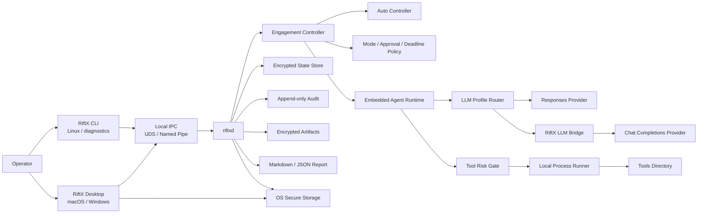
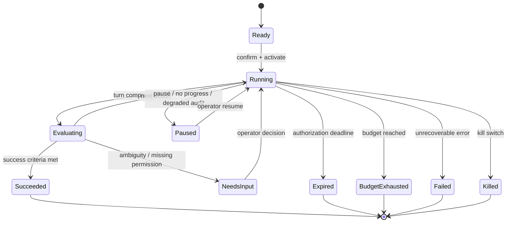

# RiftX 1.0 执行计划

> 文档版本：v1.0-plan.1
> 编写日期：2026-07-27
> 当前基线：`v1.0` / `7439678`（M0 完成；自此分支名仅含版本信息）
> 目标版本：RiftX `1.0.0`
> 状态：执行稿
> 适用范围：从当前 v0.8 主路径推进到可正式发布、可安装、可验收的 RiftX 1.0

---

## 1. 文档目的

本文不是愿景说明，而是 RiftX 从当前代码状态到正式 1.0 的工程执行依据。每个阶段都必须给出：

- 清晰的产品行为；
- 对应的代码落点和接口变更；
- 可重复的测试方法；
- 阶段退出条件；
- 已知风险、失败处理与回滚边界。

正式实施时，一次只推进一个可独立验证的阶段。阶段未达到退出条件，不把状态标记为完成，也不以“主路径已有”代替端到端验收。

本文承接 [RiftX-技术实现方案.md](./RiftX-技术实现方案.md) 的 v0.8 产品方向，但将 1.0 的正式发布要求补齐。若两份文档存在冲突，以本文定义的 1.0 发布合同为准；M0 阶段需要同步修订旧文档，避免长期保留两个事实来源。

---

## 2. 当前基线

### 2.1 已完成代码

| 能力 | 当前状态 | 主要提交 |
| --- | --- | --- |
| v0.8 产品说明与技术方向 | 已完成文档基线 | `fcc8d4b` |
| 模式改为 RedTeam / Pentest / Auto | 已完成 | `b898cc4` |
| 主路径旁路 OS Guard | 已完成 | `b898cc4`、`3135a61` |
| 模式到运行时审批策略映射 | 已完成基础映射 | `df49d05` |
| RedTeam 高风险凭据工具审批 | 已完成局部路径 | `68b93e4` |
| Desktop Tools Directory 设置 | 已完成基础编辑 | `6925140` |
| Desktop LLM Profile CRUD | 已完成界面与基础写回，生命周期尚不完整 | `6925140` |
| Auto 创建/切换风险短语 | 已完成 | `5989b4a` |
| Auto Lab 与到期时间要求 | 已完成启动前校验 | `5989b4a` |
| Auto 五分钟无进展提示 | 已完成提示，不会自动恢复或停止 | `5989b4a` |
| 本地 daemon、IPC、Desktop sidecar | 已有 | 当前主路径 |
| Tools / Skills 扫描与 Doctor | 已有 | 当前主路径 |
| Engagement、结构化状态、会话 | 已有 | 当前主路径 |
| API Key / 目标凭据安全存储 | 已有 | 当前主路径 |
| Engagement 状态、审计、Artifact 加密 | 已有 | 当前主路径 |
| Markdown / JSON 报告 | 已有基础实现 | 当前主路径 |
| macOS / Windows / Ubuntu CI 合同测试 | 已有单一 `ci.yml` | 当前主路径 |

### 2.2 当前工作区说明

M0 已将计划编写时的本地修改收敛为：

- `.gitignore`：忽略本地进度文件、`riftx.local.toml` 与额外 `target/`；
- 仓库默认 `riftx.toml`：安全的 Responses-compatible 示例；
- 本机实验配置：`riftx.local.toml`（不提交；见 `riftx.local.toml.example`）。

任何本机 API Endpoint、用户名、凭据引用或实验模型不得进入正式默认配置。

### 2.3 当前关键缺口

| 编号 | 缺口 | 影响 | 1.0 优先级 |
| --- | --- | --- | --- |
| G-01 | Agent Runtime 只使用 `/v1/responses` | DeepSeek 等 Chat Completions Provider 无法直连 | P0 |
| G-02 | 新建 Profile 时先重启 daemon、后保存 Key | Profile 创建失败并留下半更新配置 | P0 |
| G-03 | 任一未配置 Profile 可阻断整个 daemon | 可选模型配置影响全部任务 | P0 |
| G-04 | 删除 Profile 不检查 Engagement 引用与共享 Key | 旧任务和其他 Profile 可能失效 | P0 |
| G-05 | 配置写入与 daemon 重启非事务化 | 错误配置可导致应用不可用 | P0 |
| G-06 | Auto 只执行一个 turn | 不能无人监督推进直至目标 | P0 |
| G-07 | 到期只在入口校验 | 运行中的 turn 可越过授权到期时间 | P0 |
| G-08 | 高风险工具元数据只覆盖局部动态工具 | 普通 shell 可绕过 RiftX 风险闸门 | P0 |
| G-09 | 审计和部分状态持久化错误被忽略 | 可能执行成功但缺少完整证据 | P0 |
| G-10 | Scope 对普通 shell 不是强制边界 | 不能宣称系统级目标隔离 | P0 文档与交互 |
| G-11 | 设置变更会直接重启 daemon | 可能意外中断活动任务 | P1 |
| G-12 | Responses 兼容性没有协议提示和连接测试 | 错误延迟到首个 turn 才暴露 | P0 |
| G-13 | README、版本号和实现状态漂移 | 用户无法判断真实能力 | P1 |
| G-14 | Auto 缺少预算、恢复、成功判定和停止原因 | 无法安全地长期无人监督运行 | P0 |
| G-15 | 缺少正式安装包、签名、公证、升级和发布流程 | 不能称为正式 1.0 | P0 |
| G-16 | 尚未完成跨平台真人闭环验收 | 平台兼容性结论不足 | P0 |

---

## 3. RiftX 1.0 产品合同

### 3.1 一句话定义

RiftX 1.0 是一个本机运行的授权安全测试 Agent：用户通过 macOS / Windows 桌面对话或 Linux CLI 指定目标、成功条件和授权边界，使用本机 Tools Directory 中的工具，在 RedTeam、Pentest、Auto 三种模式下执行任务、处理审批、保留审计与证据并生成报告。

### 3.2 正式支持的平台

| 平台 | 1.0 产品形态 | 发布产物 | 最低支持范围 |
| --- | --- | --- | --- |
| macOS | Tauri Desktop | Apple Silicon 签名并公证的 `.dmg` | macOS 12+，M 系列芯片 |
| Windows | Tauri Desktop | x86_64 签名的 NSIS `.exe` | Windows 10 22H2 / Windows 11 |
| Linux | CLI | x86_64 tarball + SHA-256 | Ubuntu 22.04/24.04；其他发行版尽力兼容 |

平台功能一致性指 RiftX 的任务、模型、模式、审批、Auto、报告和本机工具调用合同一致。具体渗透工具是否支持某个平台，由工具本身决定；Tools Doctor 必须明确报告工具缺失、不可执行、架构不匹配或健康检查失败，不能把工具自身的平台限制伪装成 RiftX 功能成功。

### 3.3 执行环境

1. 只使用当前用户的本机环境执行命令和工具。
2. 1.0 不提供 Docker、Podman、Kubernetes、远程 Worker 或云端执行器。
3. 1.0 不以 OS Guard、容器或网络命名空间作为安全声明。
4. Tools Directory 中当前用户能够运行的程序，Agent 才能运行。
5. RiftX 不自动下载或预装渗透工具。
6. RiftX 不获得高于当前用户的隐式权限；需要管理员权限的操作仍由操作系统和用户处理。

### 3.4 交互与入口

- macOS / Windows：RiftX Desktop 是主要入口。
- Linux：`riftx` CLI 是正式入口，不要求 TUI。
- Desktop 与 daemon 只通过本机 IPC 通信：macOS 使用 UDS，Windows 使用 Named Pipe。
- daemon 默认不监听公网 TCP 控制面。
- 用户以对话描述任务，但创建 Engagement 时仍必须明确：任务名称、目标、成功条件、环境类型、模式、授权时间和初始入口。
- 目标可以是单个主机、多个网段、身份域、应用集合或“到达域控”等跨资产结果，不能把任务模型限制为单一 Target。

### 3.5 LLM 合同

1. 只允许用户自行配置 API Key，不提供上游账号、浏览器登录或设备码登录。
2. 1.0 原生支持两类 Profile：
   - OpenAI Responses-compatible；
   - OpenAI-compatible Chat Completions。
3. 每个 Profile 显式声明协议，不能仅根据 URL 静默猜测。
4. 设置页和 CLI 必须提供连接测试，并验证文本流与 function tool call，不只做 TCP/HTTP 探活。
5. API Key 存入操作系统安全存储；Linux 无可用 Secret Service 时允许仅从 stdin 或环境变量临时提供，但不得默认写入明文配置。
6. 不实现遥测；模型供应商自身的服务端数据处理由用户与供应商之间的协议决定，RiftX 必须在设置页提示这一边界。

### 3.6 三种模式

| 模式 | 面向场景 | 默认审批 | 1.0 强制行为 |
| --- | --- | --- | --- |
| RedTeam | 专业红队与对抗演练 | 危险命令、高风险/关键工具逐次批准 | 保留专业操作自由；风险元数据必须真正进入执行闸门 |
| Pentest | 指定范围评估与日常渗透测试 | 危险命令批准，其余按策略执行 | 提示目标边界；不声称 OS 级强制 Scope |
| Auto | 明确授权的测试/Lab 自动推进 | 启动前一次性确认，运行中默认不逐项打断 | 仅 Lab、必须到期、必须预算、必须 Kill、必须有确定停止原因 |

模式决定审批节奏，不改变“仅用于已授权目标”的前提。Auto 必须显示高风险警告：仅用于测试环境，不用于生产环境，不代表 RiftX 能替代授权管理和人工判断。

### 3.7 1.0 必须完成的用户闭环

```text
首次启动
  → 配置 Tools / Skills
  → 新建并测试 LLM Profile
  → 创建 Engagement
  → 定义目标、成功条件、模式和到期时间
  → 激活任务
  → 对话或 Auto 推进
  → 工具执行 / 审批 / 暂停 / Kill
  → 查看结构化资产、服务、发现、证据和时间线
  → 生成 Markdown / JSON 报告
  → 导出报告与 Artifact 哈希清单
```

闭环必须分别在：Responses mock、Chat Completions mock、至少一个 Responses live smoke、至少一个 Chat Completions live smoke 上通过。Live smoke 只能手动触发，不进入普通 PR 的稳定性依赖。

---

## 4. 1.0 明确非目标

以下内容不阻塞 1.0：

- Docker / Podman / Kubernetes 执行后端；
- 远程 Worker、集群调度和多租户；
- OS 级强制隔离、强制网络 Scope 或企业 EDR 级防护声明；
- 工具商店、工具自动下载和第三方二进制托管；
- 上游账号登录；
- 产品遥测、用户行为分析和远程诊断上传；
- Web SaaS 控制台；
- 手机端；
- Linux Desktop / Linux TUI；
- PDF / HTML 报告；
- `.riftxcase` 案件容器；
- 自动更新；
- 团队协作、云同步、SSO、RBAC；
- 把独立 Evidence Evaluator 做成企业级合规硬门槛。

Auto 仍需要内置的轻量目标评估器来判断继续、成功、失败或需要人工介入。该评估器属于 Auto 控制循环，不等同于独立的企业 Evidence Evaluator 产品。

---

## 5. 目标架构



### 5.1 组件边界

| 组件 | 1.0 责任 | 禁止承担的责任 |
| --- | --- | --- |
| Desktop | 任务、对话、设置、审批、Auto 状态、报告、更新提示 | 不持久保存 API Key，不直接运行目标工具 |
| CLI | Linux 正式入口和跨平台诊断入口 | 不绕过 daemon 策略直接执行任务工具 |
| `riftxd` | 生命周期、模型路由、策略、状态、审计、恢复 | 不暴露公网控制 API |
| Agent Runtime | 对话、上下文、工具调用、流式事件、中断 | 不决定 RiftX 产品模式和授权到期规则 |
| LLM Bridge | Responses 与 Chat Completions 的受控协议转换 | 不成为通用公网代理，不记录明文 Key/提示词 |
| Tool Risk Gate | 将工具清单、命令和模式映射为批准决策 | 不声称提供 OS 隔离 |
| Auto Controller | 多 turn 计划、进度、预算、目标评估和停止 | 不绕过 Kill、到期和审计健康检查 |
| State / Audit / Artifact | 本机持久化、恢复和报告证据 | 不静默吞掉关键写入失败 |

### 5.2 上游版本策略

- 继续使用固定 commit 的内嵌 Agent Runtime。
- 不因 Chat Completions 兼容而更换整个基座。
- Chat Completions 首选在 RiftX 边界通过 Bridge 适配，避免把长期分叉扩散到 Runtime Core。
- 每次上游同步必须：更新锁文件、运行锁校验、记录 patched components、运行 RiftX 合同测试。
- 1.0 RC 冻结后不再同步上游功能提交，只接受有明确安全或阻断性修复的变更。

---

## 6. 阶段总览与关键路径

### 6.1 阶段安排

| 阶段 | 主题 | 单人全职估算 | 依赖 | 发布阻断 |
| --- | --- | ---: | --- | --- |
| M0 | 基线、事实来源与测试恢复 | 3-5 天 | 无 | 是 |
| M1 | LLM 双协议与 Profile 事务 | 2-3 周 | M0 | 是 |
| M2 | 模式执行闸门、到期和审计可靠性 | 2 周 | M0；部分可与 M1 并行 | 是 |
| M3 | Auto 多 turn 控制器 | 2-3 周 | M1、M2 | 是 |
| M4 | 状态、证据、报告闭环 | 1-2 周 | M2、M3 | 是 |
| M5 | Desktop 产品化 | 2 周 | M1-M4 | 是 |
| M6 | Linux CLI 与三平台合同 | 1-2 周 | M1-M4 | 是 |
| M7 | 安全、供应链、安装包和签名 | 2 周 | M5、M6 | 是 |
| M8 | RC、真人验收与 1.0 发布 | 1-2 周 | 全部 | 是 |

总工期按单人全职估算为 **15-18 人周**，不包含 Apple / Windows 签名证书申请和外部审核等待时间。若并行投入 Desktop、Rust Runtime、QA/Release 三类人员，可压缩日历时间，但不能删除阶段门槛。

### 6.2 关键路径

```text
M0 基线
  → M1 双协议 + Profile 事务
  → M2 执行安全与审计
  → M3 Auto Controller
  → M4 报告闭环
  → M5/M6 三平台产品化
  → M7 签名发布
  → M8 RC 验收
```

### 6.3 版本里程碑

| 版本 | 含义 | 允许发布给谁 |
| --- | --- | --- |
| `0.9.0-dev` | M1 完成，双协议可用 | 开发者 |
| `0.9.1-dev` | M2 完成，策略和审计闭环 | 内部测试 |
| `0.9.2-alpha` | M3 完成，Auto 可在 mock/lab 运行 | 授权 Alpha 测试者 |
| `0.9.3-beta` | M4-M6 完成，功能冻结 | Beta 测试者 |
| `1.0.0-rc.1` | M7 完成，签名安装包 | RC 测试者 |
| `1.0.0` | M8 所有门槛通过 | 正式发布 |

---

## 7. M0：基线、事实来源与测试恢复

### 7.1 目标

得到一个可重复构建、状态清晰、文档一致的 1.0 开发起点。M0 不增加用户功能。

### 7.2 工作项

#### M0.1 工作区收敛

- 审核 `.gitignore` 本地修改，保留合理规则并单独提交。
- 将本机 `riftx.toml` 与仓库默认配置分离：
  - 仓库保存安全、可运行的示例；
  - 本机 Profile 放入不提交的 local config；
  - 不提交真实 Endpoint、Key、内部地址或个人 credential 名。
- 清理已跟踪的 `.DS_Store` 等平台垃圾文件。
- 确认构建目录、sidecar 和 `node_modules` 均被忽略。
- 记录当前 commit、Rust、Node、pnpm、Tauri 和 conda 环境版本。

#### M0.2 文档事实来源

- 把本文加入 README 文档入口。
- 更新 v0.8 文档中已经完成但仍标为“未完成”的内容。
- 明确 1.0 新增 Linux CLI 正式支持，修正“Linux 暂不考虑”的旧表述。
- 统一模式名，删除用户示例中的 `--mode native`。
- 统一 Desktop、Tauri、Rust crate 的版本来源，避免三处手工漂移。
- 建立 `CHANGELOG.md` 的 `Unreleased / 1.0.0` 段落。

#### M0.3 测试环境恢复

- 所有 Agent 相关命令统一使用 `conda run -n agent`。
- 恢复 `pnpm install --frozen-lockfile`。
- 构建 RiftX 相关 Rust crates 和 Desktop frontend。
- 运行现有 RiftX 定向测试。
- 经用户批准后运行一次 workspace 完整 `just test`，将历史失败分类为：
  - RiftX 回归；
  - 上游既有失败；
  - 当前 sandbox / OS 不可运行；
  - flaky。
- 建立基线测试记录，不允许后续阶段把已有失败误报为新回归。

#### M0.4 CI 基线

- 修正 Desktop CI 直接调用 `cargo test` 的问题，统一符合仓库测试入口。
- 将 CI 拆为清晰 job：
  - Rust fmt/check；
  - RiftX crate tests；
  - App Server protocol fixtures；
  - Desktop TypeScript build；
  - Tauri bridge tests；
  - macOS/Windows/Linux local contract；
  - 上游锁校验。
- 普通 PR 禁止依赖真实 API Key。
- 所有 live smoke 只允许 `workflow_dispatch` 和受保护 Secret。

### 7.3 验证

```bash
conda run -n agent pnpm install --frozen-lockfile
conda run -n agent pnpm --filter @riftx/desktop build

cd codex-rs
conda run -n agent just test \
  -p codex-riftx-app-server-adapter \
  -p codex-riftx-artifacts \
  -p codex-riftx-cli \
  -p codex-riftx-core \
  -p codex-riftx-credentials \
  -p codex-riftx-crypto \
  -p codex-riftx-domain \
  -p codex-riftx-gateway \
  -p codex-riftx-ipc \
  -p codex-riftx-report \
  -p codex-riftx-skills \
  -p codex-riftx-tools
```

### 7.4 退出条件

- 工作区没有无法解释的修改。
- 默认配置不包含个人 Provider 或敏感信息。
- README、项目说明、技术方案和本文不再对当前完成状态互相矛盾。
- macOS 本地定向测试通过。
- GitHub Actions 三平台基础合同通过。
- 已记录完整测试是否执行及其结果；未执行不能写成通过。

---

## 8. M1：LLM 双协议与 Profile 事务

### 8.1 目标

Responses Provider 和 Chat Completions Provider 都能完成“用户消息 → 流式模型输出 → function tool call → tool output → 模型总结”的完整 Agent 循环；Profile 增删改不会把 daemon 留在半失败状态。

### 8.2 配置模型

`riftx.toml` 的 Profile 增加显式协议：

```toml
[llm.profiles.deepseek]
protocol = "chat_completions"
model = "deepseek-v4-pro"
base_url = "https://api.deepseek.com"
timeout_seconds = 300
reasoning_level = "high"
context_budget = 200000
api_key = { source = "keyring", credential = "deepseek" }
```

协议枚举只接受：

- `responses`；
- `chat_completions`。

未知协议必须拒绝加载，不能自动回退。旧配置缺少 `protocol` 时，在一次性迁移中按 `responses` 解释并写出升级提示；迁移必须有版本号且可重复执行。

### 8.3 新增 `riftx-llm-bridge`

建议新增独立 crate：`codex-rs/riftx-llm-bridge`。职责限制为：

- 对内接受 Runtime 发出的 Responses 请求；
- 对外调用指定 Profile 的 Chat Completions Endpoint；
- 将请求、流式响应、工具调用、usage 和错误转换为 Runtime 已有事件；
- 不提供公网监听；
- 不保存 API Key、完整提示词或模型响应；
- 不承担任务、审批、工具执行或 Auto 决策。

首选部署方式是 daemon 进程内服务或随机 loopback 端口。若使用 loopback：

- 仅绑定 `127.0.0.1` / `::1`；
- 每个 daemon 启动生成随机 bearer token；
- Runtime 只拿 bridge token，不拿上游 Profile API Key；
- 日志必须过滤 Authorization；
- daemon 退出时 bridge 一并退出；
- 不提供通用转发路径，只接受所需方法。

### 8.4 请求转换

必须覆盖：

- `instructions` → system message；
- user / assistant 文本；
- 多轮历史；
- Responses function tool schema → Chat `tools[].function`；
- `function_call_output` → `role=tool`；
- `tool_choice`；
- `parallel_tool_calls`，仅在 Provider 声明支持时启用；
- text format / JSON Output 的受支持子集；
- `max_output_tokens` / timeout；
- reasoning level 到 Provider 参数的显式映射；
- image input 的支持矩阵；不支持时在请求前明确报错。

不能安全映射的字段必须返回能力错误，不得静默删除后继续执行。

### 8.5 工具兼容策略

Chat Completions Profile 的 1.0 最低合同是 function tools。处理规则：

1. 标准 function tool 直接映射。
2. shell、计划、审批和 RiftX 动态工具应以 function schema 暴露。
3. Runtime 的 custom/freeform tool：
   - 有确定 schema 时包装成 function；
   - 无法无损映射时对该 Profile 禁用，并在连接测试中展示原因；
   - 不允许把工具从请求中静默移除。
4. Provider 不支持并行工具调用时强制串行。
5. Provider 返回未知 tool name、缺少 call ID 或非法 JSON arguments 时，生成可恢复的模型协议错误，不执行工具。

### 8.6 流式响应转换

至少合成以下 Runtime 可消费事件：

- response created；
- output item added；
- text delta / text done；
- function call argument delta / done；
- output item done；
- response completed；
- response failed / incomplete；
- usage。

需要处理：

- SSE keep-alive 注释和空行；
- delta 跨 UTF-8 边界；
- 多个 tool call 交错；
- reasoning content 与最终文本分离；
- 用户 interrupt 后及时取消上游 HTTP；
- Provider 429、401、403、404、5xx、超时和断流；
- 错误响应不是 JSON 的情况；
- 上游返回 200 但流中包含 error 的情况。

### 8.7 Profile 生命周期重构

Profile 状态至少包括：

- `unconfigured`：配置存在但没有 Key；
- `ready`：配置与 Key 都有效；
- `invalid`：schema 或 URL 无效；
- `unreachable`：连接测试失败；
- `disabled`：用户停用；
- `in_use`：有活动 Engagement 使用。

实现要求：

- 新建 Profile 与保存 Key 作为一个用户流程，不在缺 Key 时重启全部 daemon。
- daemon 对 Profile 延迟初始化；只在首次使用或连接测试时启动对应 Runtime。
- 一个 Profile 失败不能阻断其他 Profile。
- 删除 Profile 前检查：默认 Profile、Engagement 引用、活动 turn、共享 credential。
- credential 必须建立引用计数或唯一所有权规则。
- 删除配置成功后再删除不再引用的 Key。
- Profile 更新使用候选配置验证；失败时保留旧配置和旧 Runtime。
- 活动 turn 使用不可变 Profile 快照，设置更新不改变正在运行的请求。

### 8.8 原子配置写入

配置更新流程固定为：

```text
解析现有配置
  → 应用候选变更
  → schema 验证
  → 敏感字段检查
  → 写同目录临时文件
  → flush + fsync
  → 原子 rename
  → reload 候选 Runtime
  → 成功后回收旧 Runtime / 无引用 Key
```

若 reload 失败：

- UI 返回结构化错误；
- 旧 Runtime 继续服务；
- 配置自动回滚，或候选 Profile 标记为 disabled；
- 不允许只剩损坏 TOML；
- 不允许先删除 Key 再发现写配置失败。

### 8.9 连接测试

设置页和 CLI 提供：

```text
riftx llm profiles list
riftx llm profiles test <profile>
```

测试分三层：

1. 配置检查：URL、TLS、Key 可用、协议、模型名；
2. 流式文本：发送最小请求并确认至少一个有效文本 delta；
3. function tool：提供无副作用的测试函数，确认模型产生合法 tool call。

测试结果必须显示能力矩阵，不输出 API Key、Authorization header 或完整响应正文。

### 8.10 测试

- Responses request/stream fixture 回归。
- Chat request 转换 golden fixture。
- Chat SSE 转 Responses event fixture。
- 多轮文本和单工具、多工具、串行工具测试。
- 非法 tool arguments 不执行测试。
- interrupt 传播测试。
- DeepSeek 风格 keep-alive 测试。
- 401/404/429/5xx/超时/断流测试。
- Profile 新建、缺 Key、替换 Key、共享 Key、删除、回滚测试。
- 一个坏 Profile 不影响好 Profile 的集成测试。
- API Key 不出现在日志、SQLite、审计、子进程环境和错误消息的测试。

### 8.11 退出条件

- Responses mock 完整工具循环通过。
- Chat Completions mock 完整工具循环通过。
- 手动 live smoke 至少验证一个 Responses Provider 和一个 Chat Provider。
- 新建未配置 Profile 不影响已有任务。
- 错误 Endpoint 不会破坏旧 daemon。
- 删除被引用 Profile 被明确拒绝。
- Desktop 能显示协议、Profile 状态和连接测试结果。

---

## 9. M2：模式执行闸门、授权到期和审计可靠性

### 9.1 目标

让三种模式的产品声明真正约束所有本机工具执行路径，并确保到期、Kill、审计失败不会被普通 shell 绕过。

### 9.2 统一执行决策

所有执行在进入本机进程启动器前生成统一 `ExecutionIntent`：

```text
ExecutionIntent
  engagement_id
  thread_id
  turn_id
  tool_call_id
  mode
  command / executable / args
  resolved_executable_path
  tool_inventory_hash
  tool_risk
  requested_capabilities
  authorization_deadline
  policy_revision
```

所有路径必须进入同一个决策器：

- Runtime shell；
- PTY；
- Tools Directory 二进制；
- credential tool；
- dynamic tool；
- CLI 发起的任务执行；
- Auto 发起的下一步。

禁止存在“这是普通 shell，所以不经过 RiftX 风险判断”的旁路。

### 9.3 工具风险识别

- Tools 扫描快照记录真实路径、文件哈希、风险、能力和健康状态。
- 执行时解析首个可执行程序及管道/链中的已知工具。
- 优先复用仓库已有 shell parser，不使用简单字符串包含判断。
- 对复杂 shell 无法可靠解析且命中 RedTeam 高风险场景时，要求人工批准。
- 工具在扫描后被替换，哈希变化会使已有批准失效。
- sidecar 元数据 schema 正式化并增加版本字段。
- 未声明风险默认 `unknown`，而不是默认 `low`。

### 9.4 审批绑定

单次批准至少绑定：

- Engagement；
- turn；
- tool call；
- 解析后的可执行文件路径与哈希；
- 参数摘要；
- policy revision；
- 授权到期时间。

参数、工具哈希、模式或 policy revision 发生变化后，批准失效。审批 UI 必须显示实际 executable、参数、风险来源和工作目录，不能只显示模型生成的自然语言说明。

### 9.5 运行中到期 watchdog

- Engagement 激活时注册 deadline task。
- deadline 到达后原子地：
  1. 标记任务 `expiring`；
  2. 拒绝新工具调用和审批；
  3. interrupt 当前 turn；
  4. 终止仍在运行的子进程树；
  5. 写审计事件；
  6. 标记 `expired`。
- daemon 重启后从持久状态恢复 deadline，不得因重启延长授权。
- 修改系统时钟时，以 wall-clock 到期值和 monotonic 运行时计时共同防止明显倒退。
- Auto、Pentest、RedTeam 使用相同到期底线。

### 9.6 Pause、Interrupt 与 Kill

| 动作 | 行为 |
| --- | --- |
| Pause | 不开始新步骤；当前可安全中断点停止；允许恢复 |
| Interrupt | 终止当前 turn 和其子进程；Engagement 保持可继续 |
| Kill | 立即拒绝新调用、终止进程树、撤销当前批准、结束 Auto run |

Kill 必须在模型无响应、bridge 断线、Desktop 失联时仍能由 daemon 执行。Desktop 按钮不是唯一实现位置。

### 9.7 审计 fail-closed 边界

审计分为：

- 必须写入后才能执行：批准决定、模式切换、Auto 启动、工具启动、凭据使用、Kill、到期；
- 可降级但必须告警：UI 浏览、Doctor 查询、非安全诊断。

关键审计不可用时：

- RedTeam/Pentest 拒绝新的受控执行；
- Auto 自动暂停；
- Desktop 和 CLI 显示持久的 degraded 状态；
- 已运行进程可被 Kill；
- 不用 panic 造成无法清理进程。

不得继续静默忽略 append 或状态写入错误。

### 9.8 Scope 的准确声明

1. UI 将 Scope 表述为“Operator-declared authorized scope”，不写成“系统已强制隔离”。
2. 对结构化目标和已知工具做应用层 precheck，越界时提示或要求确认。
3. 普通本机 shell 不具备 OS 级网络隔离，文档和报告必须明确。
4. Auto 对解析出的目标做严格 precheck；无法判断目标归属时暂停并请求人工处理。
5. 1.0 不以该 precheck 作为不可绕过的企业安全边界。

### 9.9 测试

- 三模式决策表参数化测试。
- 普通 shell 调用高风险 Tools Directory 程序的回归测试。
- 管道、shell chain、绝对路径、相对路径、PATH 命中测试。
- 工具替换后批准失效测试。
- 到期时文本生成、工具运行、PTY、Auto 各状态的终止测试。
- daemon 重启不延长授权测试。
- Kill 在 bridge 断线和 Desktop 断开时仍生效。
- 审计磁盘错误 / Key 不可用时 fail-closed 测试。
- 审批 payload 不泄漏 credential。

### 9.10 退出条件

- 每一种本机执行路径都能追溯到统一 `ExecutionIntent`。
- RedTeam 高风险工具无法通过普通 shell 绕过审批。
- 授权到期能终止活动 turn 与子进程树。
- Kill 在三平台合同测试中通过。
- 审计不可用时不会继续无人监督执行。
- UI 和报告不再声称存在未实现的强制 Scope。

---

## 10. M3：Auto 多 turn 控制器

### 10.1 目标

Auto Mode 能在无人监督情况下围绕一个结果型目标持续执行“观察 → 计划 → 行动 → 评估”，直到达到目标、预算耗尽、到期、Kill、不可恢复错误或需要人工介入。

Auto 不能只对一个 IP 做循环。目标可以是：

- 枚举一个网段的关键资产；
- 找到指定应用的可验证漏洞；
- 从入口资产构造到高价值身份/主机的攻击路径；
- 在授权实验域中验证是否能到达域控；
- 收集满足报告成功条件的一组证据。

### 10.2 Auto 状态机



### 10.3 Auto Run 配置

每次 Auto Run 固定不可变快照：

```text
AutoRunConfig
  objective
  success_criteria[]
  authorization_scope
  llm_profile_snapshot
  tools_snapshot_hash
  policy_revision
  expires_at
  max_turns
  max_tool_calls
  max_wall_clock
  max_single_command_duration
  max_consecutive_failures
  no_progress_window
  max_model_tokens_or_cost (provider 可提供时)
```

默认值必须保守，并允许用户进一步收紧。Auto 不允许无限 turn、无限运行时间或无限工具调用。

### 10.4 控制循环

```text
加载当前结构化状态
  → 构造本轮可验证子目标
  → 启动一个 turn
  → 收集模型、工具、状态和 Artifact 事件
  → 计算进展摘要
  → 评估成功条件与预算
  → 选择继续 / 成功 / 暂停 / 失败
  → 持久化 checkpoint
```

控制器必须由 RiftX 驱动，不能依赖模型在一条回复里“自己继续”。每个 turn 完成后由 controller 明确决定是否开始下一 turn。

### 10.5 多资产目标与状态图

- 任务入口点与最终目标分离。
- Asset、Service、Identity、Finding、Evidence 和 Attack Path 形成可扩展状态图。
- 新发现资产不会自动等于授权资产；进入下一步前执行 Scope precheck。
- “到达域控”类成功条件至少包含：
  - 目标角色或身份域；
  - 所需访问级别；
  - 攻击路径的每一跳；
  - 可复现 Evidence 引用；
  - 最低置信度。
- 不能仅因模型输出“成功”就把任务标记为成功。

### 10.6 轻量目标评估器

评估器输入：

- 结构化成功条件；
- 当前状态图；
- 本轮新增 Evidence；
- 工具退出状态；
- Artifact 哈希；
- 模型提出的完成理由。

评估顺序：

1. 先执行确定性 predicate；
2. 再检查 Evidence 是否存在、可读且属于当前 Engagement；
3. 需要语义判断时调用模型生成结构化 assessment；
4. 模型 assessment 不能覆盖确定性失败；
5. 成功结果记录满足条件的 Evidence ID 和评估版本。

### 10.7 无进展检测

进展信号包括：

- 新 Asset / Service / Identity；
- Finding 状态变化；
- 新 Evidence / Artifact；
- Attack Path 缩短或置信度提升；
- 子目标完成；
- 明确排除一个假设。

连续窗口没有任何进展时：

- 第一次触发重新规划；
- 第二次降低并发、切换策略或选择不同子目标；
- 达到阈值后暂停并标记 `needs_input`；
- 不允许只在 UI 显示横幅后继续无限消耗。

### 10.8 错误与重试

| 错误 | 默认处理 |
| --- | --- |
| Provider 429 | 指数退避，计入重试预算 |
| Provider 401/403 | 立即暂停，要求修复 Profile |
| Provider 404 协议错误 | 立即失败连接测试，不进入 Auto |
| 工具不存在 | 标记工具不可用，重新规划一次 |
| 工具退出非零 | 交给评估器，不自动判定整个任务失败 |
| 工具超时 | interrupt，记录 Evidence，计入连续失败 |
| 审计不可用 | 自动暂停 |
| 到期 | 立即 Expired |
| Scope 无法判断 | NeedsInput |
| daemon 重启 | 从最后 checkpoint 恢复为 Paused，默认不自动继续 |

### 10.9 恢复语义

- 每个 turn 前后写 checkpoint。
- daemon 崩溃恢复后，Auto 默认进入 `paused_after_recovery`。
- 用户查看上次动作、剩余预算和未完成子目标后手动恢复。
- 不重复执行无法确认是否完成的高风险动作。
- 恢复时重新验证到期、Profile、Tools 快照和 policy revision。

### 10.10 Desktop / CLI 交互

Auto 面板必须显示：

- 当前总目标；
- 当前子目标；
- turn / tool / 时间预算；
- 最近一次进展；
- 当前状态和停止原因；
- Pause / Resume / Kill；
- 授权到期倒计时；
- 成功条件完成度；
- 需要人工输入时的明确问题。

CLI 提供等价命令：

```text
riftx auto status <engagement-id>
riftx auto pause <engagement-id>
riftx auto resume <engagement-id>
riftx auto kill <engagement-id>
```

### 10.11 测试

- 两 turn 后成功的确定性 mock。
- 多资产发现后继续到结果目标的 mock。
- no-progress 重新规划并最终暂停。
- turn / tool / wall-clock 预算耗尽。
- 到期、Pause、Resume、Kill。
- daemon 重启 checkpoint 恢复。
- 429 重试、401 暂停、工具缺失重新规划。
- 模型声称成功但没有 Evidence 时不能成功。
- 新资产不在声明 Scope 时进入 NeedsInput。
- Auto 不请求逐项普通审批，但仍受 deadline、budget、Kill、audit health 约束。

### 10.12 退出条件

- Auto 能自动运行多个 turn，而不是单 turn 演示。
- 能处理跨多个资产的结果型目标。
- 每次结束都有机器可读停止原因。
- 不存在无限循环和无限预算默认值。
- 无 Evidence 时不会错误标记成功。
- 崩溃恢复不会自动重复高风险操作。

---

## 11. M4：状态、证据、Artifact 与报告闭环

### 11.1 目标

让报告来自结构化执行事实，而不是仅总结聊天记录；任何重要结论都能关联工具调用、Evidence 或 Artifact。

### 11.2 状态模型补齐

1. Engagement：目标、成功条件、模式、环境、Profile 快照、到期、最终状态。
2. Asset：地址、主机名、角色、来源、首次/最后发现时间。
3. Service：资产、协议、端口、产品、版本、证据。
4. Identity：域、账号、角色、权限级别、来源。
5. Finding：标题、严重度、状态、影响、复现、修复建议。
6. Evidence：来源工具、时间、目标、摘要、Artifact 引用、完整性哈希。
7. Attack Path：节点、边、前置条件、访问级别、证据和置信度。
8. Task / Subgoal：Auto 子目标、状态、依赖和停止原因。
9. Approval：决策、绑定参数、操作者、时间和 policy revision。
10. Artifact：内容哈希、大小、媒体类型、来源和导出记录。

所有实体必须有 Engagement 所有权检查，禁止跨任务引用或导出。

### 11.3 Artifact

- 继续采用 workspace `artifacts/` 和显式 capture。
- 自动采集必须有大小、数量和路径限制。
- 拒绝绝对路径、路径穿越、符号链接和目录。
- 导出前验证认证、大小和 SHA-256。
- 报告引用 Artifact ID 与哈希，不嵌入凭据和无限原始输出。
- 单个 Engagement 配额耗尽时明确告警，Auto 暂停或降级，不静默丢证据。

### 11.4 报告

1.0 输出 Markdown 与 JSON，字段至少包括：

- Engagement 摘要；
- 授权声明与用户声明 Scope；
- 模式、起止时间和停止原因；
- LLM Profile 名与协议，不包含 Key；
- Tools 快照摘要；
- 资产与服务；
- Findings；
- Attack Paths；
- Evidence 与 Artifact 哈希清单；
- 审批摘要；
- Auto 预算与目标评估结果；
- 已知限制；
- “本机执行、未提供 OS 强制 Scope”的准确说明。

JSON 使用版本化 schema：`riftx.report/v1`。字段新增保持向后兼容；破坏性变更必须提升 schema 版本。

### 11.5 敏感信息处理

- API Key、密码、Token、私钥绝不进入报告。
- 命令参数中可能出现凭据时使用结构化 redaction，而不是只匹配固定变量名。
- 报告预览和导出使用同一 redaction 层。
- 原始 Artifact 若由用户工具生成，RiftX 只能提示其可能含敏感信息；导出前提供确认。

### 11.6 测试

- 状态实体跨 Engagement 访问拒绝。
- Markdown / JSON snapshot。
- 报告 schema fixture。
- 凭据和 API Key redaction fixture。
- Artifact 配额、篡改、路径穿越和中断导出。
- Auto 成功报告包含成功 Evidence；失败报告包含停止原因。
- 报告生成期间状态更新时使用一致快照。

### 11.7 退出条件

- 完整任务可以生成可重复的 Markdown / JSON 报告。
- Findings 和成功条件能追溯到 Evidence。
- 报告不依赖模型自由文本作为唯一事实来源。
- 凭据不进入报告和普通日志。
- Artifact 导出完整性校验通过。

---

## 12. M5：Desktop 产品化

### 12.1 目标

macOS 与 Windows 用户无需理解内部 Runtime、手动启动 daemon 或编辑 TOML，即可完成 1.0 主闭环。

### 12.2 首次启动

- 展示授权使用声明和本机执行风险。
- 选择或确认 Tools Directory。
- 配置第一个 LLM Profile：名称、协议、模型、Endpoint、API Key。
- 执行连接测试并展示能力矩阵。
- 未配置模型时允许进入设置和 Doctor，但不能创建可运行任务。
- 不要求任何上游账号登录。

### 12.3 任务工作台

建议保持三栏或等价的高效率布局：

- 左栏：Engagement 列表、状态、模式、最近活动；
- 中栏：对话、工具执行、事件流、错误和 Auto 当前子目标；
- 右栏：授权、目标、成功条件、资产、审批、预算和报告；
- 底部：输入、模式、Pause、Interrupt、Kill。

不能把大量说明文字放在主工作区。复杂说明放到帮助、tooltip 或创建流程。

### 12.4 设置

#### LLM Profiles

- Profile 列表与状态；
- Responses / Chat Completions 协议选择；
- Endpoint / model / reasoning / timeout；
- 保存 Key、替换 Key、删除 Key；
- Test Connection；
- 默认 Profile；
- 被 Engagement 引用时禁止删除并显示引用。

#### Tools

- 多目录添加、删除、重排；
- Doctor；
- 工具路径、版本、风险、能力、哈希状态；
- 刷新只影响新任务；活动 Engagement 使用快照。

#### Skills

- 当前目录；
- Skill 清单、哈希、诊断；
- 不允许 Skill 修改绕过模式策略。

### 12.5 审批体验

- 明确区分 command approval、tool risk approval、credential use。
- 显示实际 executable、参数、工作目录、风险和原因。
- 提供 Approve Once / Deny；1.0 不提供模糊的永久批准。
- Auto 不出现普通逐项审批弹窗，但需要人工时进入 `NeedsInput`。
- 审批过期或参数变化后按钮失效并说明原因。

### 12.6 错误和恢复

必须设计并测试：

- daemon 启动失败；
- Profile Key 缺失；
- Provider 协议不匹配；
- IPC 断线与重连；
- turn 中断；
- 审计 degraded；
- Tools Directory 不可访问；
- Auto 恢复等待确认；
- 报告生成失败；
- 设置保存需要中断活动任务。

错误文案只展示 RiftX 品牌和可操作的修复步骤，不泄漏内部 JSON-RPC 或凭据。

### 12.7 设置重启协调

- 保存前检查活动 turn。
- 不影响运行时的设置直接保存，不重启 daemon。
- 需要重载 Profile 的设置只重载目标 Profile。
- 必须重启 daemon 时明确提示受影响 Engagement。
- 用户取消时不写配置。
- 用户确认后先 Pause/Interrupt，再做受控重启和状态对账。

### 12.8 UI 质量

- 用户可见区域无上游产品品牌。
- 应用名、窗口、菜单、通知、安装包、报告统一 RiftX。
- 支持键盘导航、焦点状态、可读错误和基本屏幕阅读器标签。
- 960×640 最小窗口无重叠；常用 1440×900 布局稳定。
- 长命令、长目标、长模型名和中文文本不溢出。
- Windows 125%/150% 缩放和 macOS Retina 检查。
- 不实现遥测；本地诊断日志可由用户主动导出并在导出前 redaction。

### 12.9 前端测试

- 为 Desktop 引入 Vitest + React Testing Library。
- 关键 UI 状态做组件测试：Profile、审批、Auto、连接错误、degraded。
- 使用 Playwright 做最小桌面 WebView 流程或前端 mock E2E。
- Tauri command DTO 与 `riftx-ipc` 做完整 round-trip 测试。
- macOS/Windows CI 构建安装包前先运行 frontend tests。
- 关键用户可见 UI 变化保留截图或 snapshot 审核。

### 12.10 退出条件

- 新用户只通过 Desktop 完成首次配置和主闭环。
- Profile 错误在设置阶段暴露，不延迟到 turn。
- 设置不会无提示中断活动任务。
- macOS 与 Windows 截图验收无布局重叠和品牌残留。
- Kill、审批和 Auto 状态在 daemon 重连后保持一致。

---

## 13. M6：Linux CLI 与三平台合同

### 13.1 目标

Linux CLI 成为 1.0 正式产品入口，同时确保 macOS、Windows、Linux 的核心业务合同一致。

### 13.2 CLI 功能范围

```text
riftx doctor
riftx config validate
riftx llm profiles list|test
riftx tools list|doctor
riftx skills list|doctor
riftx engagements create|get|list|activate
riftx turn
riftx events
riftx approvals list|decide
riftx interrupt
riftx kill
riftx auto status|pause|resume|kill
riftx report --format markdown|json
riftx artifacts list|export
```

所有命令支持：

- 人类可读输出；
- `--json` 机器可读输出；
- 稳定退出码；
- Ctrl-C 中断；
- 不在终端回显 API Key；
- daemon 不可用时给出明确启动或修复提示。

### 13.3 Linux 密钥

- 有 Secret Service 时使用系统安全存储。
- headless 环境没有 Secret Service 时允许：
  - 从 stdin 一次性输入；
  - 从明确配置的环境变量读取。
- 环境变量必须从工具子进程环境中剔除。
- 不提供默认明文 key 文件回退。

### 13.4 跨平台差异

| 行为 | macOS | Windows | Linux |
| --- | --- | --- | --- |
| IPC | UDS | Named Pipe | UDS |
| Secret store | Keychain | Credential Manager | Secret Service / stdin / env |
| Desktop | 是 | 是 | 否 |
| CLI | 诊断/可用 | 诊断/可用 | 正式入口 |
| Tool executable | Unix executable | `.exe/.cmd/.bat` 受控支持 | Unix executable |
| Process tree Kill | process group | Job Object | process group / pidfd 可用时 |

Windows shell、路径和参数转义必须单独测试，不能用 Unix 行为推断。

### 13.5 测试

- 三平台 IPC 权限和同用户访问。
- Named Pipe 远程客户端拒绝。
- UDS 目录 0700、socket 0600。
- Windows Job Object / Unix process group Kill。
- 带空格和 Unicode 的 Tools 路径。
- Windows `.exe/.cmd/.bat` 风险识别。
- Linux 无 Secret Service 的 stdin/env 流程。
- CLI JSON schema fixture 和退出码测试。
- 三平台 Responses/Chat mock 完整闭环。

### 13.6 退出条件

- Ubuntu 22.04/24.04 CLI 完成 1.0 主闭环。
- Windows 与 macOS Desktop 使用同一业务 DTO 和 daemon 行为。
- Kill 能清理各平台子进程树。
- 平台特定失败不会被标记为“功能已支持”。

---

## 14. M7：安全、供应链、安装包和签名

### 14.1 目标

将功能完整的 Beta 变成来源明确、可安装、可校验、可卸载的正式候选版本。

### 14.2 安全文档

- 更新 `SECURITY.md`：支持版本、漏洞报告渠道、响应时限。
- 新增 1.0 Threat Model，至少覆盖：
  - 恶意模型输出；
  - 恶意 Tools Directory 二进制；
  - Prompt Injection；
  - API Key 泄漏；
  - IPC 未授权访问；
  - 报告/Artifact 敏感数据；
  - Auto 无限执行；
  - Scope 不是 OS 强制边界；
  - 供应链和上游同步。
- 在产品和文档中明确：RiftX 是授权测试工具，本机执行，不为目标 Scope 提供不可绕过的系统级隔离。

### 14.3 依赖与供应链

- 固定 Rust、Node、pnpm、Tauri 版本。
- `Cargo.lock`、`pnpm-lock.yaml` 必须提交并在 CI 使用 frozen/locked 模式。
- 运行依赖漏洞和许可证检查。
- 生成 CycloneDX 或 SPDX SBOM。
- 校验 vendored Runtime commit 与 patched components。
- 发布包中包含许可证和上游归属，不在用户主界面使用上游品牌。
- 禁止发布调试符号、测试 Key、临时 Endpoint、请求 dump。

### 14.4 macOS 发布

- 目标：Apple Silicon `aarch64-apple-darwin`。
- 构建 Release sidecar 与 Tauri app。
- Apple Developer ID Application 签名。
- Hardened Runtime 和所需 entitlement 最小化。
- DMG 签名、公证、staple。
- 在一台未安装开发工具的干净 macOS 上验证：安装、首次启动、Keychain、工具调用、卸载。
- 输出 SHA-256 和签名验证命令。

### 14.5 Windows 发布

- 目标：`x86_64-pc-windows-msvc`。
- 生成 NSIS `.exe`。
- 使用可信代码签名证书签名应用、sidecar 和安装器。
- 验证 SmartScreen 初始行为并记录证书信誉限制。
- 在干净 Windows 10/11 VM 验证：安装、Credential Manager、Named Pipe、工具调用、卸载。
- 输出 SHA-256 和签名验证方式。

### 14.6 Linux 发布

- 构建 `x86_64-unknown-linux-gnu` CLI/daemon。
- 发布 tar.gz、LICENSE、README、示例配置和 SHA-256。
- 明确 glibc 最低版本。
- 不在 1.0 承诺 deb/rpm 仓库。

### 14.7 发布 Workflow

- 新增手动 `release.yml`，只接受 `v*` tag。
- 使用受保护 Environment 保存签名 Secret。
- 构建 job 不允许从 PR 读取签名 Secret。
- 每个平台独立构建、测试、签名、上传 Artifact。
- 汇总 job 生成 checksums、SBOM、release notes。
- 发布前必须人工批准。
- 1.0 不自动上传遥测、不自动更新客户端。

### 14.8 版本与迁移

- Desktop `package.json`、Tauri、Rust binary 统一为 `1.0.0`。
- `riftxd --version`、`riftx --version` 和关于页一致。
- State DB 使用显式 schema version 和前向 migration。
- 从当前 v0.8 数据升级前自动备份数据库和配置。
- migration 失败保留原数据并拒绝以新版本继续写入。
- 不承诺从任意开发 commit 降级；文档明确降级限制。

### 14.9 退出条件

- 三个平台产物来自同一 tag 和同一源码 commit。
- macOS DMG 完成签名与公证。
- Windows EXE 完成签名。
- Linux tarball 可在干净系统运行。
- checksums、SBOM、许可证和 release notes 完整。
- 安装包不包含 Key、内部 URL、调试请求 dump 或遥测组件。

---

## 15. M8：Release Candidate 与正式验收

### 15.1 功能冻结

进入 `1.0.0-rc.1` 后：

- 不新增产品功能；
- 不做大规模重构；
- 只修复 P0/P1 缺陷、数据损坏、安装失败和文档错误；
- 每个修复必须增加回归测试；
- Runtime 上游版本冻结。

### 15.2 自动化验收矩阵

| 场景 | Mock | Live | macOS | Windows | Linux |
| --- | --- | --- | --- | --- | --- |
| Responses 文本 | 必须 | 必须一次 | 必须 | 必须 | 必须 |
| Responses tool loop | 必须 | 必须一次 | 必须 | 必须 | 必须 |
| Chat 文本 | 必须 | 必须一次 | 必须 | 必须 | 必须 |
| Chat tool loop | 必须 | 必须一次 | 必须 | 必须 | 必须 |
| RedTeam 审批 | 必须 | 不依赖 live | 必须 | 必须 | 必须 |
| Pentest 审批 | 必须 | 不依赖 live | 必须 | 必须 | 必须 |
| Auto 多 turn | 必须 | 授权 Lab | 必须 | 必须 | 必须 |
| Deadline / Kill | 必须 | 不依赖 live | 必须 | 必须 | 必须 |
| Report / Artifact | 必须 | 授权 Lab | 必须 | 必须 | 必须 |
| Profile 回滚 | 必须 | 不依赖 live | 必须 | 必须 | 必须 |

### 15.3 真人验收场景

#### 场景 A：首次安装

1. 在干净系统安装 RiftX。
2. 不存在任何上游账号登录入口。
3. 添加 Tools Directory。
4. 新建 LLM Profile 并保存 Key。
5. 连接测试通过。
6. 创建并运行一个安全的本地任务。
7. 退出并重启，状态可恢复。

#### 场景 B：Pentest

1. 创建指定授权目标任务。
2. 模型执行低风险枚举。
3. 危险命令进入审批。
4. 拒绝后模型收到结构化结果并能调整计划。
5. 批准另一个操作后继续。
6. 生成报告。

#### 场景 C：RedTeam

1. Tools Directory 放入标记为 high risk 的测试工具。
2. 模型通过普通 shell 调用该工具。
3. RiftX 必须展示 tool risk approval。
4. 修改工具文件后旧批准失效。
5. 时间线和报告记录决策。

#### 场景 D：Auto 多资产目标

1. 使用隔离且明确授权的 Lab。
2. 目标描述为跨资产结果，而不是单 IP。
3. Auto 自动执行至少三个 turn。
4. 产生资产、服务、路径和 Evidence。
5. 达到成功条件后自动停止并说明依据。
6. 未达到条件时不能因模型自述而成功。

#### 场景 E：Auto 失控保护

1. 运行无进展 mock。
2. 触发重新规划。
3. 超过 no-progress 阈值后暂停。
4. Resume 后继续；Kill 后所有子进程结束。
5. 到期后无法再执行新工具。

#### 场景 F：故障恢复

1. 活动 turn 中断 Desktop。
2. daemon 保持状态或受控退出。
3. 重连后时间线一致。
4. Auto daemon 崩溃后恢复为 Paused。
5. 错误 Profile 不影响其他 Profile。
6. 审计不可用时 Auto 暂停。

### 15.4 性能与资源门槛

先在 M0 记录基线，RC 时至少满足：

- 空闲 Desktop 不持续高 CPU；
- daemon 空闲时不为 16 个 Profile 全部启动 Runtime；
- 10,000 条时间线事件仍可分页浏览；
- 大输出有上限、截断和 Artifact 引用，不把无限内容注入模型上下文；
- Kill 在本机事件到达后目标 2 秒内开始终止进程；
- IPC 断线重连不复制事件；
- 报告生成不需要把所有 Artifact 完整读入内存。

具体数值在 M0 基线后固化到性能测试文件，不能只写主观“流畅”。

### 15.5 缺陷门槛

正式发布时：

- P0 缺陷：0；
- P1 缺陷：0；
- P2 缺陷：必须有明确 workaround、风险评估和 1.0.x 排期；
- flaky required check：0；
- 未解释的数据迁移失败：0；
- 未解释的跨平台主闭环失败：0。

### 15.6 发布决定

Go / No-Go 评审必须确认：

- 1.0 Definition of Done 全部有证据；
- 签名产物已经在干净系统安装；
- live smoke 没有把 Key 写入日志或 Artifact；
- 安全声明与真实实现一致；
- Auto 风险提示和非生产环境限制清晰；
- release notes 列出已知限制；
- tag、checksum、SBOM、安装包 commit 一致。

---

## 16. 测试策略

### 16.1 测试金字塔

1. 单元测试：配置、转换、策略、状态机和 redaction。
2. 合同测试：IPC、LLM fixture、报告 schema、Tools metadata。
3. 集成测试：真实 App Server + mock LLM + 本机安全测试程序。
4. 平台测试：UDS、Named Pipe、process tree、keyring。
5. Desktop 流程：前端 mock E2E + Tauri bridge。
6. Live smoke：人工、受保护 Key、最小调用。
7. 真人 Lab：RC 前执行，不进入普通 PR。

### 16.2 Rust 工作流

修改 RiftX crate 后：

```bash
cd codex-rs
conda run -n agent just test -p <changed-crate>
conda run -n agent just fix -p <changed-crate>
conda run -n agent just fmt
```

规则：

- 不直接运行 `cargo test`；
- 先运行变更 crate 的定向测试；
- 修改 common/core/protocol 后，定向测试通过再经用户批准运行完整 `just test`；
- `fix` / `fmt` 后不重复跑测试，除非格式化产生语义性改动或测试代码被改变；
- 修改依赖后更新 Cargo/Bazel lock；
- 修改 App Server protocol 后生成 schema fixture 并运行 protocol tests。

### 16.3 Desktop 工作流

```bash
conda run -n agent pnpm --filter @riftx/desktop check
conda run -n agent pnpm --filter @riftx/desktop test
conda run -n agent pnpm --filter @riftx/desktop build
```

Tauri Rust bridge 也需要遵循仓库定向测试入口，CI 不得绕开统一测试约定。

### 16.4 Fixture 原则

- 普通 CI 使用确定性 Responses 和 Chat Completions fixture。
- Fixture 固定协议版本并去除时间、随机 ID 等不稳定字段。
- 转换测试比较完整对象，不逐字段零散断言。
- 不使用真实攻击目标作为自动化测试依赖。
- 测试工具是仓库内无害 fixture binary，只输出参数、等待、中断或生成固定 Artifact。

### 16.5 安全回归

每个 release candidate 固定检查：

- API Key 不进入工具环境；
- credential 不进入模型上下文、报告和日志；
- IPC 权限；
- 路径穿越和符号链接；
- 审批参数绑定；
- Kill 和 deadline；
- Auto budget；
- 恶意 tool output / prompt injection 不直接改变模式；
- 配置原子写与迁移回滚；
- Artifact 篡改拒绝。

---

## 17. API、IPC 与数据版本策略

### 17.1 共享 DTO 优先

Gateway、CLI、Desktop 共同使用的合同先修改 `riftx-ipc`，再修改生产者和消费者。不得在 TypeScript、Tauri 和 Gateway 中各自维护语义不同的临时结构。

1.0 前需要版本化的新增类型包括：

- LLM protocol / capability / connection test；
- Profile lifecycle status；
- ExecutionIntent 与 tool risk decision；
- audit health；
- AutoRunConfig / AutoRunStatus / StopReason；
- GoalEvaluation；
- report schema version；
- daemon compatibility/version handshake。

### 17.2 兼容性

- 1.0 Desktop 只连接兼容的 1.0 daemon。
- IPC initialize 返回协议版本和 daemon build commit。
- 小版本允许新增 optional 字段，不复用旧字段改变语义。
- 破坏性 IPC 变更提升 major protocol version。
- Desktop 检测不兼容 sidecar 时拒绝运行任务并提示重装，不尝试猜测协议。

### 17.3 数据迁移

- 每个 migration 有唯一递增版本。
- migration 事务化，可重复检测，不重复执行。
- 加密记录 migration 在解密后转换、重新认证写入。
- 大数据迁移显示进度并支持失败恢复。
- migration 前备份配置和数据库；Artifact 内容不重复复制，只校验索引。
- 所有历史 fixture 至少覆盖当前 v0.8 → 1.0。

---

## 18. 可观测性与隐私

### 18.1 本地可观测性

- 结构化本地日志，默认 INFO。
- 日志轮转和磁盘上限。
- 每个事件带 Engagement / turn / tool call 关联 ID。
- UI 提供本地 daemon health、audit health、Profile health。
- 用户主动导出诊断包前执行 redaction 并显示包含内容。

### 18.2 禁止遥测

- 不集成产品分析 SDK。
- 不自动上传崩溃、日志、模型信息或任务数据。
- 不设置远程 feature flag。
- 不通过更新检查隐式形成设备追踪；1.0 不实现自动更新。
- CI / release 服务的数据不进入最终运行包。

### 18.3 日志禁止项

- Authorization header；
- API Key；
- 目标密码、Token、私钥；
- 完整 credential tool 参数；
- 未经用户确认的完整 Artifact 内容；
- Bridge 的完整提示词/响应 dump；
- keyring 内部错误细节中的秘密材料。

---

## 19. 工程执行规则

### 19.1 阶段拆分

- 每次实现选择一个最小闭环，不跨越多个 M 阶段做大提交。
- 非机械变更建议少于 500 行，原则上不超过 800 行。
- 大阶段拆为共享合同、后端实现、Desktop、验收四类提交。
- 不在修复功能时顺带大规模重排上游代码。
- 新概念优先进入 RiftX crate，避免继续扩大上游 Core 分叉。

### 19.2 每个阶段的 Git 证据

每个子阶段完成时记录：

- 需求编号；
- 变更文件；
- 测试命令和结果；
- 未运行的测试；
- 平台证据；
- 数据迁移影响；
- 安全声明变化；
- 后续缺口。

### 19.3 ADR 要求

以下决策必须写 ADR：

- Chat Completions Bridge 边界；
- Profile 生命周期与配置事务；
- 统一 ExecutionIntent / Tool Gate；
- Auto Controller 与轻量目标评估器；
- Linux headless secret 输入；
- 1.0 IPC 与数据兼容策略；
- 发布签名和上游同步冻结策略。

---

## 20. 风险登记

| 风险 | 概率 | 影响 | 应对 |
| --- | --- | --- | --- |
| Chat Provider 对“OpenAI-compatible”实现不一致 | 高 | 高 | 显式能力矩阵；固定 DeepSeek fixture；不支持字段 fail-fast |
| custom/freeform tools 无法无损映射 | 高 | 高 | Chat Profile 使用 function tool contract；禁用不可映射功能 |
| Auto 被模型输出带入无限循环 | 高 | 高 | turn/tool/time/no-progress 预算；RiftX 控制循环 |
| 本机工具本身恶意或不安全 | 高 | 高 | 明确不信任边界；Doctor/hash/risk；不声称隔离 |
| Windows 参数解析和进程树终止差异 | 中 | 高 | Windows 原生 CI + VM 真人验收 + Job Object |
| 配置迁移损坏现有状态 | 中 | 高 | 原子写、备份、事务 migration、历史 fixture |
| 审计加密/keyring 故障阻断任务 | 中 | 中 | health 状态、可恢复暂停、明确错误，不静默继续 |
| 上游同步引入协议漂移 | 中 | 高 | pin commit、adapter contract、RC 冻结 |
| 签名证书申请延误 | 中 | 高 | M0 启动申请；工程完成与外部等待分开跟踪 |
| 构建产物磁盘占用过大 | 高 | 中 | scoped build、CI cache、定期清理，不使用 routine all-features |
| 文档再次超前于代码 | 中 | 中 | 每阶段更新状态表；验收证据后才能标完成 |
| Scope 文案被误解为强制隔离 | 中 | 高 | UI、报告、README 统一免责声明 |

---

## 21. 1.0 Definition of Done

只有以下条件全部满足，才能发布 `1.0.0`：

### 产品

- [ ] macOS Apple Silicon DMG 可安装、启动和卸载。
- [ ] Windows x64 EXE 可安装、启动和卸载。
- [ ] Linux x64 CLI 可完成正式主闭环。
- [ ] 用户无需上游账号，只配置自己的 API Key。
- [ ] 用户可配置 Responses 和 Chat Completions Profile。
- [ ] Tools Directory 即插即用且 Doctor 结果准确。
- [ ] RedTeam / Pentest / Auto 的实际行为与文档一致。
- [ ] Auto 能运行多个 turn，支持跨资产结果目标并有明确停止原因。
- [ ] Pause、Interrupt、Kill 和 deadline 均能终止对应工作。
- [ ] Markdown / JSON 报告与 Artifact 导出可用。

### 安全与隐私

- [ ] API Key 和目标凭据不进入配置明文、日志、报告和工具环境。
- [ ] 高风险工具无法通过普通 shell 绕过 RedTeam 审批。
- [ ] 授权到期会终止活动执行。
- [ ] 关键审计不可用时 Auto 暂停，受控执行 fail-closed。
- [ ] Auto 只能在 Lab 环境并要求风险确认、到期和预算。
- [ ] 产品明确声明本机执行和非强制 Scope 边界。
- [ ] 不包含遥测和自动上传。

### 工程质量

- [ ] RiftX 所有定向测试通过。
- [ ] 经批准的 workspace 完整测试结果已记录。
- [ ] macOS、Windows、Linux required CI 全绿且无 flaky。
- [ ] Responses/Chat mock tool loop 都通过。
- [ ] 两类协议都完成至少一次受保护 live smoke。
- [ ] v0.8 → 1.0 数据迁移通过。
- [ ] P0/P1 缺陷为 0。
- [ ] 文档、CLI help、Desktop 版本和行为一致。

### 发布

- [ ] macOS 产物签名、公证并 staple。
- [ ] Windows 应用、sidecar 和安装器签名。
- [ ] Linux tarball、SHA-256、许可证齐全。
- [ ] SBOM、checksums、release notes 发布。
- [ ] 三个平台产物对应同一个 tag 和 commit。
- [ ] 干净系统真人安装验收通过。

---

## 22. 建议的立即执行顺序

从当前状态开始，不直接进入 Auto 开发。推荐按以下顺序落地：

1. 完成 M0，恢复可重复构建和真实测试基线。
2. 先修 Profile 创建/删除/Key/回滚事务，再引入协议字段。
3. 建立 `riftx-llm-bridge` 的纯转换 fixture，不立即接 Desktop。
4. 用 Chat mock 跑通 function tool loop，再做 DeepSeek live smoke。
5. 将 Bridge 和 Profile 状态接入 Desktop 设置。
6. 实现统一 ExecutionIntent、到期 watchdog 和 audit health。
7. 这些硬约束完成后再实现 Auto 多 turn controller。
8. Auto mock 稳定后补齐状态、报告和 Desktop Auto 面板。
9. 完成 Linux CLI 合同和三平台进程终止测试。
10. 最后进入签名、RC 和真人 Lab 验收。

前四个推荐开发提交可以拆为：

```text
1. chore: establish RiftX 1.0 baseline and documentation truth
2. fix: make LLM profile lifecycle transactional and lazy
3. feat: add versioned LLM protocol configuration
4. feat: translate Chat Completions through RiftX LLM Bridge
```

完成第 4 项后，RiftX 才具备继续用真实 DeepSeek Endpoint 做主链验收的稳定基础。
