<div align="center">

# RiftX

### Durable, host-native Agent operations for authorized security work

RiftX turns operator-defined objectives, scope, approvals, execution, evidence, and stop
decisions into one observable and recoverable control protocol.

<p>
  
  
  
  <a href="./LICENSE"></a>
</p>

<p>
  
  
  
  
  
  
  
  
</p>

<p>
  <strong>English</strong> · <a href="./README_ZH.md">中文</a>
</p>

</div>

> [!IMPORTANT]
> RiftX `2.0.0-alpha.0` is alpha software for one local professional operator. The
> current trust profile is loopback-only `local_single_operator`. Use RiftX only on
> assets for which you have explicit authorization, and never expose the Control Plane
> to a LAN or the public Internet.

## Why RiftX

RiftX treats every Run as durable operational state. WebUI and CLI are projections,
while resumable workflows and node-local effect owners keep work recoverable and
attributable after a client disconnects.

- **Conversation first** — creating a Run stores its objective and boundaries in
  `waiting_user`; no model or tool starts until the operator sends a concrete instruction.
- **Attributable control** — approvals, terminal takeover, and browser takeover bind to
  stable identities and immutable decisions.
- **Durable execution** — Temporal-backed cycles and Runner-owned effects make retry,
  recovery, and interruption explicit.
- **Evidence by construction** — Artifacts, Findings, Reports, traffic metadata, and
  deterministic graph projections retain provenance.
- **Stop means confirmed** — RiftX fences new effects first and reports a Run stopped
  only after every known owner returns affirmative stop evidence.

## Explore the standalone Demo

The independent [`@riftx/demo`](apps/demo) uses sanitized local state and never contacts
a Control Plane, Temporal, model provider, Runner, browser session, or target.

```bash
conda run --no-capture-output -n agent pnpm install
conda run --no-capture-output -n agent pnpm demo:dev
# Open http://127.0.0.1:5174/?lang=en
```

Use `?lang=en` or `?lang=zh-CN` to fix the presentation locale. Every screen remains
visibly marked **DEMO / SANITIZED**.

## Product tour

Ten screens cover the primary operator journey. Click any image for the full-resolution view.

<table>
  <tbody>
    <tr>
      <td width="50%" valign="top">
        <a href="docs/assets/readme/en/01-overview.webp">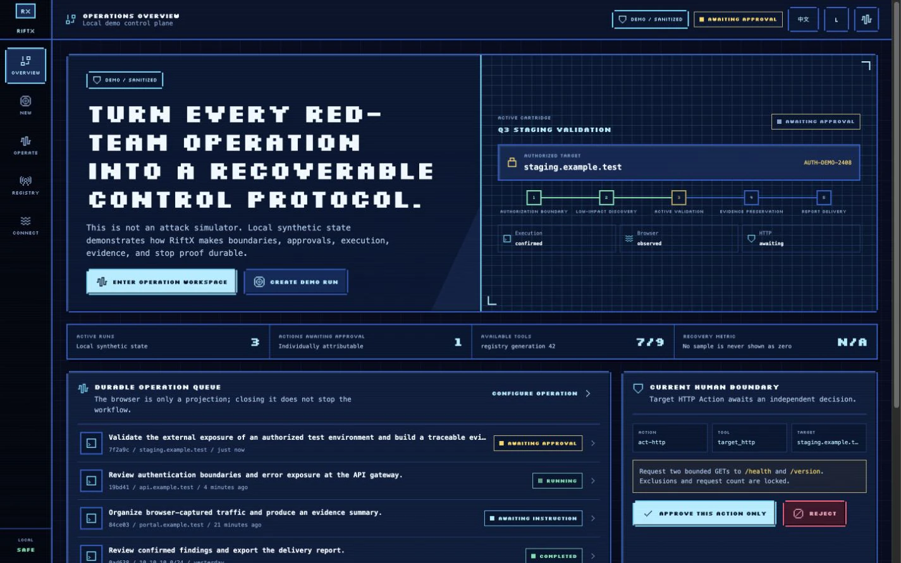</a>
        <p><strong>Operations overview</strong><br>Durable Runs, scope, approvals, and stop state at a glance.</p>
      </td>
      <td width="50%" valign="top">
        <a href="docs/assets/readme/en/02-new-run.webp">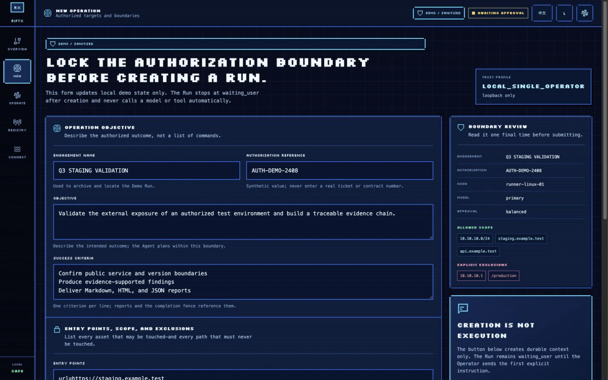</a>
        <p><strong>Authorized Run</strong><br>Lock objectives, scope, exclusions, Node, Model, and approval mode first.</p>
      </td>
    </tr>
    <tr>
      <td width="50%" valign="top">
        <a href="docs/assets/readme/en/03-conversation.webp">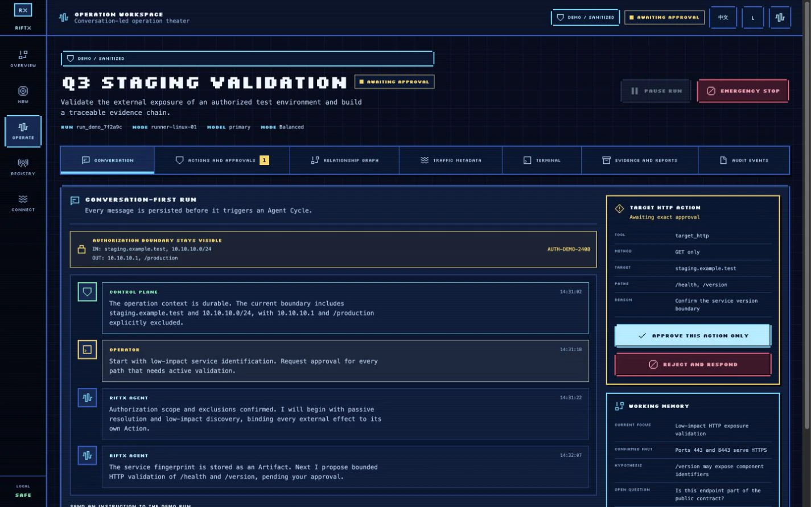</a>
        <p><strong>Conversation first</strong><br>Persist operator intent before the first bounded Agent cycle begins.</p>
      </td>
      <td width="50%" valign="top">
        <a href="docs/assets/readme/en/04-actions-approval.webp">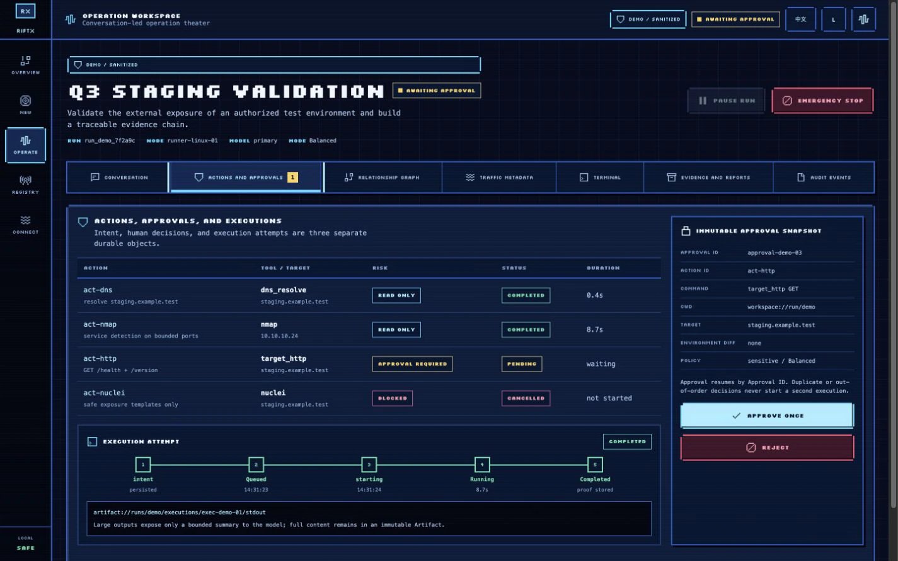</a>
        <p><strong>Actions and approvals</strong><br>Keep Action, Approval, and Execution identities separate and auditable.</p>
      </td>
    </tr>
    <tr>
      <td width="50%" valign="top">
        <a href="docs/assets/readme/en/05-operation-graph.webp">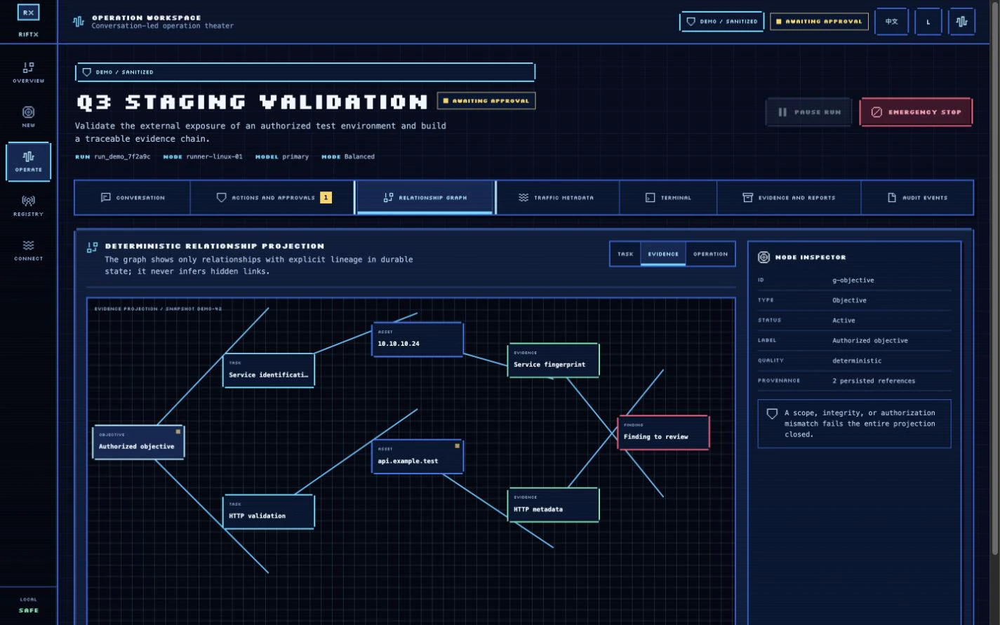</a>
        <p><strong>Evidence lineage</strong><br>Trace Task, Asset, Evidence, and Finding relationships without inferred links.</p>
      </td>
      <td width="50%" valign="top">
        <a href="docs/assets/readme/en/06-http-traffic.webp">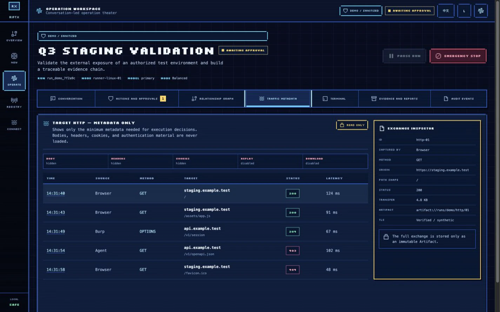</a>
        <p><strong>HTTP metadata</strong><br>Inspect sanitized exchanges with Artifact provenance and no replay surface.</p>
      </td>
    </tr>
    <tr>
      <td width="50%" valign="top">
        <a href="docs/assets/readme/en/07-terminal-takeover.webp">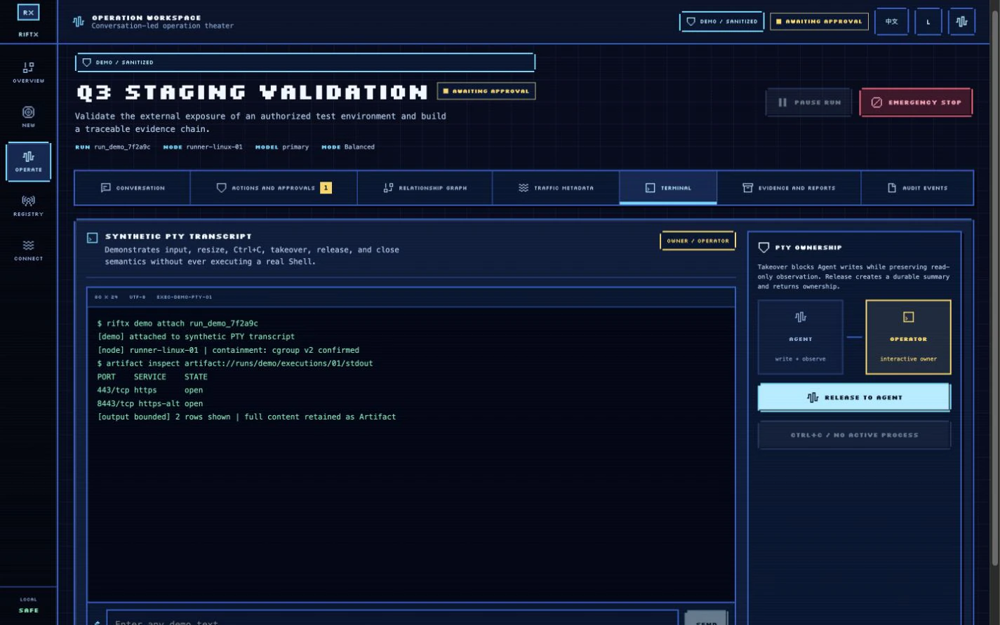</a>
        <p><strong>Terminal takeover</strong><br>Move PTY ownership between Agent and operator while retaining the transcript.</p>
      </td>
      <td width="50%" valign="top">
        <a href="docs/assets/readme/en/10-reports.webp">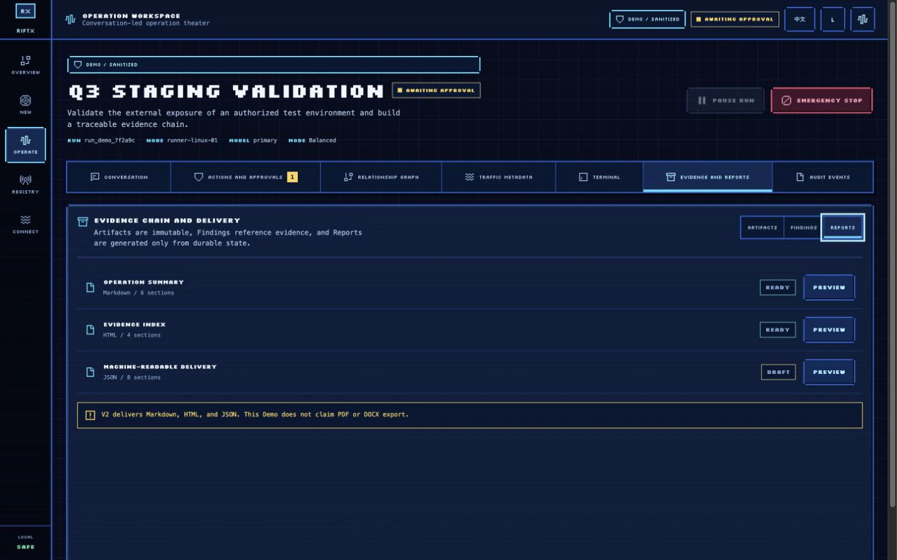</a>
        <p><strong>Evidence-backed reports</strong><br>Assemble Markdown, HTML, and JSON outputs from durable evidence.</p>
      </td>
    </tr>
    <tr>
      <td width="50%" valign="top">
        <a href="docs/assets/readme/en/13-emergency-stop.webp">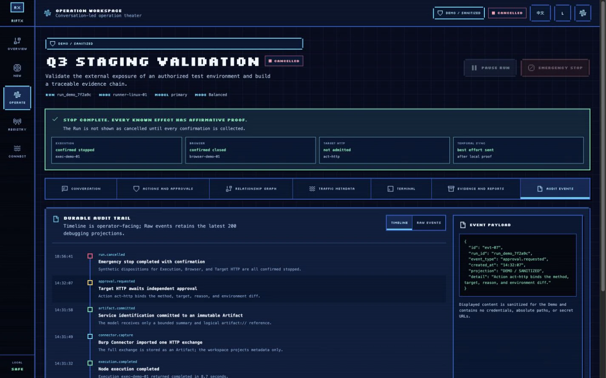</a>
        <p><strong>Affirmative stop proof</strong><br>Fence new effects and wait for every known owner to confirm its disposition.</p>
      </td>
      <td width="50%" valign="top">
        <a href="docs/assets/readme/en/17-connectors.webp">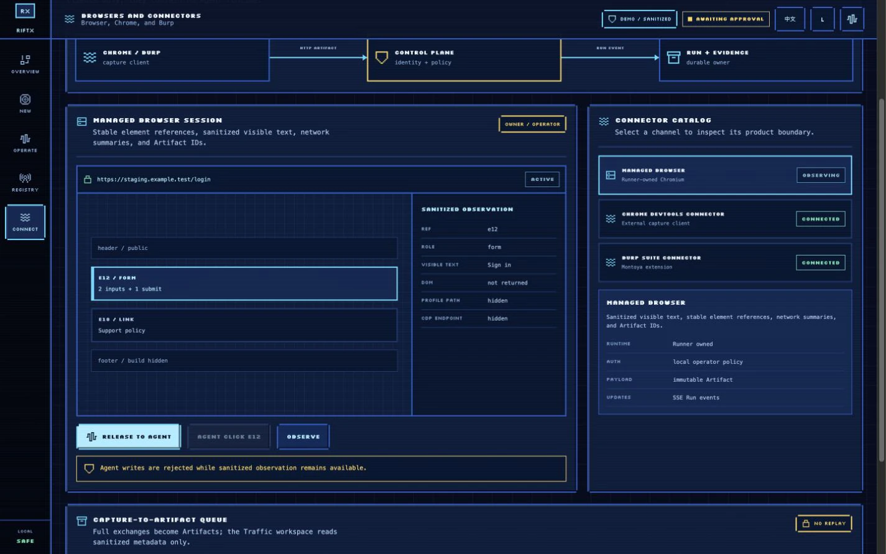</a>
        <p><strong>Browser and connectors</strong><br>Bring Managed Browser, Chrome, and Burp captures into one evidence chain.</p>
      </td>
    </tr>
  </tbody>
</table>

## Platform capability map

| Area | Implemented capabilities |
| --- | --- |
| Durable Agent runtime | Bounded Agent cycles, dynamic Tool discovery, progressive Skills, structured Working Memory, context compilation and compaction, long-term Memory, Subagents, Hooks, governed MCP integration, retry, replay, and idempotent execution identities |
| Host execution | Registered-only Process, Shell, and PTY; node-local Runner; bounded output; cancel/wait; Linux delegated cgroup v2 containment; Runner-scoped Target HTTP |
| Evidence and observability | Immutable Artifacts, evidence-backed Findings, Markdown/HTML/JSON Reports, deterministic Task/Evidence/Operation projections, resumable SSE, Raw Events, runtime metrics, and logical `artifact://` references |
| Browser and research | Runner-owned Playwright Chromium, stable element references, sanitized observations, takeover summaries, public source registry, research pipeline, Chrome DevTools connector, and Burp Montoya connector |
| Operator configuration | Node inventory, searchable Tool Registry, OpenAI/OpenAI-compatible Model Profiles, `chat_completions` and `responses` request modes, write-only credentials, bilingual WebUI/CLI, and persistent dark/light themes |

## Architecture

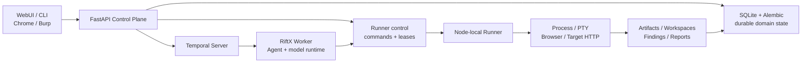

The Control Plane, Temporal Worker, and Runner are separate responsibility boundaries.
The outbound Runner protocol exists, but the only selectable trust profile in this
release keeps the Control Plane on loopback; a true remote Runner deployment is not yet
available.

## Quick start

### Prerequisites

- Python `3.12` and a Conda environment named `agent`
- Node.js with pnpm `10.32.1`
- Temporal CLI for executing the first Agent instruction
- An isolated Linux Runner with delegated cgroup v2 for high-risk execution that
  requires provable whole-process-tree containment

### Install and start the Control Plane

```bash
conda run --no-capture-output -n agent python -m pip install -e ".[dev]"
conda run --no-capture-output -n agent pnpm install

cp -n configs/tools.example.yaml configs/tools.yaml
cp -n configs/models.example.yaml configs/models.yaml

conda run --no-capture-output -n agent pnpm web:build
export RIFTX_ADMIN_TOKEN="$(openssl rand -hex 32)"

conda run --no-capture-output -n agent riftx \
  --config configs/riftx.example.yaml serve
```

Open <http://127.0.0.1:8787/>. The example registries are sanitized templates;
`configs/tools.yaml`, `configs/models.yaml`, and local secret files are ignored by Git.
The WebUI keeps the operator token in page memory rather than browser storage.

At this point the API, read-only UI, and conversation-only Run creation are available.
Sending the first concrete instruction additionally requires Temporal, a RiftX Worker,
and a credential-ready Model Profile.

### Start Temporal and the Worker

```bash
# Terminal 1 — local durable workflow service
mkdir -p .riftx
temporal server start-dev \
  --ip 127.0.0.1 \
  --port 7233 \
  --ui-port 8233 \
  --db-filename .riftx/temporal.db

# Terminal 2 — RiftX workflow/activity worker
conda run --no-capture-output -n agent riftx \
  --config configs/riftx.example.yaml worker
```

Configure a Model Profile in the WebUI before sending a Run's first instruction. For a
managed Temporal service, TLS, authentication, backup, upgrade, and supervised-service
guidance, read [`docs/deployment.md`](docs/deployment.md).

### Create a conversation-first Run

```bash
conda run --no-capture-output -n agent riftx run create \
  "Validate the authorized staging service" \
  --model primary \
  --entry url=https://staging.example.test

conda run --no-capture-output -n agent riftx run message RUN_ID \
  "Begin with passive service identification and report before active probing."
```

## Security model and current limits

> [!CAUTION]
> RiftX is intended only for explicitly authorized security testing. Do not publish the
> current Control Plane through a reverse proxy. Keep administration credentials,
> Runner bootstrap credentials, model keys, Temporal credentials, and target material
> in separate owner-scoped secret channels.

- **Local trust boundary:** `local_single_operator` requires loopback listeners and
  origins; it is not tenant-safe and does not provide multi-user RBAC.
- **Governed effects:** model keys are write-only, and every Agent-visible Process,
  Shell, PTY, Browser, and Target HTTP capability is classified and attributable.
- **Affirmative stop proof:** `failed`, `lost`, an enqueued cancellation, or a missing
  process is not reported as confirmed stopped.
- **Current limit:** provable native process containment requires delegated Linux
  cgroup v2. macOS/Windows lack equivalent whole-tree proof, and the loopback-only
  trust profile does not yet support a remote Runner deployment.

See [Deployment and safety acceptance](docs/deployment.md) and
[Model Profile hardening](docs/model-profile-hardening.md) for the exact invariants.

## Development and verification

All Agent-related tests and runtime commands in this repository use the `agent` Conda
environment.

```bash
# Python and release gates
conda run --no-capture-output -n agent ruff check src/riftx tests migrations
conda run --no-capture-output -n agent python -m pytest
conda run --no-capture-output -n agent python scripts/qa/release-gate.py

# Production WebUI
conda run --no-capture-output -n agent pnpm --filter @riftx/web typecheck
conda run --no-capture-output -n agent pnpm --filter @riftx/web test
conda run --no-capture-output -n agent pnpm --filter @riftx/web build

# Standalone Demo
conda run --no-capture-output -n agent pnpm --filter @riftx/demo typecheck
conda run --no-capture-output -n agent pnpm --filter @riftx/demo test
conda run --no-capture-output -n agent pnpm --filter @riftx/demo build
```

The authoritative feature-to-evidence matrix and release commands live in
[`docs/v2-completion-audit.md`](docs/v2-completion-audit.md). Run them against the exact
commit being qualified; this README intentionally does not publish stale test counts.

## Documentation

- [Release qualification and implementation coverage](docs/v2-completion-audit.md)
- [Deployment, trust boundaries, backup, and stop acceptance](docs/deployment.md)
- [Model Profile and credential hardening](docs/model-profile-hardening.md)
- [Chrome Connector](apps/browser-extension/README.md)
- [Burp Connector](apps/burp-extension/README.md)
- Demo: [product contract](apps/demo/PRODUCT.md) · [design system](apps/demo/DESIGN.md)

## Contributing

Describe the affected safety boundary and add executable evidence for new behavior.
Never commit credentials, real target details, captured traffic, or generated reports.

## License

RiftX is licensed under the [Apache License 2.0](LICENSE).
Third-party components retain their respective license notices.

## Contact

- Email: [ch1nfo@foxmail.com](mailto:ch1nfo@foxmail.com)
