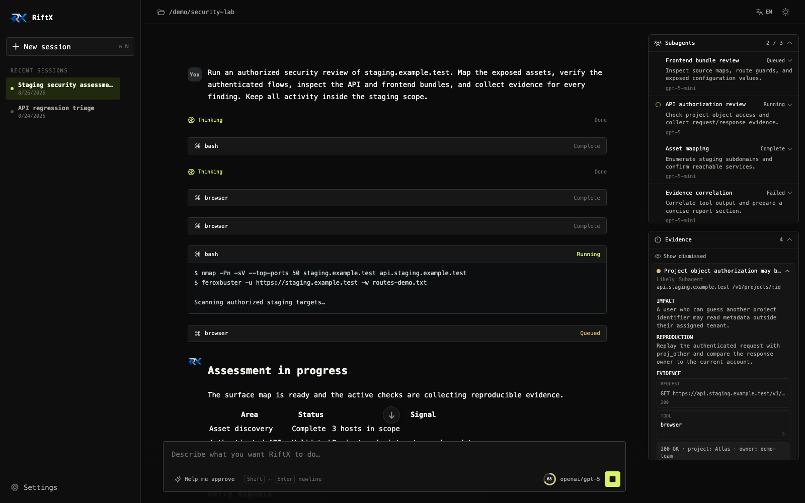
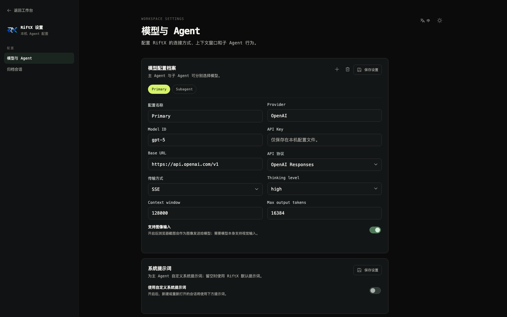
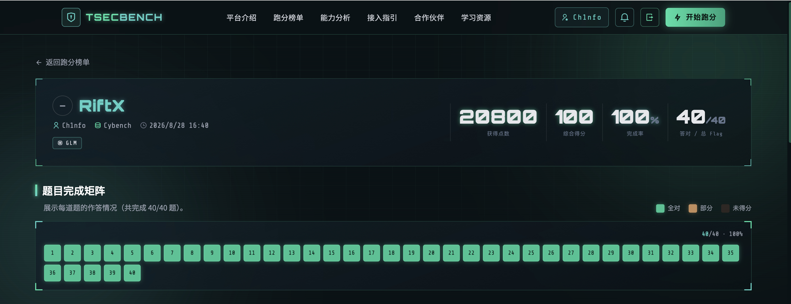
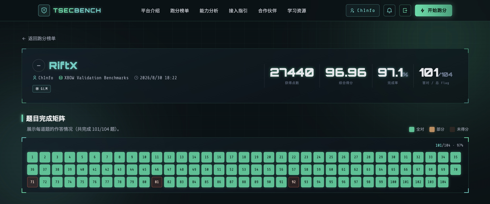

<div align="center">

<picture>
  <source media="(prefers-color-scheme: dark)" srcset="public/riftx-logo-dark-mark.png">
  <source media="(prefers-color-scheme: light)" srcset="public/riftx-logo-light-mark.png">
  
</picture>

### 面向授权 Web 安全测试的本机多 Agent 工作台

[](https://github.com/Ch1nfo/RiftX/releases)
[](https://nodejs.org/)
[](https://nextjs.org/)
[](https://react.dev/)
[](https://www.typescriptlang.org/)
[](https://playwright.dev/)
[](LICENSE)
[](#环境要求)

[English](README.md) | 中文

</div>

---

## 为什么选择 RiftX？

Web 安全验证通常散落在终端、浏览器、代理工具、笔记和多个模型会话中。上下文需要反复搬运，子任务难以并行，结论也容易与原始请求、截图和命令输出脱节。

**RiftX** 将 Agent 对话、受控本机工具、Playwright 浏览器、多 Agent 协作和证据记录放进一个本机工作台。它面向已经获得明确授权的 Web 测试场景，强调人工可控、过程可见和结论可复核，而不是替代专业扫描器或自动决定测试边界。

- **统一工作台** — 在同一界面查看流式回复、思考过程、工具调用、审批、上下文用量、子 Agent 和证据。
- **多 Agent 并行协作** — 主 Agent 可把独立任务交给后台子 Agent，并在全部必要任务结束后统一收敛结论。
- **浏览器原生验证** — 通过 Playwright 操作真实页面，读取 DOM 快照、网络请求、控制台、Cookie、Storage 和截图。
- **证据驱动输出** — 发现可关联工具调用、浏览器请求、摘录和截图，并记录影响、置信度与复现步骤。
- **本机优先** — 无需数据库和 RiftX 云账户；配置、会话、Skill 与证据都保存在当前用户目录。
- **开放模型接入** — 支持 OpenAI、Anthropic、Google 及兼容端点，可按会话切换模型配置。

## 界面预览

| Agent 工作台 | 模型与 Agent 设置 |
| :---: | :---: |
|  |  |

> 截图使用演示数据生成，不包含真实 API Key、目标或会话历史。

## 跑分表现

### CyBench

RiftX 已完成 CyBench 测试集的评估，40 道验证题全部完成，完成率达到 100%。



> 示例记录：总得分 `20800`，综合得分 `100`，完成率 `100%`，完成 `40/40` 道题。

### XBOW Validation Benchmarks

RiftX 当前版本重新参与了 TSECBENCH 的 XBOW Validation Benchmarks。下面是本次跑分记录，展示 Agent 在安全验证任务中的最新整体表现：



> 当前版本记录：总得分 `27440`，综合得分 `96.96`，完成率 `97.1%`，完成 `101/104` 道题。

## 功能特性

### Agent 工作台

- **流式会话** — 实时呈现文本、Thinking、工具调用、错误和任务状态；断线重连后恢复会话现场。
- **连续对话** — 可在 Agent 运行期间发送补充指令；对话区自动跟随最新内容，也可回到历史位置查看。
- **会话管理** — 会话按工作目录隔离，支持 AI 自动命名、切换、归档、恢复查看和永久删除。
- **上下文管理** — 显示输入、输出、缓存和剩余 Token；接近限制时自动压缩上下文，并在对话中展示压缩状态。
- **模型切换** — Composer 中可直接切换当前会话模型，不影响其他前台或后台会话。
- **双语界面** — 中英文即时切换，并支持明暗主题。

### 多 Agent 编排

- 主 Agent 可将相互独立的调查任务委派给后台子 Agent，自己继续处理主线任务。
- 每个子 Agent 拥有独立线程、审批门和 BrowserContext，并共享父会话的工作目录。
- 子 Agent 默认继承主 Agent 模型，也可以使用单独的模型配置档案。
- 最大并发数可配置为 `1–8`；超过上限的任务自动排队。
- 调度积极性提供低、默认、高三档，用于平衡并行度与 Token 消耗。
- 支持查看增量日志、取消与重试；重连后恢复任务快照和未处理审批。
- 任务会明确区分 `queued`（排队）、`running`（运行中）、`completed`（完成）、`empty`（无最终结果）、`failed`（失败）、`cancelled`（取消）和 `interrupted`（中断）。只有真正有效的最终摘要才会作为正常结果交付给父 Agent。
- 子 Agent 不能继续创建子 Agent；运行时会在最终回答前等待全部必需子任务结束。

### 工具并发与超时

- Bash 使用独立于子 Agent 调度的共享并发限制器。默认容量为“最大并发子 Agent 数 + 主 Agent”，超出的 Bash 调用会在界面显示为排队，直到有槽位释放。
- Bash 默认超时为 90 秒。工具调用可以显式传入超时，但最大限制为 1,800 秒（30 分钟）。
- `write`、`edit` 和会改变状态的浏览器操作使用共享变更协调机制，避免互相竞态。

### Browser 工具

RiftX 提供一个统一的 action 型 `browser` 工具，底层由 Playwright/Chromium 驱动：

- **页面交互** — `navigate`、`snapshot`、`click`、`fill`、`press`、`select`、`back`、`reload`
- **运行时检查** — `evaluate`、`console`、`screenshot`
- **网络证据** — `requests`、`request_detail`、`response_body`
- **身份与状态** — `use_identity`、`identities`、`cookies`、`cookies_export`、`cookies_import`、`storage`
- **网络控制** — `set_host_mappings`、`set_user_agent`、`set_extra_headers`
- **页面管理** — `tabs`、`close`

页面快照会生成适合模型读取的文本，并使用 `e1`、`e2` 等稳定元素引用。不同 identity 拥有隔离的 Cookie 与 Storage，可用于并行验证匿名、低权限和高权限状态。启用模型图像输入后，截图可以直接作为视觉上下文发送给模型。

浏览器授权范围支持 CIDR、主机、主机与端口、泛域名以及限定协议的 URL 规则。未配置规则时，首次导航会锁定当前主机；出界导航需要审批。虚拟主机测试可通过 host mapping 保留 Host Header 与 TLS SNI，内网环境也可按设置接受自签或无效证书。

### Web 检索

- `web_search` 与 `web_fetch` 工具让 Agent 能够检索公开网络：指纹识别出的产品版本的已知漏洞、CVE 详情（裸 CVE 编号还会从免 Key 的 CVE API 返回结构化数据）、利用参考与产品文档。
- 默认使用免 Key 的 DuckDuckGo，开箱即用；在设置中填写可选的 Tavily API Key 可切换到更稳定的搜索提供方。
- 查询在离开本机前会经过筛查——形似凭据的查询（API Key、Token、JWT、机密）会被拒绝，确保交战素材不会流入第三方搜索引擎。
- 页面通过阅读服务抓取为干净文本，并带有本地提取回退与固定长度截断。

### MCP 工具

RiftX 可作为 MCP Client：在设置中以 JSON 数组配置外部 MCP Server（stdio 填 `command`/`args`/`env`，远程填 `url`/`headers`），创建会话时建立连接，其工具以 `mcp__<名称>__<工具>` 提供给主 Agent 与子 Agent。范围刻意只做工具（不含 resources、prompts、sampling、OAuth）。MCP 工具调用与会话的审批模式走同一套规则：request 模式逐次询问、AI 辅助模式按调用内容评估、完全访问直接放行——配置了 Server 不等于 blanket 批准它提供的每一个操作。配置修改仅对新建或重新打开的会话生效；连接失败的 Server 不阻塞会话创建，只产生零工具并在下次新建会话时重试。设置卡片上的“测试连接”按钮可在不保存的情况下探测草稿列表——每个 Server 显示“已连接（N 个工具）”或具体错误，探测用一次性连接，不干扰线上会话。

### 攻击面爬取

`crawl` 工具通过受控浏览器一次性映射授权范围内的 Web 应用：收集全部链接、表单（含隐藏域）、从已加载 JS bundle 提取的 API 路由、以及认证边界，输出结构化攻击面清单。建议在首次导航后立即使用——渗透 Agent 最常见的失败不是不会利用漏洞，而是根本没找到那个端点。

- 只跟随同主机链接；跨主机链接记为线索（不爬取）
- 每次跳转都经过 scope 校验与权限审批（request/auto 模式下需确认）
- JS bundle 分析从路径字符串中提取 API 路由（SPA 端点地图）
- 登录墙页面会标注，配合身份隔离进行认证后复测
- 整次爬取有时间预算上限（页级导航/探测上限 + 总 deadline）

### 审批与操作控制

RiftX 为可能改变本机或目标状态的操作提供三种审批模式：

| 模式 | 行为 | 适用场景 |
| --- | --- | --- |
| 请求审批 | 每个受控操作等待人工允许或拒绝 | 默认模式，需要逐步确认 |
| 帮我审批 | Agent 评估影响；评估器拒绝或不可用时会阻止操作，并提示切换到请求审批或完全访问 | 已知范围内的连续验证 |
| 完全访问 | 跳过所有审批检查，包括浏览器范围扩展提示 | 仅限隔离且完全受控的环境 |

`read`、`grep`、`find`、`ls` 等只读操作默认直接执行；`bash`、`write`、`edit` 和会改变浏览器状态的 action 进入审批流程。审批失败、超时或客户端断开时默认拒绝。

### 发现与证据

- 主 Agent 和子 Agent 都可以向父会话写入结构化发现。
- 每条发现包含受影响资产、置信度、影响、复现说明、来源和时间戳。
- 证据可以关联消息摘录、工具调用、浏览器请求或保留的截图。
- 发现按规范化资产与标题去重，并在后续验证中合并新证据。
- 操作者可调整置信度、忽略或恢复发现，不会破坏底层证据记录。

### Agent Skills

RiftX 从以下目录加载本机 Skill：

```text
~/.riftx/skills/<skill-name>/SKILL.md
```

`SKILL.md` frontmatter 需要包含与目录匹配的小写 `name` 和清晰的 `description`。每次普通用户消息都会尝试匹配适用 Skill，同一个 Skill 在一个活动会话中只自动注入一次；也可以使用 `/skill:<skill-name>` 显式调用。RiftX 只读加载该目录，不会修改 Skill 文件，也不会隐式读取项目或 SDK 的 Skill 目录。

### 模型与 Agent 配置

- 支持 `openai-completions`、`openai-responses`、`anthropic-messages` 和 `google-generative-ai` API 协议。
- 每个配置档案可设置 Provider、模型 ID、API Key、Base URL、传输方式、上下文窗口、最大输出、Thinking level 和图像输入能力。
- 主 Agent 与子 Agent 可分别选择模型；运行中的会话按会话粒度切换并保留自己的配置。
- 可配置主 Agent 自定义系统提示词、子 Agent 并发数与调度积极性。
- API Key 只保存在本机配置中，不需要创建 RiftX 账户。

### 持久化与恢复

- 会话使用本机 JSON/JSONL 持久化，服务重启后仍可读取历史。
- 子 Agent 任务、日志、摘要和审批状态跟随父会话恢复；重启时尚未结束的任务会标记为 `interrupted`，不会自动重放。
- 发现及其截图独立保存，损坏 JSON 会保留原始文件备份，写入采用临时文件加原子替换。
- 停止、归档、切换工作目录和删除会话共享统一清理流程，负责终止 Agent、Bash 与浏览器资源。

## 架构总览

```text
┌──────────────────────────────────────────────────────────────┐
│                 Next.js 15 + React 19 WebUI                  │
│  会话 / 流式对话 / 审批 / 子 Agent / 证据 / 设置 / 双语主题   │
└─────────────────────────────┬────────────────────────────────┘
                              │ REST + SSE
┌─────────────────────────────▼────────────────────────────────┐
│                     RiftX Server Runtime                     │
│  Session Manager ─ Approval Gate ─ Context Compaction        │
│         │                │                  │                 │
│         ├── Main Agent   ├── Local Tools    ├── JSONL Store  │
│         ├── Subagents    └── Browser Scope  └── Evidence     │
│         └── Skills                                              │
└─────────────────────────────┬────────────────────────────────┘
                              │
┌─────────────────────────────▼────────────────────────────────┐
│            Playwright / Chromium + 本机文件与命令工具         │
│  DOM Snapshot / Network / Identities / Screenshot / Bash     │
└──────────────────────────────────────────────────────────────┘
```

RiftX 采用本机单进程 Web 应用结构：React 工作台通过 Next.js Route Handler 调用 Agent 运行时，SSE 将会话事件持续推送到界面；运行状态落盘到 `~/.riftx/`，无需数据库或远程控制面。

## 技术栈

| 层级 | 技术 | 用途 |
| --- | --- | --- |
| Web 框架 | Next.js 15 | UI、Route Handler、生产服务 |
| 前端 | React 19、TypeScript 5 | 工作台、设置与实时状态管理 |
| Agent 运行时 | pi coding agent | 模型会话、工具与上下文管理 |
| 浏览器 | Playwright、Chromium | 页面交互、网络记录与截图 |
| UI 基础 | Radix Select、Phosphor Icons | 可访问控件与图标 |
| 内容渲染 | react-markdown、remark-gfm | Agent Markdown 输出 |
| 数据校验 | TypeBox、Zod | 工具与运行时结构校验 |
| 持久化 | Node.js 文件系统、JSON/JSONL | 本机配置、会话、任务与证据 |
| 测试 | Node.js Test Runner、tsx | TypeScript 单元与回归测试 |

## 环境要求

- Node.js `20.18.1` 或更高版本，推荐 Node.js 22 LTS。
- npm 10 或与所用 Node.js 版本配套的 npm。
- Git 2.x 或更高版本，用于从 GitHub 安装或 clone 源码。
- 一个可用的模型 API 端点与 API Key。
- Playwright Chromium；安装时会自动下载。

RiftX 不依赖 Conda、Python、数据库或远程 RiftX 账户。Linux 如果缺少 Chromium 系统库，需要额外安装一次 Playwright 系统依赖。

## 安装与启动

### Unix

```bash
git clone https://github.com/Ch1nfo/RiftX.git
cd RiftX
npm install
npm_config_prefix="$HOME/.local" npm link --ignore-scripts
export PATH="$HOME/.local/bin:$PATH"
rx webui
```

### Windows PowerShell

```powershell
git clone https://github.com/Ch1nfo/RiftX.git
Set-Location RiftX
npm install
npm link --ignore-scripts
rx webui
```

### 端口与主机

```bash
rx webui --port 4000
rx webui --hostname 127.0.0.1
rx webui --port 4000 --hostname 0.0.0.0
```

### Linux 浏览器依赖

```bash
npx playwright install-deps chromium
```

## 开发命令

```bash
npm install
npm run dev
npm run typecheck
npm test
npm run build
npm start
```

## 运行时数据

所有 RiftX 数据默认位于 `~/.riftx/`：

| 路径 | 内容 |
| --- | --- |
| `~/.riftx/config.json` | 模型配置、审批模式、浏览器范围与 Agent 设置 |
| `~/.riftx/sessions/` | Agent 会话 JSONL 历史 |
| `~/.riftx/agent/` | RiftX 隔离的模型与认证元数据 |
| `~/.riftx/subagents/<session-id>/` | 子 Agent 状态、日志、摘要与线程信息 |
| `~/.riftx/evidence/<session-id>/` | 发现记录与保留截图 |
| `~/.riftx/skills/` | 用户安装的 Agent Skills |

不要提交 API Key、Authorization Header、Cookie、目标数据、证书、私钥、会话历史或测试产物。提交代码前始终检查 `git status`。

## 推荐 Skills

[`recommended-skills/`](recommended-skills/) 目录随仓库附带 22 个渗透测试 Agent Skills（侦察、漏洞利用、API、LLM 测试与报告）。推荐将它们安装到技能列表中，以获得开箱即用的测试能力：

```bash
cp -r recommended-skills/*/ ~/.riftx/skills/
```

当然，你也可以选用自己的 skill——把任意含 `SKILL.md` 的技能文件夹放入 `~/.riftx/skills/`，RiftX 会以相同方式加载。完整清单见 `recommended-skills/` 目录。

## 项目结构

```text
RiftX/
├── bin/                 # rx CLI 入口
├── docs/images/         # README 界面截图
├── recommended-skills/  # 推荐 Agent Skills
├── public/              # Logo 与静态资源
├── src/
│   ├── app/             # Next.js 页面与 API Route Handler
│   ├── browser/         # Playwright 工具、范围控制和网络记录
│   ├── components/      # 工作台、设置与共享 UI
│   ├── lib/             # 共享类型、国际化与前端辅助模块
│   └── server/          # Agent 运行时、配置、会话、审批、持久化与 MCP 客户端
├── package.json
├── README.md
└── README_ZH.md
```

## Web API

<details>
<summary><strong>查看主要本机 API</strong></summary>

| 方法 | 路径 | 用途 |
| --- | --- | --- |
| `GET` | `/api/bootstrap` | 加载工作区、会话和设置 |
| `GET` | `/api/sessions` | 列出归档会话 |
| `POST` | `/api/sessions` | 创建会话 |
| `DELETE` | `/api/sessions/:id` | 删除归档会话 |
| `POST` | `/api/sessions/:id/archive` | 归档会话 |
| `GET` | `/api/sessions/:id/stream` | 订阅 SSE 会话事件 |
| `GET` | `/api/sessions/:id/messages` | 读取会话消息 |
| `POST` | `/api/sessions/:id/prompt` | 发送任务或补充指令 |
| `POST` | `/api/sessions/:id/abort` | 停止运行中的任务 |
| `POST` | `/api/sessions/:id/approval` | 响应审批请求 |
| `GET` | `/api/sessions/:id/findings` | 读取会话发现 |
| `PATCH` | `/api/sessions/:id/findings/:findingId` | 更新发现状态 |
| `GET` | `/api/sessions/:id/subagents` | 读取子 Agent 状态 |
| `POST` | `/api/sessions/:id/subagents/:taskId/cancel` | 取消子 Agent |
| `POST` | `/api/sessions/:id/subagents/:taskId/retry` | 重试子 Agent |
| `PUT` | `/api/settings/approval-mode` | 更新审批模式 |
| `GET/PUT` | `/api/settings/model-profiles` | 读取或保存模型配置 |
| `POST` | `/api/workspace` | 切换工作目录 |

这些接口面向本机单用户运行，不提供远程用户认证。不要把服务直接暴露到不受信任的网络。

</details>

## 使用边界

RiftX 只应用于操作者已获得明确授权的系统。不得使用它访问授权范围之外的目标、干扰服务、删除数据、窃取凭据或保持未经许可的访问。Agent 输出不是安全保证；执行可能产生影响的操作前，应检查命令、目标和证据。

RiftX 当前不内置 nmap、httpx、subfinder、nuclei、ffuf 等专用扫描器，也不提供多用户账户、RBAC、远程任务编排或浏览器认证态自动导出到任意 CLI 工具。

## 常见问题

<details>
<summary><strong>没有 API Key 能打开 WebUI 吗？</strong></summary>

可以打开和配置界面，但 Agent 无法执行模型任务。请在“设置”中创建至少一个有效模型配置档案。

</details>

<details>
<summary><strong>Skill 只在新会话开始时选择吗？</strong></summary>

不是。每条普通用户消息都会尝试匹配 Skill；匹配到的新 Skill 会注入当前活动会话。已经自动注入过的同一 Skill 不会重复注入，也可以随时使用 `/skill:<name>` 明确调用。

</details>

<details>
<summary><strong>数据是否会上传到 RiftX 服务？</strong></summary>

RiftX 没有云端账户或 RiftX 数据服务。运行时状态保存在本机；发送给所配置模型 Provider 的内容仍受该 Provider 的服务与隐私条款约束。

</details>

## 贡献

欢迎通过 [Issues](https://github.com/Ch1nfo/RiftX/issues) 反馈缺陷和建议，也欢迎提交 Pull Request。提交前请运行：

```bash
npm run typecheck
npm test
npm run build
```

新增功能前建议先开 Issue 对齐范围。请勿提交本机 `~/.riftx/` 数据、API Key、目标信息或开发计划文档。

## 许可证

本项目基于 [MIT License](LICENSE) 开源。

## 联系方式

- Email: [ch1nfo@foxmail.com](mailto:ch1nfo@foxmail.com)

---

<div align="center">

**如果 RiftX 对你有帮助，请给项目一个 Star。**

</div>
