<div align="center">

# RiftX

### 一个会随专业使用者持续变顺手的 Pentest-first Agent

RiftX 将授权目标、Scope、审批、执行、证据、Finding、Report 与操作者维护的方法，
纳入同一条可恢复的渗透测试工作流。

<p>
  
  
  
  <a href="./LICENSE"></a>
</p>

<p>
  
  
  
  
  
  
  
  
</p>

<p>
  <a href="./README.md">English</a> · <strong>中文</strong>
</p>

</div>

> [!IMPORTANT]
> RiftX `2.0.0-alpha.0` 是面向本地单专业操作员的 Alpha 软件。
> 当前可信配置仅为 loopback 上的 `local_single_operator`。
> 只能将 RiftX 用于已获得明确授权的资产，切勿把 Control Plane 暴露到局域网或公网。

## Pentest-first 快速开始

这是从干净代码库到第一份证据化 Report 的正式支持路径。独立 Demo 和通用平台命令
都是可选项，不能代替真实授权 Pentest。

### 1. 安装并 Onboard

前置条件：Python `3.12`、名为 `agent` 的 Conda 环境，以及本地 Temporal CLI。

```bash
conda run --no-capture-output -n agent python -m pip install -e .
export RIFTX_MODEL_API_KEY="<provider key>"
export RIFTX_ADMIN_TOKEN="$(openssl rand -hex 32)"

conda run --no-capture-output -n agent riftx onboard \
  --non-interactive \
  --provider openai \
  --model gpt-5.6 \
  --request-mode responses

conda run --no-capture-output -n agent riftx doctor
```

`onboard` 会创建用户配置、Model Profile、Tool Registry、数据库和 Official Packs，
不会覆盖已有配置。缺少可选工具只会被报告为降级能力，不阻止基础 Pentest 路径启动。

### 2. 启动本地服务

在三个终端中使用相同的 `RIFTX_ADMIN_TOKEN` 与模型凭据环境：

```bash
# 终端 1
temporal server start-dev --ip 127.0.0.1 --port 7233 --ui-port 8233

# 终端 2
conda run --no-capture-output -n agent riftx serve

# 终端 3
conda run --no-capture-output -n agent riftx worker
```

当前版本只支持本地单专业操作员，并要求 Control Plane 保持在 loopback。部署、备份和
服务托管说明见 [`docs/deployment.md`](docs/deployment.md)。

### 3. 启动授权 Pentest

请把示例目标、Scope 和授权引用替换为真实授权值：

```bash
conda run --no-capture-output -n agent riftx pentest start \
  --objective "Assess the authorized staging service" \
  --authorization "ticket://SEC-1234" \
  --target "https://staging.example.test" \
  --scope "https://staging.example.test" \
  --model primary

conda run --no-capture-output -n agent riftx pentest status RUN_ID
conda run --no-capture-output -n agent riftx approvals RUN_ID
conda run --no-capture-output -n agent riftx approve APPROVAL_ID
```

Scope、Approval、预算、Credential Reference 与停止检查始终是权威门禁；Skill 不能
绕过这些检查，也不能加入未声明 Tool。

### 4. 生成 Report

当 Run 进入 `completed`、`failed` 或 `cancelled` 后：

```bash
conda run --no-capture-output -n agent riftx report generate RUN_ID \
  --format markdown \
  --format json

conda run --no-capture-output -n agent riftx report list RUN_ID
conda run --no-capture-output -n agent riftx report show REPORT_ID
```

专业用户可通过 `riftx skills` 添加并迭代本地方法，详见
[`docs/operator-skill-lifecycle.md`](docs/operator-skill-lifecycle.md)。

## 为什么选择 RiftX

RiftX 把每个 Run 视为持久化行动状态。WebUI 与 CLI 只是状态投影，
可恢复工作流与节点本地效果所有者，让客户端断开后的工作依然可恢复、可归因。

- **会话优先** —— 创建 Run 只会把目标和边界保存为 `waiting_user`；
  只有操作员发送第一条具体指令后，模型和工具才会启动。
- **可归因控制** —— 审批、终端接管与浏览器接管都绑定稳定身份和不可变决策。
- **持久执行** —— Temporal 持久循环和 Runner 所有效果，让重试、恢复与中断清晰可见。
- **证据天然可追溯** —— Artifact、Finding、Report、流量元数据与确定性图谱投影都保留来源。
- **停止必须被确认** —— RiftX 先围栏新效果，只有所有已知所有者返回明确停止证明后才报告 Run 已停止。

## 高级：独立脱敏 Demo

这是**模拟/脱敏展示**，不是 Pentest 结果。独立的 [`@riftx/demo`](apps/demo) 使用已脱敏的本地状态，
不会连接 Control Plane、Temporal、模型服务、Runner、浏览器会话或目标系统。

```bash
conda run --no-capture-output -n agent pnpm install
conda run --no-capture-output -n agent pnpm demo:dev
# 打开 http://127.0.0.1:5174/?lang=zh-CN
```

使用 `?lang=en` 或 `?lang=zh-CN` 可固定演示语言。
每个界面都会持续显示 **DEMO / SANITIZED**。

## 高级：产品导览

这些界面展示已实现能力，不是默认 Quickstart。Code Audit 页面属于 **frozen/experimental**
能力，只接受安全、兼容和现有用户阻断修复。点击图片可查看完整分辨率。

<table>
  <tbody>
    <tr>
      <td width="50%" valign="top">
        <a href="docs/assets/readme/zh/01-overview.webp">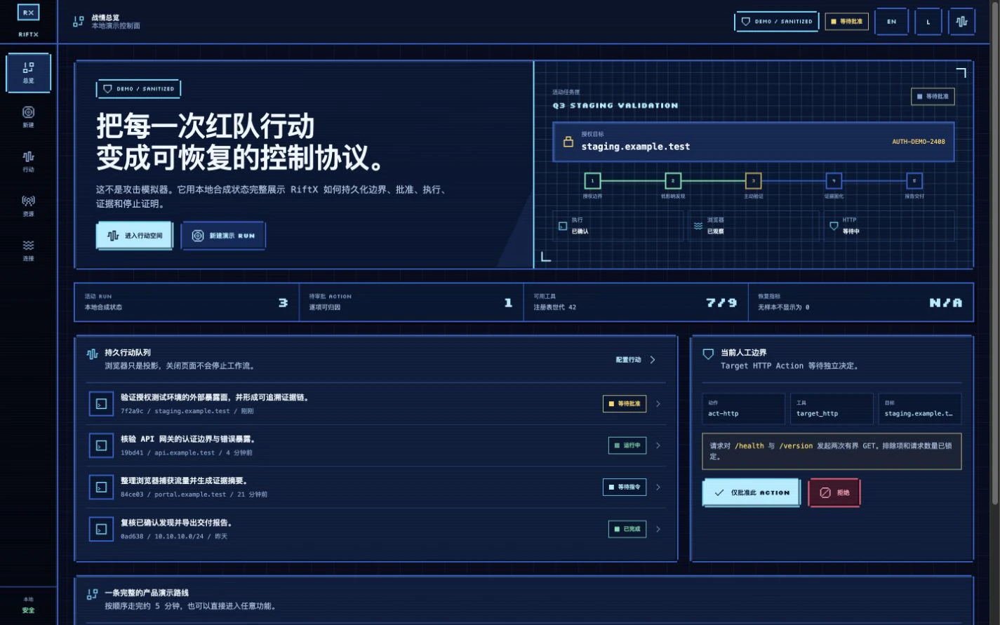</a>
        <p><strong>行动总览</strong><br>集中查看持久 Run、授权范围、审批与停止状态。</p>
      </td>
      <td width="50%" valign="top">
        <a href="docs/assets/readme/zh/02-new-run.webp">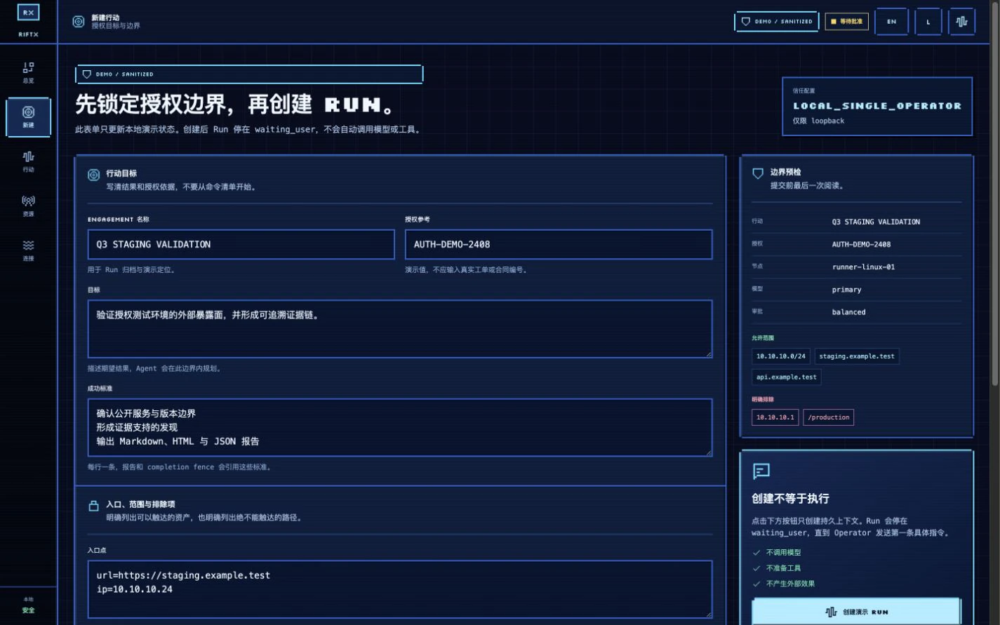</a>
        <p><strong>授权 Run</strong><br>先锁定目标、范围、排除项、Node、Model 与审批模式。</p>
      </td>
    </tr>
    <tr>
      <td width="50%" valign="top">
        <a href="docs/assets/readme/zh/03-conversation.webp">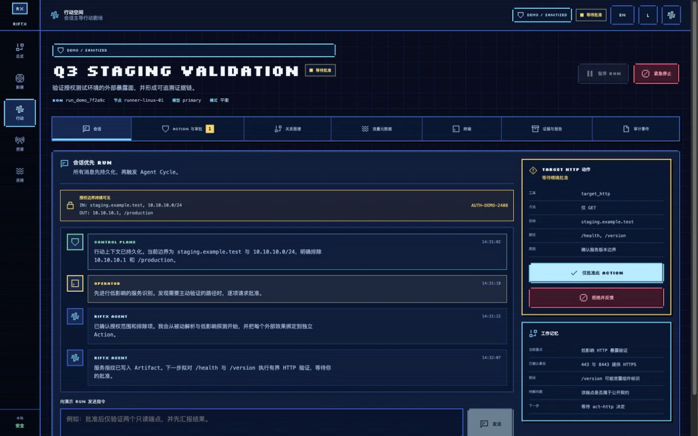</a>
        <p><strong>会话优先</strong><br>在首个有边界 Agent Cycle 启动前持久化操作员意图。</p>
      </td>
      <td width="50%" valign="top">
        <a href="docs/assets/readme/zh/04-actions-approval.webp">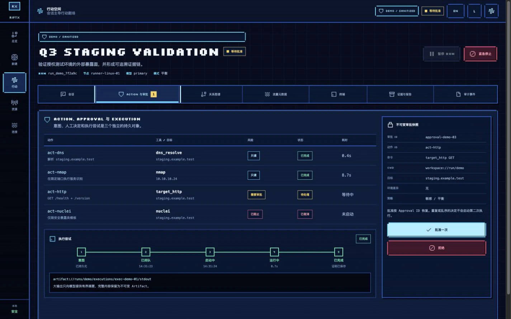</a>
        <p><strong>Action 与审批</strong><br>Action、Approval 与 Execution 身份彼此独立、可审计。</p>
      </td>
    </tr>
    <tr>
      <td width="50%" valign="top">
        <a href="docs/assets/readme/zh/05-operation-graph.webp">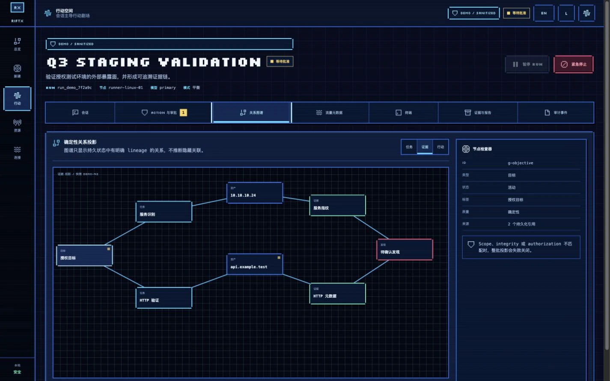</a>
        <p><strong>证据关系</strong><br>追踪 Task、Asset、Evidence 与 Finding，不推断隐藏关联。</p>
      </td>
      <td width="50%" valign="top">
        <a href="docs/assets/readme/zh/06-http-traffic.webp">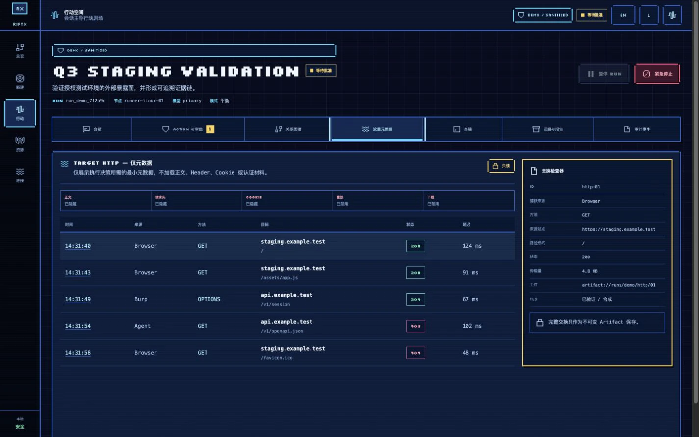</a>
        <p><strong>HTTP 元数据</strong><br>检查带 Artifact 来源的脱敏交换，不提供重放入口。</p>
      </td>
    </tr>
    <tr>
      <td width="50%" valign="top">
        <a href="docs/assets/readme/zh/07-terminal-takeover.webp">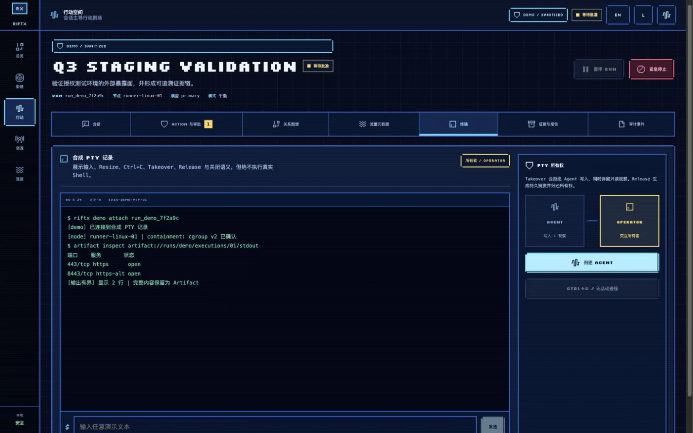</a>
        <p><strong>终端接管</strong><br>在 Agent 与操作员之间转移 PTY 所有权，同时保留记录。</p>
      </td>
      <td width="50%" valign="top">
        <a href="docs/assets/readme/zh/10-reports.webp">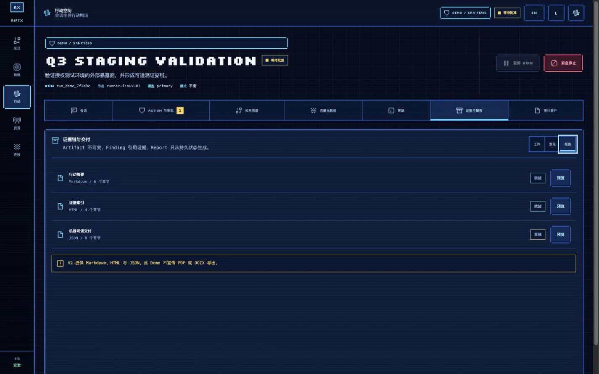</a>
        <p><strong>证据报告</strong><br>从持久证据生成 Markdown、HTML 与 JSON 交付物。</p>
      </td>
    </tr>
    <tr>
      <td width="50%" valign="top">
        <a href="docs/assets/readme/zh/13-emergency-stop.webp">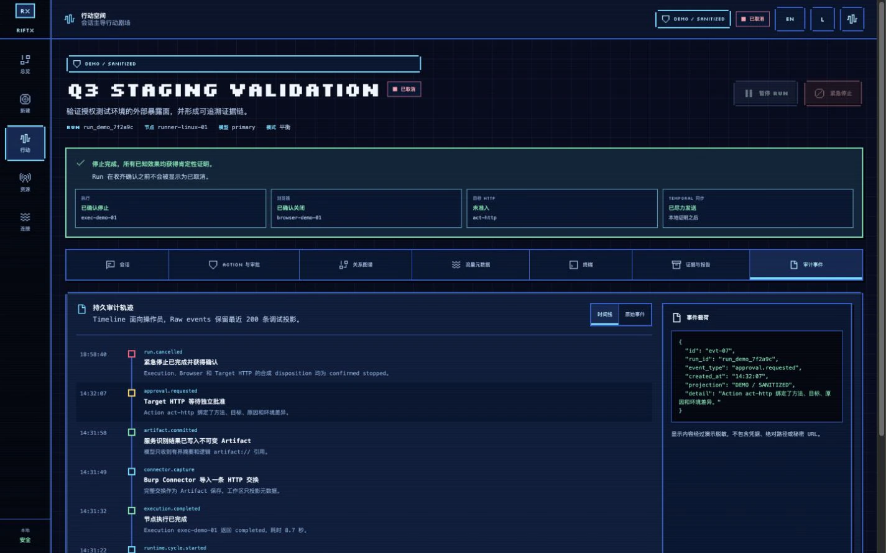</a>
        <p><strong>明确停止证明</strong><br>围栏新效果，并等待所有已知所有者确认处置结果。</p>
      </td>
      <td width="50%" valign="top">
        <a href="docs/assets/readme/zh/17-connectors.webp">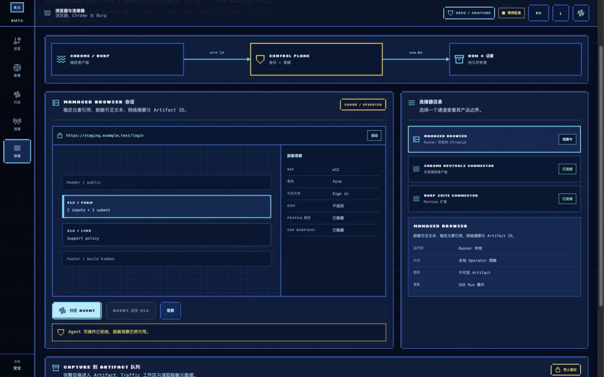</a>
        <p><strong>浏览器与连接器</strong><br>将 Managed Browser、Chrome 与 Burp 捕获接入同一证据链。</p>
      </td>
    </tr>
    <tr>
      <td width="50%" valign="top">
        <a href="docs/assets/readme/zh/18-local-code-audit.webp">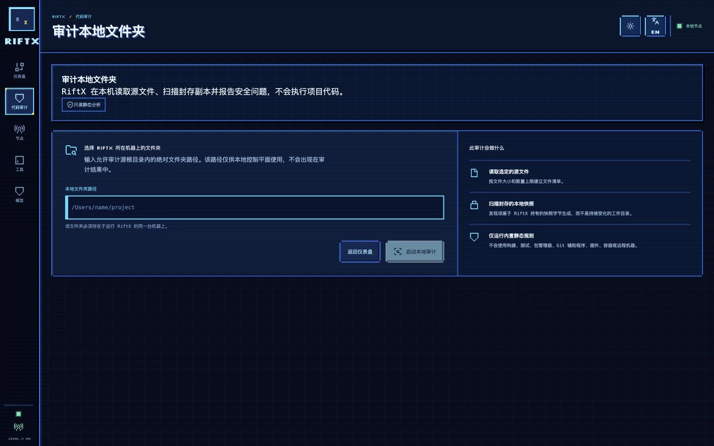</a>
        <p><strong>本地代码审计</strong><br>选择同一台机器上的文件夹，扫描封存快照且不执行项目代码。</p>
      </td>
      <td width="50%" valign="top">
        <a href="docs/assets/readme/zh/19-local-audit-findings.webp">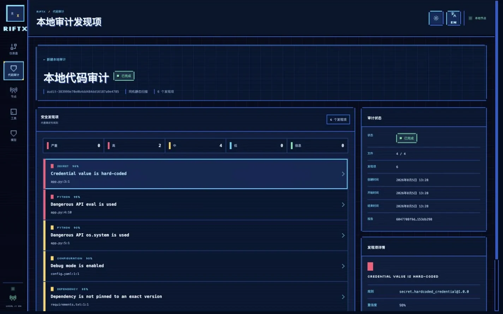</a>
        <p><strong>审计发现项</strong><br>查看严重性、置信度、相对位置、规则身份和脱敏证据。</p>
      </td>
    </tr>
  </tbody>
</table>

## 高级：平台能力图谱

| 领域 | 已实现能力 |
| --- | --- |
| 持久 Agent 运行时 | 有边界 Agent Cycle、动态 Tool 发现、渐进式 Skill、结构化 Working Memory、上下文编译与压缩、长期 Memory、Subagent、Hook、受治理的 MCP 集成、重试、重放与幂等执行身份 |
| 主机执行 | 仅限已注册的 Process、Shell 与 PTY；节点本地 Runner；有界输出；取消/等待；Linux delegated cgroup v2 隔离；Runner 范围内的 Target HTTP |
| 证据与可观测性 | 不可变 Artifact、证据支持的 Finding、Markdown/HTML/JSON Report、确定性 Task/Evidence/Operation 投影、可恢复 SSE、Raw Events、运行指标与逻辑 `artifact://` 引用 |
| 浏览器与研究 | Runner 所有的 Playwright Chromium、稳定元素引用、脱敏观察、接管摘要、公开来源注册表、研究管线、Chrome DevTools 连接器与 Burp Montoya 连接器 |
| 操作员配置 | 节点清单、可搜索 Tool Registry、OpenAI/OpenAI-compatible Model Profile、`chat_completions` 与 `responses` 请求模式、只写凭据、双语 WebUI/CLI 与持久深浅主题 |

## 高级：架构

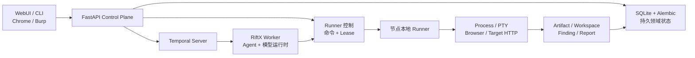

Control Plane、Temporal Worker 与 Runner 是彼此独立的职责边界。
虽然出站 Runner 协议已经实现，但当前版本唯一可选的可信配置要求 Control Plane
保持在 loopback，因此真正的远程 Runner 部署目前尚不可用。

## 贡献者与旧平台入口

### 前置条件

- Python `3.12` 与名为 `agent` 的 Conda 环境
- Node.js 与 pnpm `10.32.1`
- 用于执行第一条 Agent 指令的 Temporal CLI
- 对需要完整进程树停止证明的高风险执行，使用具备 delegated cgroup v2 的隔离 Linux Runner

### 安装并启动 Control Plane

```bash
conda run --no-capture-output -n agent python -m pip install -e ".[dev]"
conda run --no-capture-output -n agent pnpm install

cp -n configs/tools.example.yaml configs/tools.yaml
cp -n configs/models.example.yaml configs/models.yaml

conda run --no-capture-output -n agent pnpm web:build
export RIFTX_ADMIN_TOKEN="$(openssl rand -hex 32)"

conda run --no-capture-output -n agent riftx \
  --config configs/riftx.example.yaml serve
```

打开 <http://127.0.0.1:8787/>。示例注册表都是已脱敏模板；
`configs/tools.yaml`、`configs/models.yaml` 与本地密钥文件都已被 Git 忽略。
WebUI 只在页面内存中保存操作员 Token，不会写入浏览器存储。

此时 API、只读 UI 与仅创建会话的 Run 已可使用。发送第一条具体指令还需要
Temporal、RiftX Worker，以及凭据就绪的 Model Profile。

### 启动 Temporal 与 Worker

```bash
# 终端 1 —— 本地持久工作流服务
mkdir -p .riftx
temporal server start-dev \
  --ip 127.0.0.1 \
  --port 7233 \
  --ui-port 8233 \
  --db-filename .riftx/temporal.db

# 终端 2 —— RiftX Workflow/Activity Worker
conda run --no-capture-output -n agent riftx \
  --config configs/riftx.example.yaml worker
```

发送 Run 的第一条指令前，请先在 WebUI 中配置 Model Profile。
托管 Temporal 的 TLS、认证、备份、升级与进程托管说明见
[`docs/deployment.md`](docs/deployment.md)。

### 创建高级通用 Run

```bash
conda run --no-capture-output -n agent riftx run create \
  "Validate the authorized staging service" \
  --model primary \
  --entry url=https://staging.example.test

conda run --no-capture-output -n agent riftx run message RUN_ID \
  "Begin with passive service identification and report before active probing."
```

## 安全模型与当前限制

> [!CAUTION]
> RiftX 仅用于获得明确授权的安全测试。不要通过反向代理发布当前 Control Plane。
> 管理凭据、Runner Bootstrap 凭据、模型 Key、Temporal 凭据与目标资料必须使用
> 相互独立、受所有者保护的秘密通道。

- **本地可信边界：** `local_single_operator` 要求 loopback Listener 与 Origin；
  它不是 tenant-safe，也不提供多用户 RBAC。
- **受治理效果：** 模型 Key 只写不可读；Agent 可见的 Process、Shell、PTY、Browser
  与 Target HTTP 能力都必须经过分类并可归因。
- **明确停止证明：** `failed`、`lost`、已入队的取消请求或“找不到进程”
  都不会被报告为“已确认停止”。
- **当前限制：** 可证明的原生进程隔离需要 delegated Linux cgroup v2；
  macOS/Windows 尚无等价证明，loopback-only 可信配置也暂不支持远程 Runner 部署。

精确不变量请参阅[部署与安全验收](docs/deployment.md)及
[Model Profile 安全加固](docs/model-profile-hardening.md)。

## 开发与验证

本仓库所有 Agent 相关测试与运行命令都使用 `agent` Conda 环境。

```bash
# Python 与发布门禁
conda run --no-capture-output -n agent ruff check src/riftx tests migrations
conda run --no-capture-output -n agent python -m pytest
conda run --no-capture-output -n agent python scripts/qa/release-gate.py

# 生产 WebUI
conda run --no-capture-output -n agent pnpm --filter @riftx/web typecheck
conda run --no-capture-output -n agent pnpm --filter @riftx/web test
conda run --no-capture-output -n agent pnpm --filter @riftx/web build

# 独立 Demo
conda run --no-capture-output -n agent pnpm --filter @riftx/demo typecheck
conda run --no-capture-output -n agent pnpm --filter @riftx/demo test
conda run --no-capture-output -n agent pnpm --filter @riftx/demo build
```

权威的“功能到证据”矩阵与发布命令位于
[`docs/v2-completion-audit.md`](docs/v2-completion-audit.md)。
请针对待发布的准确 Commit 运行验证；本 README 不记录可能过期的测试数量。

## 文档

- [发布资格与实现覆盖](docs/v2-completion-audit.md)
- [部署、可信边界、备份与停止验收](docs/deployment.md)
- [Model Profile 与凭据安全加固](docs/model-profile-hardening.md)
- [Chrome 连接器](apps/browser-extension/README.md)
- [Burp 连接器](apps/burp-extension/README.md)
- Demo：[产品契约](apps/demo/PRODUCT.md) · [设计系统](apps/demo/DESIGN.md)

## 参与贡献

请说明变更影响的安全边界，并为新行为补充可执行证据。
切勿提交凭据、真实目标详情、捕获流量或生成报告。

## 许可证

RiftX 使用 [Apache License 2.0](LICENSE)。
第三方组件继续遵循各自的许可证声明。

## 联系方式

- Email：[ch1nfo@foxmail.com](mailto:ch1nfo@foxmail.com)
