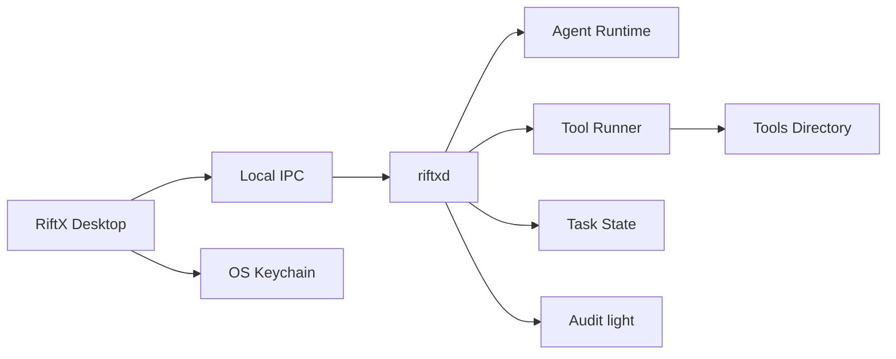

# RiftX 产品与技术实施计划

> 文档版本：v0.8  
> 日期：2026-07-25  
> 状态：产品方向已按体验优先收敛；本文取代 v0.7「本机强制隔离安全平台」叙事  
> 产品说明：[RiftX-项目说明.md](./RiftX-项目说明.md)

## 1. 文档定位

本文是 RiftX v0.8 的实施事实来源。

v0.7 把大量精力导向 OS Guard、多维强制 Scope、全库加密与三平台 Hardened 验收。相对「整合 runtime + 工具目录 + 自有桌面 + 三种场景模式」的目标，安全工程压过了产品体验。v0.8 纠正该偏差：

- **做**：Win/Mac 好用的 RiftX 桌面、工具目录、自配模型、分档审批、三种模式。
- **不做**：把产品做成强制隔离沙箱平台（详见第 10 节非目标）。
- 仓库中已存在的 Guard / 重加密等代码视为**遗留**，停止加功能，择期收敛。

## 2. 产品定义

RiftX = 开源 Agent Runtime 底座 + 安全工具目录手脚 + 自有 Win/Mac UI + 自配 LLM + 三种模式（RedTeam / Pentest / Auto）。

用户自己在提示词中说明目标与边界；敏感操作按模式分档人工批准。不依赖上游产品账号登录。

面向用户的一切展示使用 RiftX 品牌；上游产品名不出现在 UI、安装包、报告抬头等展示面。无法改动的上游内部代码可保留，但不作为产品标识露出。

## 3. 已确认产品决策

| 决策项 | 结论 |
| --- | --- |
| 模式命名 | RedTeam → Pentest → Auto（从紧到松） |
| RedTeam | 护网 AI 攻击队；危险命令 + 高风险工具要批 |
| Pentest | 企业内指定目标巡检；多数可跑，危险命令要批 |
| Auto | 靶场全自动；启动前一次风险确认，运行中少打断；Kill Switch |
| 边界手段 | 提示词 + 分档审批；不做 OS 强制隔离主路径 |
| 平台 | 仅 macOS、Windows 桌面；Linux 暂不考虑 |
| UI | 自有设计，不照抄上游 Agent 产品界面 |
| 品牌 | 展示面一律 RiftX；上游标识不进入产品展示 |
| LLM | 多 Profile，Responses-compatible；无上游账号登录 |
| 密钥 | API Key / 目标凭据进 OS 钥匙串；不进对话/报告/普通日志 |
| 工具 | Tools Directory 即插即用；不预装渗透工具 |
| 遥测 | 不实现 |

## 4. 架构

| 组件 | 职责 |
| --- | --- |
| RiftX Desktop | 任务、对话、模式、审批、设置、报告；只走本地 IPC |
| `riftxd` | 编排 Agent、工具执行、状态、轻量审计 |
| Agent Runtime | 模型调用、turn、Skill、shell、流式事件（内嵌固定版本） |
| Tool Runner | PATH / 工具目录解析、进程启动、输出采集 |
| OS Keychain | 仅存密钥类材料 |

**主路径不再依赖 `riftx-guard`。** Guard 相关 crate 若仍存在，不进入 v0.8 功能排期。

## 5. 桌面 UI 原则

- 对话优先的工作台：任务列表 | 对话与时间线 | 任务信息 / 审批。
- 文案、图标、关于页、窗口标题均为 RiftX。
- 不复刻上游产品的布局套路与品牌元素；可以借鉴通用桌面效率模式。
- WebView 不持久持有 API Key；密钥经 Tauri / daemon 访问钥匙串。

## 6. 模式与审批实现要点

用应用层策略表区分模式，而不是 OS sandbox：

| 模式 | 运行中审批 | 启动门槛 |
| --- | --- | --- |
| RedTeam | 危险命令 + 元数据标为高风险的工具 | 常规任务确认 |
| Pentest | 危险命令 | 常规任务确认 |
| Auto | 默认不打断（仍可手动暂停 / Kill） | 显式风险确认文案 + 用户确认 |

实现落点（示意）：

- 领域枚举：`EngagementMode::{RedTeam, Pentest, Auto}`（替换旧 `Native/Hardened/Auto`）。
- Gateway / Desktop 审批策略按模式分支。
- Auto：启动前确认 UI；运行中复用现有 interrupt / kill。
- 「危险命令」可先沿用 runtime 已有 command approval；「高风险工具」读 Tools 可选元数据中的风险字段。

旧 Hardened「Guard 不可用则拒绝启动」逻辑在 v0.8 **移除或旁路**，避免空壳模式挡住产品使用。

## 7. Tools / Skills

- 配置一个或多个 Tools Directory；扫描可执行文件，注入任务 PATH。
- 可选 sidecar 元数据：名称、风险等级、健康检查命令。
- `riftx tools doctor` / Desktop 设置页诊断保留。
- Skills：单一用户目录；不扩大审批绕过能力。

## 8. LLM Profile

- 配置文件或设置 UI 管理 Profile（model、base_url）。
- Key 仅 keyring；Agent 侧只使用已注入的运行时密钥句柄，不把密钥写入 SQLite 明文或报告。
- 目标凭据：可保留「引用 + 执行时注入」的轻量路径；**不再强调**次数租约 / 失败预算作为产品主叙事（已有代码可暂留，不继续复杂化）。

## 9. 阶段计划（体验优先）

### 阶段 A — 模式与品牌对齐

- 模式更名为 RedTeam / Pentest / Auto；UI、CLI、文档一致。
- 展示面清查上游产品标识 → 改为 RiftX。
- 旁路 / 停用 Hardened Guard 强制拒绝路径。

### 阶段 B — 分档审批

- 落地第 6 节策略表。
- Desktop 审批交互按模式区分提示文案与阻断点。

### 阶段 C — 工具与桌面体验

- Tools Directory 配置、医生诊断、任务内可用性打磨。
- Provider/Profile 增删与端点编辑补齐。
- UI 打磨：自有视觉，不照抄上游。

### 阶段 D — Auto 场景

- 启动前风险确认。
- 运行中少打断的自动推进（在现有 turn 循环上增强，不做完整「Evidence Evaluator 硬门槛」）。
- Kill Switch / 暂停保持可用。

### 阶段 E — 遗留收敛（不新增能力）

- 标记并逐步拆除或隔离：`riftx-guard` 主路径、过重加密案件叙事、Linux TUI 排期。
- 不阻塞 A–D。

## 10. 非目标（v0.8）

- Docker / K8s / 远程 Worker 执行后端。
- OS Guard 强制隔离与三平台 Hardened 验收。
- 多维强制 Scope 作为主安全声明。
- `.riftxcase`、全库案件加密作为发布门槛。
- 独立 Evidence Evaluator 作为 Auto 成功硬条件。
- Linux 首发、签名公证与自动更新（可晚于好用之后）。
- 上游账号登录、遥测、多租户、工具市场。

## 11. Definition of Done（v0.8 首个好用版本）

1. macOS、Windows 上 RiftX 桌面可完成：建任务 → 配模型 → 用工具目录里的工具对话执行 → 分档审批 → 看时间线 / 基础报告。
2. 三种模式名称与审批行为符合第 3、6 节；Auto 有启动确认与 Kill Switch。
3. 用户可见界面无上游产品品牌；无需上游账号，仅自配 API Key。
4. API Key / 凭据不进入对话与报告明文。
5. 不实现遥测。
6. 不把「未实现 OS Guard」当成阻断发布的理由。

## 12. 开放问题（不影响方向）

- 「危险命令」规则集是否完全复用 runtime 默认，或 RiftX 再加一层列表。
- 高风险工具元数据字段的正式 schema。
- Auto 在无进展时是否自动暂停（可选，默认人工 Kill 即可）。

这些问题用小原型验证，不得重新引入 v0.7 式强制隔离平台范围。
