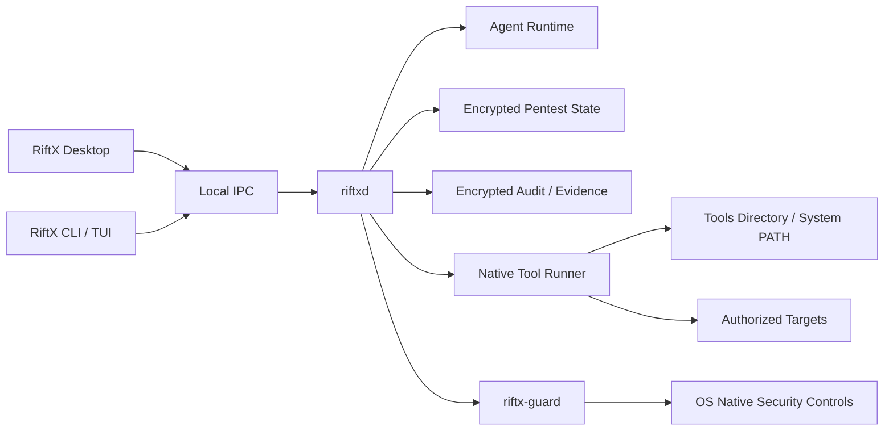

# RiftX 产品与技术实施计划

> 文档版本：v0.7
>
> 日期：2026-07-23
>
> 状态：产品决策已确认，实施中
>
> 适用范围：RiftX 下一代桌面端、Linux CLI/TUI、本机执行与 Auto Mode

## 1. 文档定位

本文是 RiftX 下一阶段的产品与技术实施单一事实来源，取代此前以 Docker sandbox、固定 Agent 和固定结构化工具为中心的方案。

本文描述的是目标产品，不代表当前代码已经具备全部能力。现有 Gateway、CLI、状态、审计和报告代码按本文分阶段收敛；旧 Docker manager、远程执行环境和固定动态工具直接删除，不保留兼容路径。

RiftX 只用于具有明确书面授权、有效时间窗和清晰目标范围的安全测试。Auto Mode 仅允许用于 Lab 环境，不得用于生产环境。

## 2. 产品定义

RiftX 是一个全平台、本机运行、对话驱动、目标导向的 AI 红队工作台。

RiftX 面向两类主要用户：

1. 专业红队和安全研究人员：需要自由 shell、本机工具、自定义脚本、代理、VPN 和人工接管能力。
2. 企业安全团队：需要可验证的本机执行边界、明确 Scope、凭据治理、完整审计和可回放证据。

RiftX 不重新实现一套通用 Agent Runtime。通用的 thread、turn、stream、interrupt、subagent、Skill、MCP、shell 和审批交互尽量复用固定版本的开源 Agent Runtime；RiftX 聚焦以下产品能力：

- Engagement 与目标管理。
- Scope 与 Policy。
- Native、Hardened、Auto 三种模式。
- 本机工具与 Skill 发现。
- 凭据安全引用。
- 目标导向状态和攻击路径。
- Evidence、Finding 与报告。
- 可回放审计。
- 跨平台桌面与 CLI/TUI。

## 3. 已确认产品决策

### 3.1 授权与安全

| 决策项 | 最终结论 |
| --- | --- |
| Scope | 使用完整多维 Scope |
| Auto 环境 | 仅允许 `lab` |
| 凭据存储 | 使用操作系统安全存储 |
| 凭据授权 | 绑定目标、Capability、次数和有效期 |
| Hardened 降级 | 安全边界失败时拒绝启动，不自动降级 |
| Auto 工具 | 使用启动时 Tools Directory 固定哈希快照 |
| Auto 风险确认 | 使用完整逐任务确认流程 |

### 3.2 目标、状态与数据

| 决策项 | 最终结论 |
| --- | --- |
| Objective | 自然语言与结构化成功条件同时存在 |
| 成功判定 | 使用独立只读 Evidence Evaluator |
| 状态模型 | 使用完整目标导向状态模型 |
| 工具结果 | 必须先成为 Observation，不能直接成为 Finding |
| Auto 运行预算 | 可选 |
| 无进展处理 | 达到阈值后自动停止 |
| 安全异常 | 分级终止或暂停 |
| 本地数据 | 完整案件数据加密 |
| 案件导出 | 加密 `.riftxcase` |
| 数据删除 | 由用户手动执行 |

Auto 运行预算可选不代表安全边界可选。以下项目始终强制：

- Auto 授权过期时间。
- Lab 环境声明。
- 固定 Scope。
- OS Guard。
- Audit。
- Tools 和 Skills 快照。
- Kill Switch。

### 3.3 产品与发布

| 决策项 | 最终结论 |
| --- | --- |
| 桌面技术栈 | Tauri + React/TypeScript + Rust |
| 桌面布局 | 对话优先的三栏工作台 |
| 后台服务 | 独立本地 `riftxd` |
| 系统托盘 | 启用 |
| Linux | CLI + 全屏 TUI |
| Skill 扩展 | 单一 Skills Directory |
| LLM | 多个 Responses-compatible Profile |
| RiftX 账号 | 不需要，产品完全本地、单用户 |
| 报告 | HTML、PDF、Markdown、JSON、`.riftxcase` |
| 更新 | 自动检查，用户确认安装 |
| 遥测 | 不实现遥测 |
| 首发架构 | macOS arm64、Windows x86_64、Linux x86_64 |
| 语言 | 中文和英文 |
| `riftx-guard` | 首次使用 Hardened/Auto 时按需安装 |
| 本地通信 | Unix Domain Socket 或 Windows Named Pipe |

## 4. 产品形态

### 4.1 分发物

| 平台 | 首发产品 |
| --- | --- |
| macOS | Apple Silicon arm64 DMG |
| Windows | x86_64 签名 EXE 安装程序 |
| Linux | x86_64 单文件 CLI 与全屏 TUI |

后续增加 Windows ARM64 和 Linux arm64。macOS 首期不要求 Intel 架构。

### 4.2 进程架构



### 4.3 组件职责

| 组件 | 职责 |
| --- | --- |
| RiftX Desktop | 任务、对话、模式切换、审批、状态、证据、设置和报告 |
| RiftX CLI/TUI | Linux 主入口，并可作为桌面平台的高级入口 |
| `riftxd` | Engagement、Agent、状态、审计、报告、工具执行和后台任务 |
| Agent Runtime | 模型调用、thread/turn、Skill、subagent、MCP、shell 和流式事件 |
| Native Tool Runner | PATH 解析、进程启动、输出采集、哈希校验和 artifact |
| `riftx-guard` | Hardened/Auto 的进程、文件、资源和网络约束 |
| Evidence Evaluator | 只读检查成功条件和 Finding 证据 |

桌面 WebView 不回读或持久持有 API Key，不直接执行工具，也不直接访问特权系统接口。
Tauri 后端负责访问 OS 安全存储，并只在启动本应用携带的 `riftxd` 时短暂持有 Key。

## 5. 桌面交互

### 5.1 主界面

```text
┌──────────────┬──────────────────────────────────┬──────────────────┐
│ Tasks        │ Conversation                     │ Engagement       │
│              │                                  │                  │
│ New Task     │ Operator / Agent messages        │ Objective        │
│ Active       │ Plans and hypotheses             │ Scope            │
│ Paused       │ Tool calls and approvals         │ Assets           │
│ Completed    │ Evidence and findings            │ Attack Paths     │
│              │                                  │ Coverage         │
├──────────────┴──────────────────────────────────┴──────────────────┤
│ Mode: Native | Hardened | Auto    Message...       Run / Stop     │
└───────────────────────────────────────────────────────────────────┘
```

布局原则：

- 左侧是 Engagement 列表和状态。
- 中间是主要对话和执行时间线。
- 右侧是可折叠状态面板。
- 底部固定显示模式、输入、运行、暂停和 Kill Switch。
- 不使用营销型首页。
- 不复制上游产品商标、名称或视觉资产。
- 支持浅色、深色、中文和英文。

### 5.2 对话式任务创建

用户可以直接描述：

```text
对 10.10.20.0/24 进行授权测试。
目标是验证是否存在到达域控的攻击路径。
初始账号使用 corp/test-user。
使用 Native Mode。
```

RiftX 从对话生成 Engagement 草稿：

- Objective。
- Success Criteria。
- Entry Points。
- Network Scope。
- Identity Scope。
- Action Scope。
- Environment。
- Time Window。
- Credential References。
- Execution Mode。
- 可选预算。

Scope、凭据范围、Auto Mode 和高影响 Capability 必须由用户明确确认，不能只依赖模型推断。

## 6. 三种模式

### 6.1 Native Mode

Native Mode 面向可信专业操作者。

能力：

- 任意本机 shell、PTY 和长进程。
- 任意 PATH 工具。
- Tools Directory 中未注册工具。
- Python、Go、PowerShell、C#、Shell 和临时 PoC。
- VPN、代理、监听、端口转发和本机工具链。
- 操作者实时接管、修改计划和终止执行。

安全措施：

- Scope precheck。
- MCP 参数检查。
- PreToolUse Hook。
- 命令和目标提示。
- 凭据引用与脱敏。
- Execution、stdout、stderr 和 artifact 审计。

安全声明：

> Native Mode 信任专业操作者，提供应用级 Scope guardrail，不保证网络层不可绕过。

### 6.2 Hardened Mode

Hardened Mode 同样使用本机工具，不使用 Docker、Podman、Kubernetes、虚拟机或远程 Worker。

Hardened Mode 的目标是：

- 保持本机工具自由度。
- 对 RiftX 启动的完整进程树实施约束。
- 使用平台原生机制限制文件、资源和网络。
- 在安全能力缺失时拒绝启动。

### 6.3 Auto Mode

Auto Mode 是 Hardened 执行策略上的无人监督模式，仅允许 `lab` 环境。

运行循环：

```text
Objective
  -> Current State
  -> Hypothesis
  -> TestCase
  -> Capability / Tool
  -> Execution
  -> Observation
  -> Evidence
  -> Attack Path / Finding
  -> Evidence Evaluation
  -> Continue / Complete / Stop
```

Auto 会持续运行，直到：

- 结构化成功条件通过 Evidence Evaluator。
- 确认目标在当前授权和能力下不可达。
- 达到无进展阈值。
- 可选预算耗尽。
- 授权到期。
- 触发安全停止条件。
- 操作者触发 Kill Switch。

Auto 不保证目标一定能够达到。

### 6.4 模式切换

Native 与 Hardened 只能在没有活动 Execution 时切换。

切换到 Hardened：

- 检查 `riftx-guard`。
- 检查管理员权限。
- 生成新 Policy Revision。
- 验证平台安全基线。
- 验证失败则拒绝切换。

切换到 Native：

- 显示失去强制边界的风险。
- 终止活动 Execution。
- 写入不可变审计事件。

切换到 Auto：

1. 要求当前没有活动 Execution。
2. 环境必须为 `lab`。
3. 显示 Objective 和结构化成功条件。
4. 显示完整 Scope。
5. 显示 Credential Grants。
6. 显示 Tools 和 Skills 快照。
7. 显示可选预算与强制授权过期时间。
8. 显示允许和拒绝的 Capability。
9. 要求输入确认短语。
10. 固化 Policy Revision。
11. 启动 OS Guard、Audit 和 Kill Switch。

确认短语：

```text
AUTO MODE - TEST ENVIRONMENT ONLY
```

Auto 切回人工模式时，立即终止当前 Execution，保留 thread、状态和证据。

## 7. 跨平台本机安全基线

三个平台提供相同产品功能，但底层安全机制和验收报告分别维护。

### 7.1 Linux

计划使用：

- process group 与 pidfd。
- cgroups v2。
- rlimit。
- Landlock 或等价文件访问限制。
- seccomp。
- network namespace。
- nftables。
- 独立临时工作目录。

不使用容器运行时。

### 7.2 macOS

计划使用：

- Seatbelt profile。
- process group。
- `setrlimit`。
- PF anchor 网络规则。
- 受限临时工作目录。
- Keychain。
- 签名 privileged helper。

macOS Hardened/Auto 需要 Apple Silicon 原生 helper，并单独验证系统版本兼容性。

### 7.3 Windows

计划使用：

- Restricted Token 或 AppContainer。
- Job Object。
- ACL 隔离的临时目录。
- Windows Firewall 或 WFP。
- Credential Manager。
- 本地签名 Windows Service。

PowerShell 执行不全局修改系统 Execution Policy。

### 7.4 失败策略

以下任一项失败时，Hardened 和 Auto 拒绝启动：

- `riftx-guard` 未安装或签名不可信。
- 管理员权限不足。
- 文件规则无法安装。
- 网络规则无法安装。
- 进程树无法纳入控制。
- Audit 无法创建。
- Kill Switch 不可用。

禁止静默降级到 Native。

## 8. Scope

### 8.1 Scope 对象

```text
Scope
├── Network
│   ├── IP
│   ├── CIDR
│   ├── Domain
│   ├── Port
│   └── Protocol
├── Identity
│   ├── Domain
│   ├── Tenant
│   └── Account
├── Action
│   └── Capability
├── Environment
│   ├── lab
│   ├── staging
│   └── production
└── Time Window
    ├── startsAt
    └── expiresAt
```

### 8.2 规则

- Entry Point 只提供起点，不限制资产发现数量。
- 新发现资产只有在 Scope 内才能继续执行。
- DNS 每次解析后重新判断 IP。
- HTTP 重定向后重新判断目标。
- IPv4 和 IPv6 分别判断。
- 代理、VPN 和 pivot 不自动扩大 Scope。
- 修改 Scope 必须生成新 Policy Revision。
- Auto 运行期间禁止修改 Scope。
- Auto 只接受 `lab`。

## 9. Credential Store

### 9.1 存储

| 平台 | 存储方式 |
| --- | --- |
| macOS | Keychain |
| Windows | Credential Manager |
| Linux | Secret Service |

`riftxd` 是评估凭据的唯一安全存储所有者。Desktop 和 CLI 先通过本机 IPC 创建
`configured=false` 的凭据引用，再通过独立的二进制请求把秘密交给 `riftxd`；只有系统
安全存储写入成功后，引用才更新为 `configured=true`。Desktop、CLI 和 Agent 都不直接
读取评估秘密，避免不同可执行文件身份导致安全存储访问失败。

同一引用的秘密不可覆盖；轮换凭据必须创建新引用和新 Grant。已有 Grant 历史的
`configured=false` 引用仅用于审计，不能重新配置。

系统安全存储调用必须运行在 blocking 线程池，不能阻塞 Agent 事件循环。执行前读取设置
固定超时；超时或读取失败必须关闭已预留的 Credential Use，且不得启动工具进程。删除
秘密前必须撤销活动 Grant；存在历史 Grant 时保留 `configured=false` 的引用用于审计。

Agent 只看到引用：

```text
credential://corp-test-user
```

### 9.2 Credential Grant

```text
CredentialGrant
├── credentialId
├── allowedTargets
├── allowedCapabilities
├── maxUses
├── maxFailuresPerIdentity
├── startsAt
└── expiresAt
```

秘密不进入：

- 对话上下文。
- SQLite 明文字段。
- Audit payload。
- 报告。
- 普通日志。
- 命令行参数。
- 凭据元数据 JSON。

工具启动时优先通过 stdin、临时文件或受控环境变量注入。临时文件必须使用最小权限并在进程结束后删除。

## 10. Tools Directory

### 10.1 路径

```text
macOS:
~/Library/Application Support/RiftX/tools/

Windows:
%LOCALAPPDATA%\RiftX\tools\

Linux:
~/.local/share/riftx/tools/
```

设置页提供：

```text
[ Open Folder ] [ Rescan ] [ Doctor ]
```

### 10.2 发现规则

RiftX 扫描：

- Tools 根目录。
- 一级子目录。
- 一级子目录下的 `bin/`。
- Windows 可执行扩展。
- macOS/Linux executable bit 与 shebang 脚本。

不无限递归扫描。

### 10.3 PATH

RiftX 不修改系统 PATH，只修改自身启动进程的 PATH：

```text
Tools Directory
  -> User Extra Paths
  -> System PATH
```

审计记录：

- 用户请求的命令名。
- 最终 resolved path。
- SHA-256。
- 可检测到的版本。
- argv。
- cwd。
- exit code。
- stdout/stderr hash。

### 10.4 模式规则

Native：

- 本机可执行即可运行。
- 不需要注册或 Manifest。

Hardened：

- 激活时扫描并确认目录。
- 运行期间目录只读。
- 工具变化后要求重新确认。

Auto：

- 启动时固定路径和 SHA-256 快照。
- 运行期间新增或修改的工具不可执行。

### 10.5 可选元数据

工具旁可以存在可选文件：

```text
nmap
nmap.riftx.toml
```

元数据可提供：

- Capability。
- 风险等级。
- 帮助命令。
- 输入目标字段。
- 输出格式和 Parser。

没有元数据时工具仍可执行，但输出只作为原始 Execution/Artifact 和模型可读结果，不自动生成结构化 Finding。

## 11. Skills Directory

### 11.1 路径

```text
macOS:
~/Library/Application Support/RiftX/skills/

Windows:
%LOCALAPPDATA%\RiftX\skills\

Linux:
~/.local/share/riftx/skills/
```

结构：

```text
skills/
├── network-recon/
│   └── SKILL.md
├── web-assessment/
│   └── SKILL.md
├── ad-attack-path/
│   └── SKILL.md
├── validation/
│   └── SKILL.md
└── reporting/
    └── SKILL.md
```

目录放入即可被发现。RiftX 区分内置 Skill 和用户 Skill，并显示来源。

Auto 启动时固定 Skills Directory 哈希快照，运行期间不加载新增或修改的 Skill。

## 12. Agent 与 Capability

### 12.1 Agent 形态

不再硬编码 Recon、Exploit、Report 运行时角色。

目标形态：

- 主 Agent：目标规划和操作者协作。
- Recon Skill/Subagent：资产和服务发现。
- Validation Skill/Subagent：验证 Hypothesis。
- Attack Path Skill/Subagent：身份、信任和横向路径。
- Evidence Evaluator：只读证据检查。
- Report Skill/Subagent：报告生成。

### 12.2 Capability

Policy 授权 Capability，而不是二进制名称：

```text
network.discovery
service.enumeration
web.discovery
content.discovery
vulnerability.scanning
vulnerability.validation
credential.testing
attack_path.analysis
lateral_movement
privilege_escalation
code_execution
evidence.capture
```

Tool Resolver 可以根据平台、PATH、Tools Directory 和操作者指令选择实际工具。

## 13. Objective 与状态模型

### 13.1 Objective

Objective 同时包含：

```text
Natural Language Goal
Structured Success Criteria
```

示例：

```text
Goal:
验证是否存在到达域控的攻击路径

Criteria:
destinationRole = domainController
accessLevel = domainAdminEquivalent
minimumConfidence = 0.9
reproducibleEvidence = true
```

### 13.2 核心对象

```text
Engagement
Asset
Service
Identity
CredentialReference
Observation
Hypothesis
TestCase
Execution
Evidence
Finding
AttackPath
Coverage
Task
Artifact
PolicyDecision
ApprovalGrant
```

### 13.3 证据链

```text
Asset / Identity
  -> Observation
  -> Hypothesis
  -> TestCase
  -> Execution
  -> Evidence
  -> Finding / AttackPath
```

任何扫描器结果都只能先形成 Observation。Finding 必须由验证 Execution 和 Evidence 支持。

### 13.4 Evidence Evaluator

Evidence Evaluator：

- 没有 shell。
- 没有目标网络。
- 不能修改 Scope 和 Policy。
- 只读取结构化状态和已保存 Evidence。
- 检查 Success Criteria。
- 给出通过、拒绝或证据不足。

主 Agent 不能绕过 Evaluator 自行把 Engagement 标记为成功。

## 14. Auto Mode

### 14.1 可选预算

以下预算由用户按需设置：

- 最大运行时间。
- 最大工具调用。
- 最大并发。
- 请求速率。
- 每个身份最大失败登录次数。
- artifact 容量。

即使没有设置预算，授权过期时间仍然强制存在。

### 14.2 无进展

默认连续三轮没有新增有效 Observation 时停止。

用户可以修改阈值，但不能关闭以下安全停止条件：

- Scope 无法确定。
- OS Guard 失效。
- Audit 写入失败。
- Kill Switch 失效。
- 工具或 Skill 哈希变化。

### 14.3 异常分级

立即终止并杀死进程树：

- OS Guard 失效。
- Audit 写入失败。
- Scope enforcement 失败。
- Tools/Skills 快照变化。
- Kill Switch 失效。

暂停并要求重新确认：

- VPN 变化。
- 网络接口变化。
- DNS 配置变化。
- 系统从睡眠恢复。
- 本机 IP 变化。

## 15. 数据与加密

### 15.1 本地目录

```text
RiftX Data
├── state/
├── audit/
├── artifacts/
├── reports/
├── tools/
├── skills/
└── logs/
```

### 15.2 加密

- 每个 Engagement 使用独立数据密钥。
- 数据密钥由 OS 安全存储保护。
- SQLite 敏感字段加密。
- Artifact 加密。
- Audit 加密。
- 临时解密文件使用最小权限并及时删除。
- 用户手动删除 Engagement。

### 15.3 `.riftxcase`

加密案件包包含：

- Engagement。
- Scope 与 Policy Revision。
- 状态对象。
- Evidence 与 Artifact。
- Audit。
- 报告。
- Tools/Skills 哈希和版本信息。

不包含：

- LLM API Key。
- RiftX 本地主密钥。
- 原始 Credential Secret。

导出时设置独立密码。

## 16. LLM

### 16.1 Profile

支持多个 Responses-compatible Profile：

```text
OpenAI
Enterprise Gateway
Local Compatible Endpoint
Test Mock
```

配置使用命名 Profile，`default_profile` 只定义新 Engagement 的默认选择，不是唯一可用
配置：

```toml
[llm]
default_profile = "openai"

[llm.profiles.openai]
model = "gpt-5.2"
base_url = "https://api.openai.com/v1"
api_key = { source = "keyring", credential = "openai" }
timeout_seconds = 300
reasoning_level = "high"
context_budget = 200000
```

每个 Engagement 选择一个 Profile。

- 第一阶段单机最多启用 16 个 Profile。
- `riftxd` 为每个 Profile 创建独立 App Server、API Key 上下文和 runtime home。
- Desktop sidecar 启动协议使用有总大小上限的 Profile-Key 内存帧一次性注入所有
  Keyring 凭据；帧只通过继承 stdin 传递并在写入/解析后清零缓冲区。
- Environment 凭据按 Profile 读取；每个 Runtime 的 Agent 工具进程环境都排除所有
  Profile 的密钥变量，防止跨 Profile 泄漏。

配置包括：

- Profile Name。
- Base URL。
- Model。
- API Key Reference。
- Timeout。
- Reasoning Level。
- Context Budget。

### 16.2 认证

- 只支持 API Key。
- 不提供 GPT/ChatGPT 账号登录。
- API Key 存入 OS 安全存储。
- Desktop WebView 只接收输入和显示连接状态，不回读明文 Key。
- Desktop 自己启动 `riftxd` 时，由 Tauri 后端读取 Key，并通过继承 stdin 的一次性
  长度前缀内存帧注入。
- 独立运行的 `riftxd` 直接从 OS 安全存储读取 Key。
- Keyring 来源的 Key 不进入命令行、环境变量、配置、数据库、审计或普通日志。

## 17. 报告

支持：

- HTML。
- PDF。
- Markdown。
- JSON。
- `.riftxcase`。

报告必须包含：

- Objective 和 Success Criteria。
- Scope。
- 执行模式。
- Auto 风险声明和停止原因。
- Tools/Skills 快照。
- 已验证 Finding。
- 未验证 Observation/Hypothesis。
- Attack Path。
- Coverage。
- Evidence 哈希。
- 关键 Policy Decision。

## 18. 后台、恢复与通知

- Desktop 关闭窗口后 `riftxd` 可以继续运行。
- 系统托盘显示运行、等待、暂停和风险状态。
- 托盘提供 Pause、Resume 和 Kill Switch。
- Pause 和 Kill Switch 先关闭新执行与批准入口，再中断活动 Engagement。
- Resume 只重新开放执行入口，不自动恢复 Engagement 或重放最后一个命令。
- Auto 默认可以在 Desktop 窗口关闭后继续。
- 系统重启后任务进入 `Paused`。
- 系统重启后不得自动恢复攻击。
- Pause 和 Kill Switch 状态必须持久化，daemon 重启不得把执行入口隐式恢复为 Running。
- 恢复前重新检查网络、VPN、DNS、Scope、工具快照和 Skill 快照。
- 崩溃恢复不自动重放最后一个命令。
- Desktop 只在主窗口隐藏或失焦时发送原生通知，当前覆盖命令审批、turn 完成、
  execution interrupt 和 Agent Runtime 断连。
- Desktop 后台服务同时维护全部 Active Engagement 的事件订阅；当前选中的任务只
  影响窗口内容，不影响其他任务的通知、审批等待或断线状态采集。
- 托盘任务状态按 Risk、Waiting approval、Running、Ready 的顺序聚合，优先显示最
  需要操作员介入的状态。
- 通知只使用固定状态文案，不显示目标、命令、参数、路径、证据、模型输出或错误详情。
- Desktop 不自动请求系统通知权限；操作员只能在设置页显式启用，拒绝后由操作系统
  设置管理。

## 19. 本地 IPC

| 平台 | IPC |
| --- | --- |
| macOS | Unix Domain Socket |
| Linux | Unix Domain Socket |
| Windows | Named Pipe |

默认不监听 TCP。

IPC 要求：

- 仅当前本机用户可访问。
- 消息大小有硬上限。
- 敏感字段使用专用脱敏类型。
- Desktop 和 CLI 共用 typed protocol。
- 协议版本协商。
- 对话历史按 Engagement 分页读取；只持久化操作员消息、最终回复和计划，不持久化
  推理、token 增量或原始 Agent Runtime 事件。
- 支持事件流、interrupt、pause、resume 和 shutdown。

## 20. CLI 与 TUI

Linux 提供功能等价入口：

```bash
riftx
riftx new
riftx open <engagement>
riftx run --mode native
riftx run --mode hardened
riftx run --mode auto
riftx pause
riftx resume
riftx stop
riftx status
riftx report
riftx tools doctor
```

直接运行 `riftx` 进入全屏 TUI，布局与 Desktop 对应。

## 21. 更新与遥测

### 21.1 更新

自动检查、用户确认安装：

- RiftX Desktop。
- `riftxd`。
- `riftx-guard`。
- 内置 Skills。

要求：

- 更新包签名。
- 版本回滚。
- 更新前暂停活动任务。
- Guard 更新后重新执行安全验收。

用户 Tools 和用户 Skills 永不自动更新。

### 21.2 遥测

RiftX 不实现遥测：

- 不发送使用统计。
- 不发送崩溃报告。
- 不发送模型、目标、命令、证据或系统信息。

提供本地诊断包导出，由用户自行决定是否分享。诊断包必须默认排除凭据、API Key、目标输出和案件数据。

## 22. 目标目录结构

```text
RiftX/
├── apps/
│   └── desktop/                 # Tauri + React/TypeScript
├── crates/
│   ├── riftx-domain/            # Engagement、Scope、状态对象
│   ├── riftx-policy/            # Policy、Capability、Approval
│   ├── riftx-agent-client/      # 薄 typed Agent Runtime client
│   ├── riftx-daemon/            # riftxd
│   ├── riftx-ipc/               # UDS / Named Pipe protocol
│   ├── riftx-runner/            # Native Tool Runner
│   ├── riftx-tools/             # Tools Directory
│   ├── riftx-skills/            # Skills Directory
│   ├── riftx-state/             # 加密状态
│   ├── riftx-evidence/          # Evidence Evaluator
│   ├── riftx-report/            # HTML/PDF/Markdown/JSON
│   └── riftx-case/              # .riftxcase
├── guards/
│   ├── macos/
│   ├── windows/
│   └── linux/
├── cli/
├── tui/
├── built-in-skills/
├── tests/
│   ├── cross-platform/
│   ├── policy/
│   ├── auto/
│   ├── tools/
│   ├── evidence/
│   └── guards/
└── RiftX-技术实现方案.md
```

目录重组按可编译、可测试的阶段完成；已废弃的执行路径不因目录迁移而保留。

## 23. 现有实现收敛

### 23.1 保留

- Gateway 中的 Engagement API 语义。
- Objective、Entry Point 和多资产模型。
- Scope、Policy Revision 和默认拒绝思想。
- SQLite 状态层的基础能力。
- Audit、Evidence、Artifact 和 Report。
- 工具参数验证和输出解析经验。
- API-Key-only 模型配置。
- App Server typed client 和协议 fixture。

### 23.2 缩减或替换

| 当前实现 | 目标 |
| --- | --- |
| 固定 Recon/Exploit/Report Runtime | Skill/Subagent |
| Gateway 平行 thread/turn 状态机 | 业务映射到 Agent Runtime IDs |
| 强制 remote environment | 本机 Agent thread |
| 固定 `rt_*` dynamic tools | Tools Directory + shell + 可选元数据 |
| Docker `sandbox-managerd` | 删除 |
| `riftx-runtime` 容器 | 删除 |
| Linux-only网络方案 | 三平台 `riftx-guard` |
| Gateway TCP 产品入口 | 本地 `riftxd` IPC |

### 23.3 删除原则

容器 manager、远程 environment、容器 exec、固定 `rt_*` 工具和对应配置、CI、脚本直接删除。
不提供兼容开关、旧字段或回退执行路径。后续能力只在本机架构上实现。

## 24. 实施阶段

### P0：架构冻结与本机基线，1-2 周

- 建立 v0.7 ADR。
- 固定上游 Agent Runtime commit。
- 删除旧 Docker、managerd、远程 environment 和固定动态工具路径。
- 建立跨平台 CI。
- 建立行为基线测试。

### P1：领域模型与加密状态，3-5 周

- 实现多维 Scope。
- 实现 CredentialReference/Grant。
- 增加 Observation、Hypothesis、TestCase、Execution、AttackPath 和 Coverage。
- 实现每 Engagement 数据密钥。
- 实现加密 SQLite、Audit 和 Artifact。

### P2：`riftxd` 与本地 IPC，3-4 周

- 抽离本地后台服务。
- 实现 UDS 和 Named Pipe。
- Desktop/CLI typed protocol。
- thread/turn 只保存业务映射。
- 实现后台任务、暂停、恢复和 Kill Switch。

### P3：Tools、Skills 与 Native Mode，3-4 周

- Tools Directory 扫描和 PATH 注入。
- Skills Directory 扫描。
- Tool/Skill 快照。
- `riftx tools doctor`。
- `riftx skills doctor`。
- 本机 shell、PTY、stdin、interrupt、artifact。
- macOS、Windows、Linux Native 验收。

### P4：桌面端与 Linux TUI，5-7 周

- Tauri 应用壳。
- 三栏对话工作台。
- Engagement 创建和确认。
- 模式切换。
- 设置、报告、工具、Skill 和凭据 UI。
- 系统托盘和通知。
- Linux 全屏 TUI。

### P5：Hardened Mode，8-12 周

- Linux Guard。
- macOS privileged helper。
- Windows Service。
- 三平台进程树、文件、资源、网络和 Kill Switch。
- 分平台安全测试和声明。
- 失败时拒绝启动。

### P6：Auto Mode，6-9 周

- Autonomous planner loop。
- Success Criteria。
- Evidence Evaluator。
- 无进展判断。
- 可选预算。
- 风险确认。
- 异常分级。
- 重启后 Paused。
- Lab-only 强制。

### P7：报告、案件包与发布，4-6 周

- HTML/PDF/Markdown/JSON。
- 加密 `.riftxcase`。
- macOS arm64 DMG 签名与 Notarization。
- Windows x86_64 EXE 签名。
- Linux x86_64 CLI/TUI 发布包。
- 签名更新和回滚。
- 中英文。

总体工作量按单人全职估算约为 32-45 人周。macOS/Windows 特权 helper、签名、网络边界和 Auto 安全验收是主要风险，不应按普通桌面 CRUD 项目估算。

## 25. 测试策略

### 25.1 平台矩阵

| 平台 | 必测 |
| --- | --- |
| macOS arm64 | Desktop、Native、Guard、Keychain、DMG |
| Windows x86_64 | Desktop、Native、Guard、Credential Manager、EXE |
| Linux x86_64 | CLI/TUI、Native、Guard、Secret Service |

### 25.2 功能测试

- Engagement 创建、暂停、恢复和删除。
- 三种模式切换。
- 对话生成 Scope 草稿。
- Tools/Skills 发现和快照。
- API Key Profile。
- Credential Grant。
- 状态和证据链。
- 报告和 `.riftxcase`。

### 25.3 Auto 测试

- 使用 deterministic model mock。
- 目标成功。
- 目标不可达。
- 无进展。
- 工具失败。
- 工具哈希变化。
- Scope 变化。
- VPN/DNS/网络接口变化。
- OS Guard 和 Audit 故障。
- Kill Switch。
- 授权到期。
- 系统睡眠和重启。

### 25.4 安全测试

- 非授权 IPC 用户访问。
- API Key 和凭据泄漏扫描。
- Tools/Skills 目录替换和符号链接攻击。
- PATH 劫持。
- 子进程逃逸。
- 进程树残留。
- 网络 Scope 绕过。
- DNS 重绑定和重定向。
- Windows/macOS/Linux 分平台规则卸载。
- 加密案件篡改。
- 更新包签名验证。

## 26. Definition of Done

v0.7 首个稳定版本必须满足：

1. macOS arm64 DMG、Windows x86_64 EXE、Linux x86_64 CLI/TUI 可安装运行。
2. 三个平台均可完成 Native 对话、工具执行、状态、证据和报告闭环。
3. Hardened 在任一安全组件缺失时拒绝启动。
4. Auto 只能在 Lab 环境启动。
5. Auto 完成完整风险确认和目录快照。
6. Auto 成功必须通过 Evidence Evaluator。
7. Auto 安全异常可确定性停止或暂停。
8. API Key 和凭据不进入对话、报告和审计。
9. 本地案件数据加密。
10. `.riftxcase` 可加密导出和校验。
11. 不实现遥测。
12. 当前活动任务在应用关闭后可继续，在系统重启后保持 Paused。
13. 所有发布包和更新包签名。
14. 中文和英文完整可用。

## 27. 非目标

第一阶段不建设：

- Docker、Podman 或 Kubernetes 执行后端。
- 远程 Worker。
- RiftX 云端账号。
- 多租户。
- 团队协作和 SSO。
- 第三方工具市场。
- Tools/Skills 自动更新。
- 生产环境 Auto Mode。
- 无限制自动持久化、破坏或数据外传能力。
- 遥测。

## 28. 开放的实施级问题

以下问题不改变产品决策，可在对应阶段通过技术验证确定：

- macOS PF 与 Seatbelt 的最小稳定组合。
- Windows AppContainer、Restricted Token、Firewall/WFP 的最终组合。
- Linux Landlock 与 namespace 的兼容矩阵。
- 本地数据库字段加密与查询性能方案。
- Tauri 自动更新和后台服务安装的具体实现。
- PDF 渲染引擎。
- `.riftxcase` 加密容器格式。

这些问题必须通过原型和测试选择，不能降低本文确定的产品边界。

## 29. 上游归属与品牌边界

RiftX 可以在内部复用固定版本的开源 Agent Runtime，但产品界面、安装包、进程名、报告、设置和认证统一使用 RiftX 品牌。

RiftX：

- 不提供上游账号登录。
- 不显示上游产品品牌作为主产品名称。
- 不暴露原始上游协议给 Desktop 或业务领域模型。
- 保留必要的源码、许可证和技术归属信息。

RiftX 是独立项目，不是 OpenAI 官方产品。
