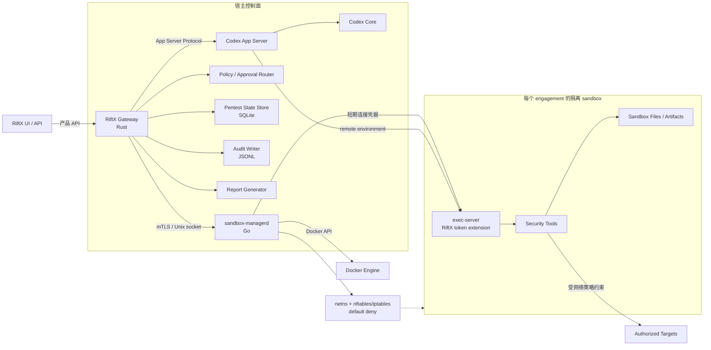
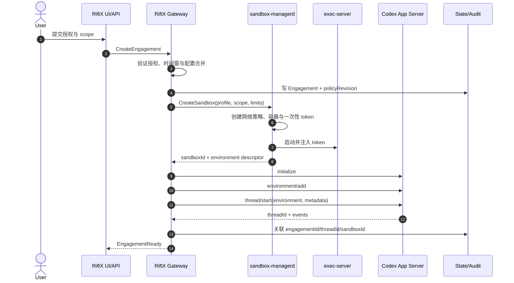
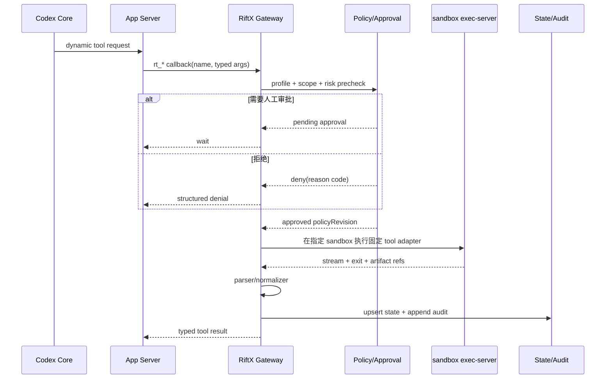
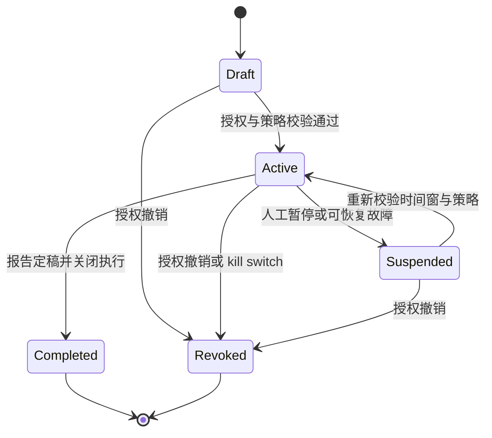
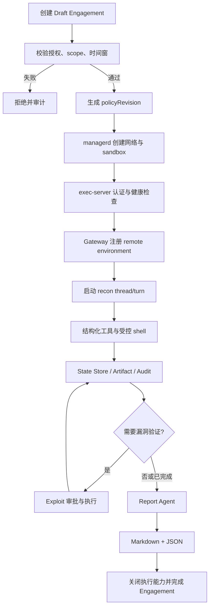
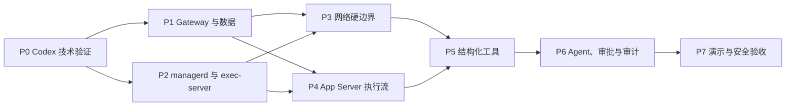

# RiftX 技术实现方案

> 面向授权安全测试的智能渗透测试 Agent  
> 文档版本：v0.4  
> 日期：2026-07-22  
> 状态：设计稿（Codex 底座重构版）

RiftX 只用于具有明确书面授权、目标范围和有效时间窗的安全测试。系统必须默认拒绝未授权目标，并把应用层检查、模型权限和网络层强制策略视为相互补充而非彼此替代。

---

## 1. 文档定位与关键决策

### 1.1 文档定位

本文定义 RiftX 第一阶段的可实施架构、组件边界、数据契约、安全基线、开发顺序和验收标准。第一阶段目标是在授权靶场内跑通以下闭环：

> 沙箱创建 → 侦察 → 漏洞发现 → 结构化状态 → 审批与审计 → 报告

第一阶段不是通用红队平台，也不追求无人监督的自动利用。所有能力均围绕“授权可证明、执行可约束、过程可审计、结果可复现”设计。

### 1.2 关键决策

| 决策项 | v0.4 结论 |
| --- | --- |
| Agent 底座 | 基于开源 Codex CLI 的 `codex-rs/core`、`app-server`、`app-server-protocol` 和 `exec-server` |
| 产品入口 | `RiftX UI/API` 只访问 `RiftX Gateway`，不直接访问原始 App Server |
| 编排层 | Rust `RiftX Gateway` 负责 Codex 协议适配、engagement 生命周期、审批、事件和动态工具回调 |
| 沙箱控制面 | Go `sandbox-managerd` 独占 Docker 生命周期、资源、网络、artifact 和 kill switch |
| 沙箱执行面 | 容器内运行 Codex `exec-server`，增加 RiftX 薄认证扩展 |
| 状态持久化 | 独立 SQLite Pentest State Store，不扩展 Codex thread 数据表 |
| 审计 | append-only JSONL，跨 Codex、Gateway、managerd 和 sandbox 关联 |
| 安全验收基线 | Linux Docker；macOS Docker Desktop 仅用于开发 |
| 网络边界 | netns 与 nftables/iptables 等网络策略为硬边界；Codex proxy 仅作补充 |
| 上游策略 | 固定到明确的 Codex commit，实验协议只暴露给 Gateway 兼容层 |
| 第一阶段报告 | Markdown 与 JSON；SARIF、DefectDojo 等集成延后 |

### 1.3 架构不变量

1. Codex Core、Gateway 和 UI 都不得直接访问 `docker.sock`。
2. 任何目标探测都必须在 engagement 对应的 sandbox 内执行，禁止从 Gateway 宿主发起。
3. `thread/shellCommand`、`process/spawn` 等宿主执行接口不得由 Gateway 向 RiftX 产品面暴露。
4. scope 的最终强制边界位于 Linux 网络层，prompt、hook、审批和代理均不能代替该边界。
5. scope、授权期限或强制 deny 的修改不能通过一次工具审批完成。
6. 任何可影响授权判断的配置变更都必须生成新的 `policyRevision` 并进入审计日志。

---

## 2. 底座选型结论及 Codex/OpenCode 对比

### 2.1 结论

RiftX 选择开源 Codex CLI 作为长期底座。原因不是单纯复用一个命令行界面，而是复用其 Rust Agent Core、App Server 事件协议、审批模型、远程 environment 接入点以及进程与 PTY 执行服务，使安全边界可以落在统一的 Rust 控制面与独立 Go 沙箱管理面之间。

当前仓库中已导入的 OpenCode 源码保留用于历史参考，不在本次文档重写中删除，也不作为 v0.4 的实施路径。本次不实施代码迁移。

### 2.2 选型对比

| 维度 | Codex CLI | OpenCode | RiftX 判断 |
| --- | --- | --- | --- |
| 核心语言 | Rust 为主 | TypeScript/JavaScript 为主 | Rust 更适合复用协议、审批与执行核心，并减少跨语言执行层 |
| Agent 运行时 | Core 与 App Server 分层，提供事件化协议 | 产品与工具框架成熟，模型适配范围广 | RiftX 更需要稳定的本地 Agent 核心和可封装的服务协议 |
| 远程执行 | environment 与 exec-server 提供可复用基础 | 需要自行维护更多远程执行适配 | Codex 路径更贴近“控制面在宿主、执行面在容器”目标 |
| 审批与事件 | turn、approval、interrupt、stream event 可统一关联 | 具备权限机制，但与 RiftX 目标架构耦合方式不同 | Codex 更适合由 Gateway 建立单一事件总线 |
| 模型生态 | 优先面向 OpenAI Responses 工作流 | 多模型与多供应商是明显优势 | 第一阶段优先安全闭环，不把广泛模型兼容作为主目标 |
| 上游变化风险 | 部分 App Server 接口仍属实验性 | 插件与内部接口也存在升级成本 | 固定 Codex commit，并用兼容层控制风险 |
| 改造成本 | 需要 Rust 能力和少量上游扩展 | 与现有导入代码更接近 | 长期安全边界收益高于短期迁移便利 |

### 2.3 选型代价与控制措施

- **实验协议变化**：`environment/add`、dynamic tools 和 permission profile 按固定上游 commit 使用，不让协议类型进入 UI、状态库或 managerd API。
- **上游维护成本**：RiftX 修改集中在独立 crate 和小型 exec-server 认证补丁；能通过组合实现的能力不修改上游 Core。
- **模型范围收敛**：第一阶段只验收 OpenAI Responses 兼容路径，不承诺所有模型供应商行为一致。
- **许可证义务**：保留上游许可证与必要 notice，RiftX 产品名、包名和发布物保持独立；正式发布前完成许可证清单审查。

---

## 3. 总体架构、组件职责与信任边界

### 3.1 总体架构



固定调用链为：

> RiftX UI/API → RiftX Gateway → Codex App Server/Core → sandbox-managerd → 容器内 exec-server → 安全工具

App Server 与 managerd 是并列的受控后端：App Server 负责 Agent 生命周期，managerd 负责 sandbox 生命周期。Gateway 负责把两者绑定到同一个 engagement，但不把 Docker 控制权交给 Codex。

### 3.2 组件职责

| 组件 | 核心职责 | 明确不负责 |
| --- | --- | --- |
| RiftX UI/API | 创建 engagement、展示状态、处理审批、查看报告 | 不直连 App Server，不拼接 shell 命令 |
| RiftX Gateway | 产品 API、Codex 协议适配、environment 绑定、动态工具、审批路由、事件聚合、状态更新 | 不直接运行安全工具，不持有 Docker socket |
| Codex App Server/Core | thread/turn、模型调用、工具编排、审批事件、interrupt、Agent 上下文 | 不创建容器，不决定授权 scope |
| sandbox-managerd | Docker 生命周期、镜像 profile、资源限制、网络策略、kill switch、artifact、容器事件 | 不解释模型意图，不写业务 Finding |
| exec-server | sandbox 内进程、PTY、输出流、stdin、中断和文件操作 | 不判定 engagement 授权，不管理其他容器 |
| Policy/Approval Router | 合并配置、scope precheck、风险分级、人工审批状态机 | 不作为网络硬边界 |
| Pentest State Store | 保存结构化资产、服务、发现、证据、任务和 artifact 元数据 | 不存储 Codex 内部 thread 实现细节 |
| Audit Writer | 写入不可变业务审计事件并维护关联 ID | 不承担主状态库查询 |
| Report Generator | 从结构化状态与证据生成 Markdown/JSON | 不从模型对话临时推断最终事实 |

### 3.3 信任边界

| 边界 | 不可信输入 | 强制措施 |
| --- | --- | --- |
| UI → Gateway | 用户参数、审批请求、报告筛选 | 身份认证、RBAC、schema 校验、幂等键 |
| Model/Core → Gateway | 工具名、参数、解释文本 | 工具白名单、强类型解析、scope precheck、审批 |
| Gateway → managerd | sandbox 与网络控制请求 | mTLS/Unix socket、service identity、参数白名单 |
| App Server → exec-server | 命令、stdin、文件请求 | environment 固定绑定、短期 token、容器 UID、资源限制 |
| Sandbox → target | 任意工具网络流量 | netns、默认拒绝、CIDR/端口/DNS 策略、速率限制 |
| Sandbox → artifact | 文件名、路径、内容 | 根目录约束、防符号链接逃逸、大小限制、哈希 |
| 任意组件 → audit | 事件字段与关联 ID | 追加写、时间戳、序列号、轮转后哈希清单 |

### 3.4 管理面与数据面

- **管理面**：UI、Gateway、App Server、managerd、状态库和审计存储，只允许管理网络访问。
- **执行面**：每个 sandbox 内的 exec-server、安全工具、工作目录和临时凭据。
- **目标网络面**：sandbox 到授权目标的流量，必须经过独立网络命名空间和强制策略。
- **artifact 面**：managerd 以受限 API 从容器导出证据，Gateway 不挂载宿主任意目录给 sandbox。

---

## 4. Codex 集成点与上游版本策略

### 4.1 复用模块

| Codex 模块 | RiftX 用途 | 改造原则 |
| --- | --- | --- |
| `codex-rs/core` | Agent turn、模型上下文、工具调用与审批基础 | 优先原样复用 |
| `codex-rs/app-server` | 面向 Gateway 的服务入口与事件流 | 通过适配层调用，不向 UI 透传原协议 |
| `codex-rs/app-server-protocol` | 请求、响应、通知和 approval 类型 | 固定版本并生成兼容测试 |
| `codex-rs/exec-server` | sandbox 内进程、PTY、流、stdin、中断与文件能力 | 仅增加薄认证和部署约束 |
| Codex hooks/permissions | 应用层预检、用户提示和能力收敛 | 只作纵深防御，不承担 scope 最终执行 |
| Codex network proxy | HTTP/SOCKS allow/deny 补充策略 | 不代替 Linux 网络层边界 |

### 4.2 Gateway 使用的 App Server 能力

Gateway 只封装 RiftX 需要的最小协议面：

| 能力 | 用途 | 稳定性处理 |
| --- | --- | --- |
| `initialize` | 建立客户端能力与协议版本 | 启动时校验 server identity 和兼容版本 |
| `environment/add` | 注册 managerd 创建的远程 sandbox environment | 视为实验接口，集中在 adapter |
| `thread/start` | 创建绑定 engagement 和 environment 的 thread | Gateway 生成业务关联 ID |
| `turn/start` | 提交 Agent 任务与动态工具定义 | 参数只由 Gateway 构造 |
| approval 请求/响应 | 连接 Codex 工具审批与 RiftX 风险策略 | 审批结果必须写审计 |
| `turn/interrupt` | 用户停止、超时、策略阻断和 kill switch 联动 | 与 exec-server 中断和容器状态对账 |
| server events | 流式输出、工具状态、usage 和错误聚合 | 转换成 RiftX 内部事件模型 |

以下接口禁止出现在 RiftX Gateway 的外部 API 或动态工具注册表中：

- `thread/shellCommand`：会在 App Server 宿主侧执行未沙箱化 shell。
- `process/spawn`：会在宿主侧启动未沙箱化进程。
- 任何可指定宿主任意 `cwd`、任意环境变量或任意文件路径的等价接口。

Gateway 的 adapter 对未知消息类型默认拒绝。即使上游新增接口，也必须经过显式映射、威胁评审和测试后才能进入 RiftX。

### 4.3 实验协议隔离

`environment/add`、dynamic tools 和 permission profile 在第一阶段按实验能力管理：

```text
Codex protocol types
        ↓
codex_adapter::{Environment, Thread, Turn, Approval, Event}
        ↓
RiftX domain types
        ↓
UI API / State Store / managerd client
```

约束如下：

1. 上游协议类型不得出现在公开 HTTP API、SQLite schema 或 managerd protobuf/JSON schema 中。
2. adapter 为每个已使用方法保存请求与事件 contract fixture。
3. 升级上游时先运行 fixture 与端到端兼容测试，再更新 lock 文件。
4. 实验接口不可用时，Gateway 进入明确的 `upstream_incompatible` 状态，不回退到宿主 shell。

### 4.4 上游版本策略

仓库根目录新增 `codex-upstream.lock`，至少记录：

```toml
repository = "https://github.com/openai/codex"
commit = "<40-character-commit>"
protocol_fixture_version = 1
patched_components = ["codex-rs/exec-server"]
```

- P0 选择并验证一个明确 commit，所有 CI、镜像和开发环境使用同一版本。
- 上游同步采用受控 rebase/cherry-pick，不跟随浮动 `main` 构建发布物。
- RiftX patch 保持小而可审计；认证扩展单独成 commit，并为上游变更保留补丁测试。
- 每次升级输出协议差异、权限差异、网络差异和安全回归结果。

### 4.5 exec-server 薄认证扩展

这是 RiftX 自有扩展，不假设上游 exec-server 已提供同等认证能力：

1. managerd 为每次 sandbox 启动生成高熵一次性 token，只通过受控注入传入容器。
2. token 绑定 `sandboxId`、预期 Gateway/App Server identity、有效期和单次初始化用途。
3. exec-server 在建立会话前校验 token，认证成功后换取仅对当前容器有效的短期 session。
4. token 和 session secret 不进入命令行、工具输出、状态库、审计 payload 或 artifact。
5. exec-server 只监听隔离管理网络地址，不绑定公网，不发布到宿主外部接口。
6. sandbox 停止、kill switch 或会话撤销时，managerd 立即使 token/session 失效。

---

## 5. App Server、Gateway、managerd、exec-server 数据流

### 5.1 engagement 启动



只有 managerd 返回“网络策略已生效、容器健康、exec-server 已就绪”后，Gateway 才能注册 environment。任一步骤失败都要回滚未完成资源并写审计。

### 5.2 自由 shell 数据流

1. Codex Core 产生 shell 工具意图。
2. PreToolUse hook 与 Gateway adapter 执行命令形态、profile 和 scope 预检。
3. approval router 根据风险等级决定自动允许、人工批准或拒绝。
4. App Server 只把命令发送到 thread 已绑定的远程 environment。
5. exec-server 在 sandbox 内启动进程并流式返回 stdout/stderr、退出状态和资源事件。
6. Gateway 聚合事件并更新 Task；需要保留的输出由 managerd 作为 artifact 导出。

自由 shell 不能切换到本地 environment，不能覆盖 managerd 注入的网络配置，也不能访问宿主 Docker API。

### 5.3 结构化工具数据流



Gateway 不接受模型提供任意二进制路径。每个结构化工具都由版本化 adapter 将类型化参数转换为固定命令，并对输出执行大小限制、超时和解析。

### 5.4 中断与取消

- 用户取消：Gateway 发送 `turn/interrupt`，同时中断 exec-server 当前进程。
- 工具超时：先中断进程；若进程树未退出，managerd 对 sandbox 执行受控终止。
- scope 违规：Policy 记录拒绝；若出现实际网络违规事件，触发 kill switch。
- Gateway 断线：不自动启动新命令；恢复后根据事件游标和 managerd 状态对账。
- App Server 重启：thread 能恢复时重新绑定事件；不能恢复时保留 engagement 状态并要求显式继续。

### 5.5 关联标识

所有关键请求和事件必须携带可用的以下字段：

```json
{
  "engagementId": "eng_01...",
  "threadId": "thr_01...",
  "turnId": "turn_01...",
  "toolCallId": "call_01...",
  "sandboxId": "sbx_01...",
  "profile": "http-recon",
  "policyRevision": "pol_01..."
}
```

字段缺失时不得静默生成不关联的审计事件。managerd 不理解 thread 语义，但要原样保存 Gateway 传入的 correlation metadata。

---

## 6. `riftx.toml`、Codex permission profile 与配置合并规则

### 6.1 配置所有权

| 配置 | 权威来源 | 内容 |
| --- | --- | --- |
| `riftx.toml` | RiftX 管理面 | managerd、镜像、资源、scope、engagement、tool profile、审计、artifact |
| `.codex/config.toml` | Codex 运行时 | 模型、provider、permission profile、agent、hook、App Server 设置 |
| 环境变量/secret store | 部署平台 | API key、mTLS key、token 加密材料 |

`.codex/config.toml` 不是授权 scope 的权威来源。Codex permission profile 即使允许某项行为，也不能扩大 `riftx.toml` 中 engagement 的授权范围。

### 6.2 `riftx.toml` 示例

```toml
version = 1

[manager]
endpoint = "unix:///run/riftx/manager.sock"
request_timeout_seconds = 30

[images]
recon = "ghcr.io/riftx/recon@sha256:<digest>"
exploit = "ghcr.io/riftx/exploit@sha256:<digest>"

[resources.defaults]
cpus = 2.0
memory_mb = 4096
pids = 512
disk_mb = 10240
tool_timeout_seconds = 900
engagement_timeout_seconds = 14400

[network]
mode = "default-deny"
dns_servers = ["10.20.0.53"]
deny_cidrs = [
  "0.0.0.0/8",
  "127.0.0.0/8",
  "169.254.0.0/16",
  "224.0.0.0/4",
  "240.0.0.0/4",
  "::1/128",
  "fe80::/10"
]
deny_ports = [25]

[audit]
directory = "/var/lib/riftx/audit"
format = "jsonl"
fsync = true
rotate_mb = 256

[artifacts]
directory = "/var/lib/riftx/artifacts"
max_file_mb = 100
max_engagement_mb = 2048
hash = "sha256"

[profiles.http-recon]
image = "recon"
tools = ["rt_httpx", "rt_nuclei", "rt_ffuf"]
network_modes = ["tcp", "dns"]
approval = "on-risk"

[profiles.port-scan]
image = "recon"
tools = ["rt_nmap"]
network_modes = ["tcp", "udp", "icmp"]
approval = "always"

[profiles.exploit]
image = "exploit"
tools = []
network_modes = ["tcp", "dns"]
approval = "always"

[engagements.demo-lab]
owner = "security-team@example.com"
authorization_ref = "LAB-2026-007"
valid_from = "2026-07-22T00:00:00Z"
valid_until = "2026-07-29T00:00:00Z"
allow_targets = ["10.50.0.0/24", "juice.local"]
deny_targets = ["10.50.0.1/32"]
allow_ports = [80, 443, 3000, 8080]
profiles = ["http-recon", "port-scan", "exploit"]
```

生产配置中的镜像必须使用 digest，示例中的占位符在启动前会被 schema validator 拒绝。

### 6.3 Codex 配置示例

下例只表达 RiftX 对 Codex 配置的职责划分；具体字段以 `codex-upstream.lock` 固定版本的 schema 为准：

```toml
model = "<approved-responses-model>"
default_permissions = "riftx-recon"

[permissions.riftx-recon]
# 仅声明 Codex 侧能力收敛；授权目标仍由 riftx.toml 决定。

[hooks]
pre_tool_use = ["riftx-policy-hook"]

[app_server]
client_name = "riftx-gateway"
```

Gateway 在启动时校验 permission profile 是否存在，并检查当前 Codex schema 与 adapter 的兼容性。禁止把 engagement 的 CIDR、域名或授权期限复制成可由用户任意覆盖的 Codex 本地配置。

### 6.4 配置合并顺序

优先级从高到低为：

```text
内置强制 deny
  ∩ 管理策略
  ∩ engagement
  ∩ tool profile
  ∩ 单次人工批准
= 本次可执行能力
```

后层只能收紧，不能覆盖前层 deny：

- 强制 deny 包含云 metadata、loopback、宿主管理网、Docker API、RiftX 控制面和保留地址。
- 管理策略定义组织级镜像、工具、资源、速率和保留期限。
- engagement 定义授权主体、时间窗、目标、端口和测试类型。
- tool profile 定义当前工具需要的能力子集。
- 单次人工批准只允许执行已在前四层交集内、但风险较高的动作。

每次合并生成不可变 policy snapshot 和 `policyRevision`。运行中的 sandbox 不接受原地扩大 scope；扩大授权必须创建新 revision、重新审批并重建网络策略。

### 6.5 配置与密钥校验

- 使用严格 schema，未知字段默认报错，避免拼写错误导致策略缺失。
- 时间窗、CIDR、域名、端口和 profile 在 engagement 激活前完成规范化。
- secret 只通过平台 secret store 或受限文件描述符传递，不写入 TOML。
- 管理配置变更必须记录操作者、旧 revision、新 revision、理由和生效时间。

---

## 7. engagement、scope、网络硬边界和 kill switch

### 7.1 engagement 生命周期



`Completed` 和 `Revoked` 均不得继续执行工具。`Suspended` 保留状态和 artifact，但默认停止所有新进程与外联。

### 7.2 scope 模型

scope 至少包含：

- 授权主体、负责人、`authorization_ref` 和审批记录。
- `valid_from` / `valid_until`，所有组件使用 UTC 判断，UI 可本地化展示。
- 允许与拒绝的 IPv4/IPv6 CIDR、域名、URL 前缀、端口和协议。
- 允许的测试类型、并发、包速率、请求速率和工具 profile。
- 域名解析策略、已批准解析结果、TTL 与变更处理方式。
- 明确排除的第三方服务、共享基础设施和控制面地址。

规则采用 deny 优先。域名不等于无限动态 IP 授权：Gateway 解析并生成候选集合，managerd 在受控 DNS 结果与 CIDR 规则交集上建立网络策略；解析漂移触发重新评估，而不是自动放行新地址。

### 7.3 三层网络控制

| 层次 | 作用 | 能否作为最终边界 |
| --- | --- | --- |
| PreToolUse / Gateway precheck | 提前发现越界参数，给出友好拒绝，减少无效执行 | 否 |
| Codex HTTP/SOCKS proxy | 约束可代理协议的域名与请求，辅助记录请求 | 否 |
| netns + nftables/iptables 或等价策略 | 控制所有出站流量，包括绕过代理、raw socket 与 DNS | 是 |

Linux 安全验收必须验证：

1. sandbox 独立网络命名空间，默认 OUTPUT/FORWARD drop。
2. 只允许 scope 解析后的目标地址、端口和必要 DNS；管理连接使用独立链路。
3. 永久拒绝 loopback、link-local、metadata、Docker bridge 管理地址、宿主控制面和其他 sandbox 网段。
4. raw socket、ICMP、UDP 只在明确 profile 中按需开放，并移除不必要 capability。
5. DNS 只能访问受控 resolver，直接访问外部 53/853 或自带 DoH 默认拒绝。
6. 网络策略由 managerd 创建和核验；容器内进程无权修改规则。

macOS Docker Desktop 可用于功能开发和靶场演示，但其虚拟化网络路径与 Linux 生产基线不同。RiftX 不对 macOS 开发环境作生产级网络隔离声明。

### 7.4 kill switch

触发条件包括：

- 用户或管理员手动终止 engagement。
- 授权到期、授权撤销或 policy revision 被禁用。
- 检测到实际越界连接、异常 DNS、管理网访问或策略篡改。
- 工具超出速率、资源、运行时间或 artifact 配额。
- Gateway、managerd 和网络策略状态无法一致确认且超过安全超时。

执行顺序：

1. Gateway 将 engagement 标记为 `revoking`，停止新的 turn 和 approval。
2. managerd 原子切换该 sandbox 出站策略为全拒绝。
3. interrupt 当前 exec-server 进程，超时后终止容器。
4. 撤销 token/session，导出允许保留的日志与 artifact 清单。
5. 写入 kill reason、触发者、策略 revision、网络计数器和最终容器状态。

kill switch 后禁止自动恢复。只有新的显式授权流程可以创建新的 active engagement 或 sandbox。

---

## 8. recon、exploit、report Agent 及审批模型

### 8.1 Agent 职责

| Agent | 输入 | 允许产出 | 默认权限 |
| --- | --- | --- | --- |
| Recon Agent | engagement scope、已有资产和任务 | Asset、Service、候选 Finding、Evidence | `http-recon`；端口扫描单独审批 |
| Exploit Agent | 已确认候选 Finding、授权测试类型 | 验证结果、Evidence、影响说明、修复建议 | 默认无执行权；每次高风险动作审批 |
| Report Agent | 结构化状态、证据、审计摘要 | Markdown/JSON 报告 | 无目标网络访问、只读 artifact |

Agent 可以是独立 thread 或同一 engagement 下的受限子任务，但不能继承比父任务更宽的 profile。report 阶段默认销毁目标网络连接能力。

### 8.2 工具 profile

| Profile | 典型能力 | 审批策略 |
| --- | --- | --- |
| `http-recon` | 已授权 URL 的低速 HTTP 探测、模板扫描、目录发现 | 低风险自动；超过速率或模板风险阈值时审批 |
| `port-scan` | 受限 TCP/UDP/ICMP 发现 | 始终审批，参数受最大端口范围和速率约束 |
| `raw-scan` | 需要 raw socket 的扫描 | 第一阶段默认关闭；启用需管理策略与人工审批 |
| `exploit` | 漏洞验证、受控 payload、状态改变动作 | 每个目标与动作审批，带有效期 |
| `report` | 只读 State Store 与 artifact | 不需要目标执行审批 |

### 8.3 审批矩阵

| 风险级别 | 示例 | 决策 |
| --- | --- | --- |
| L0 | 读取已有状态、生成报告 | 自动允许 |
| L1 | scope 内低速 HTTP banner/GET | profile 允许时自动 |
| L2 | 端口扫描、目录枚举、高请求量模板 | 人工批准或管理策略预授权 |
| L3 | 漏洞利用、认证尝试、文件写入、可能改变目标状态 | 每次人工批准 |
| L4 | scope 扩大、强制 deny 命中、持久化、破坏性动作 | 不可通过工具审批，直接拒绝 |

审批对象必须包含规范化后的目标、工具、关键参数、风险、预计影响、最长持续时间、`policyRevision` 和可撤销条件。审批结果不能由自然语言解析替代结构化字段。

### 8.4 prompt 与 hook 的边界

System prompt 应明确授权范围、状态写入规范和何时请求审批，但 prompt 不是安全机制。PreToolUse hook 负责：

- 解析常见目标参数并进行快速 scope precheck。
- 拒绝明显的宿主路径、Docker socket、控制面地址和未知工具。
- 返回机器可读 reason code 与面向用户的简短说明。

复杂 shell 可能包含重定向、脚本、子进程或运行时解析，因此 hook 不能证明最终网络行为。网络硬边界仍负责阻止实际越界流量。

---

## 9. 结构化工具、Pentest State Store、artifact 与报告

### 9.1 第一阶段结构化工具

| 工具 | 主要输入 | 结构化输出 |
| --- | --- | --- |
| `rt_nmap` | targets、ports、scan mode、rate、timeout | hosts、ports、services、scripts、raw artifact |
| `rt_httpx` | hosts/URLs、ports、probe options | URL、status、title、technology、TLS、redirect chain |
| `rt_nuclei` | URLs、template allowlist、severity、rate | template、matched target、severity、evidence、references |
| `rt_ffuf` | base URL、wordlist profile、matcher、rate | discovered paths、status、size、redirect、evidence |

动态工具定义由 Gateway 在 `turn/start` 时提供。调用过程必须经过 tool profile、scope precheck 和审批，再由指定 sandbox 中的固定 adapter 执行。Gateway 宿主不得运行这些二进制。

### 9.2 工具契约

以 `rt_nmap` 为例：

```json
{
  "targets": ["10.50.0.10"],
  "ports": [80, 443],
  "mode": "connect",
  "max_rate": 100,
  "timeout_seconds": 120
}
```

成功结果：

```json
{
  "status": "completed",
  "summary": {"hosts_up": 1, "services": 2},
  "observations": [
    {"target": "10.50.0.10", "port": 80, "protocol": "tcp", "service": "http"}
  ],
  "artifacts": [
    {"artifactId": "art_01...", "kind": "nmap-xml", "sha256": "<digest>"}
  ]
}
```

错误结果使用稳定错误码，如 `scope_denied`、`approval_required`、`tool_timeout`、`parse_failed`、`sandbox_unavailable`。模型可看到摘要，不直接获得管理面内部错误或 secret。

### 9.3 Pentest State Store

State Store 使用独立 SQLite 数据库，核心对象为：

| 对象 | 关键字段 |
| --- | --- |
| Engagement | id、owner、authorizationRef、scope、status、policyRevision、validity |
| Asset | id、engagementId、type、canonicalValue、source、firstSeen、lastSeen |
| Service | id、assetId、protocol、port、name、version、tls、confidence |
| Finding | id、assetId/serviceId、title、severity、status、confidence、remediation |
| Evidence | id、findingId/taskId、artifactId、summary、capturedAt、toolCallId |
| Task | id、agent、kind、status、threadId、turnId、toolCallId、timestamps |
| Artifact | id、sandboxId、uri、mediaType、size、sha256、retentionClass |

推荐逻辑 schema：

```text
engagements 1 ── * assets 1 ── * services
      │               │             │
      │               └──── findings┘
      │                        │
      ├── * tasks              └── * evidence
      │                              │
      └────────────────────────── * artifacts
```

- 资产按 engagement、类型和 canonical value 去重。
- 服务按 asset、协议和端口去重；多次观测保留来源与时间。
- Finding 状态为 `candidate`、`confirmed`、`false_positive`、`accepted_risk`、`fixed`。
- 自动扫描默认只能创建 `candidate`；确认需要证据规则或人工决定。
- 数据库迁移独立于 Codex thread 存储，禁止修改上游 thread schema。

### 9.4 artifact

artifact 由 managerd 从固定 sandbox 工作目录导出，Gateway 只处理元数据与受控下载：

```text
artifact://<engagementId>/<artifactId>
```

安全要求：

- 导出前解析真实路径并确认位于允许根目录，拒绝符号链接与硬链接逃逸。
- 限制单文件、单 engagement 和总存储配额。
- 计算 SHA-256、MIME 类型、生成者、toolCallId 和时间戳。
- 文本预览执行截断和 secret/凭据脱敏，原始证据按权限下载。
- 删除策略由 retention class 驱动，删除事件同样进入审计。

### 9.5 审计

审计日志为 append-only JSONL，每条至少包含：

```json
{
  "sequence": 1842,
  "timestamp": "2026-07-22T10:30:00.123Z",
  "eventType": "tool.completed",
  "actor": {"type": "agent", "id": "recon"},
  "engagementId": "eng_01...",
  "threadId": "thr_01...",
  "turnId": "turn_01...",
  "toolCallId": "call_01...",
  "sandboxId": "sbx_01...",
  "profile": "http-recon",
  "policyRevision": "pol_01...",
  "decision": "allow",
  "details": {"tool": "rt_httpx", "exitCode": 0}
}
```

命令参数和输出进入审计前必须按字段脱敏。日志轮转后生成哈希清单；第一阶段不宣称具备外部不可抵赖性，后续可接入远端 WORM 存储或签名服务。

### 9.6 报告

报告只从 State Store、artifact 元数据和审批/审计摘要生成，输出：

- `report.md`：范围、方法、执行时间线、资产、发现、证据、风险、修复建议和限制。
- `report.json`：稳定 schema，供后续集成和二次渲染。
- `artifacts.json`：artifact ID、哈希、媒体类型和证据关联，不复制全部二进制内容。

Report Agent 可以优化文字表达，但不能在缺少 Finding/Evidence 记录时创造事实。每个确认 Finding 必须能追溯到至少一个 Evidence 或人工确认事件。

---

## 10. 沙箱镜像、供应链和权限基线

### 10.1 镜像分层

| 镜像 | 内容 | 默认用途 |
| --- | --- | --- |
| `riftx/base` | exec-server、非 root 用户、证书、最小运行库、健康检查 | 所有 profile 的基础层 |
| `riftx/recon` | nmap、httpx、nuclei、ffuf 及固定 wordlist/template | recon 与结构化工具 |
| `riftx/exploit` | 经批准的验证工具和运行时 | exploit profile，默认不启用 |

第一阶段不在运行时执行 `apt install`、`go install` 或下载任意脚本。新增工具必须通过镜像构建、SBOM、漏洞扫描和 digest 固定流程进入。

### 10.2 容器权限基线

- 默认以非 root UID 运行，root filesystem 只读，工作目录与临时目录单独限额。
- 默认 `cap-drop=ALL`，只在特定 profile 中按需恢复最小 capability。
- `no-new-privileges`、seccomp、AppArmor/SELinux（可用时）和 PID 限制默认开启。
- 不挂载 Docker socket、宿主根目录、SSH agent、云凭据目录或开发者 home。
- 禁止 privileged、host network、host PID、host IPC 和任意 device 映射。
- exec-server 管理端口只存在于隔离管理网络，安全工具使用独立目标网络路径。
- 每个 engagement 使用独立容器、volume、网络策略和 token，不跨 engagement 复用可写层。

需要 SYN scan 或 raw socket 的能力通过单独 `raw-scan` profile 控制。若 profile 未启用，`rt_nmap` 自动限制为 connect scan，而不是临时授予容器额外权限。

### 10.3 供应链

1. 上游 Codex commit、Rust/Go 依赖、镜像基础层、工具版本和模板版本全部锁定。
2. CI 生成 SPDX 或 CycloneDX SBOM，并扫描 OS 包、语言依赖与工具数据库。
3. 发布镜像使用 digest 引用并签名；managerd 在创建容器前校验允许清单。
4. nuclei templates、wordlist 和辅助规则作为独立版本化 artifact 构建，不运行时浮动更新。
5. 构建日志保存来源 URL、校验和、许可证和构建时间，禁止未校验二进制进入发布镜像。

### 10.4 资源和滥用限制

- CPU、内存、PIDs、磁盘、打开文件数、进程运行时间和整个 engagement 时间均设置上限。
- 工具 adapter 施加并发、包速率、HTTP 请求速率和最大目标数量限制。
- stdout/stderr 设置流量与总量上限，超限后截断并保留明确标记。
- artifact 配额、日志配额和数据库增长设置告警与硬限制。

---

## 11. 端到端流程与故障恢复

### 11.1 完整流程



### 11.2 故障恢复原则

| 故障 | 默认动作 | 恢复条件 |
| --- | --- | --- |
| Gateway 重启 | 停止发起新动作，加载 durable state，对账 App Server/managerd | 三方 ID 与 policyRevision 一致 |
| App Server 断开 | 中断或冻结当前 turn，不切换宿主执行 | thread 可恢复且 environment 未变化 |
| managerd 不可用 | 禁止新 turn；超过安全超时触发网络全拒绝 | 管理连接与 sandbox 状态核验通过 |
| exec-server 断开 | 中断当前工具并记录未知退出状态 | 同一 sandbox session 可验证恢复，否则重建 |
| 容器 OOM/退出 | Task 失败，保存容器事件与已有 artifact | 人工或策略允许重建 sandbox |
| 网络策略违规 | 立即 kill switch | 不自动恢复 |
| State Store 写失败 | 不向模型返回成功；停止后续依赖动作 | 事务恢复并完成事件重放 |
| Audit 写失败 | fail closed，暂停新工具调用 | 审计存储恢复并确认序列连续 |

### 11.3 durable 与 ephemeral 数据

- **durable**：Engagement、State Store、approval、audit、artifact 元数据、policy snapshot、容器终态。
- **ephemeral**：exec-server session、一次性 token、PTY、流式缓冲、临时工具文件。

Gateway 使用事件游标和幂等键处理重连。状态写入与审计写入通过 outbox/事务边界保证“业务状态成功但审计完全缺失”的情况可检测和恢复。

---

## 12. 第一阶段实施计划与 Definition of Done

### 12.1 阶段计划

| 阶段 | 目标 | 主要交付物 | 估算 |
| --- | --- | --- | --- |
| P0 | 固定 Codex commit，验证 App Server/exec-server/remote environment | lock 文件、构建脚本、协议 fixture、技术验证记录 | 0.5-1 周 |
| P1 | 实现 Gateway 骨架、配置、engagement 与状态模型 | Rust crates、`riftx.toml` schema、SQLite migration、API | 1 周 |
| P2 | 实现 managerd、Docker provider、token 与资源限制 | Go service、镜像 profile、exec-server 认证补丁 | 1-1.5 周 |
| P3 | 实现 Linux 网络默认拒绝与 kill switch | CIDR/DNS 策略、metadata deny、安全测试 | 1-1.5 周 |
| P4 | 接入 environment、shell、interrupt、重连与 artifact | App Server adapter、事件聚合、故障恢复 | 1 周 |
| P5 | 实现四个结构化工具和状态更新 | tool adapters、parser、去重与 Evidence 写入 | 1-1.5 周 |
| P6 | 实现三类 Agent、profile、审批和统一审计 | prompts/agents、approval router、JSONL audit | 1 周 |
| P7 | 完成靶场演示、报告、威胁模型和安全验收 | DVWA/Juice Shop E2E、报告样例、验收记录 | 1-1.5 周 |

单人全职总工期估算为 **8-10 人周**，不包含产品级 UI、企业 SSO、远程集群调度和外部报告平台集成。

### 12.2 阶段依赖



P0 是架构门槛：若固定版本无法稳定建立 remote environment、执行流、中断和事件关联，应先调整适配方案，不允许用宿主 shell 临时替代后继续开发。

### 12.3 Definition of Done

第一阶段完成必须同时满足：

1. 在 Linux Docker 上，从创建 engagement 到生成 Markdown/JSON 报告全流程可重复运行。
2. Recon Agent 能通过 `rt_nmap`、`rt_httpx`、`rt_nuclei`、`rt_ffuf` 产生结构化 Asset、Service、Finding 和 Evidence。
3. Exploit Agent 的高风险动作必须经过带目标、参数和有效期的人工审批。
4. UI/Gateway 无法调用宿主 shell/process 接口，Core 无法访问 Docker socket。
5. sandbox 对 scope 外 CIDR、metadata、宿主控制面、其他 sandbox 和非批准 DNS 的访问均被网络层阻断。
6. kill switch 能在限定时间内阻断出站、终止进程、撤销会话并产生完整审计。
7. 每个 Finding 可追溯到 toolCall、sandbox、policy revision、Evidence 与 artifact 哈希。
8. Gateway/App Server/managerd/exec-server 任一重启都有明确、经过测试的失败或恢复行为。
9. 镜像按 digest 固定，存在 SBOM、依赖扫描和最小权限检查结果。
10. 协议 fixture、单元、集成、安全和端到端测试在 CI 中通过。

---

## 13. 单元、集成、安全和端到端测试策略

### 13.1 运行环境

仓库内 agent 相关测试和运行统一使用 conda 的 `agent` 环境：

```bash
conda run -n agent cargo test -p riftx-gateway
conda run -n agent go test ./services/sandbox-managerd/...
conda run -n agent cargo test -p riftx-app-server-adapter
```

Linux 网络安全测试必须在真实 Linux Docker runner 上执行；macOS 结果只作为开发反馈。

### 13.2 单元测试

| 模块 | 重点 |
| --- | --- |
| Config | schema、未知字段、deny 优先、交集合并、revision 稳定性 |
| Scope | IPv4/IPv6、URL、端口、DNS 漂移、过期授权、规范化绕过 |
| Gateway adapter | App Server 请求映射、未知事件拒绝、ID 关联、幂等 |
| Approval router | 风险矩阵、过期审批、参数变化后失效、L4 永久拒绝 |
| Tool adapters | 参数转义、固定二进制、超时、输出截断、parser 容错 |
| State Store | migration、upsert、Finding 状态机、Evidence 完整性 |
| managerd | 状态机、资源限制、镜像 allowlist、token 生命周期 |
| Audit | 追加序列、脱敏、轮转、故障 fail closed |

### 13.3 协议与集成测试

- 对固定 Codex commit 保存 `initialize`、environment、thread、turn、approval、interrupt 和 event fixtures。
- 使用真实 App Server 启动 remote environment，验证命令只在 sandbox 文件系统产生副作用。
- 验证 stdin、PTY、输出流、中断、进程退出和文件 artifact 导出。
- 模拟 Gateway、App Server、managerd 和 exec-server 分别重启，检查恢复矩阵。
- 验证动态工具 callback 不能修改 sandboxId、profile 或 policyRevision。
- 验证同一审批在参数、目标、turn 或 revision 改变后不可复用。

### 13.4 安全测试

至少覆盖：

- shell 拼接、重定向、子进程、编码 IP、IPv6、DNS rebinding 与 URL userinfo 绕过。
- 直接 socket、绕过 HTTP/SOCKS proxy、raw socket、外部 DNS 和 DoH 尝试。
- 访问 `169.254.169.254`、loopback、宿主 bridge、Docker API、管理服务和其他 sandbox。
- 伪造 token、token 重放、过期 session、跨 sandbox session 使用。
- privileged、capability 提升、mount、namespace、cgroup 和 seccomp 逃逸尝试。
- artifact 路径穿越、符号链接、硬链接、超大文件、压缩炸弹和敏感信息预览。
- prompt injection 诱导扩大 scope、关闭审计、绕过审批或调用禁止接口。
- 审计磁盘满、状态库锁、网络控制器失联时是否 fail closed。

### 13.5 端到端靶场

第一阶段使用隔离 Docker 网络中的 DVWA 和 OWASP Juice Shop，测试矩阵包括：

1. 正常路径：创建 sandbox、发现服务、识别候选漏洞、审批验证、生成报告。
2. 拒绝路径：工具参数包含 scope 外地址，Gateway precheck 拒绝且无网络包发出。
3. 绕过路径：shell 尝试直接连接 scope 外地址，网络层阻断并产生事件。
4. kill switch：执行中撤销 engagement，进程、网络、token 和状态按顺序关闭。
5. 故障路径：扫描中重启 Gateway 或 App Server，不重复执行已完成的高风险动作。

验收记录必须包含测试 revision、镜像 digest、Codex commit、网络规则快照、审计片段和报告哈希。

---

## 14. 威胁模型、合规边界和非目标

### 14.1 主要威胁

| 威胁 | 影响 | 主要缓解 |
| --- | --- | --- |
| prompt injection 诱导越权 | 未授权扫描或高风险动作 | 结构化策略、approval、网络硬边界 |
| shell 参数绕过 precheck | 越界连接 | 默认拒绝网络策略与 DNS 控制 |
| App Server 宿主接口误暴露 | 宿主代码执行 | Gateway allowlist、协议 adapter、API 测试 |
| Docker 控制面泄露 | 宿主接管 | managerd 独占 socket、mTLS/Unix socket、无挂载 |
| exec-server 未认证访问 | sandbox 内任意执行 | 一次性 token、隔离管理网、session 撤销 |
| sandbox 逃逸 | 宿主受损 | 非 root、cap-drop、seccomp、只读 rootfs、补丁和隔离运行时评估 |
| DNS/代理绕过 | 访问非授权目标 | 受控 resolver、netns 规则、禁止外部 DNS/DoH |
| artifact 路径逃逸 | 宿主文件泄露 | managerd 根路径验证、链接拒绝、配额 |
| 审计篡改或缺失 | 无法追责 | append-only、序列、哈希清单、失败关闭 |
| 供应链投毒 | 工具或 Agent 被接管 | commit/digest 固定、SBOM、签名、扫描 |

### 14.2 合规边界

engagement 激活前必须存在可验证的：

- 授权主体、授权文件引用和负责人。
- 测试目标、排除目标、允许测试类型和有效时间窗。
- 数据处理、证据保留、敏感信息访问和删除规则。
- 高风险动作审批人及紧急停止联系人。

RiftX 保存的是执行与证据链，不自动证明授权文件本身合法。部署组织仍需建立身份、授权、法务和数据治理流程。

### 14.3 数据保护

- 报告与 artifact 按 engagement 隔离并实施最小权限访问。
- 默认脱敏 cookie、Authorization header、API key、密码和 session token。
- 明确 retention class，到期删除状态、artifact 和可识别数据，保留必要审计删除记录。
- 模型输入应优先发送摘要和最小证据，避免无差别上传目标敏感数据。

### 14.4 第一阶段非目标

- 未经授权的公网目标、互联网范围资产发现或持续扫描。
- DDoS、流量放大、隐蔽持久化、绕过检测、社会工程或凭据喷洒。
- 无人监督的破坏性利用、数据外传或生产环境修复操作。
- Kubernetes/多主机调度、云厂商原生 sandbox、Windows 安全基线。
- 把 macOS Docker Desktop 作为生产隔离证明。
- 任意模型供应商原生兼容与模型行为一致性承诺。
- 运行时任意安装工具、任意插件市场或用户上传可执行代码。
- SARIF、DefectDojo、Jira 等外部报告/工单集成。

---

## 15. 推荐目录结构、开放问题和官方参考资料

### 15.1 推荐目录结构

```text
RiftX/
├── codex-upstream.lock
├── codex-rs/
│   ├── riftx-core/                 # engagement、policy、state 领域模型
│   ├── riftx-gateway/              # 产品 API、事件聚合、审批和工具回调
│   ├── riftx-app-server-adapter/   # 实验协议兼容层与 contract fixtures
│   ├── riftx-manager-client/       # managerd 强类型客户端
│   └── ...                         # 固定版本的 Codex 上游 crates
├── services/
│   └── sandbox-managerd/
│       ├── cmd/managerd/
│       ├── internal/docker/
│       ├── internal/network/
│       ├── internal/artifact/
│       └── internal/policy/
├── images/
│   ├── base/
│   ├── recon/
│   └── exploit/
├── config/
│   ├── riftx.example.toml
│   ├── codex.example.toml
│   └── schemas/
├── migrations/
├── fixtures/
│   ├── app-server-protocol/
│   └── tool-output/
├── demo/
│   ├── dvwa/
│   └── juice-shop/
├── tests/
│   ├── integration/
│   ├── security/
│   └── e2e/
└── docs/
    ├── threat-model.md
    ├── protocol-compatibility.md
    └── operations.md
```

上游目录与 RiftX 自有 crate 应在 Cargo workspace 中明确分组。自有域模型不得依赖 App Server protocol 类型，依赖方向只允许 adapter 指向两侧。

### 15.2 开放问题

以下问题不阻塞 P0，但必须在对应阶段前形成 ADR：

1. `environment/add` 在固定 Codex commit 下的认证和重连字段是否足以覆盖 managerd 生命周期。
2. exec-server token 扩展采用初始化消息字段、传输层 header 还是 mTLS 复合认证。
3. Linux 隔离运行时第一阶段使用默认 runc，还是将 gVisor/Kata 作为高风险 profile 的强制项。
4. 域名 scope 的 DNS 漂移策略采用固定解析快照、短 TTL 更新还是人工再批准。
5. Gateway 与 State/Audit 的原子性采用 SQLite outbox 还是独立事件日志作为 source of truth。
6. P7 之后优先建设企业身份与远端审计，还是多节点 sandbox provider。

### 15.3 官方参考资料

- [Codex App Server](https://developers.openai.com/codex/app-server)
- [Codex Configuration Reference](https://developers.openai.com/codex/config-reference)
- [Codex Advanced Configuration](https://developers.openai.com/codex/config-advanced)
- [openai/codex repository](https://github.com/openai/codex)
- [Codex exec-server source](https://github.com/openai/codex/tree/main/codex-rs/exec-server)
- [Codex network-proxy source](https://github.com/openai/codex/tree/main/codex-rs/network-proxy)
- [App Server protocol source](https://github.com/openai/codex/tree/main/codex-rs/app-server-protocol)

其中 `environment/add`、dynamic tools 和 permission profile 的具体协议与配置以 `codex-upstream.lock` 固定 commit 为准。官方文档或 `main` 分支发生变化时，不得直接推定当前 RiftX 构建已具备相同能力；必须通过 Gateway adapter 的兼容测试确认。

---

本方案的第一优先级不是扩大自动化能力，而是确保授权范围、执行环境、审批、网络强制策略、状态和审计始终可对应。任何无法明确归属 engagement、sandbox 和 policy revision 的动作都应默认拒绝。
