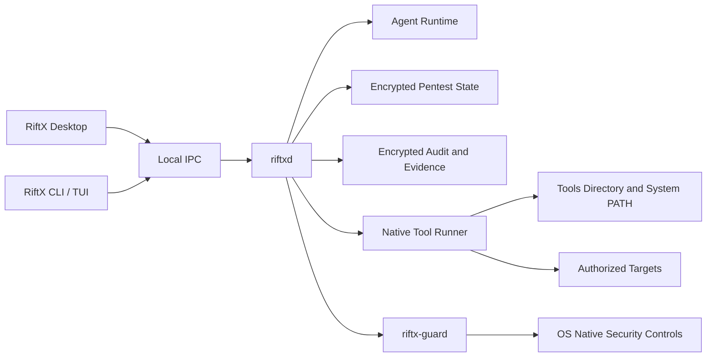

# RiftX 项目说明

> 当前版本：v0.7 开发基线
> 文档日期：2026-07-23

## 1. 产品定位

RiftX 是全平台、本机运行、对话驱动、目标导向的 AI 红队工作台。它面向具有明确书面
授权的安全评估，不把一次任务限制在单个目标，而是允许 Agent 在授权 Scope 内持续发现
资产、建立关系、验证攻击路径，直到满足结构化成功条件或被操作者停止。

一次任务称为 `Engagement`：

- `objective`：要达成的安全测试目标。
- `successCriteria`：可验证的完成条件。
- `entryPoints`：初始调查线索，不是目标上限。
- `scope`：不可突破的授权边界。
- `mode`：Native、Hardened 或 Auto。
- `policyRevision`：本次任务绑定的不可变策略版本。

例如，目标可以是“验证授权域环境中是否存在到达域控的攻击路径”。Agent 可以从一台
工作站开始，继续分析 Scope 内发现的域成员、身份、信任关系和域控，而不是只测试初始 IP。

## 2. 三种模式

### Native Mode

面向专业红队，直接使用当前用户的本机权限、shell、PATH、代理、VPN、自定义脚本和工具。
RiftX 提供 Scope 提示、审批、状态、证据和审计，但不声明具备强制安全隔离。

### Hardened Mode

仍在本机运行，由各平台 `riftx-guard` 强制进程树、文件、资源和网络边界。Guard 不可用、
策略无法安装或边界验证失败时，任务拒绝启动，不自动降级到 Native。

### Auto Mode

在无人监督情况下循环执行“观察、形成假设、设计测试、执行、验证证据、判断目标”。该模式
仅允许用于 Lab，且必须具备：

- 明确的授权过期时间和固定 Scope。
- 正常工作的 `riftx-guard`。
- Tools 与 Skills 哈希快照。
- 完整审计、状态快照和 Kill Switch。
- 逐任务风险确认。

Auto Mode 不得用于生产环境。

## 3. 产品形态

| 平台 | 首发形态 |
| --- | --- |
| macOS | Apple Silicon arm64 DMG |
| Windows | x86_64 签名 EXE 安装程序 |
| Linux | x86_64 单文件 CLI 与全屏 TUI |

macOS 和 Windows 桌面端采用 Tauri + React/TypeScript，界面是对话优先的三栏工作台：

- 左侧：Engagement 列表。
- 中间：对话、计划、工具调用、审批和执行时间线。
- 右侧：Objective、Scope、资产、攻击路径、Coverage 和证据。
- 底部：模式、输入、运行、暂停和 Kill Switch。

后台 `riftxd` 独立运行。最终产品使用 Unix Domain Socket（macOS/Linux）或 Named Pipe
（Windows），不公开 TCP 控制面。

## 4. 目标架构



RiftX 不使用 Docker、Podman、Kubernetes、虚拟机或远程 Worker 作为执行环境。所有模式
均在本机运行，macOS、Windows 和 Linux 是一等支持平台。

## 5. Agent 与工具

### 5.1 单一主 Agent

产品不固定 Recon、Exploit、Report 三套常驻角色。每个 Engagement 使用一个持续主 Agent，
按任务需要调用 Skill、subagent、MCP 和 shell。这样可以支持 Web、内网、AD、云和自定义
研究流程，而不会被预设阶段限制。

### 5.2 Tools Directory

RiftX 初期不预装任何渗透测试工具。用户配置一个或多个 Tools Directory：

```text
~/.riftx/tools/
├── nmap
├── nuclei
├── custom-scanner
└── team-script
```

目录中的文件只要能由当前用户在本机执行，就可以进入 Agent 的任务 PATH。RiftX 负责：

- 扫描可执行文件和平台兼容性。
- 记录路径、版本和哈希。
- 提供 `riftx tools doctor` 健康检查。
- 在 Auto Mode 启动时固定哈希快照。
- 把 stdout、stderr、退出状态和生成文件绑定到 Execution。

可选的伴随元数据可以描述工具名称、Capability、风险等级、版本命令和健康检查，但不是
接入工具的强制条件。RiftX 不要求为每个二进制开发固定适配器。

### 5.3 Skills Directory

Skill 使用单一用户目录，可定义工作流、提示、脚本和所需 Capability。Skill 不会扩大
Scope，也不能绕过审批、Credential Grant 或 Guard。

## 6. LLM 与凭据

RiftX 不提供 GPT 账号登录、浏览器授权或设备码登录。用户在本机配置一个或多个
Responses-compatible LLM Profile，API Key 保存在操作系统安全存储；当前开发基线从
指定环境变量读取：

```toml
[llm]
model = "gpt-5.2"
base_url = "https://api.openai.com/v1"
api_key_env = "RIFTX_LLM_API_KEY"
```

模型 API Key、目标凭据和代理凭据不得进入 prompt、SQLite 明文字段、审计 payload、
报告、命令行或普通日志。Agent 只看到 Credential Reference；执行前由 daemon 按目标、
Capability、使用次数和有效期发放短期 Credential Grant。

## 7. 状态与证据

核心状态对象包括：

- Engagement、Asset、AssetRelation、Service、Identity。
- Observation、Hypothesis、TestCase、Execution。
- Finding、Evidence、AttackPath、Coverage。
- Task、Artifact。

工具输出必须先成为 `Observation`，不能直接成为 `Finding`。Finding 必须引用可验证 Evidence；
AttackPath 的每一跳都需要证据。独立只读 Evidence Evaluator 负责判断结构化成功条件，主
Agent 不能自行宣布任务完成。

报告目标格式包括 HTML、PDF、Markdown、JSON 和加密 `.riftxcase`。当前基线已实现
Markdown 和 JSON。

## 8. 当前实现状态

已经实现：

- API-Key-only 内嵌 Agent Runtime。
- 本机 engagement workspace 和单一持续主 Agent。
- `riftxd` 本地 IPC API 与 Operator CLI。
- Tools Directory 扫描、元数据、SHA-256 快照、PATH 注入和 doctor。
- 单一 Skills Directory、独占 Runtime 根目录、内容快照和 doctor。
- Scope、Policy Revision、Approval 及三模式领域约束。
- 目标导向状态模型、Evidence 引用验证和 SQLite 持久化。
- append-only JSONL 审计。
- Markdown/JSON 报告。
- macOS、Windows、Linux 的核心领域契约 CI。

尚未实现：

- Tauri Desktop 和 Linux 全屏 TUI。
- 完整的 typed IPC 业务消息。
- 工具执行审计和完整 Native 验收。
- 案件数据加密、OS credential store 和 `.riftxcase`。
- macOS、Windows、Linux `riftx-guard`。
- Auto planner loop、Evidence Evaluator 和恢复机制。
- HTML/PDF 报告及正式安装包。

`riftxd` 默认不监听 TCP；macOS/Linux 使用 UDS，Windows 使用 Named Pipe。项目不包含
容器执行后端、固定动态工具或预装渗透工具。

## 9. 当前运行方式

构建：

```bash
conda run -n agent sh -lc \
  'cd codex-rs && cargo build -p codex-riftx-gateway -p codex-riftx-cli'
```

启动：

```bash
export RIFTX_LLM_API_KEY="<your-api-key>"
./codex-rs/target/debug/riftxd --config riftx.toml
```

创建并运行任务：

```bash
./codex-rs/target/debug/riftx create \
  --name "Authorized Lab" \
  --objective "验证授权范围内是否存在到达域控的攻击路径" \
  --success-criterion "每一跳都有可复现证据" \
  --structured-criterion '{"id":"reach-dc","description":"验证到达域控的攻击路径","predicate":{"type":"attackPath","destinationRole":"domainController","accessLevel":"domainAdminEquivalent","minimumConfidenceBasisPoints":9000,"reproducibleEvidence":true}}' \
  --entry-point "10.10.20.15" \
  --cidr "10.10.0.0/16" \
  --mode native \
  --environment lab \
  --capability network.discovery \
  --capability attack_path.analysis \
  --identity-selector '{"domain":"lab.example"}'

./codex-rs/target/debug/riftx activate <engagement-id>
./codex-rs/target/debug/riftx turn <engagement-id> "执行下一步授权测试"
./codex-rs/target/debug/riftx events <engagement-id>
```

## 10. 源码布局

```text
RiftX/
├── codex-rs/
│   ├── riftx-core/                 # 当前领域、状态、策略和审计
│   ├── riftx-gateway/              # riftxd API 与业务编排
│   ├── riftx-ipc/                  # UDS / Named Pipe 本地传输
│   ├── riftx-tools/                # Tools Directory、元数据和快照
│   ├── riftx-skills/               # Skills Directory、独占目录和快照
│   ├── riftx-cli/                  # 当前 Operator CLI
│   └── riftx-app-server-adapter/   # 受限 typed Agent Runtime facade
├── architecture/adr/               # 架构决策
├── deploy/demo/                    # 可选授权 Lab fixture，不是执行环境
├── scripts/riftx/                  # 上游锁校验脚本
├── riftx.toml                      # 当前开发配置
├── RiftX-技术实现方案.md
└── RiftX-项目说明.md
```

目标模块拆分、桌面目录和 Guard 目录以
[RiftX-技术实现方案.md](./RiftX-技术实现方案.md) 为准。

## 11. 安全边界

- Native Mode 明确不提供强制隔离安全声明。
- Hardened/Auto 的声明必须来自平台 Guard 的可验证强制边界。
- Prompt、Scope precheck 和审批是应用层控制，不能代替 OS 强制边界。
- Auto 仅允许 Lab，授权到期或 Guard 异常必须停止。
- RiftX 不实现遥测。
- 未经明确授权不得使用本项目。

## 12. 上游归属

RiftX 包含固定版本的 Apache-2.0 开源 Agent Runtime 源码。上游名称只保留在源码兼容、
许可证、锁文件和技术归属中，不进入 RiftX 产品品牌或账号体系。RiftX 是独立项目。
