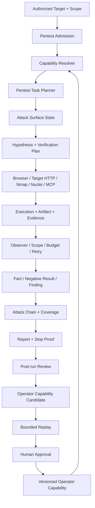

# RiftX 正式版开发优化文档

> 文档状态：权威优化与完成计划
>
> 面向对象：Codex 与 RiftX 核心开发者
>
> 优化日期：2026-08-06（Asia/Shanghai）
>
> 当前实现分支：`ch1nfo/riftx-3-code-audit`
>
> 当前交付重基线：`9424b82b`
>
> 本优化计划采用提交：`84b45640`
>
> 实际进度与提交证据：[正式版 Agent 开发实施账本](docs/implementation/FORMAL_AGENT_PROGRESS.md)
>
> 安全架构边界：[ADR-0012](docs/architecture/decisions/0012-riftx-formal-security-agent-platform-boundaries.md)

---

## 1. 文档目的与最终决策

本文档替代原《RiftX 正式版开发文档》，用于指导 Codex 基于当前真实代码完成项目优化、专业能力交付、过度代码治理和正式版发布。

RiftX 的正式版目标收敛为：

> **做一个在明确授权的渗透测试工作中真正好用的 Agent；专业人士可以持续添加工具、Skill、Technique、Playbook、目标知识和实战经验，使它越用越符合个人方法论、越擅长特定资产和技术栈。**

正式版不再同时追求“通用 Agent 平台、代码审计完全体、Pack Marketplace、多租户平台、完整企业治理和大规模评测系统”全部首发。

两个产品属性保持不变：

1. **开箱即用**：新用户完成 Onboard 后，可以在隔离授权目标上运行基础渗透测试，不需要先编写大量 Skill。
2. **高能力上限**：专业用户可以逐步加入自己的工具、验证思路、资产知识和工作流，并通过受控复盘、Replay、人工批准和版本回滚进入生产能力。

“超过 Codex、Claude Code 或 OpenCode”是长期追求，不是量化发布门。RiftX 的壁垒来自专业状态、证据、工具、经验和安全边界的长期积累，而不是绑定某个模型。

---

## 2. 当前实际进度与证据

### 2.1 已完成的基础能力

实施账本证明以下平台根基已经进入生产代码：

- Durable Run、Temporal Worker、Runner、Execution、Terminal、Artifact 和停止证明；
- Scope、Approval、Credential Reference、Redaction、Tool Policy 和 Run effect inventory；
- Browser、Target HTTP、HTTP Traffic、Web Research、MCP 和原生 Code Tool；
- Progressive Skill、Capability Version、Digest、Provenance、Pack 和 Selection；
- Task Graph、Evidence Ledger、Reasoning Graph、Working Memory Proposal/Reducer；
- Observer Supervisor、Projector 和 Closure Verifier；
- Official Pentest/Code Audit Packs；
- Onboard、Doctor、配置迁移、SQLite migration、Pack repair、Backup/Restore 原语；
- 本地离线 Pentest Demo 和真实内置 Detector Code Audit Demo；
- Capability/Pack 只读检查命令。

最近完整 Python 回归证据为：

```text
5273 passed, 5 skipped, 17 warnings
```

该结果证明现有底座具有较强回归覆盖，但不证明已经存在好用的真实渗透测试 Agent。

### 2.2 当前代码规模

当前 Python 生产代码约 `174,762` 行，具有约 64 个 CLI 命令和 109 个 API route。主要大型模块包括：

- `application/run_kind_effects.py`：约 3952 行；
- `persistence/repositories.py`：约 3948 行；
- `persistence/orm.py`：约 3551 行；
- `runtime/control_tools.py`：约 2374 行；
- `cli/app.py`：约 1810 行；
- `temporal/worker_runtime.py`：约 1526 行；
- Audit 专属文件至少约 10,528 行，实际连同 Domain、API 和 Repository 更高。

规模本身不是错误，但已经明显超过“单一专业 Pentest Agent”首发所需的最小实现，后续不得继续无边界扩张。

### 2.3 当前最关键的产品缺口

现有 `RunKind` 只有：

```text
general
code_audit
```

不存在生产级 `pentest` RunKind、Pentest admission 或用户入口。当前唯一明确的渗透命令是：

```text
riftx demo pentest
```

该命令只播放 `demo.invalid` 的脱敏离线 transcript，明确不访问目标。因此当前状态是：

> 平台基础设施很强，但真实 Pentest 产品闭环尚未交付。

### 2.4 当前过度开发判断

相对于重新确认后的产品目标，已经存在三类过度开发：

1. **范围过度**：代码审计完全体、通用编程 Agent、Pack 生态、企业协作和多租户同时进入正式版计划。
2. **平台优先过度**：大量 Domain、Repository、Graph、API、诊断和恢复能力先于第一条真实 Pentest 工作流完成。
3. **验证节奏过度**：微小切片频繁运行全仓 5000+ 测试并更新账本，交付周期被放大。

安全根基不是过度设计。Scope、Approval、Evidence、Redaction、Stop Proof、备份和失败恢复必须保留。

---

## 3. 正式版范围

### 3.1 V1 必须交付

V1 只包含以下用户结果：

- 新用户可以 Onboard、Doctor 并启动一个真实授权 Pentest Run；
- Pentest Run 必须有明确 Scope、Entry Point、禁止项、预算、批准策略和停止条件；
- Agent 可以执行被授权的被动侦察、服务枚举、状态化 Web 测试和最小漏洞验证；
- Browser、Target HTTP、Nmap/Nuclei 等工具产生统一 Execution、Artifact 和 Evidence；
- Agent 使用 Attack Surface、Hypothesis、Attempt、Negative Result、Finding 和 Attack Chain 持续推进；
- 失败、取消、重启和人工接管后可以恢复或证明停止；
- 结果形成专业报告，不把扫描信号或外部情报直接写成 Confirmed Finding；
- 操作者可以添加 Operator Skill/Technique/Tool，并通过最小 Review、Replay、批准和回滚安全生效。

### 3.2 V1 enhancement

存在明确降级路径时，下列能力不阻塞首发：

- CVE/PoC 自动研究；
- 更多 Scanner、协议和商业工具 Adapter；
- 多 Agent 并行探索；
- 自动生成验证脚本；
- WebUI 高级 Attack Graph 可视化；
- Organization/Engagement Profile 的完整导入导出；
- 远程 Runner 的能力同步；
- 代码审计产品继续增强。

### 3.3 Post-V1 或冻结范围

以下能力不属于 Pentest-first 正式版完成条件：

- Pack Marketplace、在线 install/update/publish；
- 第三方 Pack 签名分发和撤销服务；
- 多租户控制面和复杂组织权限；
- 大规模远程 Runner 集群；
- 默认深层 Agent Team；
- 代码审计完全体；
- 用排行榜证明超过通用 Agent；
- 所有语言、漏洞、协议和工具的全量覆盖。

---

## 4. 目标用户工作流

### 4.1 开箱即用路径

建议正式 CLI：

```text
riftx onboard
riftx doctor
riftx pentest start
riftx pentest status
riftx pentest resume
riftx pentest report
riftx pentest stop
```

最小启动示例：

```text
riftx pentest start \
  --target https://app.example.test \
  --scope app.example.test \
  --objective "验证身份、授权和输入处理风险" \
  --approval balanced
```

启动前必须显示并持久化：

- Engagement 与操作者；
- 允许的 Domain/IP/CIDR/URL prefix；
- exclusions；
- Entry Point；
- Objective 与 Success Criteria；
- 时间、Token、并发和目标交互预算；
- Approval Mode；
- 禁止行为；
- Stop condition；
- 选中的 Model、Tool、Skill、Technique 和 Pack 版本。

### 4.2 专业 Pentest 闭环

```text
Scope Admission
→ Passive Recon
→ Service Enumeration
→ Attack Surface
→ Hypothesis
→ Minimal Verification Plan
→ Tool Execution
→ Evidence / Negative Result
→ Finding
→ Variant / Chain Analysis
→ Report
→ Stop Proof / Review
```

每一步必须可恢复，且不能只存在于聊天历史。

### 4.3 首批真实场景

V1 先完成三个场景：

1. **网络服务场景**：目标解析、端口/服务发现、版本线索、可达性与最小验证。
2. **Web 身份场景**：登录状态、角色差异、对象访问、会话和授权边界。
3. **请求差异场景**：参数、Header、Method、身份或状态变化产生的响应差异和漏洞验证。

首发不要求自动利用或覆盖所有 OWASP/CWE。三个场景必须真实访问隔离授权目标，而不是播放固定 transcript。

---

## 5. Pentest-first 目标架构



### 5.1 必须复用的现有组件

- `Run`、`Engagement`、`Scope` 和 Approval；
- Temporal Workflow 与 Runner；
- Browser、Target HTTP、Traffic 和 Artifact；
- Tool Registry、MCP 和 Progressive Skill；
- Task/Evidence/Reasoning Graph；
- Observer、Closure 和 Report；
- Capability Repository、Version、Digest 和 Selection；
- SQLite Backup/Restore 和迁移原语。

不得为 Pentest 再建立第二套执行、Artifact、Evidence、Skill、Pack 或健康状态。

### 5.2 Pentest workload 边界

PEN-500 必须先决定并通过 ADR 固化以下两种方案之一：

1. 新增持久 `RunKind.PENTEST`；或
2. 保留 `RunKind.GENERAL`，新增不可伪造的持久 Pentest workload profile。

选择标准：

- 能否要求非空授权 Scope；
- 能否限制 Target HTTP/Browser/Scanner 只用于 Pentest；
- 能否独立生成报告和恢复状态；
- 能否与普通 General Run、Code Audit Run 清晰区分；
- 是否需要可控 migration 和兼容读取。

不得只通过 Prompt、Pack 名称或 UI 标签声称当前 Run 是 Pentest。

### 5.3 专业状态

V1 只要求以下耐久对象：

- Asset、Service、Endpoint、Parameter；
- Identity、Role、Session；
- Technology signal；
- Hypothesis；
- Verification Plan；
- Attempt；
- Evidence；
- Negative Result；
- Finding；
- Attack Chain edge；
- Coverage 与 Stop disposition。

优先复用现有 Task、Reasoning、Evidence 和 Graph Repository。只有无法表达 Pentest 语义时才新增最小字段或节点类型。

---

## 6. 能力成长闭环

### 6.1 专业人士可直接扩展

操作者必须能够添加：

- Tool Adapter；
- Skill；
- Technique；
- Playbook；
- Knowledge；
- Eval/Replay Case；
- Engagement 临时知识。

Official 能力提供稳定基线，Operator 能力表达个人方法论。V1 不要求 Organization Marketplace。

### 6.2 最小学习流程

```text
Run Trajectory
→ Post-run Review
→ Failure / Success Classification
→ Capability Candidate
→ Original + Variant + Negative + Regression Replay
→ Human Review
→ Activate / Reject
→ Observe Usage
→ Rollback / Improve
```

任何后台复盘不得调用目标交互工具，不得自动发布 Active Capability。

### 6.3 什么应该成为 Skill

适合：

- 可重复的验证顺序；
- 特定框架、设备或协议的方法；
- 工具参数和输出解释纪律；
- 常见失败后的替代路径；
- 专业报告和证据要求。

不适合：

- 单个目标的秘密或凭据；
- 未经验证的猜测；
- 一次偶然成功；
- 大段原始聊天；
- 可以由确定性代码直接完成的解析；
- 扩大 Scope 或降低 Approval 的提示文本。

---

## 7. 现有代码优化与删减策略

### 7.1 总原则

不以“代码很多”为理由删除；只删除已经证明不服务当前产品、没有生产消费者、不是兼容/迁移/安全边界且删除收益明确的代码。

优化顺序固定为：

```text
冻结新功能
→ 建立真实 Pentest 热路径
→ 记录生产引用与运行证据
→ 隔离可选模块
→ 删除无消费者代码
→ 收缩 CLI/API/配置
→ 全量回归和迁移验证
```

不得在真实 Pentest 闭环完成前进行大规模目录删除。

### 7.2 保留并强化

| 能力 | 原因 |
| --- | --- |
| Scope/Approval/Redaction/Credential | 授权渗透测试的不可削弱边界 |
| Runner/Execution/Terminal/Stop Proof | 真实工具执行和长任务恢复 |
| Browser/Target HTTP/Traffic | 状态化 Web 测试核心 |
| Artifact/Evidence/Negative Result | 专业结论与反重复尝试基础 |
| Task/Reasoning/Observer/Closure | 长周期专业推理和收口 |
| Skill/Capability/Selection | “越用越好用”的能力载体 |
| Backup/Restore/Migration | 本地单机产品的可靠性底线 |

### 7.3 立即冻结

下列区域停止新增功能，除非修复安全问题或 Pentest 热路径直接依赖：

- Code Audit 完全体与更多 Audit UI/API；
- Connector 扩展；
- 通用编程 Agent 写入能力扩张；
- Marketplace、在线 Pack 更新和签名发布；
- remote multi-user profile；
- 多 Agent Team 和远程集群调度；
- 与 Pentest 无关的 Web/Desktop UI 扩展；
- 大规模评测基础设施。

### 7.4 隔离候选

真实 Pentest V1 通过后评估：

- 将 `audit/`、`audit_worker/` 和 Code Audit routes 拆为可选包或 feature；
- 默认 Runtime 不初始化 Code Audit 专属 Service；
- 默认 CLI 不展示非 Pentest 核心命令；
- Advanced/Legacy 命令集中到单独命令组；
- WebUI 默认只加载 Pentest 所需页面和 API；
- 可选 Scanner/Connector 使用延迟加载。

### 7.5 删除准入门

一段生产代码只有同时满足以下条件才允许删除：

1. 没有 Pentest 热路径消费者；
2. 没有默认 CLI/API/UI 消费者；
3. 不是数据库 migration 兼容读取所需；
4. 不是安全、审计、恢复或 Provenance 所需；
5. 没有仍被支持的用户数据依赖；
6. 删除后目标测试、关联回归和 milestone gate 通过；
7. 有明确升级/导出/回滚说明。

只有测试引用不能自动证明生产价值，但也不能不经审查直接删除。

### 7.6 首批优化热点

按收益优先审查：

1. CLI 64 个命令的默认暴露面；
2. API 109 个 route 的默认产品面；
3. `runtime/control_tools.py` 的职责和 Pentest Tool 子集；
4. `application/run_kind_effects.py` 中不服务受支持 workload 的规则；
5. Worker Runtime 的 eager service 初始化；
6. Code Audit 专属 Runtime/Repository/API；
7. 未实现的 remote multi-user 与固定 placeholder；
8. 无生产消费者的 Connector、Model、UI 或 Adapter。

这些热点先审查和隔离，不预设必须重写。安全 effect inventory 不能为了减少行数而弱化。

---

## 8. 优化后的实施规则

### 8.1 任务必须形成用户闭环

每个实现切片必须说明：

- 用户输入；
- 生产调用路径；
- 持久状态；
- 工具副作用；
- Evidence；
- 失败/停止/恢复；
- 用户可见输出；
- 显式非目标。

只新增 Model、Repository、API Schema、Graph 节点或空 CLI 命令不算完成。

### 8.2 YAGNI 门

新增抽象前必须回答：

1. 哪个当前 Pentest 场景不能用现有组件实现？
2. 新抽象的第一个生产消费者是谁？
3. 不实现它时有什么真实用户失败？
4. 是否可以先使用标准库、现有 Repository 或现有 Tool？
5. 它是否扩大 migration、权限或恢复面积？

不能回答时不实现。

### 8.3 分层测试

| Gate | 触发 | 要求 |
| --- | --- | --- |
| Slice | 每个实现提交 | 目标测试、受影响模块回归、Ruff/mypy/typecheck、`git diff --check` |
| Task | 一个任务完成 | 用户工作流 E2E、持久化、失败、恢复和权限测试 |
| Milestone | P1/P2/P3/P4 收口或高风险边界 | 全仓 Python、相关前端/桌面 build、release gate |
| Release | 发布候选 | 三类真实靶场、升级/恢复、已知限制和安全评审 |

数据库 migration、Scope/Approval、Credential、Artifact ACL、Stop Proof 和恢复原语修改必须执行 Milestone gate。

### 8.4 Git 纪律

- 实现与任务级账本更新分开提交；
- 一个提交只包含一个可解释结果；
- 不把无关用户改动加入提交；
- 不允许使用破坏性 reset/checkout 清理用户工作树；
- 每个实现提交前运行 staged `git diff --check`；
- Task 完成后再更新一次账本，不为每个微小内部步骤重复写长文档。

所有 Agent 相关运行和测试使用：

```bash
conda run --no-capture-output -n agent ...
```

---

## 9. 优化后的任务计划

以下保留历史任务 ID，确保既有提交、数据库和账本可追溯。状态以实施账本为准；本节定义后续交付优先级。

### SEC-000：正式版 ADR 与实施账本

**依赖**：无。

状态：已完成。保留，不扩展。

### SEC-001：Security Capability Evaluation 骨架

**依赖**：SEC-000。

状态：已完成基础骨架。后续只为真实 Pentest 场景增加 Fixture/Replay，不建设对标排行榜。

### CAP-001：Capability Domain 与持久化

**依赖**：SEC-000。

状态：已完成。保留 Version、Digest、Provenance、Candidate 和 Lock；停止为未知 Marketplace 增加字段。

### CAP-100：接通生产 Progressive Skill

**依赖**：CAP-001。

状态：已完成。后续由 Operator Learning 闭环验证实际价值。

### CAP-101：原生代码工具

**依赖**：CAP-001。

状态：已完成。Pentest V1 只复用读取、搜索、Git 和受控 Patch 来审计脚本/PoC；不继续建设通用 IDE。

### CAP-102：Browser/Web/Traffic Tool 闭环

**依赖**：CAP-001。

状态：已完成基础能力，是 Pentest V1 主要执行面。

### CAP-103：MCP 生产接入

**依赖**：CAP-001。

状态：已完成。只接入专业人士实际使用的安全工具，不用 Server 数量衡量能力。

### CAP-104：持久化 Tool/Skill Selection

**依赖**：CAP-100、CAP-103。

状态：已完成。必须在 Pentest Run 中记录最终 Tool/Skill/Technique 版本和选择原因。

### COG-200：Task Graph

**依赖**：CAP-104。

状态：已完成。PEN-500/PEN-502 复用，不建设第二套 Pentest Planner 状态。

### COG-201：Evidence Ledger

**依赖**：COG-200。

状态：已完成。Pentest 所有 Target Interaction 必须产生 Execution/Artifact/Evidence 引用。

### COG-202：Reasoning Graph

**依赖**：COG-201。

状态：已完成。扩展 Pentest 节点前先验证现有 Hypothesis/Fact/Finding/Negative Result 是否足够。

### COG-203：Primary Agent Proposal Tools

**依赖**：COG-202。

状态：已完成。PEN-502 直接使用现有 Proposal/Reducer。

### COG-204：Observer Supervisor 与 Projector

**依赖**：COG-203。

状态：已完成。Pentest 重点验证 Scope、重复尝试、预算和证据门。

### COG-205：Closure Verifier

**依赖**：COG-204。

状态：已完成。Pentest Report 必须经过 Closure，不能以聊天结束代表任务完成。

### PACK-300：基础渗透 Packs

**依赖**：CAP-102、CAP-104、COG-205。

状态：已完成初版。PEN-500 至 PEN-504 必须证明这些 Pack 真正影响计划和执行，而不只是被 Catalog 加载。

### PACK-301：基础代码审计 Packs

**依赖**：CAP-101、CAP-104、COG-205。

状态：已完成但冻结。保留兼容和现有用户，不作为 Pentest V1 blocker。

### PACK-302：Onboard 和 Doctor

**依赖**：PACK-300、PACK-301。

当前唯一收尾：

- 将固定 `backup_restore` 占位检查接到真实 SQLite Backup/Restore 原语；
- 运行 Task gate；
- 完成 PACK-302。

不实现 `packs install/update/rollback`。内嵌 Official Packs 由 Onboard/Doctor 初始化和修复；真正包管理延后至 ECO-800。

### PEN-500：Pentest Admission 与 Attack Surface

**依赖**：CAP-102、COG-202。

这是 PACK-302 后的第一优先任务。

必须交付：

- Pentest workload ADR；
- `riftx pentest start/status/resume/stop` 最小 CLI；
- 非空 Scope、Entry Point、Objective、预算和 Stop condition admission；
- Pentest Official Pack 选择；
- 持久 Attack Surface 投影；
- 一个隔离靶场真实启动 E2E。

验收：没有 Scope 时拒绝；Run 创建后可重启恢复；目标外请求失败关闭。

### PEN-501：状态化 Web 测试

**依赖**：CAP-102、PEN-500。

必须交付：

- Browser、Target HTTP 和 Traffic 使用统一 Request/Session identity；
- Cookie/Token 只使用 Secret Reference；
- 登录、角色和请求状态可恢复；
- 请求/响应 Diff、重放和最小化；
- 用户接管后的 Takeover Summary。

验收：完成一个 Web 身份/授权靶场，不依赖固定 transcript。

### PEN-502：验证规划器

**依赖**：COG-203、PEN-500、PEN-501。

每个 Hypothesis 生成：

- 最小验证动作；
- 前置条件；
- 正向和负向判据；
- 风险与 Approval；
- Evidence capture；
- Stop condition；
- Retry relation。

验收：扫描信号、搜索结果和模型猜测不能直接确认 Finding；失败必须生成 Negative Result。

### PEN-503：CVE/PoC Research

**依赖**：CAP-102、PEN-502。

状态：V1 enhancement。

- 外部信息只产生线索；
- 版本、配置、可达性和目标行为分开验证；
- 外部 PoC 默认不得执行；
- 如需执行，必须静态审计、参数化、隔离和批准。

没有该能力时，PEN-500/501/502/504 仍可发布。

### PEN-504：Attack Chain、Report 与 Stop Proof

**依赖**：COG-201、PEN-500、PEN-502。

必须交付：

- Finding 与 Exploit/Proof 分离；
- Attack Chain 显示已确认段、假设段、前置条件、阻断点和权限变化；
- Coverage、Negative Result 和未完成项进入报告；
- `pentest report` 与 `pentest stop`；
- 失败、取消和重启后的停止证明。

验收：完成三类首批场景中的至少两类，并生成可审查报告。

### LEARN-600：Trajectory Store 与 Session Search

**依赖**：COG-205。

只保存脱敏、结构化 Trajectory，并支持按目标、Tool、Skill、Finding 和失败类型检索。优先使用现有数据库和 FTS，不引入第二套向量基础设施。

### LEARN-601：Post-run Review

**依赖**：LEARN-600。

后台 Review 只能生成 Memory/Capability/Eval Candidate，不能调用目标工具或直接修改 Active Skill。

### LEARN-602：Failure Taxonomy

**依赖**：LEARN-601。

V1 先覆盖：工具不可用、Skill 缺步骤、规划错误、重复尝试、证据不足、Scope 阻断、误报和环境不稳定。

### LEARN-603：Replay Lab

**依赖**：SEC-001、LEARN-601、LEARN-602。

最小 Replay 包含：原始案例、一个变体、一个负向案例和一个旧版本回归案例。大规模 Benchmark 后置。

### LEARN-604：Capability Curator

**依赖**：CAP-001、LEARN-603。

V1 提供 Candidate Diff、Replay 结果、人工 Approve/Reject、Activate、Disable 和 Rollback。完成一个 Operator Skill 的真实晋升闭环。

### LEARN-605：Profile、导入和迁移

**依赖**：LEARN-604、PACK-302。

状态：V1 enhancement。先支持 Operator Profile；Organization/Engagement 导入导出和远程同步后置。

### EVAL-701：渗透测试靶场

**依赖**：SEC-001、PEN-504。

固化三类首批场景，要求可复位、隔离、授权、Ground Truth 和 Scope violation 检查。评测用于回归和诊断，不用于证明超过通用 Agent。

### EVAL-702：版本、配置与能力包回归 Harness

**依赖**：EVAL-701、LEARN-603。

V1 只比较 RiftX 自身版本和启用/禁用 Operator Capability 的差异。Code Audit 的 EVAL-700 冻结状态不得阻塞 Pentest-only Harness。

### EVAL-703：质量与安全发布检查

**依赖**：EVAL-702、PACK-302。

发布检查覆盖真实 Pentest 场景、Scope/Approval、Evidence、恢复、Stop Proof、Operator Capability 污染和已知限制。

### AUD-400：Repository Intelligence

**依赖**：CAP-101、COG-202。

状态：冻结，非 Pentest V1 blocker。只修复安全、数据兼容和现有用户阻断问题。

### AUD-401：Scanner Adapter

**依赖**：AUD-400。

状态：冻结。Pentest 所需 Scanner 通过 Tool/MCP 接入，不扩展 Code Audit 平台。

### AUD-402：专业角色工作流

**依赖**：AUD-400、AUD-401、COG-205、PACK-301。

状态：冻结。不实现七个常驻审计 Agent。

### AUD-403：代码证据模型

**依赖**：COG-201、AUD-400、AUD-401。

状态：冻结。保留现有 Snapshot/Finding 数据兼容。

### AUD-404：Diff Audit 与 Variant Analysis

**依赖**：AUD-400、AUD-403。

状态：冻结。Pentest 脚本/PoC 的最小代码审计复用 CAP-101，不建设完整产品。

### AUD-405：受控动态验证

**依赖**：CAP-101、AUD-403。

状态：冻结。不得成为 Pentest 默认执行目标代码的后门。

### EVAL-700：代码审计语料

**依赖**：SEC-001、AUD-403、AUD-404。

状态：冻结。保留既有 Fixture；不阻塞 Pentest 发布。

### ECO-800：Pack SDK

**依赖**：CAP-001、LEARN-604。

状态：Post-V1。只有存在真实第三方/组织 Pack 来源后启动。

### ECO-801：信任与供应链

**依赖**：ECO-800。

状态：Post-V1。与真实分发渠道一起设计签名、撤销、依赖锁和 SBOM。

### ECO-802：Gateway 与持续运行

**依赖**：LEARN-605、ECO-801。

状态：Post-V1。单机专业 Pentest 体验稳定后再建设跨客户端和规模化运维。

---

## 10. 优化执行顺序

严格按以下产品结果推进：

```text
O0 计划与账本迁移
→ O1 PACK-302 Backup/Restore Doctor 收口
→ P1 PEN-500 Pentest Admission + 真实 Run
→ P2 PEN-501 状态化 Web + 统一请求状态
→ P3 PEN-502 验证规划 + Evidence/Negative Result
→ P4 PEN-504 Attack Chain + Report + Stop Proof
→ L1 LEARN-600/601/602 Trajectory 与 Review
→ L2 LEARN-603/604 Replay 与 Operator Capability 晋升
→ R1 EVAL-701/702/703 Pentest 回归与发布门
→ O2 代码引用审计、模块隔离和安全删减
→ V1 Release
```

P1 完成前禁止新增生态、代码审计或企业平台功能。P4 完成前不开展大规模删代码；先证明 Pentest 热路径，再判断哪些模块无消费者。

---

## 11. 里程碑

### O0：计划迁移完成

- 新优化文档成为权威计划；
- ADR、实施账本和文档测试指向新文件；
- 旧文件删除；
- 任务历史和依赖仍可追溯。

### P1：真实 Pentest Run 可启动

- 非空 Scope admission；
- 真实隔离目标；
- Pentest Pack 和 Tool Selection；
- Run 可重启恢复；
- Scope 外请求失败关闭。

### P2：专业验证闭环可运行

- Attack Surface、Hypothesis 和 Verification Plan；
- Browser/HTTP/Traffic 状态一致；
- Evidence、Negative Result 和 Finding；
- 重复尝试与预算受控。

### P3：任务可收口

- Attack Chain、Coverage 和 Report；
- Stop Proof；
- 失败、取消、重启和人工接管恢复；
- 至少两个真实场景通过。

### P4：能力可以成长

- Trajectory 和 Review；
- Candidate 和最小 Replay；
- 人工批准；
- Operator Capability 生效、禁用和回滚；
- 能证明一次真实使用让后续相似任务更顺手。

### P5：代码优化完成

- 默认 CLI/API 收缩；
- 非核心模块被隔离或删除；
- migration 和用户数据兼容；
- milestone gate 全绿；
- 代码规模下降不是强制指标，维护和产品认知负担必须下降。

---

## 12. 正式版完成定义

RiftX Pentest-first 正式版只有同时满足以下条件才算完成：

1. 新用户通过 Onboard 和 Doctor 可以启动真实授权 Pentest Run。
2. 目标交互必须有非空 Scope、预算、Approval 和 Stop condition。
3. Browser、Target HTTP、Runner Tool 和 Scanner 走生产 Runtime。
4. 至少两个真实隔离场景从 Scope 推进到 Evidence/Negative Result/Finding/Report。
5. 扫描信号、外部搜索和模型猜测不能直接成为 Confirmed Finding。
6. Task、Hypothesis、Attempt、Evidence、Finding 和 Selection 可跨重启恢复。
7. 取消、失败和超时具有可验证 Stop Proof。
8. 专业人士可以添加自己的 Skill/Technique/Tool。
9. 至少一个 Operator Capability 完成 Review、Replay、人工批准、生效和回滚。
10. 默认产品面不再要求用户理解与 Pentest 无关的大量命令和模块。
11. 代码审计、Marketplace、多租户和远程集群不阻塞发布。
12. 发布检查覆盖功能、安全、恢复、真实任务复盘和已知限制。

正式版不要求量化证明超过 Codex、Claude Code 或 OpenCode。长期优势通过专业人士实际使用、重复任务体验、错误减少、验证质量、经验复用和安全边界持续判断。

---

## 13. Codex 每轮施工提示

```text
Objective:
Pentest user outcome:
Current authoritative evidence:
Existing components to reuse:
Allowed files/modules:
Explicit non-goals:
Scope/Approval impact:
Persistence/migration impact:
Evidence and recovery requirements:
Target tests:
Task/Milestone gate:
Rollback strategy:
Git commit boundary:
Ledger update:
```

Codex 开始任务前必须先检查：

- 当前工作是否直接推进 O1、P1、P2、P3、P4、L1、L2、R1 或 O2；
- 是否正在为冻结范围新增功能；
- 是否存在可复用的生产组件；
- 是否把“未来可能需要”误当成当前 blocker；
- 是否可以通过更小的用户闭环完成同一目标。

若工作不能直接推进当前里程碑，默认停止并回到本文件重新判断优先级。

---

## 14. 最终产品定位

RiftX 不是另一个拥有更多工具和 Prompt 的通用 Agent。

它应当成为专业人士手中的渗透测试工作台：

- 知道目标授权边界；
- 能持续运行和恢复；
- 会记录证据、反证和失败路径；
- 能把工具信号转化为最小验证，而不是直接报漏洞；
- 能形成 Attack Surface、Finding 和 Attack Chain；
- 能吸收操作者自己的方法论；
- 能通过版本、Replay、批准和回滚越用越顺手；
- 不因自动学习、第三方工具或模型幻觉污染正式能力。

最终壁垒是：

> RiftX 能把专业人士的渗透测试经验变成有版本、有证据、有验证、有安全边界、可持续复用和可回滚的生产能力。
