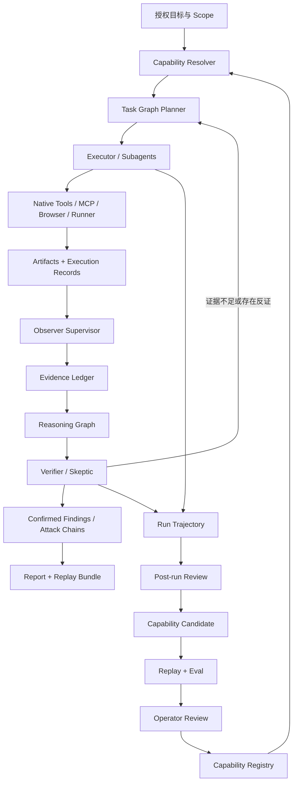

# RiftX 正式版开发文档

> 文档状态：正式版总体开发计划
>
> 面向对象：Codex 与 RiftX 核心开发者
>
> 编写日期：2026-08-05（Asia/Shanghai）
>
> 当前代码基线：`e40af267`
>
> 交付重基线：2026-08-06（专业纵向闭环优先；实时进度以实施账本为准）
>
> 产品目标：在明确授权的渗透测试与代码审计工作负载中，持续追求比直接使用 Codex、Claude Code 与 OpenCode 更强的专业能力和更高的长期能力上限

---

## 1. 文档目的

本文档用于指导 Codex 按可审查、可测试、可回滚的方式连续开发 RiftX 正式版。

RiftX 正式版需要同时兑现两个基础属性：

1. **开箱即用的即战力**：新用户完成安装和基础配置后，可以正常开展基础渗透测试、代码审计、证据整理和报告生成；该模式不要求立即超过所有通用 Agent。
2. **追求显著高于通用 Agent 的能力上限**：用户和团队能够持续添加 Tool、Skill、Technique、Playbook、Knowledge、Eval Case 和实战经验；这些能力经过验证后进入生产，使 RiftX 越用越准确、越符合操作者习惯、越擅长特定资产和技术栈。

本文档不是功能愿望清单。每项能力必须明确：

- 为什么需要；
- 接入哪个生产链路；
- 权威状态归谁所有；
- 模型可以提出什么，不能直接修改什么；
- 如何测试；
- 如何验证质量、发现退化；
- 如何回滚。

同时，每项工作必须被归入以下交付层级之一：

- **V1 blocker**：没有它，新用户无法完成真实、可验证的基础渗透测试或代码审计闭环；
- **V1 enhancement**：能明显增强专业能力，但存在安全、明确的降级路径；
- **Post-V1 ecosystem**：只有出现真实分发、多人协作或规模化运营需求后才建设。

“最终架构中有价值”不等于“必须在正式版首发前完成”。

---

## 2. 总体结论与当前判断

### 2.1 目标是否可实现

可以实现，但不能依靠“增加更多 Prompt、Skill 或 MCP”直接实现。

“超过通用 Agent”只作为产品长期追求的方向，不是必须被量化或证明的产品承诺，也不是正式版的 KPI、完成定义或发布门槛。渗透测试和代码审计的真实能力受到目标类型、操作者经验、可用工具、任务周期、上下文积累和组织知识等多种因素影响，其中相当一部分长期能力不一定能够被可靠量化。因此，正式版开发计划不设置“用评测证明 RiftX 超过通用 Agent”的任务。

因此：

- 评测专注于发现缺陷、控制回归、比较 RiftX 自身版本与改进 Capability；
- 定量指标与定性复盘并存，不要求所有专业能力都可量化；
- 不建设用于证明“超过 Codex、Claude Code 或 OpenCode”的评测任务、排行榜、统一总分或发布门槛；
- 产品方向结合真实任务完成质量、操作者反馈、长期能力积累和安全边界表现持续调整。

RiftX 必须形成三个互相闭合的系统：

1. **Security Capability System**

   统一管理 Tool、Skill、Technique、Playbook、Knowledge、Eval Case 和 Capability Pack。

2. **Evidence-driven Cognitive Runtime**

   使用 Task Graph、Reasoning Graph、Attack/Code Graph、Evidence Ledger 和结构化 Working Memory，让专业推理不再只存在于对话历史中。

3. **Capability Learning Flywheel**

   将 Run Trajectory 转化为受控的 Capability Candidate，经 Replay、Eval、人工批准后发布，并支持版本管理、回归检测和回滚。

### 2.2 当前是否已经达到目标

尚未达到。

当前 RiftX 已经具备耐久运行、安全边界、审批、执行、停止证明、Artifact、原生代码工具、Browser/Web/MCP、Progressive Skill、Task/Evidence/Reasoning Graph、Observer、Closure Verifier、Official Packs、Onboard、Doctor 和本地代码审计基线。权威完成状态和提交证据以 [正式版 Agent 开发实施账本](docs/implementation/FORMAL_AGENT_PROGRESS.md) 为准。

当前主要差距已经从“缺少平台基础设施”转变为“专业纵向闭环不够强”：

- 代码审计尚未把 Repository Intelligence、Scanner Signal、Agent 推理、反证验证、Variant Analysis 和 Finding 证据稳定串成一个默认工作流；
- 渗透测试尚未把授权 Scope、Attack Surface、状态化请求、验证计划、负结果和 Attack Chain 串成可持续推进的真实工作流；
- 学习能力尚未形成最小的 Trajectory → Review → Candidate → Replay → Approval 闭环；
- 当前仍有少量开箱即用收尾项，但不应继续以横向基础设施扩张替代专业能力交付。

因此，后续开发默认停止新增通用平台抽象，优先交付代码审计、渗透测试和能力成长三个可运行纵向闭环。

### 2.3 交付重基线与反过度设计规则

后续实施遵守以下约束：

1. **真实工作流优先**：只有直接阻断代码审计、渗透测试或能力成长闭环的问题，才能成为新的平台级 V1 blocker。
2. **先用现有能力**：新增 Repository、状态机、Graph、Middleware 或抽象前，必须证明现有生产组件不能满足当前纵向场景。
3. **一个抽象至少有一个当前消费者**：不得只为未来 Marketplace、多租户、远程集群或未知插件预建生产框架。
4. **降级路径优先于全量适配**：有 built-in、LSP、SARIF 或人工确认路径时，可选 Scanner、动态验证和外部服务不得阻塞 V1。
5. **安全根基不降级**：Scope、Approval、Evidence、Redaction、Stop Proof、备份、失败恢复和默认只读不因精简计划而削弱。
6. **任务以用户结果闭合**：任务必须从真实输入开始，以可检查的 Finding、Evidence、Report、Candidate 或恢复结果结束，不能只交付孤立模型或 Service。
7. **生态需求后置**：Pack 安装、在线更新、签名发布、Marketplace 和跨客户端持续运行统一归入 S8，出现真实第三方分发需求后再实现。

---

## 3. 研究基线与设计来源

开发决策基于以下源码或官方技术文档：

| 项目 | 研究基线 | 重点吸收机制 |
| --- | --- | --- |
| LuaN1aoAgent | `51af327c29c2` | Planner–Executor–Observer、Task/Reasoning/Operation Graph、独立 Task Session、Artifact 引用、AgentReconBench |
| CyberStrikeAI | `f7ba7070ca74` | Dynamic Tool Search、Progressive Skill、执行控制、项目黑板、验证纪律、负结果、攻击链沉淀、MCP 治理 |
| OpenAI Codex | `757c151a0e92` | 原生代码工具、Patch、Git、Sandbox、Approvals、Skills、Plugins、MCP、Hooks、Subagents、Worktrees、Thread State |
| OpenCode | `4a57013cf8cb` | Provider 抽象、动态插件工具、权限规则、Session Snapshot/Revert、LSP、服务化边界 |
| OpenClaw | `26a58bcd92ba` | 单一 Gateway、核心轻量化、插件生态、ClawHub、Onboard、Doctor、迁移与恢复 |
| Hermes Agent | `1be70d635488` | 后台复盘、Agent-created Skills、Skill Curator、Session FTS、Profile、Trajectory、远程 Backend |
| Claude Code | 官方技术文档 | Skills、Hooks、Auto Memory、Subagents/Teams、Worktrees、Checkpoint/Rewind、Code Security、权限体系 |

设计吸收原则：

- 吸收已经被实际产品验证的运行机制。
- 不复制单体高权限架构。
- 不将 MCP 作为唯一工具协议。
- 不把 LLM 生成内容直接当作权威事实。
- 不允许一次偶然成功直接写入正式 Skill。
- 不用工具数量作为 Agent 能力指标。

---

## 4. 产品北极星

RiftX 正式版的产品定义为：

> **Security Capability Operating System**：把模型、工具、技术、流程、证据、经验和评测统一为可组合、可验证、可积累、可回滚的安全能力系统。

### 4.1 开箱即用层

由 Official Baseline Packs 提供：

- 安全 Scope 与授权纪律；
- 基础网络和服务侦察；
- 基础 Web 攻击面分析；
- 基础漏洞验证；
- 基础代码审计；
- 证据捕获和 Finding 创建；
- 负结果记录；
- 报告生成；
- 工具、模型和运行环境 Doctor。

该层目标是“稳定可用”，而不是依赖用户先配置几十个 Skill。

### 4.2 高上限层

能力按以下优先级组合：

```text
Engagement Pack
    ↓
Operator Pack
    ↓
Organization Pack
    ↓
Official Baseline Pack
```

- **Official Pack**：官方维护的默认能力，强调稳定、安全和覆盖面。
- **Organization Pack**：团队内部技术栈、资产特征、审计规范和工具集。
- **Operator Pack**：个人方法论、偏好、常用工具和复盘经验。
- **Engagement Pack**：当前项目的临时知识、目标特征、验证路径和负结果。

高层能力可以覆盖低层默认值，但覆盖必须显式、可追踪且带版本。

---

## 5. 正式版目标架构



### 5.1 运行时角色

#### Planner

- 操作结构化 Task Graph。
- 根据证据、失败和预算重规划。
- 不直接执行工具。
- 不得用一份新的 Markdown 计划覆盖整个权威计划。

#### Executor

- 执行一个有界 Task。
- 使用独立、持久的 Session 和 Tool/Skill 选择集。
- 只获得当前 Task 所需 Scope、Artifact、Memory 和 Capability。

#### Observer Supervisor

- 位于工具执行和状态晋升热路径。
- 检查 Scope、Approval、重复尝试、证据完整性、预算和死循环。
- 可以阻止状态晋升或要求重规划。

#### Projector

- 异步将 Event、Evidence、Fact、Hypothesis 和 Finding 投影成 Graph、Timeline、Coverage 和 Report。
- Projector 结果不能反向成为未经校验的权威事实。

#### Verifier / Skeptic

- 为漏洞候选寻找反证。
- 检查最小复现和证据一致性。
- 决定 Candidate 是否可以进入 Confirmed 状态。

#### Reporter

- 只能消费已经通过 Reducer/Verifier 的权威状态。
- 不得从原始聊天内容自行生成新的已确认漏洞。

---

## 6. Capability System 数据模型

建议新增：

```text
src/riftx/capabilities/
├── models.py
├── manifest.py
├── registry.py
├── resolver.py
├── repository.py
├── candidates.py
├── promotion.py
├── packs.py
├── trust.py
└── lifecycle.py
```

### 6.1 核心类型

#### Tool

确定性原子能力。例如：读取文件、搜索引用、发送 HTTP 请求、调用 Nmap。

#### Technique

一项安全方法或推理模式。例如：

- Source → Transform → Sink 污点追踪；
- 身份校验绕过验证；
- 请求差异分析；
- 补丁变体搜索。

#### Skill

告诉 Agent 如何完成一类任务的程序化知识。Skill 可以依赖 Tool 和 Technique，但不能把任意 Shell 命令伪装成无副作用知识。

#### Playbook

带依赖、分支、证据门、预算和停止条件的 Task Graph 模板。

#### Knowledge

参考资料、框架特征、协议说明和漏洞情报。Knowledge 默认是不可信信息源，不能直接确认 Finding。

#### Eval Case

用于检查 Capability 的适用范围、质量、失败模式和回归情况的可复位案例。Eval Case 是研发反馈工具，为版本比较、能力晋升、故障复现和发布评审提供证据。

#### Capability Pack

可安装、可锁定版本、可签名、可回滚的能力集合。

### 6.2 Capability Manifest

最低字段：

```yaml
schema_version: riftx.capability/v1
id: web.sqli-verification
version: 1.2.0
kind: technique

domains: [web, injection]
triggers: [sql injection, database error, parameter tampering]

dependencies:
  tools: [target_http]
  skills: [web-request-analysis]
  capabilities: [http_request, evidence_capture]
  platforms: [linux, macos, windows]

permissions:
  effect_class: target_interaction
  approval_level: sensitive
  requires_scope: true

input_schema: {}
output_schema: {}

evidence_contract:
  required_refs: [request, response]
  minimum_independent_sources: 1
  confirmation_policy: explicit_verification

verification:
  success_assertions: []
  negative_assertions: []
  false_positive_rules: []

provenance:
  publisher: operator
  source: local
  digest: null
  signature: null

evaluation:
  cases: []
  minimum_pass_rate: 0.9

lifecycle:
  status: candidate
  trust_tier: local
  rollback_version: null
```

### 6.3 生命周期

```text
candidate
  → tested
  → approved
  → active
  → degraded
  → deprecated
  → archived
```

任何版本必须可以回退到前一个 Active 版本。

---

## 7. Evidence-driven Cognitive Runtime

### 7.1 Task Graph

Task 节点至少包含：

- Task ID；
- 父任务；
- 依赖任务；
- 状态；
- 输入 Scope；
- 预期输出 Schema；
- Evidence requirements；
- Capability requirements；
- Budget；
- Workspace/Session owner；
- Stop condition；
- Completion evidence；
- Retry relation。

Planner 通过以下命令修改图：

- `add_task`
- `update_task`
- `link_tasks`
- `block_task`
- `complete_task`
- `reopen_task`
- `cancel_task`

依赖未满足的 Task 不得启动。完成 Task 重新打开必须提供原因。

### 7.2 Evidence Ledger

统一证据类型：

- Execution Output；
- Artifact Span；
- HTTP Request/Response；
- Browser Observation；
- Code Location；
- Code Flow；
- Scanner Signal；
- User Decision；
- Deterministic Parser Result；
- External Research Source。

每条 Evidence 必须记录：

- ID；
- 来源 URI；
- Digest；
- Run/Session/Task；
- 创建主体；
- 时间；
- Trust class；
- Scope；
- 脱敏状态；
- 可重放信息；
- Artifact 引用。

### 7.3 Reasoning Graph

节点：

- Observation；
- Fact Candidate；
- Confirmed Fact；
- Hypothesis；
- Vulnerability Candidate；
- Finding；
- Exploit/Proof；
- Negative Result。

边：

- `supports`
- `contradicts`
- `derived_from`
- `discovered_on`
- `validates`
- `exploits`
- `invalidates`
- `depends_on`

状态纪律：

- Hypothesis 可以暂时没有证据，但必须标记为未验证。
- Confirmed Fact 必须绑定 Evidence。
- Confirmed Finding 必须绑定 Evidence 和 Reproduction Contract。
- 搜索结果、CVE 页面和 PoC 说明不能直接确认目标漏洞。
- 验证失败必须写入 Negative Result，防止重复尝试。
- Finding 与 Exploit 分开建模，存在漏洞不等于已成功利用。

### 7.4 Proposal/Reducer 模式

模型只能提交：

- Plan Update Proposal；
- Observation Proposal；
- Fact Candidate；
- Hypothesis Update；
- Attempt Record；
- Finding Candidate；
- Memory Candidate；
- Capability Candidate。

确定性 Reducer 负责：

- Schema 校验；
- Scope 校验；
- Evidence 存在性校验；
- Digest 校验；
- 状态机校验；
- 去重；
- 冲突处理；
- 版本控制；
- 权限和人工批准。

---

## 8. Capability Learning Flywheel

### 8.1 Capture

保存脱敏后的 Run Trajectory：

- Context Manifest；
- Capability 版本；
- Task Graph 变化；
- Tool Calls；
- Execution 和 Artifact 引用；
- Working Memory Proposal 与 Reducer 决定；
- 用户纠正；
- 失败路径；
- 最终结果；
- Token、耗时和成本；
- Judge 结果。

### 8.2 Classify

复盘服务判断经验属于：

- Memory；
- Knowledge；
- Technique；
- Skill；
- Tool Adapter；
- Playbook；
- Eval Case。

不是所有经验都应成为 Skill。

### 8.3 Candidate

生成默认不生效的 `CapabilityCandidate`：

- 来源 Run；
- 来源 Evidence；
- 触发原因；
- 目标 Capability；
- Diff；
- 权限变化；
- 预期收益；
- 风险；
- Replay 计划。

### 8.4 Replay

每个 Candidate 至少运行：

- 原始案例；
- 两个变体案例；
- 一个负向案例；
- 一个旧版本回归案例；
- 禁用 Candidate 的对照组；
- 启用 Candidate 的实验组。

### 8.5 Approve and Publish

用户必须能够查看：

- 完整 Diff；
- 新增权限；
- Tool/环境依赖；
- Replay 结果；
- 成功率和回归；
- 来源和签名；
- 回滚点。

### 8.6 Curate

维护以下指标：

- `use_count`
- `selection_count`
- `completion_rate`
- `verified_success_rate`
- `false_positive_rate`
- `regression_rate`
- `last_used_at`
- `average_token_cost`
- `average_tool_cost`
- `conflict_count`

自动维护最多允许：

- 提议 Patch；
- 标记 Degraded；
- 标记 Deprecated；
- Archive；
- 回滚到已验证版本。

不得自动永久删除能力，不得直接修改 Official/Organization Pack。

---

## 9. 分阶段实施计划

阶段编号描述能力演进，不再代表所有任务都必须串行完成。交付优先级如下：

| 层级 | 范围 | 发布含义 |
| --- | --- | --- |
| V1 blocker | PACK-302 最小收尾、AUD-400 至 AUD-404 的默认只读闭环、PEN-500 至 PEN-502 与 PEN-504 的授权验证闭环、LEARN-600 至 LEARN-604 的最小受控成长闭环 | 正式版首发前必须完成 |
| V1 enhancement | AUD-405、PEN-503、更多 Scanner/语言/协议 Adapter、LEARN-605、公开评测集扩展 | 有明确降级路径时不阻塞首发 |
| Post-V1 ecosystem | ECO-800 至 ECO-802、第三方 Pack 分发、在线更新、签名发布、Marketplace、多节点规模化运维 | 不属于正式版首发完成条件 |

S4、S5、S6 允许按纵向场景交错推进。例如，代码审计第一个真实闭环所需的 Eval Case 应随 AUD 任务一起加入，不必等待 S7 才开始验证。

## S0：规格、基线与评测骨架

本阶段的权威设计与进度记录：

- [ADR-0012：正式版安全 Agent 平台边界](docs/architecture/decisions/0012-riftx-formal-security-agent-platform-boundaries.md)
- [正式版 Agent 开发实施账本](docs/implementation/FORMAL_AGENT_PROGRESS.md)

### SEC-000：正式版 ADR 与实施账本

**依赖**：无。

**涉及模块**：

- `docs/architecture/decisions/`
- `docs/implementation/`
- `src/riftx/evaluation/`

**实现要求**：

1. 新增正式版总体 ADR。
2. 明确 Capability System、Cognitive Runtime 和 Learning Flywheel 边界。
3. 建立任务状态账本。
4. 记录设计研究来源版本、RiftX 基线和评测配置。
5. 明确 General Run、Pentest Run、Code Audit Run 的能力和副作用边界。

**测试**：

- 文档链接检查。
- `git diff --check`。

**验收门**：

- 任务依赖明确。
- 数据迁移顺序明确。
- 不改变现有产品行为。

### SEC-001：Security Capability Evaluation 骨架

**依赖**：SEC-000。

**建议新增**：

```text
src/riftx/evaluation/security_agent/
tests/evaluation/security_agent/
benchmarks/security_agent/
```

**实现要求**：

1. 定义 Scenario、Target、Reset、Budget、Run、Trajectory、Evidence Replay、Judge。
2. 支持代码审计和渗透测试两类 Scenario。
3. 支持隐藏集和公开开发集。
4. 记录模型、运行时、工具集、Skill/Pack 版本、时间和 Token。
5. 支持比较 RiftX 自身不同版本、不同 Capability Pack 和不同运行配置。

**验收门**：

- 至少一条代码审计和一条 Web 靶场案例可重复运行。
- 不同 Run 不共享未授权 Memory。
- 输出稳定 JSON。
- 能区分疑似、已验证、误报和未发现。

### CAP-001：Capability Domain 与持久化

**依赖**：SEC-000。

**实现要求**：

- Capability、CapabilityVersion、Dependency、Permission、EvidenceContract。
- CapabilityCandidate、PromotionRun、EvaluationResult。
- CapabilityPack、PackInstall、PackLock。
- Repository、ORM、Migration、API Schema。

**验收门**：

- Candidate 与 Active Capability 物理分离。
- 所有版本具有 Digest 和 Provenance。
- 安装、禁用、回滚幂等。
- 不允许覆盖正在运行 Session 锁定的版本。

---

## S1：生产 Capability Plane

### CAP-100：接通生产 Progressive Skill

**依赖**：CAP-001。

**涉及模块**：

- `src/riftx/skills/`
- `src/riftx/context/`
- `src/riftx/runtime/control_tools.py`
- `src/riftx/temporal/worker_runtime.py`

**实现要求**：

1. 生产 Worker 创建 `ProgressiveSkillContextManager`。
2. 将其传入生产 `ContextCompiler`。
3. 新增：
   - `search_skills`
   - `list_skills`
   - `load_skill`
   - `load_skill_references`
   - `unload_skill`
4. Skill 选择状态持久化到 Session。
5. Manifest 记录 Skill ID、Version、Digest、来源层和加载原因。
6. Subagent Skill 必须由 Delegation allowlist 控制。

**测试**：

- Primary Skill search/load E2E。
- Worker restart recovery。
- Session isolation。
- Subagent allowlist。
- Skill version stale handling。

**验收门**：

- 安装一个 Operator Skill 后，生产 Primary Agent 能发现并加载。
- Worker 重启后仍使用原版本。
- 更新 Skill 不静默改变运行中 Session。

### CAP-101：原生代码工具

**依赖**：CAP-001。

**第一批只读工具**：

- `list_files`
- `read_file`
- `read_many_files`
- `grep`
- `glob`
- `git_status`
- `git_diff`
- `git_log`
- `symbol_search`
- `find_references`
- `call_hierarchy`
- `diagnostics`

**第二批写入工具**：

- `apply_patch`
- `create_worktree`
- `revert_patch`

**安全要求**：

- 路径必须限制在 Workspace 或 Audit Snapshot。
- Code Audit 默认只读。
- Symlink escape、特殊文件和超限读取失败关闭。
- 大文件返回 Preview 与 Artifact。
- 写入、构建和测试属于独立的显式批准模式。
- 不用通用 Shell 替代代码工具。

**验收门**：

- 能在多语言仓库完成符号、调用者、实现和引用导航。
- Patch 可预览、审计、撤销。
- 不执行项目 Hook 或安装脚本。

### CAP-102：Browser/Web/Traffic Tool 闭环

**依赖**：CAP-001。

**新增工具**：

- `web_search`
- `web_fetch`
- `web_research`
- `open_browser`
- `observe_browser`
- `act_browser`
- `close_browser`
- `query_http_traffic`
- `read_http_exchange`
- `target_http_request`

**验收门**：

- Primary Agent 可以实际调用。
- Browser Action 拒绝陈旧 Observation Version。
- Web 内容标记为不可信。
- HTTP 原文进入 Artifact。
- Scope 和 Approval 在副作用发生前执行。

### CAP-103：MCP 生产接入

**依赖**：CAP-001。

**实现要求**：

- MCP Server Registry。
- MCP Tool Discovery → Tool Index。
- Schema 转换。
- Governor、限流、熔断、超时、健康检查。
- Tool Policy、Approval、Artifact 和 Transcript 接入。

**验收门**：

- MCP 不能绕过 RiftX Authorization。
- Server 故障只影响对应能力。
- 调用具有 durable ToolCall/Execution identity。
- Secret 和绝对路径不进入模型结果。

### CAP-104：持久化 Tool/Skill Selection

**依赖**：CAP-100、CAP-103。

**实现要求**：

- Session Capability Selection Repository。
- Tool、Skill、Technique 统一选择记录。
- Version/Digest lock。
- Restart recovery。
- Stale detection。
- Explicit reload/unload。

---

## S2：认知运行时

### COG-200：Task Graph

**依赖**：CAP-104。

**实现要求**：

- Task、Dependency、TaskAttempt、TaskBudget、TaskEvidenceRequirement。
- Planner command API。
- Ready-task resolver。
- Durable parallel scheduling。
- Replan 和 reopen 规则。

**验收门**：

- 依赖未满足的任务不能运行。
- 重启后图不丢失。
- 失败重试保留 lineage。
- 并行任务互相隔离。

### COG-201：Evidence Ledger

**依赖**：COG-200。

**实现要求**：

- 统一 Evidence 类型和引用协议。
- Artifact Span 和 Code Location 可精确寻址。
- Evidence Digest 校验。
- Trust、Scope、Redaction、Replay metadata。

### COG-202：Reasoning Graph

**依赖**：COG-201。

**实现要求**：

- Observation、Fact、Hypothesis、Candidate、Finding、Proof、Negative Result。
- 结构化关系边。
- 状态晋升规则。
- Evidence 和 Finding 完整性约束。

### COG-203：Primary Agent Proposal Tools

**依赖**：COG-202。

**新增工具**：

- `propose_plan_update`
- `record_observation`
- `propose_fact`
- `propose_hypothesis`
- `record_attempt`
- `propose_finding`
- `record_negative_result`
- `query_reasoning_graph`

**验收门**：

- 模型不能直接覆盖 Working Memory。
- 无 Evidence 的 Confirmed 状态被拒绝。
- 重复失败操作没有 Retry relation 时被拒绝。

### COG-204：Observer Supervisor 与 Projector

**依赖**：COG-203。

**Supervisor 检查**：

- Scope；
- Approval；
- 重复尝试；
- 证据缺失；
- Tool/Capability 不匹配；
- 预算；
- 死循环；
- 用户输入和人工接管。

**Projector 生成**：

- Task Graph；
- Reasoning Graph；
- Evidence Graph；
- Attack/Code Graph；
- Coverage；
- Timeline；
- Report draft。

### COG-205：Closure Verifier

**依赖**：COG-204。

**验收门**：

- Success Criteria 逐项映射到 Evidence。
- Pending/Blocked Task 必须有解释。
- Finding 证据可重放。
- 未完成物理停止时不能关闭 Run。
- 未通过 Closure 只能返回 Partial。

---

## S3：Official Baseline Packs 与开箱即用

### PACK-300：基础渗透 Packs

**依赖**：CAP-102、CAP-104、COG-205。

首批必须包含：

- `pentest-foundation`
- `scope-and-safety`
- `passive-recon`
- `service-enumeration`
- `web-attack-surface`
- `web-request-analysis`
- `vulnerability-verification`
- `evidence-and-reporting`
- `negative-results`
- `credential-handling`

### PACK-301：基础代码审计 Packs

**依赖**：CAP-101、CAP-104、COG-205。

首批必须包含：

- `code-audit-foundation`
- `repository-mapping`
- `entrypoint-discovery`
- `authn-authz-audit`
- `injection-audit`
- `secret-and-config-audit`
- `dependency-and-supply-chain`
- `file-upload-and-path-audit`
- `ssrf-and-outbound-request-audit`
- `deserialization-audit`
- `finding-verification`
- `variant-analysis`

每个 Pack 必须带：

- Capability Manifest；
- Skill/Technique；
- Tool requirements；
- Evidence contract；
- Negative cases；
- Eval Case；
- 版本和变更日志。

### PACK-302：Onboard 和 Doctor

**依赖**：PACK-300、PACK-301。

V1 必须命令：

```text
riftx onboard
riftx doctor
riftx doctor --fix
riftx capabilities list
riftx capabilities verify
riftx packs list
```

`riftx packs install/update/rollback` 延后至 ECO-800。当前 Official Packs 随 RiftX 发行，在没有第三方 Pack 来源、签名分发和多版本本地缓存之前，不建设伪包管理器。V1 使用 Onboard/Doctor 完成 Official Pack 初始化、完整性检查和安全修复。

Doctor 必须检查：

- Model Provider；
- Temporal；
- Runner；
- Browser；
- Tool 版本；
- Skill 依赖；
- MCP Server；
- LSP；
- 可选 Scanner；
- Snapshot/Artifact 权限；
- Pack Lock/Digest；
- 数据库迁移；
- Backup/Restore 可用性。

Backup/Restore 检查必须依据当前 file-backed SQLite、备份目录安全性和实际备份/恢复原语给出 `ready`、`degraded` 或 `failed`，不得保留“尚未实现”的固定占位状态。

**阶段验收**：

- 新用户完成 Onboard 后可以运行基础渗透和代码审计 Demo。
- 缺少可选工具时给出降级路径。
- Doctor 能定位并修复常见配置迁移问题。
- Doctor 能在 Control Plane 停止时安全修复 SQLite/Official Pack 持久化，并在失败时恢复。
- Capability/Pack 只读命令能够显示真实权威状态；V1 不要求远程 Pack 分发或在线升级。

---

## S4：代码审计专业闭环

S4 的目标不是先建成通用静态分析平台，而是让用户提交一个真实仓库后，RiftX 能稳定完成：

```text
Snapshot → Repository Map → Candidate Search → Evidence/Flow → Skeptic Verification
→ Variant Search → Confirmed Finding / Negative Result → Report
```

每个 AUD 任务必须接入这条默认只读链路。不能以“以后可供工作流使用”的孤立索引、Adapter 或角色定义作为完成证据。

### AUD-400：Repository Intelligence

**依赖**：CAP-101、COG-202。

实现：

- V1：语言和框架识别、Route/API/Controller/Entrypoint 索引、Symbol/Reference 导航、Config/Secret/CI/CD/Container Surface、Git Diff；
- V1：为当前审计假设按需生成 Call/Data Flow 证据，不要求预计算全仓完美图；
- Enhancement：完整 Dependency Graph、跨语言 Call Graph 和更多框架专用索引。

优先集成 LSP、Tree-sitter 和成熟 Scanner，不自行开发通用编译器。

**显式非目标**：V1 不自行实现通用编译器、全语言精确 CPG 或全仓预计算数据流引擎。

### AUD-401：Scanner Adapter

**依赖**：AUD-400。

Adapter 优先级：

- V1：生产内置检测器、SARIF import、Semgrep；
- V1 enhancement：Gitleaks/TruffleHog、Dependency scanners、CodeQL；
- Post-V1/按需：Joern/CPG 和其他重型 Scanner。

Scanner 统一输出 `AuditSignal`，不得直接成为 Confirmed Finding。

缺少任一可选 Scanner 时必须继续使用内置检测器、LSP、代码搜索和人工验证路径，不得阻塞基础代码审计。

### AUD-402：专业角色工作流

**依赖**：AUD-400、AUD-401、COG-205、PACK-301。

- Mapper；
- Hunter；
- Dataflow Analyst；
- Skeptic；
- Proof Builder；
- Chain Analyst；
- Reporter。

这些名称表示工作阶段和责任，不要求七个常驻 Agent。确定性步骤使用现有服务或 Middleware；只有上下文隔离、并行探索或独立反证确有收益时才创建 Subagent。

**V1 验收**：至少一条真实仓库审计从 Snapshot 开始，最终生成带精确代码位置、Evidence、反证结果和修复建议的 Confirmed Finding，或生成可解释的 Negative Result/Coverage 报告。

### AUD-403：代码证据模型

**依赖**：COG-201、AUD-400、AUD-401。

Finding 必须绑定：

- Snapshot Digest；
- 文件 Digest；
- 起止位置；
- Symbol；
- Source/Sink/Sanitizer；
- Call/Data Flow；
- Scanner Signal；
- 验证结果；
- 反证检查。

### AUD-404：Diff Audit 与 Variant Analysis

**依赖**：AUD-400、AUD-403。

支持：

- Commit/PR Diff；
- Changed surface；
- 新增危险路径；
- 修复完整性；
- 同类变体搜索；
- Baseline comparison；
- Finding identity 跨版本保持。

V1 先覆盖同仓库 Commit/PR Diff 和已确认 Finding 的同类变体搜索；跨仓库大规模变体索引属于后续增强。

### AUD-405：受控动态验证

**依赖**：CAP-101、AUD-403。

默认关闭，显式批准后：

- 创建隔离 Worktree/Sandbox；
- 网络默认关闭；
- 禁止默认运行安装脚本和 Git Hook；
- 生成 Proof Artifact；
- 检查残留进程和修改；
- 原 Snapshot 永不修改。

该任务属于 V1 enhancement。没有动态验证环境时，RiftX 必须保留静态证据、明确未验证条件并返回 Partial，不阻塞默认只读审计发布。

---

## S5：渗透测试专业闭环

S5 的目标是让一个明确授权的目标从 Scope 开始，形成可恢复、可审查的最小专业闭环：

```text
Scope → Attack Surface → Hypothesis → Minimal Verification → Evidence/Negative Result
→ Finding → Attack Chain → Report/Stop Proof
```

V1 不追求覆盖所有协议、所有漏洞类别或自动利用；优先保证状态连续、验证纪律和证据质量。

### PEN-500：Attack Surface Graph

**依赖**：CAP-102、COG-202。

节点：

- Domain/IP/Service/Endpoint/Parameter；
- Identity/Role/Session；
- Technology；
- Vulnerability/Finding/Exploit；
- Credential/Privilege；
- Request/Response/Artifact。

V1 只要求当前 Engagement 实际观察到的节点和关系按需入图，不要求预先建设互联网级资产图谱或全量 CMDB。

### PEN-501：状态化 Web 测试

**依赖**：CAP-102、PEN-500。

- Browser、Target HTTP 和已接入的流量来源使用统一 Request Identity；Burp 等外部代理属于可选 Adapter。
- Cookie/Token 使用 Secret Reference，不进入普通模型文本。
- 支持请求 Diff、响应 Diff、重放和最小化。
- 用户接管后通过 Takeover Summary 恢复。

### PEN-502：验证规划器

**依赖**：COG-203、PEN-500、PEN-501。

每个 Hypothesis 生成：

- 最小验证动作；
- 前置条件；
- 正向现象；
- 负向现象；
- 风险等级；
- Evidence capture；
- Stop condition。

### PEN-503：CVE/PoC Research

**依赖**：CAP-102、PEN-502。

- 外部搜索仅产生线索。
- 版本、配置、可达性分开验证。
- 外部 PoC 不得直接执行。
- PoC 必须先静态审计、参数化、沙箱化并审批。
- “公开存在 PoC”和“目标可利用”分开记录。

该任务属于 V1 enhancement。没有外部研究能力时，版本线索和目标验证仍可由本地证据推进；不得因缺少 CVE/PoC 搜索阻塞基础渗透闭环。

### PEN-504：Attack Chain

**依赖**：COG-201、PEN-500、PEN-502。

链条必须显示：

- 已确认段；
- 未确认段；
- 前置条件；
- 阻断点；
- 权限变化；
- 业务影响；
- 可重放 Proof。

没有 Evidence 的关系边必须标记为 Hypothesis。

**V1 验收**：至少一个隔离授权靶场能够跨请求或浏览器状态持续推进，产生已验证 Finding 或有证据的 Negative Result，并在取消、失败或重启后保持 Stop/Recovery 语义。

---

## S6：学习飞轮

S6 的 V1 目标是“越用越顺手，但不会自我污染”，不是一次性完成自治学习平台。最小闭环为：

```text
Trajectory → Post-run Review → Failure Classification → Capability Candidate
→ Bounded Replay → Human Approval → Versioned Activation / Rejection
```

V1 只要求 Operator 层能力成长；Organization/Engagement Profile 的完整导入迁移和跨节点同步属于增强项。

### LEARN-600：Trajectory Store 与 Session Search

**依赖**：COG-205。

- 存储结构化 Trajectory。
- 支持 FTS/CJK 搜索。
- 返回摘要和引用，而不是整段历史注入。
- 支持按 Run、资产、Tool、Skill、Finding、失败类型过滤。

V1 可先使用现有持久化与数据库全文检索能力；没有真实规模瓶颈前不引入独立向量数据库或第二套检索基础设施。

### LEARN-601：Post-run Review

**依赖**：LEARN-600。

后台复盘只允许调用：

- Memory Candidate API；
- Capability Candidate API；
- Eval Candidate API。

不得调用执行类工具，不得直接写正式 Skill。

### LEARN-602：Failure Taxonomy

**依赖**：LEARN-601。

至少覆盖：

- 缺少工具；
- 工具不可用；
- Skill 缺步骤；
- Skill 触发失败；
- Context 遗漏；
- 规划错误；
- 重复尝试；
- 证据不足；
- 误报；
- Scope/Approval 阻断；
- 模型能力不足；
- 环境不稳定。

### LEARN-603：Replay Lab

**依赖**：SEC-001、LEARN-601、LEARN-602。

- 可复位目标。
- Candidate A/B 对照。
- 变体和负向案例。
- Token、时间、工具调用和结果评分。
- 失败时保存可诊断 Artifact。

V1 允许对高风险 Capability 使用较小但有负向和旧版本回归的确定性案例集；大规模并行 Benchmark、复杂统计显著性和远程靶场池属于后续增强。

### LEARN-604：Capability Curator

**依赖**：CAP-001、LEARN-603。

提供：

- Status；
- Usage；
- Pin/Unpin；
- Diff；
- Promote；
- Deprecate；
- Archive；
- Restore；
- Backup；
- Rollback。

### LEARN-605：Profile、导入和迁移

**依赖**：LEARN-604、PACK-302。

- Operator/Organization/Engagement Profile。
- Pack、Memory、Skill 和配置导出导入。
- Provenance 保留。
- `doctor --fix` 负责配置迁移。
- 远程 Runner 仅同步授权能力和 Credential Reference。

该任务属于 V1 enhancement，不阻塞首个 Operator Capability 从 Candidate 安全晋升为 Active。

---

## S7：专业能力评测与回归保障

本阶段的目的，是建立稳定的研发反馈系统：发现能力短板、复现失败、检查 RiftX 自身版本回归、评估 Capability Pack 的实际影响，并为安全发布提供证据。本阶段不承担“证明 RiftX 整体超过某个通用 Agent”的任务，也不建设 Codex、Claude Code 或 OpenCode 的对标 Harness。

S7 不是等 S4/S5/S6 全部完成后才开始的独立平台工程。每个专业纵向切片必须同时留下最小可复位 Fixture、负向案例或 Replay；S7 只负责把已经证明有用的案例固化为稳定回归集和发布门。

### EVAL-700：代码审计语料

**依赖**：SEC-001、AUD-403、AUD-404。

至少包括：

- 小型单漏洞仓库；
- 多漏洞真实结构仓库；
- 大型多语言仓库；
- 高误报负向仓库；
- Patch/Diff 案例；
- 变体分析案例；
- 私有 Fresh Set。

指标：

- Verified vulnerability recall；
- Precision/FPR；
- Code location accuracy；
- Source-to-sink correctness；
- Variant discovery；
- Evidence replay；
- Coverage；
- Time/Token to first verified finding。

### EVAL-701：渗透测试靶场

**依赖**：SEC-001、PEN-504。

要求：

- 可复位；
- 隔离；
- 明确授权；
- 支持网络、Web、身份和组合链案例；
- 有确定性 Ground Truth；
- 记录 Scope violation。

指标：

- Attack surface coverage；
- Verified finding yield；
- Hypothesis-to-proof conversion；
- Duplicate attempt rate；
- Negative-result reuse；
- Attack-chain completeness；
- Evidence reproducibility；
- Recovery after restart。

### EVAL-702：版本、配置与能力包回归 Harness

**依赖**：EVAL-700、EVAL-701、LEARN-603。

回归比较对象：

- RiftX 当前稳定版本；
- RiftX 待发布版本；
- RiftX Official-only；
- RiftX Official + Operator/Organization Pack；
- 启用或禁用特定 Tool、Skill、Technique 和 Memory 的消融配置；

公平性要求：

- 比较内部版本时尽量使用相同底层模型；存在差异时必须记录；
- 同一目标 Snapshot；
- 同一 Token、时间、并发和工具预算；
- 相同网络条件；
- 关键案例允许重复运行、盲审和使用未公开案例，但不强制所有能力都被量化；
- 不共享未授权历史 Memory。

### EVAL-703：质量与安全发布检查

**依赖**：EVAL-702、PACK-302。

发布检查至少覆盖：

- 核心场景不存在阻断使用的功能回归；
- Confirmed Finding 必须满足 Evidence Contract；
- 不允许已知的严重 Scope、Approval 和停止语义违规；
- 关键失败能够留下可诊断 Artifact，并可被复现或解释；
- Operator/Organization Pack 不得引入不可接受的安全回归或能力污染；
- Onboard、Doctor、恢复、回滚和降级路径可用；
- 评测结果、真实任务复盘与已知限制共同进入发布评审。

某项能力难以量化时，仍必须通过定性复盘、失败案例、回归检查和安全边界验证提供可审查的发布依据。

---

## S8：Pack 生态与正式版运维

S8 全部属于 Post-V1 ecosystem，不阻塞正式版首发。只有同时满足以下条件才开始：

- 已存在真实的第三方或组织 Pack 来源；
- 需要在 RiftX 发行周期之外独立安装或更新 Pack；
- 已明确 Publisher、签名、撤销、依赖和本地多版本缓存的产品边界；
- S4/S5/S6 的纵向闭环已被真实用户使用并产生可复用 Capability。

### ECO-800：Pack SDK

**依赖**：CAP-001、LEARN-604。

建议命令：

```text
riftx pack init
riftx pack validate
riftx pack test
riftx pack build
riftx pack inspect
riftx pack install
riftx pack publish
riftx pack update
riftx pack rollback
```

这些命令在 ECO-801 的信任与供应链边界可用前不得以只修改本地数据库的空壳形式提前发布。

### ECO-801：信任与供应链

**依赖**：ECO-800。

- Digest lock；
- 签名；
- Publisher identity；
- Trust tier；
- 安装前静态扫描；
- 权限 Diff；
- 依赖锁定；
- 可重复构建；
- SBOM；
- 撤销和下架。

### ECO-802：Gateway 与持续运行

**依赖**：LEARN-605、ECO-801。

借鉴 OpenClaw/Hermes：

- CLI、WebUI、自动化和远程节点连接同一控制协议。
- Run、Profile、Pack 和 Memory 跨客户端连续。
- 支持定时 Review、Benchmark、Pack 更新检查和健康检查。
- Core 保持精简，新专业能力优先通过 Pack/Plugin 分发。

---

## 10. Codex 统一施工规则

### 10.1 环境要求

所有 Agent 相关测试和运行必须使用 conda `agent` 环境：

```bash
conda run --no-capture-output -n agent python -m pytest -q <target-tests>
conda run --no-capture-output -n agent ruff check <changed-python-files>
```

### 10.2 单任务流程

每个 Task 应对应一个可演示、可回滚的用户结果。正常情况下，一个实现切片只跨越一个主要能力边界；如果需要连续新增多套 Domain、Repository、API 和 UI 才能描述结果，应先拆分任务。

Codex 每个实现任务必须：

1. 阅读 `AGENTS.md`、本文件、相关 ADR 和实施账本。
2. 检查 `git status --short`，保留所有无关用户改动。
3. 将任务设为 `in_progress`。
4. 明确本切片的用户输入、生产路径、权威输出、安全不变量和显式非目标。
5. 为非平凡逻辑建立能证明行为的失败测试、Fixture 或 Replay Case。
6. 实现最小生产闭环，优先复用现有组件，不能只新增孤立类。
7. 运行目标测试、关联回归、静态检查和 `git diff --check`。
8. 创建独立实现提交；不得把无关改动或多个未闭合方向混入同一提交。
9. 一个 Task 的实现切片全部完成后，再更新一次 API/配置文档和实施账本并创建任务级文档提交；不为纯粹的微小内部步骤反复更新账本。
10. 只有验收门、对应验证层级和恢复策略均有证据时，Task 才能标记为 `completed`。

### 10.3 分层验证门禁

| 层级 | 触发时机 | 必须执行 |
| --- | --- | --- |
| Slice gate | 每个实现提交 | 目标测试、受影响模块关联回归、变更文件 Ruff/mypy/typecheck、`git diff --check` |
| Task gate | 一个 Task 完成 | 该用户工作流 E2E、相关持久化/迁移/恢复测试、受影响子系统完整测试 |
| Milestone gate | M3/M4/M5 或跨 Runtime/Schema/Security 边界 | 全仓 Python 测试、全仓 Ruff、相关 Web/Desktop build、release gate |
| Release gate | 正式发布候选 | 全平台可执行检查、关键真实场景 Replay、已知限制审查、完整发布命令 |

以下改动即使很小，也必须提升到 Milestone gate：数据库 migration head、Scope/Approval、进程停止证明、Artifact 访问控制、Credential 边界、全局 Runtime 协议和恢复原语。

全仓 5000+ 测试不再作为每个微小切片的固定前置条件；它用于高风险边界、Task/Milestone 收口和发布验证。任何定向验证都不得被描述成全仓完成证据。

### 10.4 每个任务提示模板

```text
Task ID:
Objective:
Dependencies:
Current evidence:
Allowed scope:
Files/modules expected to change:
Required domain contracts:
Security invariants:
Persistence/migration impact:
Required tests:
Acceptance criteria:
Explicit non-goals:
Rollback strategy:
Documentation updates:
```

### 10.5 禁止事项

Codex 不得：

- 用 Shell 替代应当存在的原生代码、浏览器、HTTP 或 Artifact 工具。
- 仅新增 Service/Model 而不接入生产 Worker。
- 让框架内存对象成为唯一状态真相。
- 将 LLM 输出直接写成 Confirmed Fact/Finding。
- 将公开搜索结果直接当作目标漏洞证据。
- 让 Agent 自动修改 Official/Organization Pack。
- 允许一次成功会话直接发布 Skill。
- 把所有 Skill 文本同时塞进系统 Prompt。
- 默认启用深层嵌套多 Agent。
- 在 Code Audit 默认模式执行目标代码、安装脚本或 Git Hook。
- 以“工具数量”“Prompt 长度”、单次 Demo 或单一 Benchmark 代替真实能力判断。
- 在已有安全降级路径时，把可选 Adapter、Marketplace、完整 UI 或远程分发设为 V1 blocker。
- 为没有当前生产消费者的未来场景新增第二套 Catalog、Repository、Graph 或健康状态。

### 10.6 里程碑与发布命令

```bash
conda run --no-capture-output -n agent ruff check src/riftx tests migrations
conda run --no-capture-output -n agent python -m pytest
conda run --no-capture-output -n agent python scripts/qa/release-gate.py
conda run --no-capture-output -n agent pnpm --filter @riftx/web typecheck
conda run --no-capture-output -n agent pnpm --filter @riftx/web test
conda run --no-capture-output -n agent pnpm --filter @riftx/web build
git diff --check
```

---

## 11. 推荐实施顺序

已有平台根基的完成状态以实施账本为准，不再重复建设。后续默认顺序调整为：

```text
PACK-302 最小收尾（真实 Backup/Restore Doctor 检查）
→ Code Audit 第一条真实纵向闭环
→ Code Audit Diff / Variant / Scanner 增强
→ Pentest 第一条授权状态化纵向闭环
→ Attack Chain 与恢复/停止验收
→ Operator Learning 最小闭环
→ 专业回归集与发布门
→ 可选动态验证、CVE Research、Profile 增强
→ 有真实分发需求后再建设 Pack SDK / Registry / Gateway
```

这不是禁止必要的跨阶段反馈：某个真实审计或渗透工作流暴露缺失的 Runtime 能力时，可以补齐根因；但必须以该工作流的通过证据收口，不能重新进入无边界的平台扩张。

近期明确不做：

- 在内嵌 Official Packs 之外没有真实来源时实现 `packs install/update/rollback`；
- 为所有语言和框架预建完整语义图；
- 把七个审计角色实现为七个常驻 Agent；
- 为单机本地操作者提前建设 Marketplace、多租户或远程 Pack 自动更新；
- 在首个安全 Candidate 晋升闭环前建设大规模自治学习基础设施。

---

## 12. 里程碑定义

M1/M2 是平台根基里程碑，M3 是正式版 V1 发布线；M4/M5 是专业能力和成长能力扩展，M6 是长期产品方向，不得用 M4-M6 的最终形态无限推迟 M3。

### M1：生产能力可加载

- Primary Agent 能搜索和加载 Tool/Skill。
- 状态可跨 Worker 重启恢复。
- Browser/Web/MCP/Code Tools 接入生产。

### M2：专业推理可审计

- Planner 操作 Task Graph。
- Evidence、Fact、Hypothesis、Finding 分离。
- Observer 和 Closure Verifier 工作。

### M3：正式版开箱可用

- Official Pentest/Code Audit Packs。
- Onboard、Doctor、降级路径。
- 新用户可以对一个安全 Fixture/授权靶场完成真实基础闭环，而不只是播放 Demo。
- Backup/Restore、配置迁移和失败恢复具有真实检查与证据。

### M4：专业能力形成优势

- 代码语义导航、Scanner、Dataflow、Diff/Variant Analysis。
- 状态化 Web 测试、Attack Surface、验证规划和 Attack Chain。

### M5：能力可以成长

- Trajectory、Post-run Review、Candidate、Replay、Approval、Curator。
- Operator/Organization Pack 的实际价值能够通过真实任务复盘、回归检查和操作者反馈持续确认；不要求所有改进都可量化。

### M6：形成可持续的专业能力优势

- 在真实渗透测试和代码审计工作中持续积累可感知的专业优势。
- 评测、复盘和用户反馈能够稳定暴露短板并驱动 Capability 演进。
- Official、Operator 和 Organization Pack 形成通用 Agent 难以自然复制的长期能力积累。

M6 不设“证明超过某个通用 Agent”的量化完成门；它通过长期真实任务质量、复盘、操作者反馈和 Capability 演进持续判断。

---

## 13. 正式版完成定义

RiftX 正式版 V1 只有同时满足以下条件才算完成：

1. 新用户通过 Onboard 和 Doctor 可以运行基础代码审计与授权渗透测试；缺少可选工具时有明确降级路径。
2. Primary Agent 使用的 Tool、Skill、Browser、Web、MCP 和 Code 能力走生产 Runtime，不存在只在 Demo 中可用的替代实现。
3. 至少一条代码审计纵向路径能够从真实 Repository Snapshot 生成可验证 Finding、Negative Result 和报告。
4. 至少一条授权渗透纵向路径能够从 Scope 和 Attack Surface 推进到最小验证、Evidence/Negative Result、Finding/Attack Chain 和 Stop Proof。
5. Task、Evidence、Fact、Hypothesis、Finding、Attempt 和关键 Capability Selection 为耐久状态；重启不静默丢失或改变它们。
6. 每个 Confirmed Finding 都有可访问、可验证、可重放或可明确解释不可重放原因的 Evidence。
7. Code Audit 默认只读，不执行目标项目、安装脚本或 Git Hook；动态验证必须显式批准并隔离。
8. 渗透测试所有目标交互受 Scope、Approval、预算和 Stop Proof 约束。
9. 用户可以添加 Operator Skill/Technique，并通过最小 Candidate、Replay 和人工批准流程安全激活；未经批准的学习结果不能污染生产能力。
10. Capability 具有版本、Digest、Provenance、禁用和恢复能力；V1 不要求远程 Marketplace 或在线 Pack 更新。
11. Backup/Restore、配置迁移、数据库迁移和关键失败恢复具有真实检查和回归证据。
12. Slice/Task/Milestone 验证门能够复现关键失败并阻止明显功能或安全回归；发布评审记录真实任务复盘与已知限制。

以下能力明确不属于 V1 完成条件：

- 第三方 Pack Marketplace、在线安装/更新/发布和完整供应链服务；
- Organization Pack 的规模化协作治理和跨节点同步；
- 所有 Scanner、语言、框架、协议和 CVE 数据源的全量支持；
- 默认动态执行目标代码或自动运行外部 PoC；
- 多租户控制面、复杂 Agent Team 和大规模远程 Runner 集群；
- 用统一排行榜或总分证明 RiftX 超过 Codex、Claude Code 或 OpenCode。

---

## 14. 最终产品定位

RiftX 不应试图在所有通用编程任务上替代 Codex、Claude Code 或 OpenCode。

它应当在授权安全工作中形成通用 Agent 不具备的组合优势：

- 长期、结构化的 Engagement 状态；
- 专业安全 Task/Reasoning/Attack/Code Graph；
- Evidence 驱动的结论晋升；
- 安全工具、浏览器、流量和代码语义的统一操作面；
- 团队与个人能力包；
- 从真实结果中学习但不未经验证自我污染；
- 真实任务复盘、可复位案例和用户反馈共同驱动的持续进化；
- 比普通 Agent 更强的 Scope、Approval、Recovery 和 Stop Proof。

最终壁垒不是“绑定了哪个模型”，而是：

> RiftX 能把操作者和团队的安全经验转化为有版本、有证据、有验证与复盘、有权限边界、可持续复用的生产能力。
