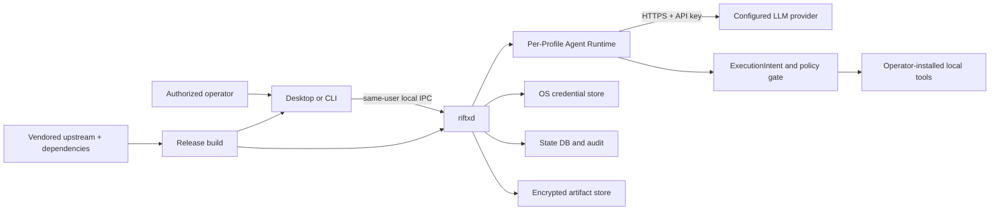

# RiftX 1.0 Threat Model

- Status: Release-gate baseline
- Date: 2026-07-28
- Scope: RiftX Desktop, CLI, `riftxd`, local IPC, Agent Runtime integration, Tools/Skills discovery,
  credentials, audit, reports, artifacts, packaging, and upstream synchronization

## 1. Product and Security Claim

RiftX is an authorized security-testing agent that runs on the operator's computer. It coordinates a
model, local tools, approvals, execution policy, audit, evidence, and reports. RiftX does **not** claim
that the declared target Scope is an OS-enforced or unbypassable network boundary. An operator or
malicious executable with the same host privileges may act outside application policy.

RiftX must fail closed where it makes an explicit enforcement claim: incompatible IPC, approval
binding, authorization expiry, critical audit availability, Auto eligibility and budgets, credential
grants, artifact integrity, and configured provider capabilities.

## 2. Assets

1. LLM provider API keys.
2. Assessment credentials: passwords, tokens, SSH keys, certificates, and their grants.
3. Authorization Scope, expiry, mode, approval decisions, and execution-intent bindings.
4. Audit records, conversation history, reports, evidence, and encrypted artifacts.
5. Local workspace files and operator-installed tools.
6. Process-control authority for Pause, Interrupt, Kill, deadlines, process groups, and Job Objects.
7. Release provenance: source revision, upstream lock, signatures, checksums, SBOM, and licenses.

## 3. Trust Boundaries and Data Flow

Boundary assumptions:

- Desktop/CLI and daemon are expected to run as the same local user.
- The OS credential store and filesystem permissions are trusted to enforce same-user access.
- The configured LLM provider is external and sees submitted model context.
- Tools, Skills content, model output, target responses, and imported workspace files are untrusted.
- A fully compromised operator account or host kernel is outside the protection boundary.

## 4. Threat Actors

- A malicious or compromised model/provider.
- Prompt injection embedded in target content, tool output, Skills, or workspace files.
- A malicious executable placed in a Tools Directory or earlier PATH entry.
- Another local user attempting IPC or filesystem access.
- Malware already running as the RiftX user.
- A dependency, upstream commit, build action, or release artifact compromised in the supply chain.
- An authorized operator who makes a scope or approval mistake.

## 5. Threats, Controls, and Residual Risk

### 5.1 Malicious model output and prompt injection

Threats include fabricated tool calls, dangerous arguments, attempts to change mode or Scope, secret
exfiltration requests, infinite planning, and instructions embedded in untrusted target content.

Controls:

- tool calls are parsed as structured Runtime events, not accepted from ordinary text;
- every execution carries a bound `ExecutionIntent` with engagement, thread, turn, tool-call, mode,
  authorization, and policy identity;
- RedTeam and risk policy can require an operator approval bound to the exact intent;
- tool output does not directly mutate mode, authorization, grants, or daemon control state;
- provider capability mismatch and unmappable Chat fields fail explicitly;
- output, context fragments, and stream events have hard size limits.

Residual risk: a model can still persuade an operator to approve a harmful command or choose a tool
that is technically in policy but unsafe for the environment.

### 5.2 Malicious Tools Directory binary

Threats include false names/metadata, PATH shadowing, credential theft, filesystem modification,
process escape, persistence, and network access outside declared Scope.

Controls:

- deterministic bounded scanning, executable/risk metadata, diagnostics, paths, and snapshot hashes;
- platform-specific executable handling and tests for spaces, Unicode, and Windows script formats;
- provider key environment variables are removed before tool spawn;
- assessment credentials are released only through scoped, expiring, use-limited grants;
- process trees are attached to Unix process groups or Windows Job Objects for termination;
- execution, output hashes, approval, and artifacts are audited.

Residual risk: local tool execution is not a security sandbox. A malicious binary running as the user
may access any resource available to that user, including resources outside RiftX's declared Scope.

### 5.3 API key and credential leakage

Threats include plaintext configuration, command history, environment inheritance, logs, model
context, reports, crash output, and cross-Profile access.

Controls:

- Keychain, Credential Manager, or Secret Service is the default store;
- Desktop uses a bounded private stdin frame; Linux headless mode uses bounded redirected JSON stdin
  or an explicitly named environment variable;
- raw stdin buffers are zeroed after decode and unknown/Profile-source mismatches are rejected;
- Profile Runtime homes and keys are isolated; all provider-key variables are stripped from tools;
- assessment credentials remain separate from LLM keys and model-visible records contain references;
- error, report, audit, and bridge paths redact sensitive material.

Residual risk: secrets exist in daemon/provider-client memory, and explicit environment mode exposes a
key to same-user process inspection where the operating system permits it.

### 5.4 Local IPC unauthorized access

Threats include another user issuing approvals, starting work, reading reports, or invoking Kill.

Controls:

- no TCP listener;
- Unix IPC directories are mode 0700 and sockets 0600;
- Windows Named Pipes reject remote clients and use local-user access controls;
- CLI/Desktop require an exact protocol handshake and reject incompatible daemons;
- request bodies are bounded and typed.

Residual risk: another process already running as the same user is inside the local-user trust
boundary and may be able to call the local API.

### 5.5 Report, audit, and artifact disclosure or tampering

Threats include secret-bearing command output, path traversal, symlink races, partial decrypt output,
corrupt ciphertext, and unbounded storage.

Controls:

- report/audit redaction and regression fixtures;
- artifacts are workspace-relative, reject traversal/symlinks/directories, and enforce quotas;
- artifact content is chunk-authenticated, encrypted, content-addressed, and revalidated on export;
- failed authentication returns no partial plaintext;
- export creates a new destination and removes partial output after local I/O failure.

Residual risk: an authorized report or exported artifact can contain sensitive target data selected by
the operator and must be handled accordingly.

### 5.6 Auto runaway execution

Threats include infinite turns, repeated failures, cost exhaustion, no-progress loops, stale work after
restart, and continued execution after authorization expires.

Controls:

- Auto is limited to Lab, requires an exact confirmation phrase and an authorization expiry;
- turn, tool-call, wall-clock, command, failure, no-progress, and optional token/cost budgets;
- typed stop reasons and state persisted across restart;
- Pause, Interrupt, Kill, deadline tasks, process-tree termination, and audit-unavailable fail-closed;
- only the controller schedules Auto turns; operator turns cannot bypass it.

Residual risk: configured limits may still be too generous for a specific tool or provider cost model.

### 5.7 Scope misunderstanding

Threat: users infer that CIDRs/domains in an engagement are a kernel-enforced egress boundary.

Controls:

- README and Desktop explicitly state that tools run locally and Scope is not OS-enforced;
- Scope, mode, environment, expiry, capabilities, and approval intent are visible in UI/report/audit;
- out-of-scope application requests are rejected where RiftX can validate them.

Residual risk: arbitrary local tools can ignore application-layer Scope.

### 5.8 Supply chain and upstream synchronization

Threats include dependency substitution, unreviewed upstream drift, malicious build scripts, leaked
signing credentials, debug/test material in packages, and platform artifacts from different commits.

Controls and release gates:

- committed Cargo/pnpm locks, frozen/locked CI installs, pinned toolchain/package-manager versions;
- a verified vendored upstream commit and patched-component review;
- dependency vulnerability/license checks and generated SBOM;
- protected manual release environment; signing secrets unavailable to pull requests;
- platform artifacts built from one tag/commit with signatures and SHA-256 checksums;
- package scans reject test keys, internal endpoints, request dumps, telemetry, and debug symbols.

Residual risk: third-party build actions and registries remain dependencies; release approval must
review their pinned revisions and generated provenance.

## 6. Privacy

RiftX does not add product telemetry or automatically upload reports, artifacts, audit records, target
content, or credentials. Network disclosure occurs when the selected provider receives model input or
when an operator-installed tool accesses the network. Live smoke uses protected secrets, harmless
probes, sanitized retained output, and explicit manual dispatch.

## 7. Verification Requirements

Required release evidence includes:

- Responses and Chat mock text/tool loops on macOS, Windows, Ubuntu 22.04, and Ubuntu 24.04;
- IPC permission and remote Named Pipe rejection tests;
- provider-key environment stripping and headless stdin acceptance;
- approval binding, authorization expiry, audit failure, Auto budget, Interrupt, and Kill tests;
- report redaction, artifact traversal/tamper/quota tests, and migration fixtures;
- protected dual-provider live smoke with secret-leak scanning;
- locked dependency audit, license review, SBOM, checksums, signatures, and clean-system installs.

## 8. Out of Scope

- protection after compromise of the operator account, kernel, or OS credential store;
- a mandatory network namespace, VM, container, or kernel-level target Scope sandbox;
- making arbitrary third-party security tools safe;
- guaranteeing that an external model provider does not retain submitted data;
- automatic remediation of vulnerable targets or authorization mistakes.
