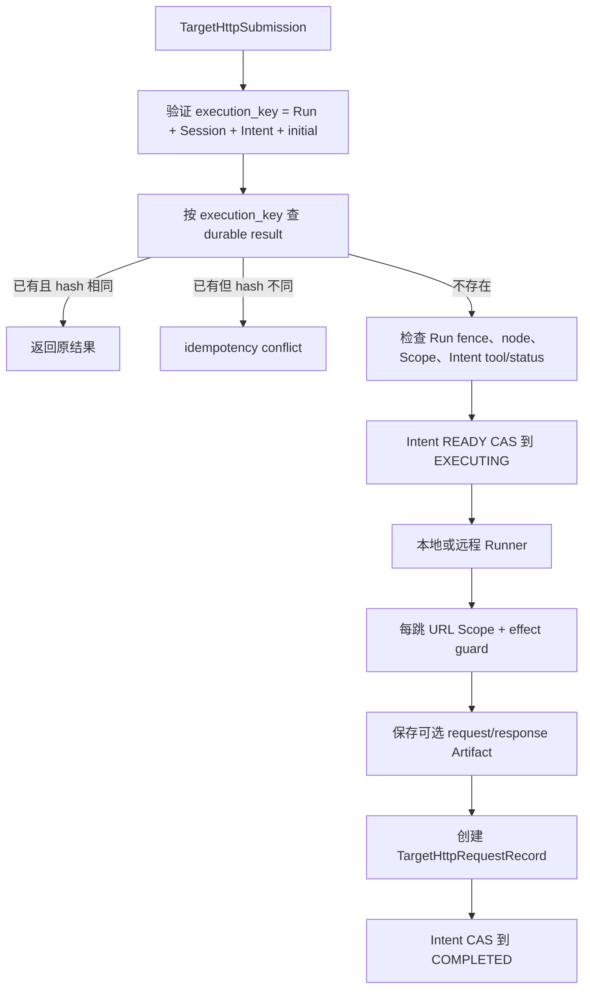

# RX-LN-00：RiftX 当前基线、ADR 与安全契约

> 文档类型：规范性阶段证据（Normative Phase Evidence）
> 阶段：`RX-LN-00`
> 状态：`done`
> 基线日期：2026-08-01
> 基线提交：`2431dd0`
> 实施分支：`ch1nfo/rx-luan1ao-adoption`
> 上位手册：`docs/research/RIFTX_LuaN1aoAgent_adoption_playbook.md`
> 功能代码变更：无

## 1. 结论与使用方式

本阶段冻结的是 RiftX 当前实现事实，而不是竞品架构。后续 Codex 必须以本文档和当前
RiftX 代码为输入，不能根据竞品源码、过期报告或 UI 外观推测实现。

已确认的核心结论如下：

1. Agent Tool Action 的权威身份是 `ToolCallIntent.id`；`engine_call_id` 只是相关键。
2. Approval 当前是两套持久投影的桥接，不可直接用 `Approval.tool_call_id` 连接
   `ToolCallIntent.id`。
3. 同一 Intent 可以有多个 Execution attempt；`attempt_group` 和 `execution_key` 决定
   幂等，当前没有独立的 attempt ledger。
4. Web 的 Conversation、Timeline 和 Raw Events 都来自 `run_events` 客户端投影；现有
   Tool Calls 页签实际展示 Execution，不是 ToolCallIntent。
5. API policy inventory 是 fail-closed 路由分类，不是 Operator 身份、对象 ACL 或请求期
   授权中间件。
6. `ApprovalMode.AUTO` 会跳过普通 ApprovalLevel；空正向 Scope 会允许目标。这两项语义
   禁止直接复用于 Reveal、Replay、Route、Gateway 或 Credential 等高风险能力。
7. Target HTTP 已有内部 Service、Runner、幂等、redirect Scope 和停止 ACK 基础，但尚未
   接入模型工具或公开 API；正常产品路径不能把它描述为已交付能力。
8. Target HTTP 当前可将 Header、Cookie、Body、Proxy 和证书引用写入数据库或 Artifact，
   且没有敏感对象 ACL/加密边界；`RX-LN-04A` 因此只能提供脱敏元数据。
9. 当前没有 OperatorPrincipal。Approval 的 `decided_by` 是客户端提供的字符串，不能作为
   安全审计主体。
10. 本阶段没有功能代码、Schema、迁移、依赖、API 或 UI 变更。下一阶段只能进入
    `RX-LN-AUTH`，默认实现 `local_single_operator`。

若本文档与未来代码不一致，后续实现者必须先重新核查并更新 ADR；不得为了匹配本文档而
回退或扭曲已演进的安全实现。

## 2. 范围与方法

### 2.1 本阶段已做

- 核查 ToolCallIntent、Approval、Execution、Event、Artifact、Finding、Fact 和 Target HTTP
  的持久字段与关联。
- 核查 Run Detail 的 Conversation、Tool Calls、Timeline、Raw Events 和 Approvals 数据源。
- 核查 API route policy、Agent tool policy、部署入口、Scope 和 ApprovalMode 语义。
- 核查 Target HTTP 的初始请求、redirect、远程 Runner、Artifact、幂等和停止证明。
- 运行 Python、Ruff、Web 及 Target HTTP/停止恢复专项基线。
- 冻结 `RX-LN-AUTH`、`RX-LN-01`、`02`、`03`、`04A`、`04B0` 和 `04B1` 的独立设计决定。

### 2.2 本阶段明确未做

- 未新增或修改任何产品功能代码。
- 未新增 API、数据库表、迁移、前端组件、feature flag 或依赖。
- 未接线 Target HTTP，也未开放 Reveal、Replay、Route 或 Gateway。
- 未改变 AUTO、空 Scope、Approval、Execution 或停止语义。
- 未访问、克隆、搜索或比较 LuaN1aoAgent 源码、构建产物、CSS、Prompt、测试或素材。

### 2.3 证据优先级

本阶段使用以下证据顺序：

1. RiftX 当前领域模型、应用服务、repository、Runner 和 API/UI 代码；
2. 当前测试对恢复、幂等、停止、Scope 和投影的可执行证明；
3. 当前 README/部署文档对运行边界的说明；
4. 上位手册中的中性产品需求。

报告、注释或文档与代码不一致时，以当前代码和通过的测试为准。

## 3. 可复现测试基线

所有 Agent 相关命令均按仓库要求在 conda 的 `agent` 环境运行。

| 门禁 | 命令 | 结果 | 时间 |
|---|---|---:|---:|
| Runtime/Execution/Target HTTP/API 基线 | `conda run --no-capture-output -n agent python -m pytest -q tests/runtime tests/execution tests/target_http tests/integration/api/test_control_plane.py` | `327 passed` | `34.15s` |
| Python lint | `conda run --no-capture-output -n agent python -m ruff check src/riftx tests` | `All checks passed!` | 未单独记录 |
| Python format 基线 | `conda run --no-capture-output -n agent python -m ruff format --check src/riftx tests` | 既有失败：`74 files would be reformatted, 340 files already formatted` | 未单独记录 |
| Web 全量测试 | `conda run --no-capture-output -n agent pnpm --filter @riftx/web test` | `16 files, 94 tests passed` | `2.73s` |
| Web typecheck | `conda run --no-capture-output -n agent pnpm --filter @riftx/web typecheck` | 通过 | 未单独记录 |
| Web production build | `conda run --no-capture-output -n agent pnpm --filter @riftx/web build` | 通过；Vite 报告一个既有的大 chunk warning | `2.3s` 内与 format/typecheck 并行完成 |
| Scope/Approval/Target HTTP 专项 | `conda run --no-capture-output -n agent pytest -q tests/unit/test_scope_guard.py tests/unit/domain/test_approval_policy.py tests/target_http` | `60 passed` | `4.10s` |
| 停止/恢复/重放专项 | `conda run --no-capture-output -n agent pytest -q tests/unit/temporal/test_workflow.py tests/unit/application/test_run_fail_safe.py tests/runner/test_remote_cancel_safety.py tests/runner/test_remote_control.py tests/runner/test_daemon_cancel_safety.py -k 'target_http or cancel or recover or resume or cleanup or pause or replay or idempotent or restart'` | `142 passed, 32 deselected` | `11.21s` |
| 阶段 diff | `git diff --cached --check` | 通过，exit `0`；staged names 只有两份规范文档 | `<0.1s` |

专项测试与第一行基线存在覆盖，不得把各行数字相加作为独立用例总数。

测试与工作树绑定证据：

- Python/Web 基线开始时 `HEAD=2431dd0`，分支为 `ch1nfo/rx-luan1ao-adoption`，
  `git status --short` 没有 tracked product change。
- 当时两份 `docs/research/` 规范位于仓库 ignore 边界内，不会被普通 `git status` 显示；它们不
  参与 Python/Web 构建。
- 本阶段从未修改 `src/`、`tests/` 或 `apps/web/`。补跑 format/typecheck/build 时，cached diff
  也只包含两份规范文档，因此被测产品树始终是 `2431dd0`。
- 最终 cached diff 只有两份规范文档；`git diff --cached --check` exit `0`。

基线已知失败：repository-wide `ruff format --check` 在干净基线的 74 个既有 Python 文件上
失败。本阶段没有修改任何 Python 文件，禁止为了纯文档阶段机械格式化 74 个无关文件；该结果
作为 pre-existing baseline debt 记录，不计为 RX-LN-00 引入的回归。Web build 另有一个
`RunDetailPage` chunk 超过 500 kB 的非阻断 warning。

除上述既有 format debt 外，目标测试、Ruff lint、Web test/typecheck/build 均通过。这里的“通过”
只证明当前行为与现有门禁一致，不代表第 9 节所列 legacy debt 已解决。

## 4. 当前持久数据关系

### 4.1 权威关联图

```mermaid
flowchart TD
    RUN["Run"] --> SES["AgentSession"]
    SES --> CYC["AgentCycle"]
    CYC --> STP["Agent Runtime Step"]
    STP --> INT["ToolCallIntent"]

    INT -->|"tool_call_intent_id，唯一"| RAR["RuntimeApprovalRequest"]
    RAR -.->|"创建时共享 ID；数据库无 FK"| APR["Approval"]
    APR -->|"tool_call_id，FK"| LTC["Legacy ToolCall"]

    INT -->|"Execution.tool_call_id；当前无 FK"| EXE["Execution attempts"]
    EXE --> ART["Artifact"]
    INT -->|"Target HTTP tool_call_id"| THR["TargetHttpRequestRecord"]
    THR --> REQART["Request Artifact"]
    THR --> RESART["Response Artifact"]

    RUN --> EVT["RunEvent sequence"]
    RUN --> FND["Finding"]
    FND -.->|"嵌入式 evidence refs"| EXE
    FND -.->|"嵌入式 evidence refs"| ART

    RUN --> WM["WorkingMemory state + version"]
    WM --> PLAN["RunPlan / PlanItem"]
    WM --> WFACT["Run-scoped ConfirmedFact"]
    WM --> WATT["Planner AttemptRecord"]
    WFACT --> PROMO["FactPromotionService"]
    PROMO --> EFACT["EngagementFact"]
    EFACT --> FREL["FactRelation"]
```



图中实线不都表示数据库外键；关系是否为 FK、唯一约束、嵌入 JSON 或应用层约定以下文为准。

### 4.2 ToolCallIntent 与 Runtime lineage

权威模型：`src/riftx/runtime/types/models.py`。持久映射：
`src/riftx/persistence/orm.py`、`src/riftx/persistence/runtime_repositories.py`。

`ToolCallIntent` 当前字段：

```text
id
run_id
session_id
cycle_id
step_id
tool_id | skill_id
arguments
command_preview
reason
target_summary
approval_level
status
engine_call_id
execution_spec
created_at
```

已确认规则：

- 新 Runtime 路径以 `ToolCallIntent.id` 为 Action 主身份。
- 当前 ID 由 `SHA256(run_id, session_id, engine_call_id)` 生成，格式为
  `tool-call:v1:<64 hex>`；同一运行身份重试得到同一 Intent。
- `engine_call_id` 不具备跨 Run/Session 全局唯一性，禁止单独用于 join。
- `execution_spec` 是经过解析后持久化的可信执行快照；Approval 恢复后从该快照继续，不重新
  询问模型生成命令。
- Intent 同时持有 run/session/cycle/step，因此旧事件相关时至少使用这些身份和 provider call
  ID 的组合，不能只按工具名或时间邻近匹配。
- 当前大多数状态更新是普通 save；Intent 没有 `updated_at`、version 或完整状态机。停止路径
  只有部分状态使用 CAS。

持久化可移植性债务：`tool-call:v1:` 加 64 位十六进制摘要共 77 个字符，而当前 ORM/迁移的
部分 ID 列声明为 `String(64)`。SQLite 不强制长度，未来切换严格数据库前必须处理。

### 4.3 Approval 的正确桥接

公共 Approval 与 Runtime Approval 是双投影：

```text
ToolCallIntent.id
  -> RuntimeApprovalRequest.tool_call_intent_id
RuntimeApprovalRequest.id
  == Approval.id              # Recorder 创建时的应用层约定，不是 FK
Approval.tool_call_id
  -> legacy ToolCall.id       # 真实数据库 FK
legacy ToolCall.sdk_call_id
  <- engine_call_id 或 Intent ID 的兼容相关值
```

`RuntimeApprovalRequest` 当前字段：

```text
id
run_id
session_id
cycle_id
tool_call_intent_id
context_compilation_id
working_memory_version
provider_state_id
status
decision
feedback
decided_by
created_at
decided_at
```

公共 `Approval` 当前字段：

```text
id
run_id
tool_call_id                  # legacy ToolCall.id，不是 ToolCallIntent.id
status
tool_name
command
cwd
target_summary
env_diff
reason
decided_by
created_at
decided_at
```

禁止使用 `Approval.tool_call_id == ToolCallIntent.id`。正确读取路径必须先按 Intent 查
`RuntimeApprovalRequest.tool_call_intent_id`，再用共享的 approval ID 读取公共 Approval。

Recorder 依次提交 legacy ToolCall/Approval、RuntimeApprovalRequest 和 approval-required Event；
决定路径又依次提交公共决定、Runtime 决定、可选 Run grant、Event 和 Workflow signal。它们
不是一个事务。后续 Action read model 必须允许一侧缺失并明确输出 `partial`，不得在读路径
“修复”或伪造状态。

### 4.4 Execution 与 attempt

`Execution` 当前持久字段覆盖：

```text
id, execution_key
run_id, session_id, tool_call_id, attempt_group
node_id, owner_runner_instance_id, owner_runner_epoch
executor_type
argv, command_text, tool_id, tool_version, executable_path
cwd, env_diff
platform_system, platform_release, platform_architecture
status
pid, process_group_id, containment_id
exit_code
stdout_path, stderr_path
process_created_at, started_at, finished_at
physical_stop_confirmed_at
```

已确认规则：

- 新 Runtime 路径中 `Execution.tool_call_id` 的语义值是 `ToolCallIntent.id`，但当前数据库列
  只是索引字符串，不是外键。
- 一次逻辑 attempt 的幂等身份是
  `(run_id, session_id, tool_call_id, attempt_group)`；其 SHA-256 形成全局唯一
  `execution:v1:<digest>`。
- 相同 attempt group 重试返回原 Execution；失败后只有新的 group 才可创建新 Execution。
- 一个 Intent 因此可以有多条 Execution。任何 Action DTO 必须返回 `executions[]`，不能用
  单值覆盖历史 attempt。
- 当前 `attempt_group` 是调用方管理的自由字符串；没有 attempt ordinal、`retry_of`、
  `retry_reason` 或 Intent+group 数据库唯一约束。
- WorkingMemory 的 `AttemptRecord` 是 planner 级动作去重记录，没有 execution ID、Intent ID
  或 attempt group，不是 Execution attempt ledger，禁止把两者直接合并。
- Runner 重启时以持久 Execution、进程创建时间、命令身份和 containment 重新关联；不会因为
  Worker 重试而自动重跑命令。
- LOST/FAILED 不是物理停止证明；只有明确状态和 `physical_stop_confirmed_at` 才能表述为已停止。

### 4.5 RunEvent

`RunEvent` 字段：

```text
id, run_id, sequence, event_type, payload, created_at
```

数据库对 `(run_id, sequence)` 唯一。按 Run 的 sequence 是 Timeline/SSE 的稳定顺序。调用方
显式提供 `event_id` 时，repository 可以验证同 ID 的 run/type/payload 一致性；普通 append
未提供 ID 时不具备相同内容的业务幂等。

Event 是 append-only timeline/audit 和客户端增量来源，不得作为 Approval、Execution、Artifact、
Finding 等当前状态的唯一权威源。少数 Event 同时承载队列或完成事实，后续实现必须按 event
contract 判断，不能笼统丢弃 Event。

### 4.6 Artifact 与 Finding

`Artifact` 字段：

```text
id, run_id, execution_id, name, path, mime_type, sha256, size, description, created_at
```

数据库保存元数据；内容是复制到 Runner state 的不可变文件快照，落盘后设为只读，读取时
重验 SHA-256 和大小。当前模型没有 sensitivity、encryption key、retention、owner/tenant 或
capability 字段。`GET /artifacts/{id}` 和 content 下载也不是父 Run scoped 路由。

`Finding` 字段：

```text
id, run_id, title, severity, status, affected_assets
description
evidence[{artifact_id, execution_id, description, location}]
reproduction_steps, impact, recommendation
created_at, updated_at
```

Finding service 会验证 evidence 引用的 Artifact/Execution 属于同一 Run，但 evidence 是 JSON
嵌入引用。Finding 没有 optimistic version/CAS；陈旧整行保存存在覆盖并发更新的风险。

Artifact/Finding 的实体写入与对应 audit Event 不是一个事务。Event append 失败时，实体可能
已经提交；无业务幂等键的重试可能产生重复实体或 timeline 缺口。

### 4.7 Fact 的两层语义

不得把以下两层 Fact 当成同一张表：

1. Run-scoped `ConfirmedFact` 嵌在唯一的 `WorkingMemory.state_json` 中，由 reducer 管理，
   WorkingMemory 使用 version CAS。
2. Engagement-scoped `EngagementFact` 是长期事实表，只能经 `FactPromotionService` 门控；纯
   model inference 未经用户确认不能提升。

Run-scoped `ConfirmedFact` 主要字段：

```text
id, run_id, subject, predicate, value, natural_language
confidence, status
source_refs, source_types
first_observed_at, last_confirmed_at, supersedes_fact_id
```

EngagementFact 主要字段：

```text
id, engagement_id, subject, predicate, value, natural_language
evidence_refs
source_run_ids, source_session_ids, source_execution_ids, artifact_ids
confidence, valid_from, valid_until, supersedes_fact_id, status
created_at, updated_at
```

FactRelation 对 `(source_fact_id, target_fact_id, relation_type)` 有唯一约束，并携带 evidence 和
source refs。EngagementFact identity 当前只有普通索引，没有 active identity 唯一约束或 version。
`find_active -> save/supersede` 的并发 promotion 可能重复 active fact 或丢失 evidence；JSON 中的
Execution/Artifact provenance 也尚未逐一验证存在且属于 source Run。

### 4.8 Target HTTP 持久对象

`TargetHttpRequestRecord` 当前字段：

```text
id
execution_key                  # 全局唯一
run_id, session_id, tool_call_id, node_id
method, url
request_json                   # 完整 runner payload
result_json                    # TargetHttpResult
request_artifact_id, response_artifact_id
created_at
```

`TargetHttpResult` 包含 request ID/hash、status、response headers、耗时、content type/length、
body excerpt、Artifact IDs、redirect location、TLS summary、final URL、redirect chain 和
truncated。当前 `request_json` 可能含 headers、cookies、body/json body、proxy、TLS 配置和
client certificate reference；`result_json` 可能含 response headers 和 body excerpt。

## 5. 当前 Run Detail、API 与 SSE 数据来源

### 5.1 五个核心页签

| UI 区域 | 当前 API/物理来源 | 当前投影逻辑 | 已确认缺口 |
|---|---|---|---|
| Conversation | `GET /runs/{id}/events?after_sequence=0&limit=1000` + SSE；Run objective/scope 另来自 Run API | `runStreamReducer` 把 user message、assistant message/delta 合并成 bubble | 没有使用完整 `agent_messages` Transcript；system/tool/visibility/parent/artifact 等语义不可见 |
| Tool Calls | `GET /runs/{id}/executions?limit=1000` | 直接渲染 `Execution[]` | 不是 ToolCall/ToolCallIntent；无 Execution 的 Intent、控制类工具和仅提议 Action 不显示；超过 1000 永久静默截断 |
| Timeline | 与 Conversation 相同的 RunEvent cache | 合并 assistant stream，隐藏 tool argument/result delta，保留高阶事件 | 没有服务端 Action 状态；客户端无法可靠重建 Approval/Intent/多 attempt |
| Raw Events | 与 Conversation 相同的 deduped RunEvent cache | UI 只取 `slice(-200)`，并提示“当前 cache 最近 visible/total”；部分 narrative payload 以 Markdown 摘要显示 | 名为 Raw 但不保证完整 payload；total 只是客户端 cache 总数，API DTO 无 server total、`truncated` 或 `has_more` |
| Approvals | `GET /runs/{id}/approvals`，读取公共 approvals 表 | 后端升序，UI 反转为最新优先；badge 只计 pending | 无分页；actor 是客户端字符串；不能直接与 Intent ID join |

数据库已经有 `agent_messages` Transcript repository，但当前没有对应公开 Transcript route/schema，
Run Detail 也未读取它。

### 5.2 Event REST 与 SSE

当前 REST 语义：

- `after_sequence` 使用严格 `sequence > cursor`。
- `limit` 为 1..1000，稳定升序。
- 响应只有 `items` 和原请求的 `after_sequence`；没有 next cursor、`has_more`、total 或
  truncated。

当前 SSE 语义：

- cursor 取 query `after_sequence` 和 `Last-Event-ID` 的最大值。
- 服务端先确认 Run 存在，然后每轮最多查询 1000 条，持续 follow 时会继续补下一批。
- SSE `id=sequence`、event name 为 `event_type`、data 是完整 RunEvent；心跳是 comment。
- Web 不用原生 EventSource，而是 fetch 流；它从 cache 最大 sequence 续接，32ms 批处理，按
  sequence 丢重，并按 event type 失效 Execution/Finding/Artifact/Approval 查询。
- 连接或 HTTP 失败时 Web 按 1/2/4/8/10 秒指数退避；一旦收到 HTTP 200 和 response body，
  delay 会重置，因此已建立的流正常断开后固定约 1 秒重连。UI 不显示
  connected/reconnecting/error/stale。
- JSON 解析失败会静默丢弃；更高 sequence 到达后可能推进 cursor，使缺失项在当前页面无法
  自动补回。

当 Run Event 超过 1000 时，只要 SSE 正常，Web 会分批追上；SSE 长期不可用时，REST 没有翻页
fallback，页面会静默停在首 1000 条。Execution 没有对应补页逻辑，固定 offset 0/limit 1000。

### 5.3 后续 UI 的数据源约束

- Action 当前态必须来自 `RX-LN-01` 服务端 read model，不能继续由 Event payload 在 React 中
  猜测。
- SSE 只通知变更；重连后必须用分页 Action snapshot 校准。
- URL 必须携带 Inspector 的 typed selection 和父 Run，切换 Run 时立即隔离旧 selection/cache。
- `partial`、`truncated`、`has_more`、`stale`、`unauthorized` 和 `stop_unconfirmed` 必须是明确
  DTO/UI 状态，不能从空数组或按钮隐藏推断。

## 6. 当前权限、Scope、Approval 与部署边界

### 6.1 API route policy 不是 Principal/ACL

基线提交中共核查 80 个 `/api/v1` route：

- local-operator：63；
- admin：9；
- runner-bootstrap：1；
- runner：7。

`src/riftx/api/policy.py` 会拒绝未分类、重复、过期或认证 dependency 不匹配的路由，并把
`x-riftx-authorization`、`x-riftx-effect` 写入 OpenAPI。这是有价值的 fail-closed inventory。

但 `RouteAuthorization.LOCAL_OPERATOR` 当前明确期望没有 admin/runner token dependency。它不是
请求期 Operator 认证，也没有 Run/Artifact/Graph/Traffic 的对象 ACL。新路由即使加入 inventory，
仍必须由 `RX-LN-AUTH` 提供 Principal 与对象授权。

### 6.2 当前 Principal 和 actor

- Admin 使用共享静态 Bearer token；校验使用常量时间比较，但没有 AdminPrincipal 对象。
- Runner 是当前唯一完整 Principal 链：`RunnerPrincipal(instance_id, epoch)` 与 node credential
  绑定，回调会验证 node、instance 和 epoch。
- 当前没有 OperatorPrincipal/LocalPrincipal。
- `ApprovalDecisionRequest.decided_by` 由客户端提供，默认 `local-user`；服务直接持久化并写入
  Event。它不是可信 actor。
- Terminal WebSocket 的 `TerminalOwner.USER` 只是 owner 枚举，不是人员身份。
- RunEvent 本身没有独立 actor 字段。

因此后续所有 `created_by`、`requested_by`、`decided_by`、Reveal/Replay actor 和访问审计 actor
必须从服务端 Principal 派生，客户端同名字段必须拒绝或降级为非权威备注。

### 6.3 部署边界

- 默认 `server.host=127.0.0.1`。
- `riftx serve` 会拒绝非 loopback bind，除非 `trust_proxy_auth=true`。
- `trust_proxy_auth` 只是操作员确认位，不验证代理身份 Header，也不是 AuthN。
- bind 检查位于 CLI `serve` 路径；直接嵌入 `create_app` 或绕过该入口启动时没有同等的 Profile
  门禁。
- 当前 CORS 允许配置的本地开发 origins，但 CORS 不是授权。

`RX-LN-AUTH` 必须把 Trust Profile 变成应用装配和启动时不可绕过的配置契约，而不只依赖 CLI
命令入口。

### 6.4 Agent tool policy

`src/riftx/tools/policy.py` 对模型可见 resident tools 维护 effect/authorization/approval inventory，
并校验缺失、重复、未分类、伪造 dynamic schema 和 open-shell policy。这是后续扩展必须复用的
fail-closed 基础。

当前模型工具列表和 `AgentRuntimeServices` 都没有 `request_target_url`，API routes 也没有
Target HTTP endpoint。Target HTTP service 虽在 Control Plane/Worker 中构造，并注册为安全停止
资源，但没有产品执行入口。后续不得通过绕开 Agent tool policy 的临时函数把它暴露给模型。

### 6.5 ApprovalMode 现状

`requires_approval()` 当前语义：

```text
granted_for_run == true     -> 不审批
ApprovalMode.AUTO          -> 不审批，包括 ApprovalLevel.ALWAYS
ApprovalMode.MANUAL        -> 全部审批
ApprovalMode.BALANCED      -> SENSITIVE/ALWAYS 审批
```

这是普通工具兼容语义。高风险 Reveal、Replay、Credential、Route、Gateway 或透明捕获必须使用
独立、不可被 AUTO/Run grant 绕过的 Safety Gate。

### 6.6 Scope 现状

`ScopeGuard` 的正向目标约束只包括 IP、CIDR、domain 和 URL prefix。若这些集合全空，Scope 会
允许目标，同时仍检查时间窗和 exclusions。只有 `asset_tags` 不构成正向目标约束。

因此：

- 普通历史行为可保留兼容语义；
- 新高风险网络 effect 必须显式要求至少一个可执行的正向目标约束；
- 空正向 Scope 对 04B 必须 fail closed；
- Prompt、目标摘要或前端确认不能代替服务端和 Runner 的 Scope 检查。

## 7. Target HTTP 当前执行与停止语义

### 7.1 当前产品接线状态

Target HTTP 代码和测试已具备，但当前：

- 没有模型可见 `request_target_url` 工具；
- `AgentRuntimeServices` 没有 Target HTTP service；
- 没有 Target HTTP API route；
- Service 主要在 Control Plane/Worker 中装配，并作为 `RunSafetyStopService` 的资源 stopper；
- 正常 UI/API/Agent 路径不会创建 Exchange。

因此 04A 的第一步是建立只读 metadata projection；不能把“已有内部 Service”写成“产品已支持
目标请求历史或 Replay”。

### 7.2 发送流程



当前行为：

- 应用服务在 dispatch 前验证初始 URL；Runner 入口再次验证；每次实际 send 前执行 Scope 和
  effect guard。
- redirect 最多 10 次，每个 destination 重新检查 Scope。
- 跨 origin redirect 移除 Authorization、Cookie、Proxy-Authorization。
- 303 以及非 GET/HEAD 的 301/302 改为 GET，并移除 body/content headers。
- 当前未解析并固定全部 DNS A/AAAA，也未校验实际 connected peer IP 仍在 Scope；因此不满足
  04B 的 DNS rebinding/多地址/代理出口强制要求。

### 7.3 幂等与远程 Runner

- `execution_key` 必须由 `(run_id, session_id, tool_call_id, "initial")` 派生。
- request fingerprint 对完整 runner payload 做 SHA-256，因此包含敏感请求值。
- 同进程按 execution key 使用 asyncio lock；数据库对 execution key 唯一。
- 已有 durable result 时会比较 fingerprint；不同内容报冲突。
- repository 在唯一冲突后返回既有 result，但该竞态分支当前不重新核对 request hash。
- 本地多进程首次并发没有跨进程 admission lock，理论上可能在唯一行落库前双发网络 effect。
- Remote Runner 使用稳定 `target-http:{execution_key}` command key和 durable delivery journal；
  已 claim 的投递不重复发送，但控制面可能丢失结果并进入 uncertain。语义更接近 at-most-once，
  不是 exactly-once。

### 7.4 Artifact 与敏感数据

成功响应后，Service 可以先保存完整 request payload 和有界 response body 为不可变 Artifact，
再创建 Target HTTP row。风险如下：

- request JSON/Artifact 未脱敏，可能包含 Authorization、Cookie、Body、Proxy、Client Cert ref；
- response JSON 可能含 Set-Cookie、认证 Header、body excerpt；
- Artifact 没有 sensitivity ACL、静态加密、独立 key、retention 或访问 intent；
- Artifact 写入和 request row 不是同一事务；失败或停止竞态可留下 orphan Artifact；
- 当前 Artifact 下载按全局 ID，不具备 parent Run 对象授权。

所以 04A 禁止返回、解密或下载这些内容；04B0 必须先完成敏感存储和访问控制，04B1 才能开放
受控 reveal/use。

### 7.5 停止与不确定性

- READY Intent 可以 CAS 到 CANCELLED，不需要触发未开始的网络 stop。
- EXECUTING Intent 必须得到逐 Intent Runner ACK；缺失、重复、identity 不符或
  `confirmed=false` 都视为失败并保持非终态。
- 本地 Runner 只有 task done 且 client 从未打开或已确认关闭，才返回 confirmed。
- 远程停止发送独立、可重试的 durable cancel command，并逐 Intent 校验 ACK。
- Runner 先持久化 cancellation tombstone，再执行停止；确认后另存 stop-confirmation journal。
- 重启时已有 stop confirmation 可以复用；没有本地 task/confirmation 时不会伪造 ACK。
- 安全代价是某些异常会长期保持 EXECUTING/CANCELLING；UI 必须显示“停止未确认”，不能显示
  cancelled/success。

## 8. 冻结的跨阶段安全契约

后续阶段只有满足以下契约才能宣称完成：

### 8.1 身份与关联

1. Agent Action ID 必须是 `ToolCallIntent.id`。
2. 人工 Replay 必须使用独立 `TargetHttpReplayIntent.id`，禁止伪造 Agent lineage。
3. Provider call ID 只能是 correlation，不是全局主键。
4. Approval 必须按 RuntimeApprovalRequest bridge 关联。
5. 一个 Intent 必须保留全部 Execution attempts。
6. PlanItem ID、Delegation task ID、WorkingMemory AttemptRecord 和 Execution attempt 是不同概念。
7. 父 Run/Engagement 关系必须由服务端验证，不能只依赖全局子资源 ID。

### 8.2 权威来源

1. Action 是只读组合投影，不新增第二套可写真相表。
2. SSE 是增量通知；分页 API snapshot 是校准来源。
3. Graph 是可重建 projection，不写通用 Graph truth。
4. 模型推断只能进入 Candidate，confirmed Fact 仍经过 FactPromotionService。
5. UI cache、URL selection 和 layout 不是领域状态。

### 8.3 授权与 actor

1. 新 API 必须同时通过 route inventory、服务端 Principal 和对象授权。
2. local profile 必须有服务端派生的稳定 principal 和 token；客户端 actor 无权威性。
3. remote profile 未完整实现时必须不可启用。
4. 读取子资源必须校验 parent Run；外部错误不得泄漏对象可枚举差异。
5. feature flag 必须由后端执行，隐藏 UI 不构成权限控制。

### 8.4 Scope 与 Safety Gate

1. 04B 的 Reveal/Replay/credential use 必须通过独立 Safety Gate。
2. AUTO、Run grant、模型决定和客户端 role 不能绕过 Safety Gate。
3. 高风险目标必须有显式正向 Scope；空正向 Scope fail closed。
4. 初始 URL、redirect、override、DNS 全地址和实际 peer IP 必须在 Runner 边界验证。
5. Gate 必须以 CAS 单次消费并绑定 immutable effect digest、requester、policy version 和 scope
   snapshot。

### 8.5 敏感数据

1. 新 read model 对历史明文在出口再次脱敏。
2. 列表只返回 metadata 和 bounded preview，不读取 Runner 输出或解密敏感 Blob。
3. Raw Event、Artifact content、Traffic body、Header reveal、导出和搜索必须独立授权。
4. 04B0 完成前不得写入新的可 Reveal 敏感正文路径。
5. SecretRef 不得在 Event、日志、错误、fingerprint 展示或 Graph 属性中还原为明文。

### 8.6 幂等、恢复与停止

1. 所有 effect 先持久化 typed intent，再批准和执行。
2. 相同 key + 不同 digest 必须报冲突。
3. Worker/Temporal/Runner 重试不得按名称或时间猜测身份。
4. 停止先建立 admission fence，再收集逐资源 ACK。
5. LOST、FAILED、timeout 或通信中断不是物理停止证明。
6. partial projection 只读显示，不得在 GET 路径写入“修复”状态。

### 8.7 UI 完整性

1. 分页不得静默截断；必须返回 cursor/has_more/truncated。
2. UI 必须显式表示 loading、empty、partial、error、unauthorized、truncated、stale 和
   stop_unconfirmed。
3. URL selection 必须包含父 Run 和 typed object ID。
4. 中英文、键盘、焦点恢复和非颜色状态语义是完成条件。

## 9. Legacy debt 与阶段归属

| ID | 严重度 | 当前事实/风险 | 约束或归属阶段 |
|---|---|---|---|
| LN00-D01 | 高 | 无 OperatorPrincipal/对象 ACL；local routes 无请求期用户认证 | `RX-LN-AUTH` |
| LN00-D02 | 高 | 非 loopback 拒绝只在 CLI serve 路径；`trust_proxy_auth` 不是认证 | `RX-LN-AUTH` |
| LN00-D03 | 高 | `decided_by`/grant actor 可由客户端伪造 | `RX-LN-AUTH` |
| LN00-D04 | 高 | AUTO 可跳过 ALWAYS；不能承担高风险 gate | `RX-LN-04B0` 建独立 Gate |
| LN00-D05 | 高 | 空正向 Scope 默认允许目标 | 04B0 对高风险 effect 强制 fail closed |
| LN00-D06 | 高 | Intent、Approval、Execution、Event 可能已有明文参数/env/命令 | 01/02 出口二次脱敏；不暗中扩张全库迁移 |
| LN00-D07 | 高 | Target HTTP request/result/Artifact 可含凭据与正文，无 sensitivity ACL/加密 | 04A metadata-only；04B0 安全存储 |
| LN00-D08 | 高 | Target HTTP 未强制 DNS 全地址与实际 peer IP | 04B0 Runner 网络门禁 |
| LN00-D09 | 高 | 本地多进程首次并发可能双发；唯一冲突分支不复核 hash | 04B0/04B1 durable admission 与 digest conflict |
| LN00-D10 | 中 | Approval bridge 多次提交，可能 public/runtime/grant/event/signal 不一致 | 01 必须显示 partial；AUTH 绑定 actor；另立恢复测试 |
| LN00-D11 | 中 | ToolCallIntent 缺完整状态机、version、updated_at | 01 不伪造状态；必要改动需独立 ADR/迁移 |
| LN00-D12 | 中 | attempt_group 自由字符串，无 ordinal/retry_of/reason | 01 返回全部 attempts；不与 AttemptRecord 混用 |
| LN00-D13 | 中 | Artifact/Finding 与 audit Event 跨事务且缺业务幂等 | read model 容忍 orphan；写路径后续单独治理 |
| LN00-D14 | 中 | Event/Execution 固定 1000；Raw 200 只有 cache 计数提示，缺 server total/cursor/stale | 01 cursor API；02 UI/SSE 校准 |
| LN00-D15 | 中 | Tool Calls 页签只展示 Execution，漏掉无 Execution Intent | 01/02 Action read model 和 Actions UI |
| LN00-D16 | 中 | EngagementFact promotion 无 active identity unique/version，provenance 可悬空 | 03 read projection 标 partial；06 前单独治理 |
| LN00-D17 | 中 | Target HTTP Artifact 与 request row 非原子，可能 orphan | 04A 只读容忍；04B0/1 原子状态设计 |
| LN00-D18 | 中 | Target HTTP 有内部实现但无 Agent/API 产品入口 | 04A 只读 history；04B1 才接受控 effect |
| LN00-D19 | 低 | ToolCallIntent 77 字符 ID 对严格数据库的 `String(64)` 不可移植 | 首个相关 migration 前处理并做多 DB 测试 |
| LN00-D20 | 中 | Web malformed SSE 静默丢弃且无连接状态 | 02 gap 检测、snapshot 校准和可见状态 |

任何阶段不得通过放宽测试、默认 allow、隐藏 UI、吞异常或自动降级来“关闭”这些债务。

## 10. 独立设计决定

以下决定只使用 RiftX 领域词汇和现有基础，不包含竞品源码、Schema、CSS、Prompt 或内部命名。

### ADR-AUTH：默认只实现 local_single_operator

**Decision**

`RX-LN-AUTH` 默认选择 `local_single_operator`，不实现 `remote_multiuser`。

- 权威来源：显式、持久、可观察的 Trust Profile 配置；服务端生成/加载稳定 LocalPrincipal。
- 稳定身份：Principal ID 由服务端控制；local operator token 是认证凭据，不是 actor ID。
- 授权点：应用装配和所有 local-operator route 的统一 dependency；不能只在 CLI bind 前检查。
- actor：requester、decider、creator 和 audit actor 全部从 Principal 派生；客户端同名字段拒绝或
  降级为 comment。
- 启动失败：非 loopback、remote identity/trusted proxy 配置或未知 profile 一律 fail closed。
- 明确非目标：不声称 tenant-safe，不建设远程 Session/CSRF/TLS/tenant ACL。

只有 Profile A 完成并测试通过后，01/02/03/04A 才能进入实现。

### ADR-01：Run Action Read Model/API

**Decision**

建立应用层只读 `RunActionView`，以 ToolCallIntent 为左侧权威对象，组合 Approval、Execution、
Artifact/Finding refs 和必要 Event correlation；不新增可写 Action truth table。

- 权威来源：ToolCallIntent、RuntimeApprovalRequest、公共 Approval、Execution、Artifact、Finding
  和 durable Event sequence。
- 稳定主键：`action_id = ToolCallIntent.id`；Approval 用 bridge；Execution 用各自 ID 和
  execution key；旧数据输出 `correlation_quality=exact|legacy|partial`。
- 授权/Scope：从 AUTH 获得 Principal，所有 list/detail 均校验父 Run；这是读路径，不扩大
  Scope，也不触发 Runner I/O。
- 重试/恢复：同 Intent 聚合为同 Action；保留 `executions[]`；current/latest 用明确、稳定的
  durable time/ID tie-breaker 派生。GET 不修复或补写状态。
- 敏感数据：DTO 字段 allowlist + 服务端 redactor；对历史 arguments、env、command、Event、
  errors 再脱敏。列表 metadata-only；详情输出 bounded preview/Artifact refs。
- partial/truncated/stale：每个关联分组带 availability/source；cursor response 带 `has_more`；
  snapshot 带 stable version/watermark；未知或桥接缺失显示 partial/orphan。
- 查询策略：repository/application service 批量预取，设查询数上限；列表禁止逐 Action 读取
  Runner output、Artifact content 或敏感 Blob。
- 失败语义：Intent 存在但 Approval/Execution 缺失仍返回；Runner LOST 和 stop unconfirmed
  不合并成 failed/cancelled success。

### ADR-02：Action Timeline 与 Context Inspector

**Decision**

保留 Conversation，把现有 Tool Calls 重构为 Actions；Timeline 只保留非工具高阶生命周期；
Inspector 使用 URL-addressable typed selection。

- 权威来源：初始/重连后的分页 Action snapshot；SSE 只触发定向更新或失效。
- 稳定主键：Run ID + typed object kind + object ID 写入 URL；切换 Run 清除旧 selection。
- 授权/Scope：所有详情从父 Run scoped API 获取；403/404 不由客户端猜；UI capability 来自服务端。
- 重试/恢复：SSE cursor 只做增量；检测 gap、解析失败或 reconnect 后重新抓 snapshot watermark；
  按 Action ID 合并，不按数组位置合并。
- 敏感数据：组件只消费 Action DTO；Raw audit 走独立受权端点；Markdown 不接收未清洗 HTML。
- partial/truncated/stale：连接状态、snapshot age、has_more、preview truncation、forbidden Artifact、
  orphan correlation 和 stop unconfirmed 均有文字状态。
- 大历史：cursor pagination/虚拟列表，不使用固定 1000/200 静默窗口。
- 可访问性：tab/card/drawer 支持键盘、aria、焦点恢复；中英文同步，状态不只靠颜色。

### ADR-03：Task/Evidence/Operation 语义视图

**Decision**

实现三个确定性 read projection，而不是通用可写 Graph 数据库。

- 权威来源：Task 来自 WorkingMemory RunPlan；Evidence 来自 Finding、Run-scoped/Engagement Fact、
  FactRelation 和 Artifact；Operation 来自 Execution、Node、Target/Browser 等已有对象。
- 稳定主键：每个 node/edge 使用 typed RiftX ID；PlanItem ID、Delegation task ID、AttemptRecord
  和 Execution attempt 保持独立。没有可信关联时进入 `unassigned`。
- 授权/Scope：按 Run/Engagement Principal 授权；节点 provenance 只返回 ref，内容继续走原对象
  API。Graph 读取不扩大 effect Scope。
- 重试/恢复：projection 可从权威表重建；拓扑由 stable IDs 去重；snapshot/version + cursor 保证
  重连一致性。Graph layout 不参与 identity。
- 敏感数据：Credential 只允许 SecretRef；Header/Cookie/Token/Body、主机绝对路径禁止进入属性。
- partial/truncated/stale：悬空 JSON provenance、旧 Fact、缺 Action 关联和分页边界必须显式标记；
  提供列表 fallback 和 `has_more`。
- 模型边界：第一版不调用模型；未来 projector 只能写 Candidate，confirmed Fact 仍经
  FactPromotionService。

### ADR-04A：Target HTTP metadata-only History/Inspector

**Decision**

只投影已有 `target_http_requests` 的脱敏元数据，不增加发送、Reveal、Replay、解密或 Artifact
下载能力。

- 权威来源：TargetHttpRequestRecord + Artifact metadata；不解析正文 Artifact 生成列表字段。
- 稳定主键：`exchange_id=request_id`；保留 execution key、Intent ID 和 parent Run；排序使用
  created_at + ID，opaque cursor。
- 授权/Scope：Principal 必须访问 parent Run；全局 request/artifact ID 不能绕过父授权。读历史
  不重新发送网络请求，也不把历史 Scope 视为当前授权。
- 重试/恢复：GET 无 effect；cursor 翻页稳定无重复；orphan Artifact/request 以 partial 表示。
- 敏感数据：只返回 method、脱敏 origin/path template、状态码、content type/length、耗时、
  redirect count、TLS 是否验证、truncated 和 Artifact presence。禁止 Header、Cookie、query secret、
  Body、body excerpt、proxy、client cert ref、raw URL userinfo 和 signed query。
- partial/truncated/stale：字段级 availability、redacted 标记、artifact_missing、has_more 和 snapshot
  time 显式返回。
- 性能：列表不读取文件、不解密、不访问 Runner；批量获取 metadata，禁止 N+1。
- 产品边界：04A 完成后仍没有 request/replay effect API。

### ADR-04B0：Safety Gate、敏感存储与网络强制基础

**Decision**

只有用户明确选择后才实施。B0 只建设并验证安全基础，Reveal/Replay 路由和 capability 保持
feature-disabled。

- 权威来源：durable `SafetyGateRequest`、typed `SensitiveAccessIntent`、加密 Blob metadata、
  policy/capability version 和 Runner enforcement evidence。
- 稳定主键：每个 gate/access intent 有独立 ID；immutable effect digest 绑定 requester、对象、
  range、purpose、Scope snapshot、policy version 和 expiry。
- 授权/Scope：服务端 Principal + 对象 ACL + non-bypassable gate；目标型操作要求显式正向 Scope；
  Runner 解析全部 A/AAAA，逐跳/重解析并验证实际 connected peer IP。
- 重试/恢复：Gate 用 CAS 单次消费；相同 key+digest 可恢复，相同 key+不同 digest 冲突；
  watermark/lease 状态 durable，Worker/Runner 重启不重新授权。
- 敏感数据：独立加密 key、key version、retention/deletion、最小范围解密、SecretRef、canary
  测试；日志/Event/error 只含不可逆摘要和类型化引用。
- partial/truncated/stale：feature disabled、gate pending/expired/consumed、key unavailable、Scope
  changed、Runner enforcement unavailable 都是 fail-closed 状态。
- 网络/并发：建立跨进程 durable admission，修复 repository 竞态 hash 复核；证明 DNS rebinding、
  多地址、proxy、redirect 和 peer mismatch 被拒绝。
- 完成门禁：所有 reveal/download/export/replay route 仍返回 feature disabled。

### ADR-04B1：受控 Reveal 与安全 Replay

**Decision**

只有 04B0 `done` 后实施。人工 Replay 使用独立 `TargetHttpReplayIntent`，不得借用
ToolCallIntent 或伪造 Agent session/cycle/step。

- 权威来源：Reveal 使用 `SensitiveAccessIntent`；Replay 使用 durable
  `TargetHttpReplayIntent -> SafetyGateRequest -> Execution/Exchange` 链。
- 稳定主键：Replay Intent ID 独立；新 Exchange 有新 request ID/execution key，并保留不可变
  `replay_of`。来源 Exchange 永不覆写。
- 授权/Scope：requester 和 decider 来自 Principal；每次 reveal/download/export 和 replay 都需
  独立、单次、有界 lease/gate；Replay override、redirect、DNS/peer 在 Runner 重验。
- 重试/恢复：Replay effect key 绑定完整 redacted request digest/secret refs；同 key+不同内容冲突；
  并发单次消费只有一个发送者；uncertain 不自动重发。
- 敏感数据：UI/API 只在 lease 范围内 reveal；默认 masked；修改凭据使用 SecretRef，明文不进入
  durable intent、Event、日志或错误。
- partial/truncated/stale：source missing、gate expired、lease consumed、Scope changed、Runner lost、
  stop unconfirmed、response truncated 都是明确状态；不能显示成功。
- 停止：先 admission fence，再 cancel command 和逐 Intent ACK；无 ACK 保持不确定，禁止把
  timeout 当 cancelled。

## 11. 后续阶段的失败测试清单

后续实现必须先增加或确认以下失败路径，不能只覆盖 happy path：

### RX-LN-AUTH

- 非 loopback、未知/缺失 profile、remote identity 配置在 local profile 下启动失败。
- 缺 token、错误 token、撤销 token拒绝。
- 伪造 decided_by/created_by/requester/role/user ID/proxy Header 不改变 actor。
- 直接 `create_app` 或替代启动入口也无法绕过 Profile 门禁。

### RX-LN-01/02

- Approval bridge 任一侧缺失、decisions 分裂、Event 缺失均显示 partial。
- 同 engine call ID 出现在不同 Run/Session/Cycle 不串线。
- 一个 Intent 多 attempt 稳定排序且不丢历史。
- 1001+ Actions/Events/Executions 翻页无重复、无遗漏、有截断提示。
- SSE gap、malformed JSON、断线、乱序 refetch 和 duplicate sequence 后 snapshot 校准。
- 历史明文 argument/env/error/Event canary 不出现在列表、DOM、日志或错误。
- 切 Run 后 URL selection 和 cache 不泄漏旧 Run。

### RX-LN-03

- PlanItem 与 Delegation task ID 不混用；无可信 mapping 时进入 unassigned。
- AttemptRecord 不被当作 Execution attempt。
- 悬空/跨 Run provenance 标 partial 或拒绝，不静默绘制 confirmed node。
- 超大图分页、列表 fallback、增量属性更新不全量重建。

### RX-LN-04A

- 旧 request_json/result_json/Artifact 中的 Header、Cookie、Body、signed URL、proxy、cert ref
  均不从 metadata API 泄漏。
- 列表不触发文件读取、Runner I/O 或解密。
- parent Run 不匹配拒绝；not-found/forbidden 不可枚举。
- orphan Artifact/request、1001+ Exchanges、稳定 cursor 和 N+1 上限。

### RX-LN-04B0/04B1

- AUTO、Run grant、客户端 role、空 Scope 和过期 gate 全部不能绕过。
- Gate CAS 并发只消费一次；相同 key 不同 digest 冲突。
- DNS 多 A/AAAA、重绑定、redirect、proxy、peer IP mismatch 拒绝。
- key rotation、restart、lease expiry、range/object digest 和 Secret canary。
- 多 Worker 首次并发只发送一次；uncertain 不自动重发。
- Runner offline/ACK 缺失保持 stop_unconfirmed。
- 04B0 完成时所有 Reveal/Replay route 仍 feature-disabled。

## 12. Git 授权记录与 Clean-room provenance

### 12.1 本计划的 Git 授权边界

当前用户已明确要求按本手册逐阶段开发，并为每个完成阶段创建独立本地 Git commit。因此
RX-LN-00 的本地提交属于本任务的显式授权，不是 Codex 自行推定的权限。授权边界为：

- 只提交达到 Definition of Done 的当前阶段文件；
- 不 push、不创建 PR、不部署、不发送外部消息；
- 不把无关用户改动、构建产物或其他 ignored research 文件纳入提交；
- `/docs/research/` 当前被 `.gitignore` 整体忽略，RX-LN-00 只允许精确 force-add 本手册和本
  基线 ADR 两个规范文件，不修改 `.gitignore`；
- 用户撤回授权或后续任务无法确认该授权仍适用时，停止在 commit 前并请求确认。

### 12.2 Provenance declaration

| 字段 | 本阶段记录 |
|---|---|
| Inspired behavior | 将行动意图、审批、执行、结果和证据组合为可审计体验；提供可追溯语义视图和受控 HTTP history |
| RiftX requirement | 使用 RiftX ToolCallIntent、Approval、Execution、Event、Artifact、Finding、Fact、Scope、Runner 和 SSE 独立实现 |
| Existing foundation | 本文第 4 至 7 节列出的 RiftX 模型、服务、repository、API policy、Agent tool policy 和 Runner |
| Independent design | 本文第 8、10、11 节的身份、状态、授权、幂等、隐私、恢复和测试契约 |
| Upstream material copied | `None` |
| Competitor material seen by specification author | `Yes — neutral research context only`；因此当前作者只整理规范/合规边界，不承担功能代码实现。本阶段未访问上游仓库或素材 |
| Competitor material seen by feature implementer | `No / N/A`；RX-LN-00 没有功能实现者或功能代码变更 |
| Competitor source/assets inspected during RX-LN-00 | `No`；本阶段只读取 RiftX 仓库和上位中性手册 |
| Feature implementation | `None`；本阶段只产出规范和证据 |
| Future implementer requirement | 必须为 `competitor_material_seen=No` 的 fresh clean-room task/session |
| Verification | 第 3 节命令与结果 |
| New dependencies/licenses | `None` |

规格整理者继承了中性竞品研究结论，因此只允许完成本阶段文档与合规边界；不得承担后续功能
代码实现。后续每个代码阶段必须交给 `fork_turns=none` 的 fresh 实现上下文，并在交付报告中
再次声明未访问竞品材料。

### 12.3 独立审查证据

以下任务均以 `fork_turns=none` 启动，未继承竞品源码审查历史，任务指令明确禁止访问上游
材料；全部只读且没有修改工作树：

| 审查任务 | 范围 | 上游材料声明 | Verdict / evidence |
|---|---|---|---|
| `/root/rx00_runtime` | ToolCallIntent、Approval bridge、Execution、Event、Artifact、Finding、Fact、恢复和幂等 | 未访问竞品；只读 RiftX | 通过并提出 8 类 legacy debt；结论已进入第 4、8、9、11 节 |
| `/root/rx00_api_ui` | API policy/Principal、Run Detail、REST/SSE、Web 投影与分页 | 未访问竞品；只读 RiftX | 通过并确认 80 路由分类、五页签数据源和 1000/200 边界；结论已进入第 5、6、9、11 节 |
| `/root/rx00_http` | Scope、redirect、Target HTTP Runner、Artifact、幂等、停止 ACK | 未访问竞品；只读 RiftX | 通过；专项 `60 passed` 与 `142 passed, 32 deselected`；结论已进入第 7 至 11 节 |
| `/root/rx00_doc_review` | Playbook 8.2/8.3、事实一致性、测试门禁、provenance 与最终文档 diff | 未访问竞品；只读 RiftX | 初审 changes requested；修正门禁/provenance 和两处事实偏差后，最终 cached-diff 实质性复核 `PASS`，无完成阻断 |

最终审查者必须在两份规范文件被精确 stage 后检查 cached diff、clean-room 声明和本阶段范围；
只有 Verdict 为通过或仅有非阻断残余风险时，才可把台账改为 `done`。

## 13. RX-LN-00 交付报告

### Outcome

- 冻结当前数据关系、UI/API/SSE 来源、权限与部署语义、Target HTTP 状态机和 legacy debt。
- 为 AUTH、01、02、03、04A、04B0、04B1 写出独立设计决定和失败测试门禁。
- 未修改功能代码。

### Scope

- Implemented：基线证据、ADR、安全契约、测试记录、clean-room provenance。
- Explicitly not implemented：Principal/ACL、Action API/UI、Graph、HTTP History、Reveal/Replay。

### Independent design

- Inspired behavior：统一、可追溯的行动与证据体验。
- RiftX requirement：只从当前 RiftX durable primitives 构建 read projection 和安全 effect intent。
- Reused RiftX primitives：ToolCallIntent、RuntimeApprovalRequest、Approval、Execution、Event、
  Artifact、Finding、FactPromotion、ScopeGuard、Runner、SSE、policy inventories。
- Authority/source of truth：本文第 4 节。
- Identity/idempotency：本文第 4、7、8、10 节。
- Authorization/Scope/Safety Gate：本文第 6、8、10 节。
- Secret handling：本文第 7.4、8.5、9、10 节。
- Recovery/rollback：RX-LN-00 只有文档，可通过独立提交回滚；后续 effect 必须遵守第 8.6 节。

### Clean-room declaration

- Implementation input：本开发手册、RiftX 源码、RiftX 测试和仓库内文档。
- Competitor material seen by feature implementer：No / N/A；无功能实现。
- LuaN1aoAgent source/assets inspected during implementation：No。
- Copied or translated competitor code/tests/prompts/assets：No。
- New dependencies and licenses：None。
- Independent ADR/design：本文第 10 节。
- Independent reviewer without upstream-source context：`/root/rx00_runtime`、
  `/root/rx00_api_ui`、`/root/rx00_http`、`/root/rx00_doc_review`。
- Reviewer result/evidence：见第 12.3 节；无功能代码 diff，最终 cached-diff 实质性复核
  `PASS`，无完成阻断。

### Verification

- Command/result：见第 3 节。
- Known failures：repository-wide `ruff format --check` 在 74 个本阶段未修改的既有文件上失败；
  Web build 有一个非阻断大 chunk warning。
- Residual risks：见第 9 节；这些是后续阶段门禁，不是本阶段已修复项。

### Ledger update

- Previous：`RX-LN-00 = not_started`。
- During work：`RX-LN-00 = in_progress`，且无其他 in-progress 阶段。
- New：`RX-LN-00 = done`。
- Evidence：本文、测试输出、用户明确授权后的最终 `git diff --cached --check` 和阶段独立本地
  提交。

## 14. 下一阶段唯一允许的启动提示词

RX-LN-00 完成后，fresh clean-room Codex 只能从以下任务开始：

```text
competitor_material_seen=No

请完整阅读：
1. docs/research/RIFTX_LuaN1aoAgent_adoption_playbook.md
2. docs/research/RIFTX_LuaN1aoAgent_RX-LN-00_baseline_adr.md
3. 当前 AGENTS.md 和 RX-LN-AUTH 相关 RiftX 源码/测试

本次唯一目标是 RX-LN-AUTH，并且只选择 local_single_operator。
先把台账从 not_started 改为 in_progress，检查工作树并运行相关 conda agent 基线。

必须实现：
- 显式、不可绕过的 local_single_operator Trust Profile；
- 非 loopback 和 remote identity 配置启动时 fail closed；
- 服务端稳定 LocalPrincipal 与 local operator token；
- local-operator routes 的统一认证依赖和父资源授权扩展点；
- decided_by/created_by/requester 等 actor 只能由服务端 Principal 派生；
- 客户端伪造 actor/role/user/proxy identity 无效；
- Profile/actor/feature capability 的测试和中英文错误。

明确不实现：
- remote_multiuser、TLS/Session/CSRF/tenant ACL；
- Action API/UI、Graph、HTTP History、Reveal、Replay；
- AUTO 或全局空 Scope 兼容语义变更；
- 竞品代码、Prompt、CSS、Schema 或命名。

任何替代启动入口都不能绕过 Profile 门禁。完成前运行目标测试、邻接 API/CLI 测试、Ruff
check/format、Web test/typecheck/build（按改动范围适用）、git diff --check，并由未继承竞品
上下文的独立审查者复核。只有 Definition of Done 全部满足，且当前用户“每阶段独立本地提交”
授权仍适用时，才能把 RX-LN-AUTH 标为 done 并创建该阶段独立本地提交；不得 push 或创建 PR。
```
