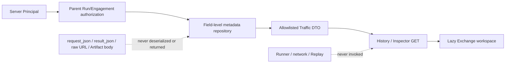

# RX-LN-04A 独立设计摘要：Target HTTP metadata-only History/Inspector

> 状态：`done`
> 日期：2026-08-02
> 实现边界：只读脱敏 metadata；无 Reveal、Replay、解密、Artifact 正文或网络 effect

## 1. Authority and state

- 权威来源是 `TargetHttpRequestRecord` 与同 Run 的 ToolCallIntent、Approval、Node 和 Artifact
  **metadata existence**；不读取 Artifact 文件，不从 RunEvent 或正文推导 Exchange。
- `exchange_id = request_id`；稳定排序键为 `(created_at, id)`，父对象始终是 URL 中的 Run 与其
  服务端解析的 Engagement。
- 04A 没有写状态机：History/Inspector 都是可重建 GET projection。不存在 reveal/replay intent，
  不消费 approval，不调用 Runner，也不重新执行 Scope admission。
- 现有 record 没有 replay、retention、安全门决定或 creator principal 时，DTO 返回 typed
  `unavailable/legacy_unmanaged/not_implemented`，不得从字符串或当前 Principal 猜测历史事实。

## 2. Read boundary

- SQL 只投影标量身份、状态和明确 JSON leaf；禁止整行加载、完整反序列化
  `request_json/result_json`，禁止选择 Artifact path/name/description/content。
- 新写入可在现有 `result_json` 中附加 server-generated `safe_metadata_v1`：origin-only URL summary、
  不含内容的 path shape/count、redirect count/origin hops、request-body presence。legacy row 没有该
  子对象时显示 partial/unavailable，不回读 raw URL 补齐。
- 裸 `request_hash` 不得离开 persistence adapter；独立 app-start key 对 hash + Run/request identity
  做 domain-separated HMAC。API 明确 digest stability 为 server instance，且 request ID 才是身份。
- Header、Cookie、Authorization/Proxy Authorization、client certificate、Body/body excerpt、proxy、
  TLS secret、raw URL userinfo/query/fragment、redirect URL、签名 path token、Artifact path 和 Secret
  不得进入 DTO、Event/SSE、错误或日志。

## 3. API, identity and authorization

- `GET /api/v1/runs/{run_id}/target-http/exchanges`
- `GET /api/v1/runs/{run_id}/target-http/exchanges/{exchange_id}`
- List query 仅允许 `method`、`status_class`、`limit`、`cursor`；禁止 actor、role、capability 或
  client-declared access class。
- 服务层使用 typed `traffic.metadata.read`，由 local Profile authorizer 映射到服务端
  `OperatorCapability.READ`；路由同时进入 `LOCAL_OPERATOR / READ_ONLY` policy inventory。
- 必须先解析 server Principal、父 Run 和 Engagement，再读取子资源；unknown、foreign、wrong Run
  使用同形 `resource_not_accessible`，避免枚举。
- HMAC cursor 绑定 principal namespace/id、Run、Engagement、filter、limit、snapshot boundary 和
  offset/key；tamper 为 stable 422，snapshot 改变为 stable 409。使用 limit+1 与确定排序，保证无
  重复/遗漏；新插入记录不得漂移进入既有 snapshot。

## 4. DTO semantics

- Identity/lineage：exchange/request/execution key、Run/session/tool/node；Runner Node `lost` 只表示
  node status，不伪造 HTTP failure。
- Safe request：method、keyed canonical digest、URL summary availability/scheme/origin/path shape/count，
  且始终 `redacted=true`。
- Safe response：status/status class、elapsed、content type/length、truncated；不返回 reason phrase、
  headers、excerpt、TLS body 或 final URL。
- Artifact/body：只返回与真实 Artifact ID 不可互换的 keyed opaque ref、recorded presence、metadata-only
  access 和 body availability；`revealable=false`。真实 ID 不进入 Traffic API/URL/storage。
- Redirect：count、是否 follow、safe origin-only hops（仅新记录）及 availability/partial；不返回
  location/final URL。
- Provenance/governance：server-derived creator kind、Approval ref/status、Scope decision unavailable、
  Safety Gate not implemented、restricted sensitivity、metadata-only access、legacy unmanaged retention、
  reveal capability disabled、projection quality/partial reasons。

## 5. Legacy and bypass closure

- legacy raw `target_http.request_started.url` 在 Event REST/SSE serialization 时脱敏；新 Event 从源头
  不再写 raw URL。不得删除或改写 durable audit record。
- Traffic DTO 不返回真实 Artifact ID。所有已明确属于 Target HTTP 的 request/response Artifact，
  包括 referenced、in-flight 与 orphan，必须从通用 Artifact list/get/content 路径 fail closed；
  普通 Artifact 行为保持不变。
- 读取 History/Inspector 不构造 `TargetHttpApplicationService` 调用链，不访问 Artifact loader/decryptor，
  不发网络，不创建 Event/Approval/Execution，也不改变 Run/ToolCall 状态。

## 6. Failure, recovery and rollback

- loading/empty/partial/forbidden/truncated/stale 与 pagination 是显式状态；字段缺失不等于空值。
- Web 401/403 零重试并 purge/mask 同 Run Traffic cache；普通 500 可保留最后已验证 metadata，必须
  显示 stale。切 Run、Back/Forward 和卸载不能回显旧授权数据。
- 无 migration、新依赖或新 effect；回滚移除 read projection/UI 即可，已有 Exchange 不变。
- 任何需要 Body、Header、Secret、解密、Replay、Safety Gate、DNS/peer-IP enforcement 或敏感存储
  的需求都属于 04B0/04B1，当前必须停止并保持 feature disabled。
