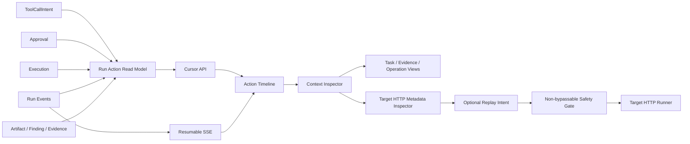

# RiftX 借鉴 LuaN1aoAgent 的 Clean-room 开发与稳定实现手册

> 文档状态：规范性实施指南（Normative Implementation Playbook）
> 版本：1.3
> 创建日期：2026-07-31
> 适用仓库：RiftX
> 竞品研究基线：`SanMuzZzZz/LuaN1aoAgent`，`main@b6fa3e4befe665f8ef6448c955ddde2b694de909`
> 许可证边界：竞品当前 `main` 为 `AGPL-3.0-only`；本计划只允许 clean-room 独立实现

## 0. Codex 必须如何使用本文档

本文档是“如何安全、稳定地吸收竞品优点”的实施契约，不是要求一次性完成所有功能的需求清单。

Codex 接到相关开发任务时，必须遵守以下顺序：

1. 完整阅读本文档、当前用户请求和适用的 `AGENTS.md`。用户可改变产品目标和范围，但普通任务
   指令不能静默豁免许可证、安全或数据保护 MUST；豁免需要单独、明确、记录在案的项目所有者、
   安全负责人或法律批准。
2. 实现必须在未继承竞品源码审查历史的 fresh task/session 中进行。上下文中已经出现上游源码、
   diff、CSS、Prompt、测试或实现细节的 Agent 只能整理中性规格或做合规审查，不能承担代码实现。
3. 在“实施台账”中确定唯一目标阶段；一次任务原则上只推进一个阶段或一个明确子阶段。
4. 检查当前工作树和相关实现，禁止覆盖、回滚或格式化用户的无关改动。
5. 先运行与目标相关的最小基线测试，再设计和修改。
6. 复用 RiftX 现有领域模型、持久化、Temporal、Runner、Scope、Approval 和 SSE；不得以借鉴竞品为由重写基础架构。
7. 每个功能交付阶段或台账定义的纵向切片必须覆盖其所需的领域/应用层、API、权限清单、
   客户端、测试和文档；纯基线/ADR 阶段和明确拆分的后端契约阶段按其 Definition of Done 执行。
8. 所有 Agent 相关测试和运行必须在 conda 的 `agent` 环境执行。
9. 只有在本阶段 Definition of Done 全部满足并提供测试证据后，才能把台账状态改为 `done`。
10. 不得自行 commit、push、创建 PR、部署、发送外部消息或执行破坏性迁移，除非用户明确要求。
11. 如果需要新的外部权限、产品决策、许可证判断、网络特权或破坏性数据迁移，停止扩展实现并向用户说明准确阻塞点。

本文档使用以下规范词：

- **MUST / 必须**：缺失即不得宣称阶段完成。
- **MUST NOT / 禁止**：违反即属于安全、合规或架构缺陷。
- **SHOULD / 应当**：除非有记录充分的 RiftX 特有理由，否则必须遵循。
- **MAY / 可以**：非完成条件。

## 1. 目标、范围与非目标

### 1.1 总目标

在不复制 LuaN1aoAgent 代码、CSS、素材、提示词或内部命名的前提下，把以下经过验证且适合 RiftX 的产品思想独立实现：

1. `公开行动意图 → ToolCallIntent → Approval → Execution → Result → Artifact/Evidence` 的统一 Action 体验。
2. Trace、Approval、Execution、Evidence、Finding、Artifact、Task 和 Graph 联动的 Inspector。
3. 基于 RiftX 现有 Target HTTP 的 Exchange History 与安全 Replay。
4. Task、Evidence/Reasoning、Operation 三种语义视图，而不是三套互相竞争的事实来源。
5. 可选的异步 Event-to-Candidate Projector，但所有模型推断仍经过 RiftX Fact Promotion。
6. Task/子 Agent 的 Context、Workspace、Session lineage 和 tool allowlist 隔离。
7. TUI 的任务过滤、按需展开、状态可见性和安全停止体验。

### 1.2 明确非目标

除非用户另行批准，以下内容不属于本计划：

- 把 RiftX 重写为 Planner–Executor–Supervisor–Projector 四角色 Runtime。
- 复制竞品的 TypeScript Controller、Web Server、Graph Store、Gateway 或组件。
- 用提示词替代 Scope、Approval、ACL、Secret Vault 或网络出口策略。
- 将透明 MITM、SSH/Chisel Route 或全 TCP 捕获作为前置条件。
- 为追求视觉相似度复制竞品布局尺寸、颜色、文案、图标组合或截图素材。
- 改变现有 Temporal replay、Runner cancel、紧急停止或 durable approval 语义。
- 建设完整企业多租户体系；但新 API 必须保留对象授权扩展点并至少遵守当前 RiftX 的服务端授权边界。

### 1.3 借鉴决策矩阵

| 竞品层面的可见优点 | RiftX 决策 | 独立实现方式 | 稳定性边界 |
|---|---|---|---|
| 工具调用把意图、审批、执行、结果放在同一处 | 核心采纳 | 以 ToolCallIntent 为左侧权威对象建立 Action read model | 不创建第二套可写状态；保留 orphan 与多 attempt |
| 时间线卡片与右侧详情联动 | 核心采纳 | Action Timeline + URL-addressable Inspector，复用 SSE 和现有设计系统 | 重连后用分页快照校准；长列表不静默截断 |
| Task/Evidence/Operation 多视图 | 调整后采纳 | 从 RunPlan、Finding、Fact、Artifact、Execution 做确定性投影 | 图不是事实源；节点必须有 provenance 和列表 fallback |
| HTTP 请求历史与重放 | 分级采纳 | 04A 做脱敏元数据；04B0 建安全基础；04B1 才实现 Reveal/Replay | 04B0/1 默认关闭，必须经过 Scope、Safety Gate、ACL、敏感存储和 Runner |
| 模型异步整理关系 | 条件采纳 | Event-to-Candidate Projector | 无 effect 工具，只写 Candidate；故障不阻塞主 Run |
| 子 Agent/任务隔离 | 分层采纳 | 先建 PlanItem/Delegation 的可信 lineage，再选择容器 profile | 不混用 ID；容器不可用时 fail closed，不降级宿主 |
| Operator TUI | 可选采纳 | 与 Web 共用 Action API/SSE | 默认 Ctrl+C 只 detach；取消仍走 durable API/ACK |
| 透明 Gateway、Route、全流量捕获 | 默认不采纳 | 只保留独立决策门和威胁模型 | RX-LN-09 保持 blocked，不能作为其他阶段前置条件 |
| 角色/工具最小权限 | 核心原则采纳 | 复用 Agent tool policy、API policy、Scope、Approval 和 MCP governance | 未分类工具/路由 fail closed；Prompt 不能代替权限控制 |
| 本地快速部署 | 调整后采纳 | 明确 local 与 remote 两个 Trust Profile | local 强制 loopback；remote 缺 TLS/AuthN/ACL 等条件时拒绝启动高风险能力 |

## 2. Clean-room 与许可证合规协议

### 2.1 允许借鉴

允许把公开观察到的产品行为转写为与实现无关的需求，例如：

- 一张卡聚合行动理由、工具、审批、执行和证据。
- 图节点可以跳转到来源 Event 和 Artifact。
- Replay 创建新 Exchange，并保留不可变来源引用。
- 每个角色或子 Agent 只有完成职责所需的工具集合。
- 大结果只在主视图显示有界预览，完整内容进入 Artifact。

### 2.2 禁止行为

实现 Codex MUST NOT：

- 在实现任务中访问、克隆、打开、搜索或读取竞品仓库、Fork、镜像、构建产物、Source Map、
  npm 缓存或本地克隆；此规则不以“是否同时编码”为条件。
- 复制或轻度改写竞品源码、测试、Schema、SQL、提示词、CSS、文案、素材或独特内部命名。
- 把竞品文件作为构建依赖、测试 fixture、golden snapshot 或运行时资源。
- 依据竞品私有实现细节设计兼容协议，除非存在独立公开标准且得到用户批准。
- 在 RiftX 产品源码中加入竞品版权头，或形成无法说明独立来源的大段相似实现。

许可证事实只用于确定边界：`v2.0.0` 标签中的代码声明为 Apache-2.0，之后
`c652dee` 提交将主分支切换为 AGPL-3.0-only。不得据此推定任意文件或后续功能仍适用
Apache-2.0；clean-room 是默认且唯一由本文档授权的路径。

### 2.3 上下文隔离与独立实现记录

实施上下文在写代码前必须明确声明 `competitor_material_seen=no`。若为
`yes/unknown`，当前上下文只能整理本文档这类中性需求或做合规审查，必须把实现
交给不继承研究历史的 fresh task/session。实施作者和独立审查者均不得用本地或远程
相似性工具反向查找竞品实现。

每个阶段的交付说明必须包含下表，证明实现来自 RiftX 需求和现有基础：

| 字段 | 必填内容 |
|---|---|
| Inspired behavior | 只描述用户可见行为或抽象工程原则 |
| RiftX requirement | 用 RiftX 术语重新表述的需求 |
| Existing foundation | 列出复用的 RiftX 模型、服务和 API |
| Independent design | 描述本次独立数据流、状态机和安全边界 |
| Upstream material copied | 必须为 `None`；否则立即停止并上报 |
| Verification | 测试命令、用例和结果 |
| Competitor material seen by implementer | 必须为 `No`；否则不得实现 |
| Independent review | 未继承竞品源码上下文的审查者对声明和 diff 的复核 |

### 2.4 命名规则

生产代码和 UI 使用 RiftX 领域词汇：

- 使用 `Run Action`、`Tool Call Intent`、`Execution Inspector`、`Evidence View`、`Target HTTP Exchange`。
- 禁止使用 `LuaN1ao`、`Luanniao` 或竞品内部类名作为生产标识符。
- “Reasoning”只表示有证据来源的语义关系，禁止把隐藏 chain-of-thought 持久化或展示给用户。

## 3. 必须保留并优先复用的 RiftX 基础

| 能力 | 当前主要落点 | 本计划中的用途 |
|---|---|---|
| Durable ToolCallIntent | `src/riftx/runtime/types/models.py`、`src/riftx/persistence/runtime_repositories.py` | Action 主身份与行动理由 |
| Durable Approval | `src/riftx/domain/approval.py`、`src/riftx/application/services/approvals.py`、`src/riftx/runtime/types/models.py` | HITL、决定者和恢复；`Approval.tool_call_id` 指向 legacy `ToolCall`，必须经 `RuntimeApprovalRequest.tool_call_intent_id` 连到 Intent |
| Execution | `src/riftx/application/services/executions.py`、`src/riftx/execution/service.py`、`src/riftx/execution/deferred.py`、`src/riftx/runner/supervisor.py`、`src/riftx/persistence/repositories.py` | 查询 API、durable 提交/状态同步、Runner 恢复与取消；同一 Intent 可有多个 attempt group |
| ScopeGuard | `src/riftx/scope/guard.py` | 显式目标检查；不得声称它等于沙箱 |
| Target HTTP | `src/riftx/target_http/`、`src/riftx/runner/target_http.py` | Exchange、Runner 网络和 Replay 基础 |
| Artifact | `src/riftx/application/services/artifacts.py` | 不可变大输出与 provenance；现有 Target HTTP Artifact 没有独立 sensitivity ACL，不能直接当成已安全的流量正文存储 |
| Finding/Fact | `src/riftx/application/services/findings.py`、`src/riftx/facts/` | Evidence Graph 和候选晋升 |
| API policy inventory | `src/riftx/api/policy.py` | 新路由 fail-closed 分类；这是路由清单，不等于 principal/对象 ACL |
| Agent tool policy | `src/riftx/agent/tool_policy.py` | 新模型可见工具 fail-closed 分类 |
| SSE | `src/riftx/api/routes/events.py`、`apps/web/src/hooks/useEventStream.ts` | 实时增量和断线恢复 |
| Stream projection | `apps/web/src/pages/runStreamReducer.ts` | 可读 Conversation/Timeline 投影 |
| Context Compiler | `src/riftx/context/compiler.py` | 子任务有界上下文 |
| Task-like identity | `src/riftx/context/working_memory.py`、`src/riftx/subagents/models.py` | `PlanItem.id` 和 `DelegationPacket.task_id` 是两种不同语义；RX-LN-05A 前不得混用 |
| MCP governance | `src/riftx/mcp/governance.py` | 外部工具并发与熔断 |
| Temporal/Runner | `src/riftx/temporal/`、`src/riftx/runner/` | durable workflow、远程执行和停止证明 |

若现有基础与本文档描述不一致，Codex 必须先以当前代码和测试查明事实，不得凭本文档猜测。

## 4. 跨阶段不可破坏的系统不变量

本节对所有 RX-LN 新代码和被本计划修改的边界强制生效。历史数据已可能在
ToolCallIntent arguments、Approval 快照或 Target HTTP Artifact 中包含原始敏感值；
`RX-LN-00/01` 必须记录这项 legacy debt，并在新读模型出口二次脱敏，但不得为了
完成基础阶段而暗中扩张为全库 SecretRef 迁移。某阶段要新写入或重放敏感数据时，
必须在启用前完成本文要求的存储、引用、授权与泄漏门禁。

### 4.1 数据与身份

1. Agent 发起的 Tool Action 的权威主键 MUST 是持久化 `ToolCallIntent.id`。人工发起的
   高风险 Effect 必须使用独立、带类型命名空间的 durable intent ID；不得为了复用 Action
   主键而伪造 Agent session/cycle/step。
2. Provider/SDK 的 `engine_call_id` 只用于相关性，不得作为全局唯一主键。
3. 兼容旧事件时的相关键至少包含 `run_id + session_id + cycle_id + engine_call_id`。若只有 legacy `sdk_call_id/tool_call_id`，必须保留字段命名空间并输出 `correlation_quality`，不得把 legacy `ToolCall.id`、`ToolCallIntent.id`、`Execution.tool_call_id` 和 provider call ID 当成同一个值。
4. 数据库、Artifact 和 append-only Run Event 是权威来源；React state、Graph layout 和缓存不是。
5. 所有列表 API 必须具备稳定排序、游标或明确分页，不得静默只取“最近 N 条”。
6. 重试、SSE 重连、Temporal replay 和 Worker 重启不得产生重复 Action、Execution、Replay 或 Graph Candidate。
7. `Approval.tool_call_id` 与 `ToolCallIntent.id` 不能直接 join；当前正确桥接是与公开 Approval 共用 ID 的 `RuntimeApprovalRequest.id`，再通过其 `tool_call_intent_id` 关联 Intent。
8. 一个 ToolCallIntent 可以关联多个 Execution attempt；读模型必须保留 `executions[]`，“当前/最新”只能是可解释的派生值。

### 4.2 公开意图与隐私

1. UI 只展示 `ToolCallIntent.reason`、`target_summary`、结构化状态和明确标记的派生摘要。
2. 禁止请求、持久化或展示模型隐藏 chain-of-thought。
3. 派生摘要必须标记为 derived，不能伪装成模型原始公开输出。
4. 参数、环境、Header、Cookie、Token、凭据和输出必须在持久化与展示两个边界分别审查。
5. 主列表只展示有界 preview；完整内容通过受授权的 Artifact API 按需读取。

### 4.3 Scope 与高风险 Safety Gate

当前代码有两项必须显式处理的语义：

- `requires_approval()` 在 `ApprovalMode.AUTO` 下会跳过包括 `ALWAYS` 在内的审批。
- `ScopeGuard` 在 Scope 没有正向 IP、CIDR、domain 或 URL prefix 时默认允许目标。

因此：

1. Replay、Route、Gateway、Credential 使用和透明捕获等新高风险能力 MUST 使用独立于普通 ApprovalMode 的不可绕过 Safety Gate。
2. Safety Gate 不得被 `AUTO`、Run grant、模型决定或客户端字段绕过。
3. 目标型高风险操作必须要求显式正向 Scope；空正向 Scope 必须 fail closed。
4. 每次初始请求、重定向、Replay override 和 Route 目标都必须在真正网络 I/O 前重新检查。
5. Scope 检查与用户授权必须在服务端和 Runner 信任边界执行；前端隐藏按钮不是授权。
6. 无法证明目标或执行环境满足边界时，状态必须是 rejected/blocked，不得自动回退到更宽权限路径。

### 4.4 状态、恢复与停止

1. 所有效果必须先有 durable intent，再进入 approval/ready/executing。
2. 幂等键冲突必须报错，不得把不同请求误认为重试。
3. Worker/Runner 重启后必须通过 durable ID 恢复，不得按工具名或时间窗口猜测。
4. Run 停止必须先建立 effect admission fence，再逐资源停止并收集 ACK。
5. Runner 离线、LOST 或停止未确认时，UI 必须显示“未确认停止”，不能显示成功。
6. 新 UI 不得削弱现有紧急停止、Target HTTP redirect scope 或 Execution cancel 测试。

### 4.5 投影与图

1. Graph 是可重建 read projection，不得成为与 Finding、Fact、Artifact 竞争的第四套事实来源。
2. Evidence 节点必须有可解析的 Event、Execution、Artifact 或用户决定来源。
3. 模型产生的关系只能进入 Candidate；模型推断不得绕过 `FactPromotionService`。
4. Projector watermark 与 candidate commit 必须原子提交；失败时两者同时回滚。
5. 属性更新不得导致整个图无条件销毁和重新布局。

### 4.6 隔离与供应链

1. 用户要求容器隔离时，容器不可用必须 fail closed。
2. 禁止 `auto` 静默降级为宿主 Shell。
3. 容器必须 non-root、drop capabilities、no-new-privileges、只读 rootfs、资源限额和最小环境变量。
4. Workspace 和 Secret 文件不得使用 `0777` 或普通用户全局可读权限。
5. 新依赖、镜像、Skill、MCP Server 必须固定版本/摘要并通过现有治理；禁止安装远端默认分支的全部 Skill。

## 5. 目标产品架构



设计原则：

- Action Read Model 是读取投影，不替代 ToolCallIntent、Approval 或 Execution。
- SSE 通知变化，分页 API 提供权威快照；客户端可增量更新，但重连后必须能重新校准。
- Inspector 只通过稳定 ID 读取对象，不通过本地文件路径。
- Graph 和 Exchange 从现有领域对象投影，不导入竞品数据库结构。

## 6. 实施台账与依赖顺序

状态只能使用：`not_started`、`in_progress`、`blocked`、`done`；任何时候最多只能有一个阶段/子阶段为 `in_progress`。

| ID | 阶段 | 依赖 | 当前状态 | 完成证据 |
|---|---|---|---|---|
| RX-LN-00 | 基线、ADR 与安全契约 | 无 | done | [基线、ADR 与安全契约](RIFTX_LuaN1aoAgent_RX-LN-00_baseline_adr.md)；327 Python/94 Web、typecheck/build、独立复核 PASS |
| RX-LN-AUTH | 部署 Trust Profile、Principal 与对象授权 | 00 | not_started | loopback/remote 启动门禁、ACL/actor 测试 |
| RX-LN-01 | Run Action Read Model/API | 00、AUTH | not_started | 后端单元/集成/API policy 测试 |
| RX-LN-02 | Action Timeline 与 Inspector | 01、AUTH | not_started | Web 测试、SSE 恢复、可访问性 |
| RX-LN-03 | Task/Evidence/Operation 语义视图 | 01–02、AUTH | not_started | Graph API/UI、provenance 测试 |
| RX-LN-04A | Target HTTP Exchange 元数据 History/Inspector | 01–02、AUTH | not_started | 元数据分页、父 Run 授权、脱敏测试 |
| RX-LN-04B0 | Safety Gate、敏感存储与网络强制基础 | 04A、AUTH、用户明确选择 | not_started | Gate CAS、SensitiveAccessIntent、加密、DNS/peer-IP 测试 |
| RX-LN-04B1 | 受控 Reveal 与安全 Replay | 04B0 | not_started | Reveal/Replay intent、Scope、幂等、审计、停止测试 |
| RX-LN-05A | Durable Task lineage | 01–02、用户明确选择 | not_started | 语义 ADR、兼容迁移、lineage/恢复测试 |
| RX-LN-05B | Task read graph | 03、05A | not_started | 只读投影、provenance、旧数据测试 |
| RX-LN-05C | 可选 dependency DAG | 05B、用户明确选择 | not_started | 版本、循环检测、调度/replay 测试 |
| RX-LN-06 | Event-to-Candidate Projector | 03、用户明确选择 | not_started | watermark 原子性、Fact Promotion 测试 |
| RX-LN-07 | Task-scoped 隔离 Profile | 05A、AUTH、用户明确选择 | not_started | fail-closed、资源/网络/清理测试 |
| RX-LN-08 | Operator TUI | 01–02、AUTH、用户明确选择 | not_started | 同源 Action 投影、停止语义测试 |
| RX-LN-09 | 透明 Gateway/Route 决策门 | 04B1、用户明确批准 | blocked | 产品/威胁模型/原型数据 |

默认核心交付范围是 RX-LN-00、RX-LN-AUTH（默认只落实 `local_single_operator`）、
RX-LN-01 至 03 和 RX-LN-04A。RX-LN-04B0/04B1 因为会建立敏感访问能力并重放网络
effect，必须由用户明确选择，且 B0 完成后才能进入 B1。RX-LN-05A 至 08 同样是可选阶段；
RX-LN-09 默认禁止进入生产实现。

## 7. 所有阶段统一执行协议

### 7.1 开始阶段

Codex 必须：

1. 输出目标阶段、依赖状态、计划修改范围和明确不修改范围。
2. 运行 `git status --short`，识别用户已有改动。
3. 使用 `rg` 定位当前模型、服务、路由、Schema、前端 query 和测试。
4. 阅读相关文件的完整逻辑，不只看搜索命中行。
5. 运行目标相关基线测试；如基线失败，先判断是否为既有失败。
6. 写出不超过一页的独立设计摘要：状态机、权威来源、授权点、幂等键、失败语义。

### 7.2 实施阶段

1. 优先修改现有抽象；只有缺少明确领域概念时才新增模块。
2. 先写/更新失败测试，再实现最小通过代码。
3. 后端、API、policy inventory、前端类型和 UI 必须保持同步。
4. 数据库变更必须使用 Alembic，兼容旧记录和 replay。
5. 每个错误必须有稳定机器码和用户可理解描述。
6. 前端必须处理 loading、empty、partial、error、unauthorized、truncated 和 stale 状态。
7. 新文案同步中英文；交互元素必须具备键盘和 aria 语义。
8. 不引入依赖，除非标准库/现有依赖无法合理完成；新增依赖要说明许可证、版本锁定和 bundle 影响。

### 7.3 完成阶段

1. 运行目标测试、邻接回归测试、lint/format 和构建。
2. 涉及迁移时运行 `alembic heads` 并验证旧数据升级。
3. 涉及 Agent/Runtime 时运行相应恢复、取消和 Temporal replay 测试。
4. 检查 `git diff --check` 和最终 diff，确认没有无关改动或敏感数据。
5. 在交付说明中列出：实现结果、关键决定、测试结果、未完成风险和下一阶段。
6. 只有所有 MUST 条件满足时更新实施台账。

## 8. RX-LN-00：基线、ADR 与安全契约

### 8.1 目标

在写功能代码前冻结 RiftX 当前事实，防止后续 Codex 根据过期报告或竞品架构做错误假设。

### 8.2 必做步骤

1. 确认当前 `ToolCallIntent`、Approval、Execution、Event、Artifact、Finding、Fact 和 Target HTTP 的持久字段及关联。
2. 确认 Run Detail 当前 Conversation、Tool Calls、Timeline、Approvals 和 Raw Events 的数据来源。
3. 确认 API 路由授权、Agent Tool policy、Scope 默认语义和 ApprovalMode 语义。
4. 确认 Target HTTP 初始请求、redirect、远程 Runner、Artifact 和幂等行为。
5. 记录当前相关测试数量、运行时间和已知失败。
6. 为 RX-LN-01 至 03、RX-LN-04A、RX-LN-04B0 和 RX-LN-04B1 各写一段独立设计决定，至少回答：
   - 权威来源是什么？
   - 稳定主键是什么？
   - 授权和 Scope 在哪里执行？
   - 重试和恢复如何去重？
   - 敏感数据在哪里脱敏？
   - UI 如何识别 partial/truncated/stale？

### 8.3 Definition of Done

- 没有功能代码变更。
- 基线测试结果可复现。
- 设计记录不包含任何竞品源码或实现片段。
- 明确记录 `AUTO` 审批绕过和空正向 Scope 默认允许的影响。
- 明确 RX-LN-04A 只返回脱敏元数据；RX-LN-04B0 只建设并验证安全基础且保持功能关闭；
  RX-LN-04B1 必须依赖 B0，不得在 B1 内补做自己的前置条件。

### 8.4 建议测试

```bash
conda run --no-capture-output -n agent python -m pytest -q \
  tests/runtime tests/execution tests/target_http \
  tests/integration/api/test_control_plane.py
conda run --no-capture-output -n agent python -m ruff check \
  src/riftx tests
conda run --no-capture-output -n agent pnpm --filter @riftx/web test
```

## 8A. RX-LN-AUTH：部署 Trust Profile、Principal 与对象授权

### 8A.1 目标

在 Graph、敏感 Artifact、Traffic Body 或 Replay 上线前，明确当前部署属于哪一个信任模型。
`RouteAuthorization.LOCAL_OPERATOR` 只是路由分类，不等于用户身份或对象 ACL。

### 8A.2 Profile A：`local_single_operator`

适用于当前单机开发和个人工作站：

- Web/API 强制绑定 loopback；非 loopback 配置在启动时 fail closed。
- 服务端生成固定且不可由客户端覆盖的 local principal。
- 使用本地 operator/admin token；客户端 `user_id`、`role`、`created_by`、`decided_by`
  只作为非法输入忽略或拒绝。
- Traffic Body、Replay、Route、Gateway 默认 feature flag 关闭。
- 开启高风险功能仍需要 non-bypassable Safety Gate、显式正向 Scope 和 actor audit。
- feature flag 由后端配置和策略强制，不能只隐藏 UI。

此 Profile 不是多用户 ACL，不得在文档或 UI 中描述为 tenant-safe。

### 8A.3 Profile B：`remote_multiuser`

任何公网或局域网远程绑定必须先完成：

- TLS 和启动时证书/终止边界校验；
- 真实 AuthN 和服务端 Principal；
- Secure、HttpOnly、SameSite Session 与 CSRF；
- 精确 CORS、登录限流和 Session 撤销；
- trusted proxy allowlist 和外部身份 Header 清洗；
- tenant/engagement/Run ownership 与 resource capability；
- Artifact、Traffic、Graph、SSE、WebSocket、导出和搜索的对象 ACL；
- 敏感数据静态加密、独立密钥管理、保留/删除/导出策略。

任一项缺失时，任何非 loopback 服务必须拒绝启动；不能以“只关闭高风险 feature”或 warning
保留一个缺少 TLS/AuthN/ACL 的远程低风险服务。

### 8A.4 Actor 规则

1. 必须区分 `requester_principal_id`（请求 Effect 的主体）与 `decided_by`（批准或拒绝的主体）；
   两者可能相同，但不得复用一个含义模糊的客户端 `actor` 字段。
2. `created_by`、`requester_principal_id`、`decided_by`、Replay actor 和访问审计 actor 只能来自服务端 Principal。
3. 客户端请求体、query、Cookie 自定义字段或前端 store 不得决定 actor。
4. 反向代理身份只接受 trusted proxy 注入且在边界清洗。
5. Effect Digest 绑定 requester；批准记录另行绑定 `decided_by`、decision、digest 和 policy version。
6. 旧 API 若仍接受 `decided_by`，本阶段必须将其改为服务端派生，或明确把客户端值降级为
   非权威 comment 并使用独立 actor 字段。

### 8A.5 两个 Profile 的共享测试

- 伪造 `decided_by`、`created_by`、requester、role、user ID 和非可信代理身份 Header 无效。
- 子资源父 Run 不匹配时拒绝；无权限和不存在对象的外部响应不泄漏可枚举差异。
- 后端 feature flag 关闭时直接 API 调用也被拒绝。
- 配置没有显式选择 Profile、同时选择两个 Profile 或含未知 Profile 时启动失败。

### 8A.6 Profile A 必测场景

- 非 loopback 监听、非本地 trusted proxy 或 remote identity 配置启动失败。
- local principal 由服务端生成且重启后稳定，客户端不能覆盖。
- 本地 token 缺失、错误、撤销或权限不足时拒绝。
- remote endpoints/capabilities 不可用；未实现 Profile B 不需要伪造 tenant fixture 才能完成 A。

### 8A.7 Profile B 必测场景

只有选择 Profile B 时，本组是完成门禁；未选择时只验证 Profile B 无法启用：

- 缺 TLS、AuthN、Session/CSRF、登录限流、trusted proxy 或 ACL 任一配置时启动失败。
- 跨 tenant/engagement/Run 的 Action、Artifact、Graph、Traffic、SSE、WebSocket、搜索和导出拒绝。
- 权限撤销后敏感缓存、实时流和后续下载停止。
- 非可信入口注入的身份 Header 被剥离，trusted proxy 链解析不接受越界 hop。

### 8A.8 Definition of Done

- 台账明确本次只选择 Profile A 或 Profile B；未选的 Profile 不是当前阶段实现范围。
- 当前部署 Profile 是显式、持久和可观察的。
- 所有审计 actor 来自服务端 Principal。
- local profile 不被误称为对象 ACL。
- remote profile 未选/未完整实现时不可用；被选择时，任一安全前置缺失都会拒绝非 loopback 服务启动。

## 9. RX-LN-01：Run Action Read Model 与 API

### 9.1 目标

把分散的 ToolCallIntent、Approval、Execution、Artifact、Finding 和 Event 组合为稳定的服务端读取投影，使 Web、TUI 和未来客户端共享同一语义。
进入本阶段前 RX-LN-AUTH 必须完成；所有列表和详情查询从已选择的 Trust Profile 获得 Principal 与对象授权语义。

### 9.2 建议读取模型

`RunActionView` 至少包含：

| 分组 | 字段 |
|---|---|
| identity | `action_id=tool_call_intent.id`、run/session/cycle/step ID、engine_call_id |
| intent | tool_id、skill_id、公开 reason、target_summary、approval_level、脱敏 arguments summary |
| approval | approval_id、status、服务端 actor、decided_at、反馈摘要 |
| executions | `executions[]`：execution_id、attempt_group、node_id、status、started/finished_at、exit/error summary；另有明确派生的 current/latest attempt |
| result | 列表只有 truncated、artifact IDs/count、output size/availability；详情可含 bounded preview/cursor |
| evidence | evidence refs、finding IDs、artifact IDs |
| lifecycle | proposed/awaiting_approval/ready/executing/succeeded/failed/cancelled/partial |
| metadata | created_at、updated_at、stable sequence/version |

这必须是应用层 read model；禁止新建一个由 UI 写入的“Action 真相表”。
列表端点必须是 metadata-only，不得为每一行调用本地/远程 Runner 输出 I/O。展开详情时再通过
`/executions/{id}/output` 读取有界输出，或直接使用已注册的 immutable stdout/stderr Artifact。

### 9.3 实施步骤

1. 在 application service 层新增组合查询，使用 repository 接口，不在 API route 中拼接 SQL。
2. 以 ToolCallIntent 为左表语义：即使 Approval 或 Execution 缺失，也必须显示 orphan/partial Action。
3. Approval 关联必须先按 `RuntimeApprovalRequest.tool_call_intent_id` 查到 Runtime request，再以其
   `id` 取公开 Approval；禁止使用 `Approval.tool_call_id == ToolCallIntent.id`。
4. 批量读取同一 Intent 的所有 Execution attempt，保留 attempt_group；current/latest 的选择规则
   必须确定（例如按 durable started/created sequence 加 ID tie-breaker）并在 Schema 中说明。
5. 定义明确的状态合并优先级；最终 durable cancelled/failed/succeeded 优先于较早的 Event。
6. 对旧数据缺失关联时使用 composite correlation，并在输出中标记 `correlation_quality=exact|legacy|partial`。
7. 默认响应不得包含 Secret、完整环境、Cookie、Authorization、原始大输出或主机绝对路径。
8. Read Model 必须对历史 Approval、Event、Execution、arguments 和 env diff 再做服务端脱敏，
   不能因为数据已在库中就直接透传；Raw Event 只能走独立受权审计接口。
9. 提供稳定 cursor pagination；排序至少使用 durable sequence/created_at 加 ID tie-breaker。
10. API 返回 total/has_more 或 opaque cursor，不得静默截断。
11. 列表关联使用批量查询/预加载，测试对查询数量设上限；不得出现每个 Action 单独查 Approval、Execution、Artifact 或 Runner 输出的 N+1。
12. 为单个 Action 提供 Run-scoped 详情端点；即使 Action ID 全局唯一也必须验证父 Run，敏感 Artifact 继续走独立授权端点。
13. 将新 API 加入 `src/riftx/api/policy.py`；任何漏分类必须使应用启动或 inventory test 失败。
14. 只有确有必要时增加 `run.action_changed` 事件；优先复用现有 durable 事件由前端定向刷新。

### 9.4 建议代码落点

- `src/riftx/application/services/observability.py` 或独立 `actions.py` read service。
- `src/riftx/api/schemas/actions.py`。
- `src/riftx/api/routes/actions.py`。
- repository protocol 和组合查询实现。
- `src/riftx/api/policy.py`。
- 对应 unit、persistence 和 API integration tests。

实际命名必须先检查当前目录职责，避免创建与已有 Observability Service 重复的抽象。

### 9.5 必测场景

- 免审批成功。
- 等待审批、批准、拒绝和取消。
- Intent 已持久化但没有 Execution。
- 一个 Intent 有多个 attempt_group，列表保留全部并稳定派生 current/latest。
- Approval 通过 RuntimeApprovalRequest 桥接，legacy ToolCall ID 不与 Intent ID 误 join。
- Execution 失败或 Runner LOST。
- 相同 engine call ID 出现在不同 cycle。
- SSE/Temporal replay 重复事件。
- 多个同轮 ToolCallIntent 顺序稳定且不串线。
- 大输出只返回 preview/Artifact ref。
- 参数和错误中包含 Secret 时正确脱敏。
- 包含历史明文 env diff/arguments/Event 的 fixture 仍被读取边界脱敏。
- cursor 翻页无重复、无遗漏。
- 无权限访问其他 Run 时服务端拒绝。

### 9.6 Definition of Done

- Action API 完整、分页、脱敏、fail-closed 授权。
- 列表 metadata-only、无 Runner 输出 I/O 与无 N+1；详情输出按需有界读取。
- 不新增第二套可写 Action 状态。
- 所有状态都能解释其来源。
- 重启/replay 后 Action 数量和身份不变。
- API policy inventory 和 OpenAPI 类型同步。

## 10. RX-LN-02：Action Timeline 与 Context Inspector

### 10.1 目标

在现有 Run Detail 上形成“可读对话 + 可审计 Action + 可定位证据”的工作台，不复制竞品视觉。
进入本阶段前 RX-LN-01 与 RX-LN-AUTH 必须完成，UI 展示的 actor 和 capability 必须来自服务端。

### 10.2 信息架构

推荐保留现有 Conversation，同时将分散的 Tool Calls、Timeline 和 Approval 关系重构为：

- **Conversation**：用户消息和最终/流式助手回复。
- **Actions**：按 RunActionView 展示行动卡。
- **Timeline**：Run、Workflow、状态、停止、错误等非工具高层事件。
- **Raw Events**：审计/调试，分页或窗口化。
- **Context Inspector**：当前 Action、Finding、Artifact、Graph Node 或 Exchange 的详情。

### 10.3 Action 卡最小内容

折叠态：

- Agent/step、公开行动理由、tool 名称和目标摘要。
- approval/execution 状态。
- 开始时间、耗时、Runner node。
- Evidence、Finding、Artifact 数量。
- 错误或 truncated 标记。

展开态：

- 脱敏参数和命令预览。
- Approval 决策、反馈和决定者。
- Execution 生命周期、退出状态和 bounded output。
- Artifact/Evidence/Finding 链接。
- 明确标记的 derived summary 和原始审计对象入口。

### 10.4 实施步骤

1. 新增 typed query 和 Action DTO，不从原始 Event 在组件中重新猜完整状态。
2. 复用 `useEventStream`；按 Action ID 定向更新或失效 Action query。
3. SSE 重连后以服务端 cursor snapshot 重新校准，不能只相信客户端累计状态。
4. 使用虚拟列表或分页支持长 Run；不得只保留最近固定条数且不告知用户。
5. Inspector 状态写入 URL query/path，使刷新和分享仍能定位对象。
6. 切换 Run 时立即清空或隔离旧 selection/data，禁止显示上一个 Run 的详情。
7. 401/403 使用统一认证/授权错误处理；Session 过期返回登录或明确提示。
8. Action Card 和 Inspector 支持键盘选择、展开、关闭和焦点恢复。
9. 中英文文案同步，状态色之外必须有文字/图标语义。
10. 移动/窄屏可使用 Drawer，但桌面布局不得强制固定三栏。

### 10.5 必测场景

- 初始加载、空 Run、长 Run 和分页。
- SSE 新 Action、状态更新、重复序列、断线重连。
- 同 cycle 多 ToolCall 不串卡。
- 切换 Run 不显示陈旧数据。
- Approval 决定后原卡原地更新。
- Artifact truncated/forbidden/not-found。
- 401、403、404、500。
- 键盘展开、Inspector focus 和 aria label。
- 中文和英文主要路径。

### 10.6 Definition of Done

- “为何行动、做了什么、是否批准、结果如何、证据在哪”可在一张卡和 Inspector 中完成。
- UI 不显示 hidden chain-of-thought。
- 断线重连无重复 Action。
- 无磁盘 Runtime 路径作为主要导航。
- Web test 和 production build 通过。

## 11. RX-LN-03：Task、Evidence 与 Operation 语义视图

### 11.1 目标

利用现有 RunPlan、Finding、FactRelation、AttackGraph、Execution 和 Artifact 提供三种可追溯 read view，不直接复制竞品三图数据库。

### 11.2 三种视图

1. **Task View**
   - 第一版只投影现有 RunPlan sequence、状态和来源。
   - 展示 Plan item、Finding、blocker 和完成证据；只有现有数据已经带可信 `plan_item_id`
     时才关联 Action，否则把 Action 放入明确的 `unassigned` 区域。
   - 不在第一版改变 Temporal 调度。
2. **Evidence View**
   - 展示 Evidence、Finding/Hypothesis、已确认 Fact/Vulnerability、Artifact。
   - 任何 confirmed 节点必须能回到确定性证据或用户决定。
3. **Operation View**
   - 展示 Host、Service、Endpoint、Credential reference、Session、Execution 等对象及关系。
   - 禁止在图属性中放 Secret、Cookie、Token 或凭据正文。

### 11.3 实施步骤

1. 先定义服务端 `GraphView DTO`，节点和边使用稳定 RiftX ID。
2. 从现有领域表投影，禁止第一版新增通用 graph node 真相表。
3. API 按 Run/Engagement 授权，支持 view、node/edge type、focus ID 和 cursor/limit。
4. 返回 `truncated/has_more`，禁止无提示的固定 1200/2400 上限。
5. 节点详情包含 provenance refs，但内容仍通过对应受权 API 读取。
6. 前端 Graph chunk lazy-load，布局计算不阻塞 Action 首屏。
7. 属性变化使用增量更新；只有拓扑或用户请求变化时重新布局。
8. 提供列表替代视图，保证键盘、读屏和超大图可用。
9. Trace/Action 与 Graph Node 双向跳转；找不到节点时显示 partial，而不是静默失败。
10. 图例、过滤和搜索基于服务器返回的类型元数据，避免散落硬编码。

### 11.4 必测场景

- Evidence 无 provenance 时拒绝确认状态。
- 模型推断未经用户/规则确认不能成为 Engagement Fact。
- 跨 Engagement 关系拒绝。
- Graph cursor 无重复和孤儿边。
- Action→Node→Evidence→Artifact 链可往返。
- 缺少可信 Task lineage 时 Action 进入 unassigned，不按时间/current focus 猜测 PlanItem。
- 大图不阻塞 Action 页面；列表替代视图完整。
- 属性更新保留布局和 selection。
- 敏感字段不进入节点/边属性。

### 11.5 Definition of Done

- 三种视图共享现有权威领域数据。
- 每个安全结论可追溯到证据。
- 图不是新的无治理模型记忆。
- UI 明确显示 projection source、partial 和 truncation。

## 12. RX-LN-04A/04B0/04B1：Target HTTP Exchange 与安全 Replay

本能力必须分两次交付。元数据可观测性与敏感正文/主动重放不能共用一个“阶段完成”声明。

### 12.1 交付边界

- **RX-LN-04A（默认核心）**：只读、脱敏、metadata-only 的 Exchange History/Inspector。
  禁止解密或返回 Header、Cookie、Authorization、Client Certificate 和 Body；禁止发送 Replay。
- **RX-LN-04B0（显式选择的安全基础）**：实现 durable Safety Gate、typed SensitiveAccessIntent、
  敏感存储与 Runner 网络强制；不开放 Reveal/Replay 用户入口。
- **RX-LN-04B1（高风险功能）**：基于完成的 B0 实现受控 reveal/use 和会产生网络 effect 的 Replay。
- 04A、04B0、04B1 分别更新台账并给出测试证据；前一阶段完成不得把后一阶段标为 `done`。

### 12.2 RX-LN-04A 进入条件

1. RX-LN-00 至 02 与 RX-LN-AUTH 已完成。
2. 已核实 Target HTTP 的持久模型、redirect、Artifact、execution key、停止 ACK 和远程 Runner 语义。
3. Metadata API 使用服务端 Principal，并按父 Run/Engagement 执行所选 Trust Profile 的授权。
4. 读取路径不触发 Runner I/O、不解密敏感 Blob，也不通过 Artifact preview 间接返回正文。

### 12.3 RX-LN-04A Exchange Read Model

至少包含：

- `request_id`、`execution_key`、redacted canonical request digest、run/session/tool/node ID；
  digest 不得是可供离线猜测低熵 Secret 的裸 hash。
- method、移除 userinfo/query secret 的 URL/host summary、status、elapsed、content type/length。
- 不透明的 request/response Artifact ref、body availability、truncated 和 redirect chain summary。
- `replay_of_request_id`、服务端 `created_by`、created_at。
- Scope decision summary、Approval/Safety Gate reference（存在时）。
- sensitivity/access class、retention state 和 reveal capability；capability 只表示服务端判定结果，
  不能由客户端声明。

列表必须稳定分页、批量加载、metadata-only。Header、Cookie、Authorization、Proxy
Authorization、Client Certificate、Body、签名 URL query 和主机路径不得进入响应、SSE 或日志。

### 12.4 RX-LN-04A API、测试与完成定义

- 至少定义 `traffic.metadata.read`；所有路由进入 API policy inventory。
- 子资源查询继续验证父 Run；403/404 行为不得泄漏对象可枚举差异。
- local profile 只接受服务端 local principal；remote profile 执行完整对象 ACL。
- 前端处理 loading、empty、partial、forbidden、truncated、stale 和分页，不预取正文。
- 测试覆盖多 redirect、Runner LOST、旧敏感 Artifact、跨 Run IDOR、cursor 无重复/遗漏、
  URL/query 脱敏、无 N+1、列表不触发 Runner/解密 I/O。

只有元数据 History、Inspector、授权、分页、脱敏、API/Web 测试和生产构建全部通过时，
RX-LN-04A 才能标记 `done`。

### 12.5 RX-LN-04B0 进入条件与安全基础

B0 开始前只要求 RX-LN-04A、RX-LN-AUTH 已完成并且用户明确选择继续；B0 的职责就是建设
原先缺失的安全解锁门，不得把这些门反过来写成 B0 的前置条件。B0 实施期间
Reveal/Replay 的后端 feature flag 始终关闭。

B0 必须完成：

1. 通用 durable `SafetyGateRequest`、不可变 Effect snapshot/digest、服务端 requester/decider、
   nonce/expiry、状态机和 CAS 单次消费；详细语义遵守第 19.2 节。
2. `require_explicit_scope` 或等价服务，并在 Target HTTP Runner 实现全部 A/AAAA、
   connect-time peer IP、retry/redirect 和可信 proxy 的强制检查。该 strict admission path 在
   B0 只由测试/内部 contract 调用并保持 feature-disabled，不得静默收紧既有 Target HTTP 兼容语义。
3. 敏感流量的 `sensitivity/access_class`、普通索引排除、envelope encryption、
   独立密钥、轮换/吊销、retention、删除、导出、备份恢复和无正文审计。
4. `traffic.body.read`、`traffic.replay` 与相应对象授权，但 B0 不注册可用的
   Reveal/Replay 产品路由，或路由固定返回 feature-disabled。
5. local/remote Profile 的启动门禁；remote 缺任一安全条件时非 loopback 服务拒绝启动。
6. 兼容 migration、key/config rollback 和“关闭 feature 不丢失历史元数据”的回滚证明。

### 12.6 RX-LN-04B0 Typed Sensitive Access Intent

读取敏感 Body、下载、导出以及为 Replay 使用敏感字段都必须先创建
`SensitiveAccessIntent`（最终名称可按仓库风格调整），不能把普通 GET、前端弹窗或
SafetyGateRequest 本身冒充访问意图。至少持久化：

- access intent ID、run/engagement、target object/type、operation；
- requester principal、公开 purpose、字段/range/最大字节选择；
- object version、access class、payload/selection digest、policy version；
- Safety Gate ID、single-use access lease/reservation、expires_at；
- proposed/awaiting_gate/ready/serving/consumed/rejected/cancelled/expired/failed 状态；
- created/decided/consumed 时间与不含正文的结果摘要。

Safety Gate 只批准该 immutable intent snapshot。CAS consume 产生一次有界 response/stream lease；
同一批准不能打开第二个响应、扩大 range、切换对象或转作 Replay。分块传输必须绑定同一 lease、
总字节上限和短 TTL，连接结束即 consumed；失败后的 retry 只能恢复同一 reservation，不能重新
解密或产生并行 reveal。审计只引用 intent/gate/object ID，禁止包含正文或 Secret。

### 12.7 RX-LN-04B0 必测场景与完成定义

- 两个并发消费者只有一个能消费 Gate/lease；digest、range、对象版本或 principal 改变使批准失效。
- 服务重启可恢复 pending/approved reservation，过期、取消和 consumed 均不可复用。
- canary 只存在于加密 Blob 和授权测试解密边界，不进入普通 DB/API/Event/SSE/日志/FTS/DOM。
- key rotation/revocation、retention、删除、导出和备份恢复不破坏授权与审计边界。
- 空正向 Scope、混合 A/AAAA、DNS rebinding、peer IP 不匹配和非可信 proxy 在真实连接边界拒绝。
- Profile、capability、父 Run/Engagement 和 feature flag 均由后端 fail closed。

只有上述基础与自动测试完成、Reveal/Replay 入口仍关闭、既有 Target HTTP 行为未被暗中改变时，
04B0 才能标记 `done`。

### 12.8 RX-LN-04B1 Reveal 接线与 Durable Replay Intent

只有 RX-LN-04B0 已标记 `done` 才能进入 B1。B1 的敏感 reveal/download/export 必须消费
04B0 的 SensitiveAccessIntent/lease，并返回
no-store、有界、安全渲染的响应；不得新增第二套临时批准或直接解密端点。

人工 Replay 禁止借用或伪造 Agent `ToolCallIntent` 的 session/cycle/step。第一版必须使用独立
`TargetHttpReplayIntent`（最终名称可遵循仓库风格），至少持久化：

- replay intent ID、run ID、source request ID、requester principal；
- source/request/override digest、Scope hash、policy version、Safety Gate ID；
- 服务端幂等键、Runner execution key、状态、created/updated/finished 时间；
- `replay_of` 与结果 request/exchange ID。

状态至少为：

```text
proposed → awaiting_gate → ready → executing → succeeded
                  └──────→ rejected
ready/executing ─────────→ cancelled | failed | uncertain
```

Target HTTP 应用服务必须增加显式的 operator-effect admission 路径，并在发送前验证
ReplayIntent readiness、Safety Gate consumption、Run fence、Scope 和 execution key。禁止只把
ReplayIntent ID 填进 `tool_call_id` 来绕过现有 ToolCallIntent 校验。

`ToolCallIntent.id` 继续只作为 Agent Tool Action 的身份；Replay 在 Exchange Inspector 中以
`kind=target_http_replay + replay_intent_id` 标识。以后若统一到通用 Activity 流，必须使用
tagged union 和带类型的 ID，不能把两类原始 ID 放进无命名空间的 `action_id`。

### 12.9 RX-LN-04B1 Replay 语义

1. 来源 Exchange/Artifact 不可修改；每次 Replay 创建新的 ReplayIntent、Safety Gate request、
   execution key、Exchange 和审计结果。
2. 第一版只允许非终态且 effect admission 仍开放的 Run。历史 Replay 必须创建新的显式授权 Run
   或经过单独产品/安全设计，不能复活已结束 Run。
3. 精确复用只适用于已授权的非敏感字段。Secret-bearing Header、Cookie、Body 片段或 client
   certificate 使用 `SecretRef/SensitiveBlobRef` 重新绑定，并引用 operation=`use_for_replay` 的
   SensitiveAccessIntent。可以使用一个同时绑定 ReplayIntent 与 AccessIntent digest 的 composite
   Safety Gate，或使用两个 Gate；无论哪种方案，两个 intent/reservation 必须原子消费，访问 lease
   不能脱离该 Replay 单独读取或复用。
4. override 使用服务端 allowlist；第一版禁止任意 proxy/route override。
5. URL、method、Header、Body 等允许的 override 在确认页显示脱敏 diff；服务端从最终 payload
   重新生成 target summary 和 Effect Digest，不能信任客户端摘要/hash。
6. 初始 URL、retry、每次 redirect 和允许的 override 都在 Runner 连接边界重验 Scope/DNS/peer IP。
7. `AUTO`、ApprovalGrant、客户端 `force` 或旧批准不能绕过/复用 Safety Gate。
8. 来源请求未完整保存、已损坏、已过 retention 或不可授权读取时拒绝 Replay。
9. 幂等键由 server principal、Run、客户端 request UUID、source ID 和规范化 override digest
   共同派生；相同键不同 payload 返回 409，并发只发送一次。返回已有结果前仍要重新执行当前
   对象授权；权限撤销后不得借幂等读取泄漏旧结果，也不得因此重复发送。
10. 跨 origin redirect 移除 Authorization、Cookie 和 Proxy-Authorization。
11. Stop/Cancel 复用 Target HTTP 的 durable fence 和 ACK；Runner 离线时保持 uncertain，
    不得误报停止或成功。
12. 审计只记录 requester/decider、source/result ID、目标摘要和 override 字段名，禁止记录 Secret 值。

当前 Target HTTP Artifact 若不能表达独立 sensitivity ACL、加密和 retention，敏感 reveal 与
Replay 必须保持关闭；不得把普通 Artifact API 改名后当作安全存储。

### 12.10 RX-LN-04B1 必测场景

- Reveal/download/export 创建并消费独立 SensitiveAccessIntent；改变 range/object/version 后旧 Gate 无效。
- 同一 reveal lease 只能产生一个有界响应/流，关闭、过期或权限撤销后不能继续读取。
- Replay 创建独立 ReplayIntent 并保留 `replay_of`，不生成虚假 Agent lineage。
- Secret-bearing 字段通过 SecretRef/SensitiveBlobRef 重新绑定；只在授权 no-store reveal/use 边界可见。
- override diff、服务端 digest 与最终请求一致。
- `AUTO`、旧批准和两个并发消费者不能绕过/复用 Safety Gate。
- 空正向 Scope、override 越界、redirect 越界、DNS rebinding 和 peer IP 不匹配均拒绝。
- 跨 origin 敏感 Header 移除；未保存/截断/过期来源拒绝。
- 相同幂等键不重复发送，内容冲突返回 409。
- 未授权 principal 无法读取敏感 Body、使用 Secret 或 Replay。
- 审计、错误、SSE、默认 API/DOM 和普通 Artifact preview 不出现敏感值。
- Runner 离线、取消和 stop race 不误报成功。

### 12.11 RX-LN-04B1 Definition of Done

- 按需 reveal、确认 diff、Replay、停止和审计形成完整纵向切片。
- 每次敏感 reveal/download/export 都有独立 SensitiveAccessIntent、单次 Gate/lease 和有界响应。
- 每次 Replay 都有独立 durable intent、单次 Safety Gate、显式 Scope 和 Runner 执行。
- 原始 Exchange 永远不可变。
- Secret 不进入持久化/展示 URL query、浏览器持久存储、普通日志、SSE 或默认/列表 API。
- 持久敏感正文已加密，密钥与 DB/Artifact 数据分离；retention、删除、导出、备份恢复和轮换有自动测试。
- feature flag 关闭或任一安全门失败时，直接 API 调用仍 fail closed。

## 13. RX-LN-05A、05B、05C：Durable Task Lineage 与可选 DAG

### 13.1 目标

先建立 Action 到业务 Task/Plan Item 的稳定 lineage，再决定是否把线性 RunPlan 演进为依赖
DAG。禁止直接把 AgentStep、Session 或当前 UI 行号冒充 Task identity。
进入 RX-LN-05A 前用户必须明确选择该可选能力；05B 与 05C 继续遵守各自独立依赖与选择门。

### 13.2 当前基础和兼容要求

- `PlanItem.id` 是 Run 内业务计划项的 canonical identity；本阶段统一称为
  `plan_item_id`，并以 `run_id + plan_item_id` 验证归属。
- `DelegationPacket.task_id` 是一次子 Agent delegation/job identity，不等于 PlanItem，
  不能重命名后直接当成 `plan_item_id`。
- `AgentStep.id` 表示一次 Agent Runtime step，不等同于业务 Task。
- 旧 ToolCallIntent、Execution、Target HTTP 和 Artifact 可能没有 `task_id/plan_item_id`。
- 旧 Run 必须可读；缺失 lineage 时标记 `unassigned`，不得根据时间接近度自动猜测。

所有新增关联必须使用带类型字段：`plan_item_id`、`delegation_task_id`、
`agent_step_id`；禁止继续新增语义不明的裸 `task_id`。

### 13.3 子阶段 A：只增加 Task lineage

1. 先持久化服务端拥有的 `TaskAssignment`（名称可按仓库风格调整），至少记录
   run、plan_item、delegation task、parent session、child session、generation 和创建来源。
2. 创建 delegation 时由 Orchestrator 从当前、已验证且属于同 Run 的 PlanItem 生成映射。
   可以给 `DelegationPacket` 增加明确的 `plan_item_id`，但必须保留
   `task_id` 作为 delegation identity；两者不得互相覆盖。
3. ToolCallIntent 的 lineage 只能来自服务端持久的 current focus/TaskAssignment。模型工具参数中的
   `plan_item_id/task_id` 最多是非权威请求，必须与 assignment 比对；不能直接决定归属。
4. 将 canonical `plan_item_id` 传播到 ToolCallIntent、Execution、Target HTTP、
   Artifact provenance、Finding 和 Action Read Model；需要追踪子 Agent job 时另存
   `delegation_task_id`。
5. 子 Agent 使用其 TaskAssignment 的 PlanItem，不能继承主 Agent 当前焦点，也不能引用另一个
   delegation 的 ID。
6. 控制类、读取类或旧数据可以为 null；新 effectful Action 若没有可信 assignment，必须显式
   标记 `unassigned + lineage_reason`，或按阶段策略拒绝，不能静默猜测。
7. 所有 lineage 写入在同 Run 内验证，并使用 generation/version 防止陈旧 assignment 覆盖新 focus。
8. 使用兼容 migration；旧记录不回填猜测值。

### 13.4 子阶段 B：Task Graph 只读投影

1. 第一版只表达现有 sequence、status、current focus、Action 和证据。
2. 没有持久 dependency 数据时，禁止 UI 虚构依赖边。
3. 允许将 blocker、Finding 或 evidence requirement 表达为 read-only annotation。
4. 所有节点跳转到稳定 Plan Item/Action/Finding ID。

### 13.5 子阶段 C：可选 dependency DAG

只有产品需求明确要求并行 ready-task 调度时才实施：

1. 为 Plan Item 增加版本化 `depends_on` 和可选 parallel group。
2. 命令批次使用 expected version 和原子提交。
3. 写入前进行 missing dependency、自依赖和环检测。
4. completed item 重新打开必须持久化 reopen reason。
5. ready 集合由确定性函数计算，排序必须稳定。
6. 第一版调度保持原有串行行为；并行执行通过 feature flag 和明确 concurrency cap 启用。
7. 每个并行 Task 拥有独立 Context compilation、Session lineage 和 tool allowlist。
8. Temporal Workflow 变更使用 patch/version 机制，确保已有 history replay。
9. Task budget、Run budget、停止 fence 和 Approval 必须继续有效。

### 13.6 RX-LN-05A 测试与 Definition of Done

必须测试：

- 主 Agent 与多个子 Agent 的 Task lineage 不串线。
- 同一 PlanItem 的多个 delegation 保留不同 `delegation_task_id`，但共享可信
  `plan_item_id`。
- 伪造工具参数中的 `plan_item_id/task_id` 不能改变服务端 assignment。
- 旧 Run 显示 unassigned 而非错误归属；跨 Run PlanItem/delegation ID 拒绝。
- Worker 重启与 Temporal replay 不重复 TaskAssignment 或覆盖较新 generation。

05A 完成时，Action、Execution、Artifact、Finding 和 API 使用同一 canonical
`plan_item_id`，delegation identity 以独立字段保留；TaskAssignment 可恢复、可审计，
模型参数不能成为 lineage 权威来源。此时不得宣称 Task Graph 或 DAG 已完成。

### 13.7 RX-LN-05B 测试与 Definition of Done

必须测试：

- 旧 Run、unassigned Action、空 Plan 和部分 provenance 可读。
- 没有持久 dependency 时 API/UI 不产生依赖边。
- PlanItem→Action→Finding/Evidence 的链接使用稳定 ID，分页无孤儿边或重复节点。
- Graph 属性更新保留 selection/layout，列表 fallback 与键盘路径完整。

05B 完成时只读 Task Graph 可从现有权威数据重建，并明确 partial/truncated/provenance；
不得新增依赖写 API、ready-task 调度或改变现有串行执行。05B 完成、05C 未选择时可以合法把
05B 标为 `done`，同时让 05C 保持 `not_started`。

### 13.8 RX-LN-05C 测试与 Definition of Done

只有用户明确选择 05C 才运行和要求本组：

- dependency missing、自依赖、两节点和多节点环拒绝。
- ready 集合顺序确定；expected version 冲突不产生部分写入。
- 并发 cap、Task/Run budget、Approval、Run cancel 和 stop fence 正确。
- Worker restart/Temporal replay 不重复 task admission。
- completed item 无原因不能回退；feature flag 关闭时维持原有串行行为。

05C 完成时 DAG 具备版本、原子提交、环检测、确定性 ready 计算、恢复、兼容 migration、
Temporal patch 和后端 feature flag。任何一项缺失都只能保持 05C `in_progress/blocked`，
不能影响已经完成的 05A/05B 状态。

## 14. RX-LN-06：Event-to-Candidate Projector

### 14.1 进入条件

- RX-LN-03 Graph DTO/API 和 provenance 规则稳定。
- Fact Promotion、跨 Engagement 边界和用户确认测试通过。
- 用户明确选择实现 Projector。
- 已有可衡量的人工整理成本或图谱使用需求；不得只因竞品有 Projector 就实现。

### 14.2 原则

Projector 是异步、无副作用、可重建的候选生成器：

- 没有 Shell、Browser、HTTP、MCP、Route、Secret 或文件写工具。
- 只能读取有界 Evidence envelope 和现有候选/事实摘要。
- 只能提交 schema-valid Candidate，不能直接写 EngagementFact、Finding confirmed 状态或 Operation effect。
- 没有充分证据时提交空 delta。
- 模型不可用、超时或输出无效时不阻塞主 Run。

### 14.3 持久模型

`ProjectionCheckpoint` 至少包含：

- run/engagement ID；
- projector name、version 和 policy version；
- last source event sequence；
- generation；
- source digest；
- updated_at。

`ProjectionCandidate` 至少包含：

- immutable candidate ID 和 identity key；
- candidate type、properties 和 confidence；
- evidence/source refs 和 source sequences；
- source type：deterministic parser、model inference、user decision；
- projector version/generation；
- status：candidate、accepted、rejected、superseded；
- created/decided metadata。

唯一约束至少覆盖 `run_id + projector_version + source_digest + candidate_identity`。

### 14.4 调度与原子性

1. Projector 禁止同步位于主 Run 状态转换、effect admission、停止或完成的关键路径。
2. 默认方案是独立的 durable job/queue 与专用 Worker，以
   `run_id + projector_version + source range/digest` 去重。
3. 若使用 Temporal，必须由独立 Child Workflow 或 Activity 承载；父 Workflow 捕获
   timeout、取消和最终失败并继续主 Run。模型调用只能发生在 Activity/Worker，不能出现在
   Workflow 确定性代码中，也不能在 Temporal history replay 时再次调用 provider。
4. 若暂时复用主 Workflow，必须有版本化 patch、显式 try/catch、有限 retry policy 和非阻塞
   continuation；无法证明失败与主 Run 隔离时不得上线 Projector。
5. 只在稳定边界投递，例如 Action 完成、cycle checkpoint、Finding/Artifact 注册；禁止逐 token 调模型。
6. 读取 `after_sequence` 的有界批次并计算 source digest。
7. Candidate 批次与 checkpoint/watermark 在一个应用事务提交。
8. 中途失败时二者同时回滚。
9. 旧 generation 不得覆盖新 generation。
10. 重复输入产生相同 candidate identity，不新增重复记录。
11. 持续失败的 poison event/batch 进入可见 quarantine；不得无限热重试或阻塞后续安全批次。
12. Accepted candidate 仍通过现有 FactPromotionService/AttackGraphService。
13. Worker 重启从 durable job/checkpoint 恢复；不得依赖进程内 queue 或定时窗口猜测。

### 14.5 Projector 系统提示词模板

```text
你是 RiftX 的证据候选投影器，不是执行 Agent。

你只能依据输入中的 Evidence envelopes、已确认事实摘要和允许的 Schema
生成候选节点或候选关系。你没有任何 Effectful 工具。

规则：
1. 不得创造不存在的 Event、Execution、Artifact、Finding、Target 或身份。
2. 每个候选必须引用至少一个输入 source_ref。
3. 模型解释统一标记为 model_inference，不能标记 confirmed。
4. Secret、Cookie、Token、Credential value 和响应正文不得进入属性。
5. 证据不足、冲突或只是重复已有语义时，返回空 candidates。
6. 只返回约定的结构化输出和一句公开理由，不输出隐藏思维链。
```

### 14.6 必测场景

- 相同批次重复运行不产生重复候选。
- candidate 写入前 crash 不推进 watermark。
- watermark 提交失败不留下候选半批次。
- 旧 generation 被拒绝。
- 空证据不能产生候选。
- 恶意 HTTP/Artifact 文本不能触发工具或改变系统规则。
- 模型 candidate 无法绕过 Fact Promotion。
- Projector Worker 未启动、超时、重试耗尽或 provider 不可用时，主 Run 仍可完成，UI 显示 stale/quarantined。
- Temporal replay 不再次调用模型，也不重复创建 job/candidate。

### 14.7 Definition of Done

- Candidate、confirmed、rejected、stale 在 API/UI 中明确区分。
- 所有候选可追溯、幂等、可重建。
- 故障隔离拓扑、retry/quarantine 和 Worker 恢复均有自动测试。
- Projector token、延迟、接受率、人工修正率可观测。
- 未经证据和晋升规则不能产生确认事实。

## 15. RX-LN-07：Task-scoped Isolation Profile

### 15.1 进入条件

- RX-LN-05A durable Task identity 已完成。
- RX-LN-AUTH 已完成，Sandbox create/exec/stop 的服务端 Principal 和 capability 已明确。
- 用户明确选择容器隔离作为产品能力。
- 已完成独立 threat model 和 Runner backend 设计。

### 15.2 配置语义

只允许显式 profile，例如：

```text
host
task_container
```

禁止 `auto`。当用户选择 `task_container` 时，Runtime、镜像、权限或隔离能力不满足必须失败，不得回退 host。

### 15.3 Runner-owned Sandbox Backend

容器生命周期必须属于 Runner 的 typed backend，不能属于普通 Shell 工具：

1. 定义 `SandboxBackend` 或等价 port，至少提供 create、inspect、exec、stop、remove、
   recover/reconcile；输入输出是 typed contract，不是拼接 CLI 字符串。
2. Control Plane 只提交带 command ID、payload digest、run/task/node/profile generation 的 durable
   Runner command。选中的远程 node 必须在该 node 创建容器；禁止悄悄在 Control Plane 本机创建。
3. Runner 通过受控 Docker/Podman/containerd API 或严格封装的 backend adapter 操作容器。
   禁止让 Agent/普通 Terminal 执行 `docker run/exec/stop/rm`，也禁止把容器 CLI
   当成普通宿主进程交给现有 Shell supervisor 后就宣称具备隔离恢复。
4. backend identity 必须返回不可伪造/可复核的 runtime、instance ID、image digest 和 labels。
   labels 至少绑定 run、plan item、node、profile generation 和 RiftX owner。
5. create/exec/stop 命令以 command ID + digest 幂等；相同 ID 不同 payload 报 conflict。
6. recover/cancel 先按持久 backend ID 查询，再验证 labels/generation；禁止按名称、PID、模糊前缀
   或时间窗口认领、停止、删除容器。
7. backend 不可达、身份不匹配或停止 ACK 缺失时状态为 `uncertain`，不得切到 host、
   不得创建替代容器继续 effect。

### 15.4 容器最低基线

- 固定 image digest，禁止 floating `latest`。
- non-root 固定 UID/GID。
- `no-new-privileges`。
- drop all capabilities，只以设计记录逐项恢复。
- 默认 seccomp；平台可用时使用 AppArmor/SELinux 等 LSM profile。
- 只读 root filesystem。
- 最小化并 masked/read-only 挂载 `/proc`、`/sys` 和系统设备。
- 当前 Task 独立 workspace，host 权限不得为 0777。
- 精确 read-only/read-write mount，拒绝 symlink 和 path traversal。
- 禁止 Docker socket、host network 和无关 device。
- PID、CPU、memory、filesystem、file descriptor、tmpfs 大小和 wall-clock 限额。
- Secret 通过短时 tmpfs/FD/受控注入，结束后清除。
- 默认无网络；有网络 profile 必须由 Runner/可信 egress 在 connect-time 强制显式 Scope，
  不能只依赖容器内 DNS、代理变量或 Agent 自检。
- 完整 process-tree cancel、网络连接终止和 Runner ACK。

Sandbox 不替代 Scope、Safety Gate、ACL 或 Secret policy。

### 15.5 Durable Sandbox 状态

```text
requested → creating → ready → stopping → stopped
    └──────────────→ failed
creating/ready/stopping → uncertain
```

持久化至少记录：

- run/task/node ID；
- profile generation 和 image digest；
- backend type、backend instance/container ID 和 Runner command ID；
- requested/observed state；
- created/stopped/last_observed 时间；
- recovery generation 和错误摘要。

Runner 重启通过 backend-specific inspect/reconcile、受控 labels、backend ID 和持久状态恢复。
只有身份与 generation 全部匹配才能接管；普通 PID 只可作为观测字段，不能作为所有权证明。

### 15.6 必测场景

- 容器能力不可用时明确失败且不执行 host command。
- 普通 Shell/Terminal 无法用 `docker run` 绕过 SandboxBackend admission。
- 远程 Runner 在选定 node 创建并恢复容器，Control Plane 本机没有替代实例。
- 重复 create/exec/stop command 幂等；相同 command ID 不同 payload 被拒绝。
- backend ID 或受控 label 被伪造/错配时拒绝接管、停止和删除。
- 容器内 non-root、rootfs read-only、capabilities 为空。
- Task A 无法读取 Task B workspace、network namespace 或 Secret。
- symlink/path traversal、Docker socket、host mount 和 host network 拒绝。
- seccomp/LSM、masked proc/sysfs 和 tmpfs cap 按平台生效。
- CPU/memory/PID/disk 超限产生明确状态。
- create/start/stop 各窗口 Runner crash 后可恢复或保持 UNCERTAIN。
- Run cancel 在 Sandbox/Execution 均确认停止后才完成。
- image digest 不符拒绝启动。
- no-network profile 确实无法出网。
- 日志、inspect 和 Action 不含 Secret。

### 15.7 Definition of Done

- profile 显式、隔离可验证、不可静默降级。
- 所有容器 lifecycle/exec/cancel/recovery 均通过 Runner-owned typed backend，普通 Shell 没有旁路。
- Task/Run 间没有可观察数据泄漏。
- 停止、恢复和不确定状态符合现有 Runner 安全语义。

## 16. RX-LN-08：Operator TUI

### 16.1 目标

让 CLI 用户消费与 Web 相同的 Action Read Model，支持长 Run 观察和安全控制，不在客户端重新实现关联规则。
进入本阶段前 RX-LN-01、02 和 AUTH 必须完成，且用户明确选择 TUI；TUI 不得自创 local user、role 或审批 actor。

### 16.2 实施步骤

1. CLI client 增加 Action list/detail 和 SSE cursor 接口。
2. Reducer 使用 `action_id`，保留 Run/Session/Task 维度。
3. 断线时先补 cursor gap，再恢复 live。
4. 提供 Task/Session filter、稳定颜色加文本符号、Enter 展开和 Artifact 按需读取。
5. 非 TTY 自动降级为稳定逐行输出，便于日志和自动化。
6. 默认 watch 模式第一次 Ctrl+C 只 detach，不取消 Run。
7. 只有明确 `--control` 模式允许取消；仍调用 durable Run cancel API。
8. 第二次 Ctrl+C 不能直接杀远程进程或绕过 Runner ACK；只改变本地等待/退出行为，并明确远程状态是否已确认。
9. Approval 操作继续走原有 API，每个决定产生 durable audit。

优先复用现有 `prompt-toolkit` 和 `rich`，默认不引入新的 TUI 框架。

### 16.3 必测场景

- 并行 Session/Task 不串 Action。
- SSE 重连无重复、无 gap。
- 默认 Ctrl+C 不改变 Run。
- control 模式取消有 durable audit，未确认停止明确显示。
- Artifact 读取有上限和 truncated 提示。
- 非 TTY 输出稳定并可解析。

### 16.4 Definition of Done

- Web 与 TUI 对同一 Action 的身份、状态和来源一致。
- TUI 不复制服务端状态机。
- 观察操作不会意外产生副作用。

## 17. RX-LN-09：透明 Gateway、Route 与全流量捕获决策门

本阶段默认 `blocked`。Codex 不得根据本文档自行开始生产实现。

### 17.1 解锁所需人工决定

用户必须明确回答：

1. 核心用户是否需要透明捕获普通 Shell/语言 socket 的流量？
2. 是否需要 SSH/Chisel pivot 和跨网段 Route 生命周期？
3. 哪些协议必须捕获：HTTP、TLS、raw TCP、UDP、ICMP？
4. MITM CA、凭据、流量正文的保留和合规责任由谁承担？
5. 这些能力是否值得引入特权网络容器和显著运维成本？
6. 为什么现有 Browser、Burp import 和 Target HTTP 不能满足需求？

### 17.2 编码前必需产物

- 产品使用数据和用户访谈。
- 独立 threat model。
- per-Run/Task network namespace 设计。
- 显式正向 Scope 和 egress enforcement 设计。
- Route owner、lease、TTL、revoke 和 crash cleanup。
- Credential Vault 与 SecretRef 设计。
- MITM 明示授权、CA key 保护、保留/删除/导出策略。
- Linux/macOS/远程 Runner 运维方案。
- 不采用方案和回滚计划。

### 17.3 禁止的捷径

- 不得通过代理环境变量或 shell alias 冒充透明捕获。
- 不得只记录流量而不强制 Scope。
- 不得在 Gateway 不可用时直连。
- 不得把 Credential 存成普通 Artifact。
- 不得把网络命名空间、Docker alias 或基础设施容器投影成目标 Host。
- 不得从竞品 Gateway/Route 源码派生实现。

## 18. 对象 ACL、Secret 与数据安全附加规则

### 18.1 对象级授权

API route policy 分类不等于对象授权。每次读取或修改 Run、Action、Artifact、Finding、Graph、
Exchange、Approval 或 Route 都必须先识别服务端 Principal，再按当前 Trust Profile 验证：

- `local_single_operator`：对象属于本地受信 namespace/Run，principal 是服务端 local principal，
  capability 与 sensitivity class 允许；不得虚构 tenant membership，也不得把此规则宣传为多租户 ACL。
- `remote_multiuser`：tenant、engagement、Run membership/ownership、resource action capability 与
  sensitivity class 全部验证；任一关系未知即拒绝。
- 两个 Profile 都必须验证子资源父 Run、对象类型和请求动作，不能只验证“已登录”。

子资源按 ID 查询时仍必须验证父 Run，防止 IDOR。SSE、WebSocket、Artifact 下载、Graph 搜索和导出同样适用。

建议能力拆分：

- `run.view`
- `artifact.read`
- `artifact.sensitive.read`
- `traffic.metadata.read`
- `traffic.body.read`
- `traffic.replay`
- `secret.use`
- `route.manage`

如果 `remote_multiuser` 的完整对象 ACL 尚未完成，Traffic Body、Replay、Route 和 Gateway
不得对远程部署启用。local profile 也只能在 loopback、服务端 local principal 和相应安全门下
逐项开启；前端 role 和隐藏按钮不能代替服务端检查。

公网或局域网远程部署还必须具备 TLS、真实身份认证、登录限流、安全 Session 和 trusted proxy
allowlist。信任反向代理身份时，必须剥离来自非可信入口的身份 Header。

### 18.2 Secret 数据分类

Secret Value MUST NOT 进入：

- ToolCallIntent arguments/command preview；
- Approval、Run Event、SSE、日志或错误；
- Finding、Fact、Graph、Memory；
- 普通 Artifact metadata、preview 或全文索引；
- 持久化/日志/展示 URL query、遥测、localStorage/sessionStorage；
- 模型上下文和 Projector 输入。

只保存不透明 `SecretRef`，由 Runner 在 effect 前即时解析。Approval 的 env diff 只记录键名、变化类型和 SecretRef。
若目标协议不可避免地使用签名 URL，持久层和 Control Plane 只保存含 SecretRef 的模板与脱敏
target summary；Runner 在 Safety Gate consumption 后只在内存中即时解析，再对最终 URL
重新规范化并执行 Scope/DNS/peer-IP 校验，然后立即进行网络 I/O。禁止把解析后的 URL 写回
Event、Artifact metadata、日志、API 或浏览器状态。

HTTP Header、Cookie、认证 Body、client certificate、SSH credential 和签名 URL 均属于敏感数据：

- 列表不预取正文；
- Body 按需读取并返回 `Cache-Control: no-store`；
- HTML/XML 以 inert text 或 sandboxed viewer 展示；
- 下载设置 `Content-Disposition: attachment` 和 `X-Content-Type-Options: nosniff`；
- 权限变化、切换 Run 或退出后清除前端敏感缓存；
- 读取敏感正文产生不含正文的审计事件。

持久敏感流量还必须满足：

- 元数据具有 `sensitivity` 和 `access_class`，普通 Artifact API 不能忽略该分类；
- 正文使用 envelope encryption 或等价独立加密存储；
- data-encryption key 与数据库、Artifact 文件和其备份分离，支持轮换和吊销；
- preview、全文索引、搜索摘要、Graph/Memory ingestion 默认排除敏感正文；
- 定义 retention、legal hold、删除、导出和备份恢复语义；
- 删除/导出/密钥轮换为受审计管理操作；
- remote/multiuser profile 在这些能力未完成时不得持久保存或展示敏感正文。

### 18.3 Canary Secret 门禁

每个涉及参数、Artifact、HTTP、Approval 或 Inspector 的阶段，必须使用合成 canary，例如
`RIFTX_TEST_SECRET_DO_NOT_LEAK_...`，搜索确认它只存在于专用测试 Secret Store/fixture，
加密 Sensitive Blob 和明确授权的 reveal 响应。它不能出现在：

- 普通数据库列；
- Run Event/SSE；
- 日志和错误；
- 默认、列表、缓存或未授权 API JSON；
- Action/Graph/Memory；
- Artifact preview/FTS；
- 未授权/默认前端 DOM 或浏览器存储。

授权 reveal 通道必须 `Cache-Control: no-store`、记录不含正文的访问审计，并在关闭 Inspector、
切换 Run、权限撤销或退出时清除内存缓存和 DOM。测试可在该受控通道断言 canary 可见，
同时断言其他所有通道不可见。

禁止把 RiftX 私有源码或 canary 数据上传第三方相似性/安全扫描服务。

## 19. Scope、URL 与 Safety Gate 详细要求

### 19.1 显式 Scope

本计划新增的 Replay、Route、Gateway、透明捕获及 task-container egress 必须额外调用
`require_explicit_scope` 或等价服务边界，不能依赖 ScopeGuard 的空 Scope 兼容语义。
Exclusion 永远优先。对既有 Target HTTP/Browser/Public Fetch 的全局兼容收紧仍需独立迁移阶段。

URL/网络规范化测试至少覆盖：

- domain 大小写和尾点；
- 默认端口；
- IPv4、IPv6、IPv4-mapped IPv6；
- IDN/Punycode；
- userinfo URL；
- redirect 到 IP literal；
- 多 A/AAAA 记录和 DNS rebinding；
- loopback、link-local、Unix socket 和云元数据地址。

除非 IP/CIDR 明确授权，Domain Scope 不得隐式授权 special-use 网络。

Runner 侧 DNS/连接强制要求：

1. 每次请求、retry 和 redirect 都解析并校验全部 A/AAAA 结果。
2. 任一解析结果属于未明确 IP/CIDR 授权的 loopback、link-local、private/special-use 或云元数据
   地址时，拒绝连接；不能只挑一个“看起来安全”的结果。
3. 连接必须固定到已验证地址，或在 connect-time 校验实际 peer IP 与已验证集合一致。
4. 校验与 connect 之间不得再次使用未绑定 hostname 产生 TOCTOU。
5. 使用 proxy 时，只有可信的 Scope-aware proxy 能代为解析；任意用户 proxy 不能成为绕过路径。
6. 测试的通过标准必须证明实际连接 peer 被强制，不是只断言 URL 字符串通过 ScopeGuard。

若要收紧已有 Target HTTP、Browser 或 Public Fetch 的兼容语义，必须作为独立迁移阶段评估
旧 Run 和用户配置。

### 19.2 不可绕过 Safety Gate

高风险策略结果必须独立于 ApprovalMode：

```text
DENY
REQUIRE_HUMAN_ONCE_NON_BYPASSABLE
MODE_CONTROLLED
ALLOW_READ_ONLY
```

至少以下行为属于 `REQUIRE_HUMAN_ONCE_NON_BYPASSABLE`：

- HTTP Replay 或修改后重发；
- Route/Tunnel/Pivot 生命周期；
- SecretRef/client certificate 使用；
- 敏感流量正文读取或导出；
- 透明 MITM；
- Scope/Exclusion 放宽；
- Sandbox 降级或增加 capability；
- 破坏性 HTTP method 或批量主动请求。

审批必须绑定不可变 Effect Digest，至少包含：

- Run、带类型命名空间的 intent ID、requester principal；
- 规范化目标、method/command 和参数 hash；
- Scope hash、policy version；
- Runner、Route、CredentialRef；
- request/override digest。

Digest 中的敏感部分使用不可变 SecretRef/SensitiveBlob version 或仅服务端可计算的 keyed HMAC，
不得包含 Secret value，也不得向普通 API 暴露可用于离线猜测的裸 hash。

任一字段改变，旧批准失效。高风险批准只能单次使用，不能套用宽泛 Run Grant。Run 结束、Scope 过期或审批过期后不得执行。

Safety Gate 必须有 durable 单次消费状态机：

```text
pending → approved → consumed
pending  ─────────→ rejected | cancelled | expired
approved ─────────→ cancelled | expired
```

- 保存不可变 Effect snapshot、digest、nonce、expires_at、requester principal 和 policy version。
- 批准/拒绝记录另存服务端 `decided_by`、decision、decided_at 和所批准的 digest；
  requester 与 decider 是不同安全角色，不能由一个客户端 actor 字段替代。
- approved 到 consumed 使用 CAS/唯一约束，两个并发执行只有一个能消费。
- consume 前重新检查 Run admission fence、Scope hash/有效期、requester 与 decider capability、
  policy version、Route/Secret lease 和 payload digest。
- consume 与 effect admission 应在一个原子边界；跨 Runner 无法单事务时使用 durable reservation/
  execution key，保证 retry 只恢复同一 snapshot。
- consumed、expired、cancelled 的批准不可重用。
- Runner 未确认停止时不能创建替代 effect 绕过单次消费。

## 20. Skills、MCP 与供应链

禁止：

- `curl | sh`；
- 克隆未固定默认分支并批量安装 Skill；
- floating Git ref 或 `latest` 镜像；
- 同名 Skill 静默覆盖；
- 未审查 Skill 自动获得 Shell、Network 或 Secret；
- 运行时无校验下载可执行文件。

Skill/Plugin manifest 至少记录：

```text
id
version
immutable source commit
file hashes
SPDX license
publisher/signature
requested capabilities
approved reviewer
install time
revocation status
```

MCP/Plugin 必须复用 RiftX 并发、超时和熔断治理，并声明最小能力。外部工具输出和网络正文
全部视为不可信数据，不能被解释成系统指令。

发布产物的依赖和镜像必须具备 lockfile、checksum/digest、SBOM、许可证清单和可复现 CI
证据。Critical 或确认可利用的 High 漏洞阻止发布；例外必须由安全负责人批准并记录责任人、
理由、补偿控制和到期日。

## 21. 测试、质量和发布门禁

### 21.1 统一命令

Agent 相关命令统一在 `agent` 环境执行：

```bash
# 后端目标测试
conda run --no-capture-output -n agent python -m pytest -q <targeted-tests>

# Python 静态检查
conda run --no-capture-output -n agent python -m ruff check <changed-paths>
conda run --no-capture-output -n agent python -m ruff format --check <changed-paths>

# 数据库
conda run --no-capture-output -n agent alembic heads

# Web
conda run --no-capture-output -n agent pnpm --filter @riftx/web test
conda run --no-capture-output -n agent pnpm --filter @riftx/web typecheck
conda run --no-capture-output -n agent pnpm --filter @riftx/web build

# 全量和发布证据
conda run --no-capture-output -n agent python -m pytest -q
conda run --no-capture-output -n agent python scripts/qa/release-gate.py
```

命令名称可随仓库演进调整，但当前已有的 `typecheck` 与 conda `agent` 环境约束不可省略。

### 21.2 最低回归矩阵

每个阶段覆盖与其改动和所有已启用 feature 相交的行。对尚未选择的 04B0/04B1/06/07/09，至少测试
后端 feature flag 关闭且直接调用 fail closed；不要求为了“跑矩阵”提前实现可选能力。

| 类别 | 必须覆盖 |
|---|---|
| identity | 同 provider call ID 跨 Run/Session/Task 不串线 |
| SSE | duplicate、out-of-order、gap、重连、晚到响应 |
| persistence | Worker/Runner restart、Temporal replay、幂等冲突 |
| Scope（04B0/04B1/07/09） | 空正向 Scope、Exclusion、过期、redirect、IPv6/IDN/DNS rebinding |
| Safety Gate（04B0/04B1/07/09） | AUTO 不可绕过、digest 变化失效、终止 Run 后不可执行 |
| ACL | 跨 Run IDOR、Artifact、SSE、Graph；启用时再覆盖 Traffic Body/导出 |
| Secret | canary 不进入 Event、SSE、默认/未授权 API、默认 DOM、浏览器存储、Artifact preview/FTS 或 Memory；只允许在受权 no-store reveal/use 通道出现并留下无正文审计 |
| HTTP | 04A：metadata 脱敏/分页；04B0：网络/敏感基础；04B1：Reveal lease、原请求不可变、并发 Replay 去重、stop race |
| Graph | provenance、跨 Engagement；启用 06 时覆盖 candidate promotion/stale generation |
| Sandbox（07） | 不降级、跨 workspace、resource limit、process tree stop |
| supply chain | hash mismatch、floating version、Skill conflict、MCP breaker |

### 21.3 阶段完成门禁

任何阶段不得用以下内容冒充完成：

- TODO、mock server 或仅前端假数据；
- 只隐藏按钮而无服务端授权；
- “仅实验用途”但默认启用；
- 只测 happy path；
- 未接线的 Schema/组件；
- 跳过本阶段适用的 migration、replay、stop 或 Secret 测试；
- 手工截图替代自动测试。

## 22. 可复制的 Codex 主提示词

以下提示词用于所有阶段。调用时把 `{{PHASE_ID}}` 和 `{{USER_GOAL}}` 替换为当前值。

```text
你正在 Proprietary RiftX 中执行 {{PHASE_ID}}：
{{USER_GOAL}}

请完整阅读：
1. 当前用户请求和适用 AGENTS.md；
2. docs/research/RIFTX_LuaN1aoAgent_adoption_playbook.md；
3. 本阶段列出的 RiftX 文件和现有测试。

本文档是实施契约。用户/AGENTS.md 可调整产品范围，但普通任务指令不能静默豁免许可证、
Safety Gate、ACL、Secret 或数据保护 MUST；此类豁免需要单独、明确、记录在案的负责人批准。
只完成当前阶段，不提前实现后续阶段。

Clean-room 强制要求：
- 代码实现必须在未继承竞品源码审查历史的 fresh task/session 中进行；
- 如果当前上下文已经包含 LuaN1aoAgent 源码、diff、CSS、Prompt、测试或实现细节，
  立即停止；本任务只能整理中性规格或审查，不能写实现；
- 只使用本开发文档、RiftX 源码和所用框架官方文档；
- 不访问、克隆、搜索、引用或复制 LuaN1aoAgent、Fork、镜像、构建产物、
  Source Map、Prompt、测试、CSS、截图或素材；
- 不通过翻译、重命名或语言移植生成竞品代码的等价副本；
- 使用 RiftX 领域模型、命名和设计系统。

开始前先：
1. 报告目标阶段、前置依赖、最小纵向切片和明确非目标；
2. 检查 git status，保留用户已有改动；
3. 列出将复用的 RiftX primitive；
4. 分析 Effect、Scope、Safety Gate、ACL、Secret、Sandbox、恢复、幂等和迁移；
5. 运行相关基线测试；
6. 提出独立设计和需要新增的失败测试。

实施时：
- 先写失败测试，再写最小实现；
- Agent Tool Action 使用 ToolCallIntent.id；人工 effect 使用带类型命名空间的独立 durable intent，
  禁止伪造 Agent lineage 或混用裸 ID；
- 数据库是权威状态，Event 是 append-only 审计，SSE 是增量通知；
- 所有未知 Agent Tool/API policy fail closed；
- 新高风险 Effect 使用 AUTO 也不能绕过的 Safety Gate；
- 新主动网络 Effect 要求显式正向 Scope；
- 对象权限在服务端验证，Secret 只用引用；
- 强隔离不可用时失败，不能降级；
- 模型投影只能产生 candidate；
- 不重写 RiftX Runtime，不修改无关文件。

所有 Agent 相关测试和运行使用 conda 的 agent 环境。

完成前：
1. 运行 targeted tests、邻接回归、Web test/typecheck/build、lint/format；
2. 涉及 Runtime 时运行恢复、取消和 Temporal replay 测试；
3. 涉及数据库时验证 migration 和 alembic heads；
4. 使用 canary 检查 Secret 泄漏；
5. 检查 git diff --check 和最终 diff；
6. 报告真实结果、未完成风险和下一阶段；
7. 提供 clean-room provenance 声明。

只有本阶段 Definition of Done 全部满足才能声明完成。若需要扩大授权、弱化安全边界、
查看竞品源码、执行破坏性迁移或无法避免许可证污染，请停止并向用户报告准确阻塞点。
```

## 23. 各阶段可复制的目标提示词

使用方式：先发送上一节“主提示词”，再追加一个阶段提示词。

### 23.1 RX-LN-00

```text
目标：只完成 RX-LN-00 基线与独立设计记录，不写功能代码。
核验 Action、Approval、Execution、Artifact、Finding、Fact、Target HTTP、Scope、
API policy、Agent tool policy、SSE、Temporal 和 Runner 的当前真实语义。
特别验证 AUTO 审批和空正向 Scope 的现状。
输出基线测试结果、数据关联图、授权点、幂等键、失败语义和 RX-LN-01 至 03、
RX-LN-04A、RX-LN-04B0、RX-LN-04B1 的独立设计摘要。
```

### 23.1A RX-LN-AUTH

```text
目标：选择并落实 local_single_operator 或 remote_multiuser Trust Profile。
所有 actor 必须来自服务端 Principal，客户端 decided_by/created_by/role/header 不得成为权威。
local profile 强制 loopback 且高风险 feature 默认关闭；remote profile 必须具备 TLS、AuthN、
安全 Session、登录限流、trusted proxy、对象 ACL 和敏感数据治理，缺任一项 fail closed。
执行共享测试和所选 Profile 的完整测试；未选 Profile 只验证无法启用。选择 local 不要求
伪造 remote tenant fixture；选择 remote 时覆盖跨 tenant、SSE/Artifact/Graph/Traffic 和撤权。
```

### 23.2 RX-LN-01

```text
目标：实现服务端 Run Action Read Model 和分页 API。
前置条件是 RX-LN-AUTH 已完成；所有查询使用服务端 Principal 和父 Run 授权。
Action 主键必须是 ToolCallIntent.id；必须保留 orphan/partial 和多个 Execution attempt。
服务端统一脱敏，列表不返回大输出或 Secret；使用稳定 cursor。
新增路由必须进入 api/policy.py。不要修改 UI，除非只为同步生成类型或最小 API contract test。
```

### 23.3 RX-LN-02

```text
目标：基于 RX-LN-01 API 实现 Action Timeline 与 Context Inspector。
前置条件是 RX-LN-AUTH 已完成；不得展示或信任客户端自报 actor/role。
复用可恢复 SSE，不增加轮询；切换 Run 必须隔离旧状态。
Action 卡回答为何行动、做了什么、是否批准、结果如何、证据在哪。
禁止显示隐藏思维链，derived 摘要必须标记。覆盖长 Run、重连、并行调用、401/403、
truncated、键盘访问和中英文测试。
```

### 23.4 RX-LN-03

```text
目标：实现确定性的 Task/Evidence/Operation read views 及 Graph UI。
第一版从 RunPlan、Finding、FactRelation、AttackGraph、Artifact 和 Execution 投影，
不新增通用可写 Graph 真相表，不调用模型，不虚构 dependency。
提供 provenance、分页/truncated 信息、列表 fallback 和 Action 双向跳转。
```

### 23.5A RX-LN-04A

```text
目标：只实现 Target HTTP Exchange 的脱敏 metadata-only History/Inspector。
禁止解密/返回 Header、Cookie、Authorization、Client Certificate 或 Body，禁止发送 Replay。
实现父 Run 授权、稳定分页、URL/query 脱敏、旧敏感 Artifact 防泄漏、无 N+1，
并证明列表不触发 Runner 或解密 I/O。不要提前实现 04B0/04B1。
```

### 23.5B0 RX-LN-04B0

```text
目标：在用户明确选择后，只建设 04B 的安全基础，不开放 Reveal/Replay。
实现 durable SafetyGateRequest/CAS、typed SensitiveAccessIntent、显式 Scope 与 Runner
DNS/peer-IP enforcement、敏感 Blob 加密/独立密钥/retention，以及服务端 capability。
覆盖并发单次消费、range/object digest、canary、key rotation、重启恢复和 profile fail-closed。
完成时 Reveal/Replay 路由仍必须 feature-disabled。
```

### 23.5B1 RX-LN-04B1

```text
目标：只在 04B0 完成后，实现受控敏感 reveal/use 和安全 Replay。
每次 reveal/download/export 使用独立 SensitiveAccessIntent 与单次有界 lease。
人工 Replay 使用独立 TargetHttpReplayIntent，不得借用 ToolCallIntent 或伪造 Agent lineage。
每次 Replay 创建新 intent、单次 Safety Gate、execution key 和 Exchange，保留 replay_of。
覆盖显式 Scope、DNS/peer IP 逐跳重验、SecretRef、敏感存储、对象 ACL、并发幂等、
停止 ACK 和无 Secret 审计。B0 未完成或任一门禁失效时保持后端 feature flag 关闭并 fail closed。
```

### 23.6A RX-LN-05A

```text
目标：只建立 durable Task lineage，不实现 DAG。
前置条件是用户已明确选择 RX-LN-05A。
PlanItem.id 是 canonical plan_item_id；DelegationPacket.task_id 是独立 delegation identity。
通过服务端 TaskAssignment 建立可信映射，模型工具参数不能决定 lineage。
旧数据标记 unassigned，不按时间猜测；覆盖跨 Run、伪造参数、重启和并发 delegation。
```

### 23.6B RX-LN-05B

```text
目标：只基于 05A 实现 Task read graph，不实现 dependency 写入或调度。
没有持久 dependency 时禁止虚构边；提供稳定 ID、provenance、分页/partial 状态和列表 fallback。
完成 05B 后保持 05C not_started，不改变现有串行执行。
```

### 23.6C RX-LN-05C

```text
目标：只在用户明确选择且 05B 完成后实现 dependency DAG。
DAG 必须版本化、原子提交、环检测、确定性 ready 计算、replay-compatible，
并默认通过后端 feature flag 保持原有串行调度。覆盖并发 cap、budget、Approval 和 cancel。
```

### 23.7 RX-LN-06

```text
目标：实现无副作用 Event-to-Candidate Projector。
前置条件是用户已明确选择 RX-LN-06，且存在可衡量需求。
Projector 无 Effectful 工具，只处理有界 Evidence envelope；Candidate 与 watermark 原子提交。
模型推断不能直接写 confirmed Fact，必须经过 FactPromotionService。
使用独立 durable job/Worker，或具备明确 catch/timeout 的 Temporal Child/Activity；
模型调用不得发生在 Workflow 确定性代码或 history replay 中。
Projector 失败不能阻塞 Run，重复和 replay 不产生重复 job/candidate。
```

### 23.8 RX-LN-07

```text
目标：实现显式 task_container Runner profile。
前置条件是 RX-LN-05A 与 AUTH。禁止 auto 和 host fallback。
所有 create/exec/stop/recover 走 Runner-owned typed SandboxBackend；禁止普通 Shell 执行
docker run/exec/stop/rm 作为实现，也禁止在 Control Plane 本机替代远程 Runner 创建。
验证 non-root、drop all、read-only rootfs、独立非 0777 workspace、资源限额、
默认无网络、Secret 短时注入、process-tree cancel、Runner ACK 和 crash recovery。
如果平台能力不足，明确失败。
```

### 23.9 RX-LN-08

```text
目标：实现消费同一 Action API/SSE 的 Operator TUI。
前置条件是用户已明确选择 RX-LN-08，且 RX-LN-01、02 与 AUTH 完成；actor 只能来自服务端 Principal。
按 Task/Session 过滤，展开 bounded Artifact，断线补 gap。
默认 Ctrl+C 只 detach；只有显式 control 模式调用 durable cancel API，
不能直接杀远程进程或伪造停止 ACK。
```

### 23.10 RX-LN-09

```text
目标：只完成透明 Gateway/Route 的产品决策、Threat Model 和原型计划，不写生产实现。
前置条件是 RX-LN-04B1 已完成；否则保持 blocked。
必须证明现有 Target HTTP、Browser 和 Burp import 无法满足核心需求，并获得用户明确批准。
输出 Scope-aware egress、Route lease、Credential Vault、MITM 授权、CA key、
数据保留、运维和回滚设计。不得查看竞品 Gateway 源码。
```

## 24. 代码审查与稳定化提示词

### 24.1 独立审查提示词

```text
请作为独立高级审查者评估当前 RX-LN 阶段改动，不扩展功能。

重点检查：
1. 是否违反 clean-room 或引入竞品特有代码/命名/视觉；
2. 是否创建第二套权威状态；
3. ToolCallIntent/Action/Execution/Task 身份是否可能串线；
4. AUTO、空 Scope、前端 role 或宽泛 grant 是否绕过 Safety Gate；
5. API/Agent tool policy 是否 fail closed；
6. 是否存在 IDOR、Secret 泄漏、Artifact/Graph/日志污染；
7. retry、SSE reconnect、Temporal replay、Worker/Runner restart 是否幂等；
8. stop race 和未确认 ACK 是否被误报成功；
9. migrations、旧数据和 feature flag 是否可回滚；
10. 测试是否覆盖失败路径而非只测 happy path。

只报告有证据、可操作的问题，按严重度排序并给出文件/行号。若没有问题，明确说明残余风险。
```

### 24.2 稳定化提示词

```text
当前功能已基本实现。请只做稳定化，不增加新特性：
- 修复已知测试、类型、lint、migration 和构建问题；
- 增加并发、重放、断线、恢复、取消、Scope、Safety Gate、ACL 和 Secret canary 测试；
- 检查 N+1、无界响应、固定最近 N 条、全量 Graph 重建和 bundle 回归；
- 验证旧 Run/旧 Workflow history 可读和可 replay；
- 运行本阶段全门禁并报告真实结果。
禁止通过放宽断言、跳过测试、吞异常、默认 allow 或静默 fallback 让测试通过。
```

### 24.3 交接/续做提示词

```text
请读取本开发手册和当前 git diff，接续当前唯一 in_progress 阶段。
先核实前一交接中的测试和事实，不重复已完成工作。
输出：
- 已完成且有测试证据的内容；
- 当前未完成的最小子阶段；
- 用户已有/无关改动；
- 下一步文件与测试；
- 阻塞、风险和需要人工决定的事项。
除非 Definition of Done 满足，不得把阶段标为 done。
```

## 25. 阻塞处理协议

遇到以下情况必须停止当前实现并请求用户决定：

- 需要查看或复制竞品源码才能继续。
- 需要改变 Proprietary/AGPL 许可证策略。
- 需要开放公网、特权容器、MITM、Route 或 Credential 使用。
- 需要改变全局空 Scope 或 AUTO 审批兼容语义。
- 需要破坏性 migration、删除数据或不兼容 Workflow history。
- 现有用户改动与目标文件重叠且无法安全合并。
- 无法保证 effect 幂等、停止 ACK 或对象授权。
- 新依赖引入重大许可证、供应链或运维成本。

阻塞报告必须包含：

1. 已核实的事实和文件位置。
2. 为什么现有安全方案不足。
3. 两到三个可选方案及其风险/成本。
4. 推荐方案。
5. 用户必须决定的最小问题。

## 26. 阶段交付报告模板

```markdown
## RX-LN-{{ID}} 交付报告

### Outcome
- ...

### Scope
- Implemented:
- Explicitly not implemented:

### Independent design
- Inspired behavior:
- RiftX requirement:
- Reused RiftX primitives:
- Authority/source of truth:
- Identity/idempotency:
- Authorization/Scope/Safety Gate:
- Secret handling:
- Recovery/rollback:

### Clean-room declaration
- Implementation input: 本开发文档、RiftX 源码、框架官方文档
- LuaN1aoAgent source/assets inspected during implementation: No
- Copied or translated competitor code/tests/prompts/assets: No
- New dependencies and licenses:
- Independent ADR/design:
- Independent reviewer without upstream-source context:
- Reviewer result/evidence:

### Verification
- Command:
- Result:

### Risks and follow-up
- ...

### Ledger update
- Previous:
- New:
- Evidence:
```

## 27. 程序级完成定义

### 27.1 默认核心完成

只有满足以下全部条件，才能说“RiftX 已稳定吸收本计划中默认核心的竞品优点”：

1. RX-LN-00、RX-LN-AUTH、RX-LN-01、02、03 和 04A 全部 `done`，并有可复现测试证据。
2. Web 以及任何已实现的 TUI 都以 Action API 作为 Agent Tool Action 的唯一关联语义来源，
   客户端不重新猜 ToolCallIntent/Approval/Execution 关系。
3. 用户可从 Action 定位 Approval、Execution、Artifact、Finding 和 Evidence。
4. SSE 重连、并行 ToolCall、Temporal replay 和 Worker/Runner restart 不重复、不串线。
5. Graph 是有 provenance 的 read projection；未启用 Projector 时完全确定性，启用后模型也只能产生 Candidate。
6. 04B0/04B1、05A 至 09 等未选择能力的后端 feature flag 保持关闭，直接 API 调用同样 fail closed。
7. AUTO、空 Scope、前端 role、宽泛 grant 和 sandbox fallback 无法绕过已实现的高风险边界。
8. 所选 Trust Profile、对象授权/单用户 loopback 限制和 feature flag 状态清晰且经过测试。
9. Secret canary 在所有已实现 surface 上通过；IDOR、恢复、停止和既有 Scope 回归测试通过。
10. Web 主要路径中英文、键盘可用，长历史不静默截断。
11. 全量 Python/Web 测试、typecheck、lint/format、migration heads、build 和 release gate 通过。
12. 每阶段 clean-room provenance 声明完整，没有竞品代码、Prompt、测试、CSS 或素材。
13. 未继承上游源码上下文的独立审查者已复核 provenance 和实现 diff。

### 27.2 可选阶段的附加完成条件

- 若用户选择 04B 能力，必须先独立完成 04B0 的 Safety Gate、SensitiveAccessIntent、
  敏感存储和网络强制，再完成 04B1 的 Reveal/Replay；B0/B1 分别标记，不能合并为一个完成状态。
- RX-LN-05A、05B、05C、06、07、08 只在用户选择时进入交付范围；每个阶段必须独立满足其 Gate
  和 Definition of Done，不能用默认核心完成状态代替。
- RX-LN-09 在没有独立人工批准时保持 `blocked`；它不阻止默认核心完成，也不得被表述为已交付。

## 28. 研究来源与实现输入边界

实现 Codex 只应使用本文档所抽象的需求，不应重新访问竞品源码。研究事实基线：

- Repository：`https://github.com/SanMuzZzZz/LuaN1aoAgent`
- 审查 commit：`b6fa3e4befe665f8ef6448c955ddde2b694de909`
- 审查日期：2026-07-31
- 当前主分支许可证：`AGPL-3.0-only`
- RiftX 许可证：`Proprietary`

本手册不是法律意见。若未来需要复用某个 Apache-2.0 历史 blob，必须由项目所有者进行逐文件、
逐 commit 的单独许可证审查和书面批准；不得由 Codex 自行决定。
